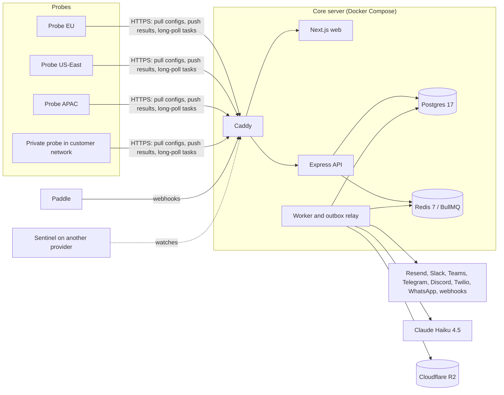
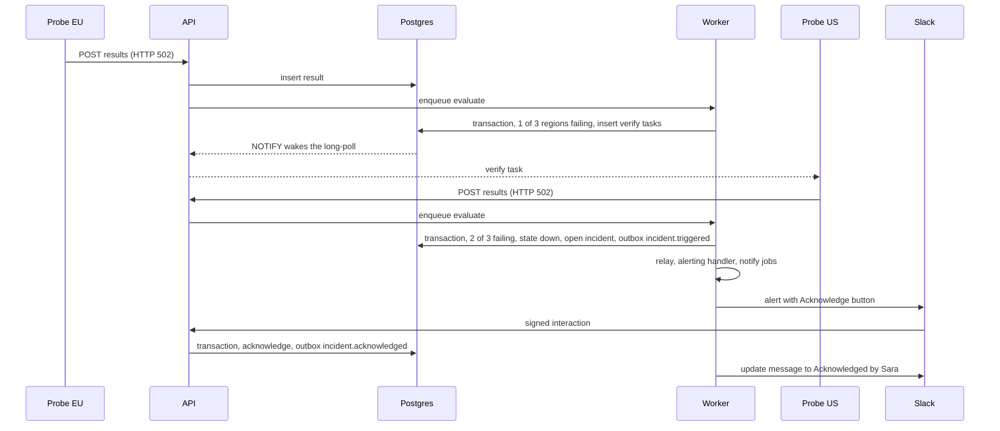
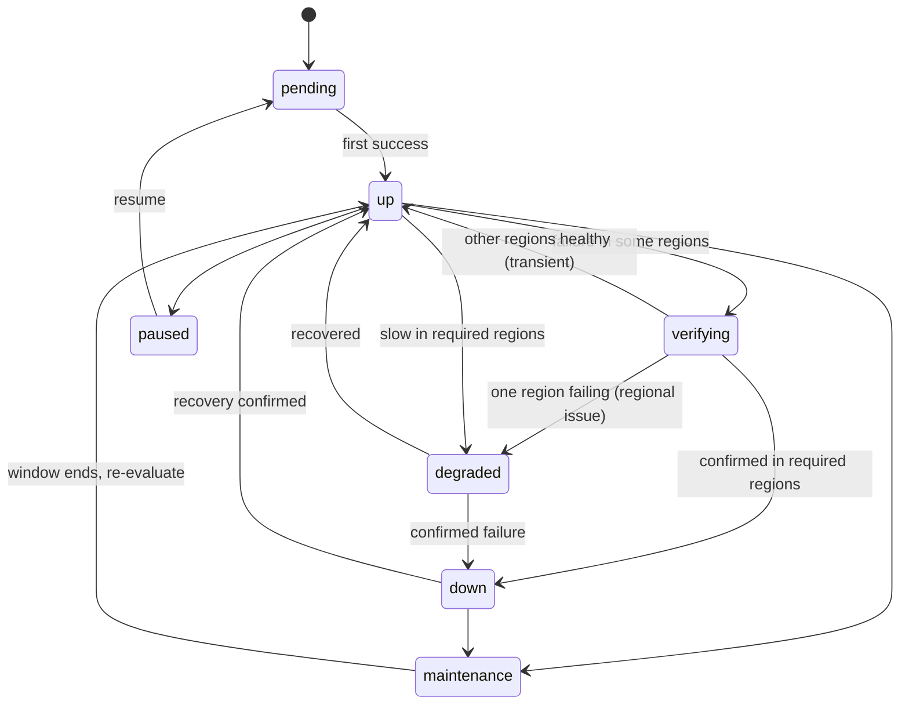

# Watchpost — Product Spec and Build Plan (`PRODUCT.md`)

> **Working name:** Watchpost. Replace it and `<domain>` everywhere once the final name and domain are chosen (Open decision #1).
> **Status:** In progress · **Current phase:** 0 · **Next task:** `P0-T10` · **Last updated:** 2026-09-30 (P0-T09 done; owner action: branch ruleset in `docs/ci.md`)
> The build agent keeps this status block current.

**Companion files**
- `STACK.md`: tools, versions and code conventions (the "how").
- `ENV_SETUP.md`: where to get Paddle and R2 keys. Save the `paddle-r2-setup.md` guide under this name, because STACK.md already links to it.
- `CLAUDE.md` / `AGENTS.md`: short pointer for coding agents, created in task P0-T01.

**Assumptions:** one developer plus an AI coding agent working from this file · start on Monday 2026-10-05 · DNS on Cloudflare (needed for wildcard certificates; you already use R2) · payments through Paddle (already used for Post-mint).

---

## Contents
1. Product in one page
2. Agent operating rules (read every session)
3. Market and competitors
4. Why customers will pay us
5. Pricing and packaging
6. Feature specification
7. Architecture
8. Data model
9. Core engines
10. Integration details
11. Billing with Paddle
12. Security, abuse and privacy
13. Reliability of our own platform
14. Frontend and UX
15. Testing and quality bars
16. Deployment and operations
17. Build sequence (phases and tasks)
18. Go-to-market
19. Metrics
20. Decision log
21. Proposed changes and improvement backlog
22. Open decisions for the owner
23. Changelog and phase retros
- Appendix A: Environment variables
- Appendix B: Check error taxonomy
- Appendix C: Sources

---

## 1. Product in one page

**One-liner:** Uptime monitoring, on-call and status pages that only page you for confirmed outages, and let you act from Slack, Teams, Telegram, WhatsApp, SMS or a phone call.

**Promise:** Confirmed, explained, actionable alerts. One flat price. No per-seat tax.

**Ideal customers, in priority order**
1. **Small software teams (2–30 engineers)** on UptimeRobot, Uptime Kuma, Better Stack or Opsgenie who are tired of false alarms and per-responder pricing.
2. **Agencies and freelancers** watching 20–500 client sites who need client-facing status pages and monthly uptime reports.
3. **IT teams at SMEs**, especially in South Asia and the Middle East, who live in WhatsApp, Telegram and Teams.

**Problems we solve**
- Single-location checks and network blips cause false alarms. Teams start ignoring alerts and miss real outages.
- "Site is down" alerts don't say why, so diagnosis is slow.
- Monitoring, on-call and status pages are sold separately, and on-call is priced per person.
- Self-hosted monitors (Uptime Kuma) go down with the infrastructure they watch, and someone has to maintain them.
- Forced migrations: Opsgenie reaches end of support on April 5, 2027, and Microsoft switched off Teams Office 365 connectors in May 2026, which broke many alert setups.

**Core loop:** Monitor → Confirm → Alert → Act → Communicate → Learn

| Step | What the product does |
|---|---|
| Monitor | HTTP/API, keyword, JSON, TCP, ping, DNS, WebSocket, SSL, domain expiry, cron heartbeats, alerts from other tools; private probes for internal services |
| Confirm | Re-checks from other regions before anyone is paged; quarantines our own faulty probes |
| Alert | Email, Slack, Teams, Discord, Telegram, webhooks, SMS, voice, WhatsApp, push, routed by on-call schedules and escalation policies |
| Act | Acknowledge, snooze, resolve or escalate from the alert itself |
| Communicate | Status pages on custom domains, subscribers, auto-incidents, AI-drafted updates |
| Learn | Evidence bundles, AI explanations, postmortems, SLA reports, alert-accuracy report |

**MVP** = end of Phase 3 (`v1.0.0`): multi-region monitoring, incidents, alerts on all main channels, status pages, billing, SMS/voice.

**Internal targets for the first 6 months after launch:** 1,000 activated workspaces, 100 paying workspaces, false-alarm rate under 1% of incidents, p95 time from confirmed failure to first notification under 10 s, delivery success after retries above 99.9%.

---

## 2. Agent operating rules (read every session)

### 2.1 Start of every session
1. `git checkout <current phase branch> && git pull --rebase`
2. Read the status block at the top, this section, the current phase in §17, and STACK.md §5 (conventions).
3. Check §21.1 for owner-approved proposals (✅) that change the plan.
4. `pnpm install && docker compose up -d && pnpm test`. The baseline must be green before new work.
5. Work on the task named in **Next task**.

### 2.2 How to work a task
- One task at a time. A task is done only when its acceptance criteria (AC) pass.
- Split large tasks into sub-tasks (`P1-T07a`, `P1-T07b`) in §17 **before** starting them.
- Follow STACK.md §5 strictly: routes → controller → service → repository; Zod on every body, query, params and env; block comments `/* */` only, never `//`; Postgres is the source of truth; Redis holds only jobs, locks and rate limits; jobs use deterministic `jobId`s, exponential backoff, `removeOnFail: false`, a recovery sweep on start and graceful shutdown; webhooks mount before `express.json()` with `express.raw()`; third-party tokens are encrypted with AES-256-GCM; every paid external call is metered into the ledger.
- Every tenant query filters by `workspace_id` through the repository helper (§8). No exceptions.
- Write tests with the code. Never weaken a security control or delete a test to make CI pass.
- Before building any third-party integration, read the provider's current docs (Teams changed twice in 2025–26) and record anything surprising in §20.

### 2.3 Git and GitHub (automatic)
- **Prerequisite:** the machine running the agent has push access to the repo (SSH key or GitHub CLI login). The owner sets this up once.
- **Branch:** one per phase, `phase/<n>-<slug>` from `main` (for example `phase/1-core-monitoring`).
- **After every task:** `pnpm lint && pnpm typecheck && pnpm test`, then `git add -A`, commit, `git push`.
- **Commit format:** Conventional Commits plus the task ID, for example `feat(monitors): HTTP executor with timing waterfall [P1-T07]`. Types: `feat, fix, refactor, perf, test, docs, build, ci, chore`.
- **Checkpoints:** in long tasks, also commit and push working checkpoints (`wip(scope): … [P1-T07]`) whenever lint and typecheck pass, so no work is lost.
- **This file:** update it in the same commit as the code (tick the task, move **Next task**, add decisions, backlog items and changelog lines).
- **End of phase:** open a PR from the phase branch to `main`, wait for green CI, merge without squashing, tag the version from the phase's exit criteria, `git push --tags`, write a phase retro in §23, then start the next phase branch from `main`.
- **Never:** commit `.env` or any secret, force-push `main`, rewrite pushed history, commit `dist/`, `.next/` or `node_modules/`, or disable a CI check.
- **Push rejected?** `git pull --rebase`, re-run tests, push again. If this file conflicts, keep every checked box from both sides.
- **Auth problems** (no credentials, permission denied): stop and ask the owner. Don't create tokens or change remotes yourself.

### 2.4 Keeping this document alive
| You may do without asking | Write a proposal in §21.1 and wait for ✅ |
|---|---|
| Tick tasks, move **Next task** | Change a phase's scope or order |
| Add Decision Log entries for implementation choices | Change pricing, plans or limits |
| Add backlog items with evidence | Add a paid third-party service |
| Fix technical errors in the spec (with a §23 line) | Change the stack in STACK.md |
| Clarify wording, add examples, add sub-tasks | Drop or defer a feature, or loosen a security rule |

Every edit to spec content gets a one-line entry in §23 (date, section, change, reason). When building reveals something (a provider limit, a better algorithm), update the relevant section in the same commit.

### 2.5 Stop and ask the owner when
- Something costs money or can't be undone (servers, domains, paid plans, deleting data, migrations that drop columns in production).
- Credentials are needed. Use only what the owner puts in `.env`; never paste secrets into code, commits, logs or this file.
- Legal or policy text is needed (draft it and mark it `needs owner review`).
- A test would hit a real third-party production system or a real phone number.

### 2.6 Definition of Done (every task)
AC pass · lint, typecheck, tests and build pass · new env vars added to `.env.example` and Appendix A · migrations generated and applied · user-facing copy is clear · no `TODO` without a backlog entry · this file updated · committed and pushed.

### 2.7 Agent pointer file (create in P0-T01)
Create `CLAUDE.md`, and `AGENTS.md` with the same text if other agents are used:
```md
# Agent instructions
1. Read PRODUCT.md §2 and STACK.md before doing anything.
2. Work only on the task in PRODUCT.md's "Next task"; follow its acceptance criteria.
3. After each task: pnpm lint, typecheck, test → commit (Conventional Commits + task ID) → push.
4. Update PRODUCT.md in the same commit (tick task, next task, decisions, backlog, changelog).
5. Never commit secrets or force-push main. Ask the owner before spending money or changing scope.
6. Before writing code, read PRODUCT.md §7.1 (architecture rules) and follow the module template in §7.3.
7. To find code: module map (§7.4) → exact names with grep/ripgrep → meaning-based search with the code index (§2.8).
```

### 2.8 Finding code efficiently (architecture map + CocoIndex)
Every session also reads §7.1 (architecture rules) as part of step 2 in §2.1.

**What CocoIndex is.** An open-source (Apache 2.0) incremental indexing framework with a Rust core. Its companion tool **CocoIndex Code** (`cocoindex-code`, CLI `ccc`) builds an AST-aware semantic index of a repository and serves it to coding agents as a CLI, a skill or an MCP server. The agent can ask "where do we verify Paddle signatures?" and get the exact functions instead of opening many files.

**Does it make the agent more efficient? Sometimes.** The maker advertises about 70% token savings. Independent results are mixed: at least one published test (August 2026) measured higher token use in its own workflow. It helps most in large or unfamiliar codebases and for "where is the logic for…" questions; for exact names, grep/ripgrep is just as good. In this project the biggest efficiency gain is the architecture itself: with the module map (§7.4) and fixed file names (§7.3), the agent can usually open the right file without searching. So we use CocoIndex Code, measure it, and keep it only if it wins on our repo.

**Setup (task P0-T10)**
- Developer tooling only. It is not part of the product and adds nothing to production; STACK.md is unchanged.
- Install the version with local embeddings so our source code never leaves the machine: `pipx install 'cocoindex-code[full]'`. The slim version sends code chunks to a cloud embedding provider; don't use it here.
- Build the index from the repo root with `ccc index`. Re-runs are incremental (only changed files are re-indexed), and the MCP search tool refreshes the index before each query by default.
- Register it for the whole project so every session gets it: `claude mcp add --scope project cocoindex-code -- ccc mcp`. This writes `.mcp.json` at the repo root; commit it. Claude Code asks once to approve project-scoped servers. For other agents, use the command from the CocoIndex Code README (for example `codex mcp add cocoindex-code -- ccc mcp`).
- Never commit the index database files (`ccc status` shows where they live); add them to `.gitignore`. `ccc reset` deletes the index if it gets into a bad state.

**Search order for the agent**
1. Module map (§7.4) and file-naming rules (§7.3) → open the file directly.
2. Exact identifier, route, table or error code → grep/ripgrep.
3. Conceptual question ("how do we decide a monitor is down?") → the CocoIndex search tool.
4. Only then read whole folders.

**Keep-or-drop check** (end of Phase 1, repeated at each phase retro). `docs/agent-benchmark.md` holds 10 "find the code for X" questions with known answers plus 3 real tasks. Run them with and without the code index and record tokens, tool calls, time and correctness in D-013 (§20). Keep it only if tokens or time drop by at least 20% with no loss of correctness; otherwise remove it from `.mcp.json` and note why.

---

## 3. Market and competitors
*Checked 2026-09-30 from vendor and third-party pages (Appendix C). Re-verify on vendor pages before publishing any comparison.*

| Competitor | Model | Reported pricing | Weak spot | Our answer |
|---|---|---|---|---|
| UptimeRobot | Hosted uptime monitor | Free: 50 monitors at 5-min checks. Paid (Aug 2026, monthly): Solo ~$13, Team ~$46, Scale ~$98 for 200 monitors | 2025 repricing; free-plan commercial-use terms changed and sources disagree on current rules; users report SMS credits used up by false alerts | Free plan that allows commercial use, multi-region confirmation, false-alarm credit refunds, on-call included |
| Better Stack | Monitoring, on-call and observability suite | ~$29 per responder/month billed annually ($34 monthly); 10 monitors included, then ~$21–25 per 50 | Bill grows per responder and per add-on pack | Flat plans, unlimited members from Pro |
| PagerDuty | Enterprise on-call | Professional ~$21/user/month annual ($25 monthly); Business ~$41 ($49); status pages are a paid add-on | Expensive for small teams; no built-in uptime checks | Monitoring, on-call and status pages in one price |
| Opsgenie (Atlassian) | On-call and alerting | New sales ended June 4, 2025 | **End of support April 5, 2027**; unmigrated data is deleted | Opsgenie importer, parallel-run mode, migration guide |
| Hyperping | Flat-price monitoring, status pages, on-call | Pro ~$74/month billed yearly (10 seats, 250 monitors, 3 status pages); free plan with 20 monitors | Closest positioning to ours | Lower entry price, unlimited seats, private probes, WhatsApp/Telegram, AI, agency tooling |
| Uptime Kuma | Free, MIT, self-hosted | $0 plus your server and time | One location; goes down with your server; no on-call or escalation; you maintain it | Hosted, multi-region, private probes for internal checks, one-click Kuma import |
| OneUptime | Open-source all-in-one | Hosted ~$1 per active monitor/month (its own comparison page) | Broad platform | We compete on simplicity and opinionated defaults |
| Spike.sh | Budget on-call | From ~$7/user/month with status pages | Per-user pricing, lighter monitoring | Flat pricing, deeper monitoring |

**Market events that create demand**
- **Opsgenie shutdown (April 5, 2027):** every Opsgenie customer must move within the next six months. Our on-call and importer must be ready by mid-January 2027 (Phase 4).
- **Teams connectors retired:** Office 365 connectors, including Incoming Webhook, were switched off May 18–22, 2026. Alerts to Teams now go through Workflows webhooks (Adaptive Cards; posts show as the Workflows bot; legacy MessageCard buttons don't render) or a Teams app with a bot.
- **Bot Framework SDK retired:** support ended December 31, 2025. Microsoft points new bots to the Microsoft 365 Agents SDK or the Teams SDK.
- **UptimeRobot's 2025 price changes** pushed many small teams to look for alternatives.
- **AI in incident tools** (Better Stack's AI SRE, PagerDuty's AI features) is becoming expected. We include AI explanations in every plan instead of selling them as an add-on.

**What we deliberately don't build:** logs, APM/tracing, RUM, ITSM ticketing. We integrate with those tools through inbound alerts and outbound webhooks.

---

## 4. Why customers will pay us
Each pillar has a "proof moment": something a trial user sees in the first session.

| # | Pillar | What we build | Proof moment |
|---|---|---|---|
| 1 | **Confirmed alerts, not false alarms** | Failure confirmed from ≥2 regions via instant cross-region re-checks; probe self-quarantine; flapping control | Monitor page shows "Confirmed from 3/3 regions" and the workspace's alert-accuracy stat |
| 2 | **Alerts that explain themselves** | Evidence bundle (timing waterfall, error class, failing regions, status, headers, body snippet, TLS/DNS facts) plus a one-line AI explanation in the thread | The first test alert already shows the waterfall |
| 3 | **Act where you are** | Acknowledge, snooze, resolve and escalate from Slack, Teams (app), Telegram, web push, email links, SMS reply codes and phone keypress | Tap "Acknowledge" in Slack during onboarding |
| 4 | **On-call without the per-seat tax** | Schedules, rotations, overrides, escalation policies, personal notification rules; unlimited members on Pro and up | Pricing-page calculator vs per-seat tools |
| 5 | **One inbox for every alert** | Inbound alerts from Grafana, Alertmanager, Datadog, Sentry, email and generic webhooks feed the same escalation engine | Paste an Alertmanager URL and watch a test alert reach on-call |
| 6 | **Migrate in minutes** | Importers for UptimeRobot, Uptime Kuma, Better Stack and Opsgenie; forwarding for parallel runs | Import 48 monitors from UptimeRobot in under a minute |
| 7 | **Inside and outside your network** | Private probe: one Docker command monitors internal services, databases and containers | Private probe shows "online" after one command |
| 8 | **Status pages customers trust** | Custom domain with automatic HTTPS, subscribers, auto-incidents, AI-drafted updates, 90-day uptime bars | Status page generated from monitors in one click |
| 9 | **Built for agencies** | Client workspaces, white-label pages and SLA PDFs, client read-only access | Branded monthly report preview |
| 10 | **Everything as code** | REST API, outbound webhooks, Terraform provider, YAML sync, MCP server, Prometheus endpoint, badges | Copy a README badge |
| 11 | **We tell you when alerting is broken** | Channel health checks (revoked Slack token, deleted Teams workflow, bounced email) with fallback delivery and admin warnings | Integrations page shows health per channel |
| 12 | **Local where it matters** | WhatsApp and Telegram alerts, per-country SMS routing, localized pricing, i18n with RTL support | Choose WhatsApp during onboarding |

---

## 5. Pricing and packaging
*Draft; the owner confirms it in Open decision #3. Prices in USD; Paddle handles tax as merchant of record.*

| | **Free** | **Starter** | **Pro** | **Business** |
|---|---|---|---|---|
| Monthly price | $0 | $9 | $29 | $79 |
| Billed annually (per month) | $0 | $7.50 | $24 | $66 |
| Monitors | 20 | 50 | 150 | 500 |
| Heartbeat (cron) monitors | 5 | 20 | 75 | 250 |
| Fastest check interval | 3 min | 1 min | 30 s | 15 s (verified domains) |
| Regions per monitor | 2 | 3 | 5 | All |
| Team members | 3 | 5 | Unlimited | Unlimited |
| Email, Slack, Teams, Discord, Telegram, webhook alerts with two-way actions | ✓ | ✓ | ✓ | ✓ |
| SMS / voice / WhatsApp credits per month | — | 25 | 150 | 500 |
| On-call schedules and escalation policies | — | 1 each | Unlimited | Unlimited |
| Inbound alert sources | 1 | 3 | Unlimited | Unlimited |
| Status pages | 1 on our subdomain | 3, custom domain | 10, 2,000 subscribers | 50, 20,000 subscribers, private pages, white-label |
| Data history | 30 days | 6 months | 13 months | 25 months |
| AI summaries and drafts | 20/month | 100/month | Fair use | Fair use |
| Reports | Weekly digest | + monthly email | + PDF/CSV SLA reports | + white-label reports |
| Private probes | — | — | 1 | 5 |
| API, Terraform, MCP | Read-only API | ✓ | ✓ | ✓ |
| SSO (OIDC/SAML), audit log, custom roles | — | — | — | ✓ |
| Agency client workspaces | — | — | — | 10 included |
| Support | Docs | Email | Email, 1 business day | Priority, 4 business hours |

**Add-ons (Starter and up):** 100 credits $6 · 500 credits $25 · +100 monitors $15/month (Pro, Business) · extra private probe $10/month · extra client workspace $5/month.

**Credit costs:** 1 credit per SMS in low-cost countries, with per-country multipliers where the provider charges more; voice calls cost 2+ credits per minute; WhatsApp is charged per template message. Multipliers come from the provider price list with at least a 3× margin, and are shown before a phone number is enabled.

**Pricing rules**
- Free forever, commercial use allowed, no card to sign up.
- Every new workspace gets a **14-day Pro trial without a card**, then drops to Free unless upgraded.
- No per-seat pricing on Pro and Business. Annual billing = two months free.
- **Founding customers:** the first 100 paying workspaces get 30% off for life.
- **False-alarm refund:** marking an incident as a false alarm returns the SMS/voice credits it used.
- **Downgrades never delete data.** Monitors over the new limit are paused, and the user picks which stay active.
- Optional regional pricing through Paddle price overrides (Open decision #3).

**Upgrade moments** (where the paywall appears, always showing what the user gains): 21st monitor · interval below 3 min · first SMS/voice/WhatsApp contact · first on-call schedule · custom status-page domain · subscribers · history beyond 30 days · private probe · SSO.

---

## 6. Feature specification

### 6.1 Monitor types
| Type | What it checks | Key options | Phase |
|---|---|---|---|
| HTTP(S) | Status code, response time, redirects, TLS | Method, headers, body, basic/bearer auth (OAuth2 client credentials and mTLS in P6), accepted status codes, follow redirects (max 5), ignore TLS errors, upside-down mode | P1 |
| Keyword | Body contains / doesn't contain text or regex | Case sensitivity; reads at most 1 MB | P1 |
| JSON query | JSONata expression result vs expected value | `==, !=, <, >, contains, matches` | P1 |
| TCP port | Connect; optional TLS; optional send/expect | Host, port | P1 |
| Ping (ICMP) | Reachability, packet loss, RTT | Count, loss threshold | P1 |
| DNS | Record values and change detection | A/AAAA/CNAME/MX/TXT/NS/SOA/CAA, resolver, expected values | P1 |
| WebSocket | Handshake, optional send/expect | Subprotocols, headers | P1 |
| SSL certificate | Expiry, validity, hostname, chain, unexpected change | Warn at 30/14/7/3/1 days; on by default for HTTPS monitors | P1 |
| Domain expiry | Registration expiry via RDAP, WHOIS fallback | Warn at 60/30/14/7/1 days; suggested per apex domain | P1 |
| Heartbeat (push) | Pings from cron jobs and workers | Period or cron + timezone, grace, start/fail signals, max duration | P1 |
| Inbound alert | Alerts from other tools | Dedup key, auto-resolve | P4 |
| gRPC health | `grpc.health.v1` | TLS, service name | P6 |
| Game servers | Steam / GameDig queries | Game type | P6 |
| Databases | Postgres, MySQL/MariaDB, MSSQL, MongoDB, Redis: connect plus optional query | Private probe only | P6 |
| Docker container | Running / healthy | Private probe only | P6 |
| MQTT, Kafka, RabbitMQ, SNMP, RADIUS | Protocol checks | Private probe only | P6 |
| Multi-step API | Chained requests, extracted variables, assertions | JSONata extraction | P8 |
| Browser (Playwright) | Real user flows, screenshots | Script, recorder, AI authoring | P8 |

### 6.2 Options every monitor has
Interval · timeout · regions · confirmation policy (minimum failing regions, default 2) · recovery policy (consecutive successes: default 2 for intervals up to 60 s, else 1) · degraded threshold (latency over N checks) · upside-down mode · reminders while down (every N minutes) · tags · group · parent dependency · alert policy · severity (critical/high/low) · maintenance windows · runbook URL and notes · public name for status pages.

### 6.3 Incidents
- Opened by monitors, heartbeats, inbound alerts or manually. One open incident per monitor, enforced by the database.
- Status `triggered → acknowledged → resolved`, plus time-boxed `snoozed` and a `flapping` flag.
- Contents: title, severity, cause code, failing regions, evidence bundle, AI explanation, timeline, comments, linked status-page incidents, postmortem.
- Actions: acknowledge, snooze (15 min / 1 h / 4 h / custom), resolve, escalate now, reassign, add responder, mark false alarm (refunds credits and feeds accuracy stats).
- Auto-resolve on recovery (configurable per monitor; inbound alerts resolve from their source).
- Per-workspace incident numbers (`#482`) used in SMS replies and chat commands.

### 6.4 Alert channels
| Channel | Direction | Setup | Phase |
|---|---|---|---|
| Email | Two-way through signed action links | Default for every user | P1 |
| Slack | Threads in P1; buttons, user linking and slash command in P4 | OAuth app install | P1, P4 |
| Microsoft Teams | One-way via Workflows webhook (P1); two-way via Teams app and bot (P6) | Paste Workflows URL (guided) / install app | P1, P6 |
| Discord | One-way, link buttons | Webhook URL | P1 |
| Telegram | One-way in P1; inline buttons in P4 | Deep link to our bot | P1, P4 |
| Webhook (outbound) | Signed JSON; custom body templates in P6 | URL + secret | P1 |
| SMS | Two-way (reply codes) | Verified phone | P3 |
| Voice call | Two-way (keypress) | Verified phone | P3 |
| Web push (PWA) | Two-way (notification actions) | Install app, allow notifications | P4 |
| WhatsApp | Template messages; quick-reply acknowledge later | Verified number, opt-in | P6 |
| Google Chat, Mattermost, Rocket.Chat, Matrix, Pushover, ntfy, Gotify, Zulip, Home Assistant | One-way | URL or token | P6, by demand |
| PagerDuty / Opsgenie (outbound) | Forward alerts during migrations | Integration key | P4 |

### 6.5 On-call
- **Schedules:** layers with daily, weekly or custom rotations; handoff day and time; participant order; restrictions (for example weekdays 09:00–18:00); overrides; IANA timezones (DST-safe); iCal feed per user; shift start/end notifications; "who's on call now and next".
- **Escalation policies:** ordered steps targeting users, schedules or channels; delay per step; repeat rounds; stop on acknowledge; escalate now.
- **Personal notification rules** per urgency. Default high urgency: push and email immediately, SMS after 2 min, voice after 5 min. Low urgency: email and push only, optionally business hours only.
- **Handoff report:** what happened during your shift, sent at shift end.
- **Chat commands:** `/watchpost oncall`, `/watchpost ack 482`, `/watchpost maintenance 1h api` (Slack in P4, Teams bot in P6).

### 6.6 Status pages
- URL `https://<slug>.status.<domain>` or a custom domain with automatic HTTPS.
- Components linked to monitors or set manually; groups; 90-day uptime bars; current status banner; incident history; scheduled maintenance; optional response-time chart.
- **Auto-incidents:** when a monitor behind a public component stays down for N minutes (default 5), a status-page incident opens with an AI-drafted message, published automatically or held for approval.
- Updates: investigating → identified → monitoring → resolved; AI drafts in a chosen tone.
- Subscribers: email (double opt-in), webhook, Slack, RSS/Atom; per-component subscriptions on Pro and up.
- Branding: logo, colors, favicon; custom CSS and removing "Powered by" on Business.
- Visibility: public, password-protected, SSO or IP allowlist (Business).
- JSON API and embeddable status widget (P6); multi-language pages (P7).

### 6.7 Heartbeats
- `https://hb.<domain>/<token>` accepts GET and POST, plus `/start`, `/fail` and `/<exit-code>`; an optional body (up to 10 KB) is stored as a log excerpt.
- Schedule by period or cron expression with timezone, plus grace time. Tracks run duration and alerts on runs that take too long.

### 6.8 Inbound alerts
- Generic JSON endpoint `https://app.<domain>/api/inbound/<token>` with `status` (trigger/resolve), `dedup_key`, `severity`, `title`, `description`, `links`, `tags`.
- Native parsers: Prometheus Alertmanager, Grafana alerting, Datadog webhooks (we provide the payload template), Sentry (P6), email-to-alert (`<token>@in.<domain>`).
- Mapping rules: severity mapping, title template, routing to an alert policy or escalation policy, auto-resolve.

### 6.9 AI features (Claude Haiku 4.5, per STACK.md)
| Feature | When | Output | Phase |
|---|---|---|---|
| Incident explainer | Seconds after an incident opens | Headline, likely cause, confidence, evidence references, next checks; posted as a thread reply and shown on the incident | P5 |
| Status update drafts | Auto-incidents and manual updates | Customer-friendly update in a chosen tone | P5 |
| Postmortem draft | After resolve | Markdown postmortem from the timeline and evidence | P5 |
| Weekly digest insights | Weekly, via the Batch API | Short narrative on trends and noisy monitors | P5 |
| Alert hygiene tips | Monthly | Flapping monitors, unacknowledged alerts, broken channels | P5 |
| Browser check authoring | On demand | Playwright script from plain English, human-approved | P8 |

Guardrails are in §9.10. **AI never decides whether to alert and never delays the first alert.**

### 6.10 Reports
Weekly digest email · monthly uptime email · SLA reports per monitor, group or status page (uptime %, downtime minutes, incidents, MTTA, MTTR, latency percentiles) as PDF and CSV · white-label PDFs for agencies · scheduled delivery to stakeholders and clients.

### 6.11 Team, roles and security
| Role | Can |
|---|---|
| Owner | Everything, including billing, deleting the workspace and transferring ownership |
| Admin | Monitors, integrations, members, status pages, policies |
| Member | Monitors, status pages, incidents |
| Responder | View everything; acknowledge, resolve and comment; manage own contact methods |
| Viewer | Read-only |
| Billing | Billing pages only |

TOTP 2FA on all plans (passkeys later) · SSO (OIDC/SAML) and enforced 2FA on Business · audit log on Business, security events on all plans · session list and revoke · scoped API keys.

### 6.12 Imports and migration
| Source | Method | Imports |
|---|---|---|
| UptimeRobot | Read-only API key | Monitors (HTTP, keyword, ping, port, heartbeat), intervals, alert contacts as channels |
| Uptime Kuma | Upload of the Kuma SQLite database (default install) or JSON backup; CSV template for other setups | Monitors, tags, groups, notification configs where supported, status pages |
| Better Stack | API token | Monitors, heartbeats, policies where mappable |
| Opsgenie | Read-only API key | Users (by email), teams, schedules and rotations, escalations, integration list as a checklist |
| PagerDuty | API key (P7) | Schedules, escalation policies, services |

Every import runs as a **dry run** first (preview and warnings), then applies. Uploaded files are deleted after import (R2 lifecycle of 1 day). Outbound Opsgenie and PagerDuty channels support a parallel run during migration.

### 6.13 Developer platform
REST API v1 with OpenAPI docs generated from Zod · scoped API keys · outbound webhooks for `incident.*`, `monitor.*`, `status_page.*` · Terraform provider · YAML "monitoring as code" synced by a GitHub Action · MCP server for AI assistants (read monitors and incidents, acknowledge, create maintenance) · Prometheus metrics endpoint per workspace · SVG badges (status, uptime, response time) that link back to us.

### 6.14 Uptime Kuma parity (the baseline)
| Kuma feature | Our version | Phase |
|---|---|---|
| HTTP(s), TCP, keyword, JSON query, WebSocket, ping, DNS, push monitors | Same types, checked from multiple regions | P1 |
| Steam game servers, Docker containers, databases and other 2.x types | Game servers from our probes; Docker, databases, MQTT and others via private probes | P6 |
| 90+ notification services | Native top channels plus generic webhook with templates; long tail by demand | P1–P6 |
| 20-second intervals | 30 s on Pro, 15 s on Business (verified domains) | P3 |
| Multiple status pages mapped to domains | Yes, with automatic HTTPS, subscribers and auto-incidents | P2 |
| Ping chart, certificate info | Per-region percentiles, timing waterfall, TLS details | P1–P2 |
| Proxy support | Per-monitor HTTP proxy on private probes | P6 |
| 2FA | TOTP; SSO on Business | P1, P7 |
| Maintenance windows, tags, groups, badges | Yes | P1–P2 |
| Multi-language UI | i18n-ready from P1; languages added by demand | P1, P7 |
| Upside-down mode, retries, resend while down | Upside-down mode, multi-region confirmation, reminders | P1–P2 |
| Prometheus metrics | Per-workspace endpoint | P6 |

---

## 7. Architecture
This section is the architecture contract. Read §7.1 before writing any code. CI enforces the rules (§7.13). If a rule blocks you, write a proposal in §21.1 instead of working around it.

### 7.1 Rules and trust zones

**Rules (non-negotiable)**
1. **Modular monolith plus probes.** One backend codebase (`@app/api`) with two entry points: `server.ts` (HTTP) and `worker.ts` (jobs). Probes are a separate deployable. No microservices.
2. **Postgres is the source of truth.** Redis holds only queues, locks and rate limits. Every queued job must be rebuildable from Postgres by a recovery sweep, or be explicitly marked `ephemeral`.
3. **Modules own their tables.** Only a module's repository reads or writes its tables. Other modules use its public API in `modules/<name>/index.ts`.
4. **Calls go down, events go up.** A module may call only the modules listed for it in §7.4. Anything that must flow the other way is an event (§7.5).
5. **Layers inside a module:** routes → controller → service → repository. Controllers hold no business logic. Repositories hold no business logic and know nothing about HTTP. Job processors and event handlers call services.
6. **Cross-module side effects go through the outbox.** In this document, "emit X" always means "insert an outbox row for X in the current database transaction"; the relay enqueues handlers after commit. A module may enqueue its *own* follow-up jobs directly only when the work is already recorded in Postgres (a pending delivery row, a due timestamp), so the sweep can rebuild it. Provider callbacks with response deadlines (Slack, Telegram, Twilio) apply the state change synchronously in one transaction and emit events; the heavy work runs from those events. Better Auth callbacks run outside our transactions, so they enqueue their email jobs directly with deterministic IDs.
7. **Validate at every edge** with Zod: HTTP input, webhook payloads (after the signature check), probe payloads, job data, event payloads, env. Inside the core, types are trusted.
8. **Tenancy is explicit.** Every service method that touches tenant data takes a `WorkspaceScope` first; repositories refuse to run without one.
9. **Everything is idempotent.** Deterministic job IDs, unique constraints on external event IDs, `ON CONFLICT DO NOTHING` for results. Any handler can run twice without harm.
10. **Shared code is pure.** `@app/shared` holds Zod schemas, types, constants and pure functions only: no Node APIs, no I/O, no dependency except `zod`.
11. **The web app is a client of the API.** Next.js never touches the database; business rules live in the API (STACK.md §8).
12. **Providers sit behind adapters.** Provider SDKs are imported only in `infra/` and `modules/channels/adapters/`.
13. **When in doubt, don't page.** If a failure might be our fault (probe error, platform gap), record it and alert our ops, not the customer.

**Trust zones**
| Zone | Callers | Entry points | Authentication |
|---|---|---|---|
| Public | Anyone | Marketing site, status pages, badges, `/api/public/*` | None: read-only, cached, rate-limited |
| Token URLs | Customers' cron jobs and tools | `hb.<domain>/<token>`, `/api/inbound/<token>` | Secret token in the URL, stored hashed, rotatable |
| App | Signed-in users | `app.<domain>`, `/api/w/:workspaceId/*` | Better Auth session cookie (+2FA or SSO) |
| Public API | Scripts, Terraform, MCP server | `/api/v1/*` | Scoped API key |
| Probes | Our probes and private probes | `/api/probe/v1/*` | HMAC signature per probe |
| Providers | Paddle, Slack, Telegram, Twilio, Microsoft | `/api/webhooks/*`, `/api/integrations/*` | Provider signature or secret |
| Internal | Caddy, worker | `/api/internal/*`, `http://web:3000/api/revalidate` | Docker network only (+ shared secret for revalidate) |
| Data | API and worker only | Postgres, Redis | Private network and credentials; never exposed |

### 7.2 Runtime containers


| Container | Responsibility |
|---|---|
| Caddy | TLS (wildcard for status subdomains, on-demand TLS for custom domains), routing, blocks `/api/internal/*` from the internet |
| Web (`@app/web`) | Marketing site, app UI, public status pages (cached) |
| API (`@app/api`, `server.ts`) | All HTTP routes in §7.9: app API, public API, Better Auth, webhooks, probe protocol, heartbeat and inbound ingest |
| Worker (`@app/api`, `worker.ts`) | Outbox relay, evaluation, event handlers, notifications, escalations, timers, sweeps, rollups, retention, AI, reports, imports, billing, emails |
| Probe (`@app/probe`) | Regional and private probes: sync assigned monitors, schedule and run checks, push results, run urgent tasks |
| Postgres | Source of truth, including partitioned check results and the outbox |
| Redis | BullMQ queues, locks and rate limits only |
| R2 | Failure evidence, screenshots, report PDFs, import uploads, backups |
| Sentinel | Small independent watchdog on a different provider that pages the founders directly |

### 7.3 Repository and module layout (extends STACK.md §4)
```
/
├─ PRODUCT.md  STACK.md  ENV_SETUP.md  CLAUDE.md  AGENTS.md  .mcp.json
├─ .dependency-cruiser.cjs        (architecture rules, §7.13)
├─ .github/                       (CI workflows, PR template)
├─ docs/
│  ├─ runbooks/                   (our own ops: restore, probe down, mass false alarms …)
│  ├─ integrations/               (user-facing setup guides per channel)
│  └─ agent-benchmark.md          (code-search benchmark, §2.8)
├─ packages/shared/src/
│  ├─ schemas/                    (monitor configs, probe protocol, API requests/responses, events)
│  ├─ constants/                  (plans, regions, error codes, roles)
│  └─ index.ts
├─ probe/                         (@app/probe, §7.6)
├─ tools/fake-target/             (dev-only outage simulator)
└─ backend/                       (@app/api)
   ├─ drizzle.config.ts           (schema glob: src/modules/*/schema/*.ts and src/infra/*/schema.ts)
   ├─ drizzle/                    (one migration history for the whole database)
   ├─ scripts/                    (paddle-catalog.ts, new-module.ts, deploy-probes.sh)
   ├─ src/
   │  ├─ server.ts                (HTTP entry: builds the container, mounts routes)
   │  ├─ worker.ts                (jobs entry: builds the container, registers processors, starts the relay)
   │  ├─ app.ts                   (Express app factory and middleware order, §7.9)
   │  ├─ migrate.ts
   │  ├─ composition/             (container.ts wires everything; architecture.ts lists allowed module edges)
   │  ├─ config/                  (env schema, constants, plans)
   │  ├─ core/                    (AppError types, WorkspaceScope, pagination, clock and ID interfaces; no I/O)
   │  ├─ infra/                   (db, redis, queues, outbox, auth, email, r2, anthropic, paddle, twilio, logger, crypto, locks)
   │  ├─ middleware/              (request-id, session, api-key, probe-auth, workspace, roles, quota, validate, error handler)
   │  └─ modules/<module>/        (template below)
   └─ web/                        (@app/web, §7.10)
```
`pnpm-workspace.yaml` adds `"probe"` and `"tools/*"`.

**Module template** (`pnpm new:module <name>` generates it, so every module starts identical):
```
modules/<module>/
├─ index.ts                  public API: create<Module>Module(), service interface, public types, event types
├─ <module>.routes.ts        Express router: paths, middleware, validators → controller
├─ <module>.controller.ts    HTTP in and out only
├─ <module>.service.ts       business rules, transactions, emits events
├─ <module>.repository.ts    Drizzle queries for this module's own tables only
├─ schema/                   Drizzle tables owned by this module
├─ validators/               Zod request schemas (built from @app/shared)
├─ types/                    internal types
├─ events/                   handlers for events this module consumes
├─ jobs/                     BullMQ processors for this module's jobs
└─ __tests__/                unit and integration tests
```

**Composition root.** `composition/container.ts` builds infra clients once (db, redis, queues, outbox, clock, logger, providers) and creates each module with explicit dependencies, for example `createIncidentsModule({ db, outbox, clock, audit, monitors })`, which returns `{ service, router, eventHandlers, processors }`. `server.ts` mounts routers; `worker.ts` registers processors and handlers. No DI container and no global singletons: tests build a module with fakes in a few lines. Middleware that needs module logic (probe auth, quota) receives functions from the container, so middleware never imports modules.

### 7.4 Modules, table ownership and allowed calls
Better Auth's tables are managed by Better Auth through `infra/auth`; modules reach users and memberships only through `workspaces`. Every edge not listed under "May call" is forbidden and fails CI. The graph has no cycles; keep it that way.

| Module | Owns tables | Responsibility | May call |
|---|---|---|---|
| `audit` | audit_logs | Append-only audit trail (`audit.record(tx, …)`) | — |
| `workspaces` | workspace_settings | Workspaces, members and roles (via Better Auth), settings, incident numbers, trial dates | audit |
| `apikeys` | api_keys, idempotency_keys | API keys, scopes, idempotency for the public API | workspaces, audit |
| `billing` | subscriptions, billing_events | Paddle, plans, entitlements (`billing.entitlements(scope)`) | workspaces, audit |
| `credits` | credit_ledger, usage_ledger | Credit balance, charges, refunds, cost metering | billing |
| `monitors` | monitors, monitor_groups, tags, monitor_tags, monitor_config_changes | Monitor configuration, limits, config change feed for probes | workspaces, billing, audit |
| `maintenance` | maintenance_windows | Windows; "is this monitor in maintenance at time T" | monitors, audit |
| `contacts` | contact_methods, notification_rules, chat_links | Users' contact methods, personal rules, chat account links | workspaces, audit |
| `channels` | channels, slack_installations, telegram_chats, teams_installations, message_refs | Channel configs and adapters (send, update, health) | credits, audit |
| `results` | check_results, check_events, rollups_5m, rollups_1h, rollups_1d | Result storage, partitions, rollups, retention, chart queries | monitors |
| `probes` | probes, probe_tasks | Probe registry and auth, assignments, tasks, probe health, "Test now" | monitors, results |
| `incidents` | incidents, incident_events, incident_comments, postmortems | Incident lifecycle and timeline | monitors, workspaces, audit |
| `detection` | monitor_state, monitor_region_state, downtimes | Result ingest (`POST /api/probe/v1/results`), fast path, evaluation engine (§9.2), uptime math | monitors, results, probes, maintenance, incidents |
| `heartbeats` | heartbeat_state, heartbeat_pings, platform_gaps | Heartbeat ingest, missed-ping sweeper, platform tick and gap guard | monitors, maintenance, incidents |
| `expiry` | domain_expiry_cache, expiry_notices | SSL and domain sweeps; opens or updates one low-severity incident per expiring item, resolves it on renewal | monitors, results, incidents |
| `inbound` | inbound_sources | Parse inbound alerts, dedupe, route | incidents, workspaces |
| `oncall` | schedules, schedule_layers, schedule_overrides, escalation_policies | Schedules, who's on call, escalation policy definitions | contacts, workspaces, audit |
| `alerting` | alert_policies, notification_deliveries | Delivery planning, `notify` and `escalate` jobs, reminders, fallback notices, false-alarm credit refunds | incidents, oncall, contacts, channels, credits |
| `actions` | action_tokens | Acknowledge, snooze, resolve and escalate from links, chat and phone | incidents, contacts, channels |
| `ai` | ai_generations | Explainers, status drafts, postmortems, digests | incidents, results, monitors, billing, credits |
| `statuspages` | status_pages, status_components, status_incidents, status_updates, status_subscribers | Pages, custom domains, subscribers, auto-incidents | monitors, detection, incidents, results, maintenance, ai |
| `reports` | reports | SLA reports, digests, PDFs | monitors, detection, incidents, results, statuspages |
| `imports` | imports | Importers (dry run, apply) | monitors, channels, contacts, oncall, statuspages |
| `badges` | — | SVG badges | monitors, detection, results |
| `admin` | product_events | Internal admin pages, metrics, activation analytics (fed by events) | Any module, read-only |

Cross-module calls inside a transaction pass `tx` explicitly (for example, `detection` calls `incidents.openForMonitor(tx, …)` in the same transaction that changes monitor state, so the unique index in §8 guards against duplicates).

### 7.5 Events, outbox and background work

**Transactional outbox** (`infra/outbox`, table `outbox_events`: id, workspace_id, type, version, payload, correlation_id, created_at, dispatched_at, attempts, last_error)
1. `outbox.emit(tx, type, payload)` validates the payload against the event's versioned Zod schema in `@app/shared/schemas/events`, inserts the row in the caller's transaction and issues `NOTIFY outbox` (Postgres delivers it only on commit).
2. The relay in the worker wakes on that notification (and polls every second as a fallback), claims up to 100 undispatched rows `FOR UPDATE SKIP LOCKED`, enqueues one job per subscribed handler (`evt:{eventId}:{handler}`), marks the rows dispatched and commits. A crash between enqueue and commit only causes a harmless duplicate (rule 9).
3. Handlers reload current state from Postgres and never rely on event order.
4. Dispatched rows are deleted after 7 days. Outbox lag (age of the oldest undispatched row) is a metric; `/api/ready` fails above 60 s.

**Event catalog** (payloads carry IDs and a short summary)
| Event | Emitted by | Consumed by |
|---|---|---|
| `workspace.created` | workspaces | alerting (default alert policy), admin |
| `monitor.created`, `monitor.updated`, `monitor.deleted` | monitors | statuspages (component links), admin |
| `monitor.state_changed` | detection | statuspages (component status, auto-incident timer, revalidation), admin |
| `incident.triggered` | incidents | alerting (notify, start escalation), ai (explainer), statuspages, admin |
| `incident.acknowledged`, `incident.snoozed`, `incident.resolved`, `incident.reopened` | incidents | alerting (update messages, stop or resume escalation), statuspages |
| `incident.escalation_requested` | incidents | alerting (run the next step now) |
| `incident.ai_summary_ready` | incidents | alerting (thread follow-up) |
| `incident.false_alarm_marked` | incidents | alerting (refund credits through `credits`), admin (accuracy stats) |
| `channel.health_changed` | channels | alerting (fallback notices to admins) |
| `status_page.update_published` | statuspages | statuspages (subscriber fan-out, revalidation) |
| `billing.plan_changed` | billing | monitors (pause or resume over-limit monitors), credits (grants), admin |
| `billing.period_renewed` | billing | credits (monthly grant) |
| `import.completed` | imports | admin |
| `email.requested` | any module | `infra/email` (sends through Resend) |

**Queues and jobs** (all: exponential backoff, `removeOnFail: false`, `worker.close()` on SIGTERM; one worker process runs every queue, and can later be split with `WORKER_QUEUES=…` using the same image)
| Queue | Kind | Work | Job ID | Rebuilt on start from |
|---|---|---|---|---|
| `evaluate` | Technical | Evaluate one monitor after new results | `eval:{monitorId}:{lastResultId}` | `last_result_at > last_evaluated_at` |
| `<module>-events` | Event handler | One event for one handler (`alerting-events`, `statuspages-events`, `ai-events`, `credits-events`, `monitors-events`, `admin-events`) | `evt:{eventId}:{handler}` | Undispatched outbox rows |
| `notify` | Follow-up | Deliver one pending delivery | `notify:{eventId}:{destinationKey}` | Pending `notification_deliveries` |
| `escalate` | Delayed | Next escalation step | `esc:{incidentId}:{round}:{step}` | Triggered incidents: `esc_round`, `esc_step` and the time of the last `triggered`/`escalated` timeline event |
| `timers` | Delayed | Snooze wake-up, auto-incident delay, reminders (processed by the module that owns the state) | `timer:{kind}:{refId}:{dueAt}` | `snoozed_until`, `monitor_state.since`, last reminder event |
| `sweeps` | Scheduled | Heartbeat misses (15 s), platform tick (10 s), SSL/domain (daily), maintenance boundaries, outbox cleanup | `sweep:{kind}:{bucket}` | Schedules re-registered on start |
| `results` | Scheduled | Rollups, partition create/drop, retention | `rollup:{size}:{bucketStart}` | Schedules; rollups are idempotent |
| `statuspages` | Follow-up | Subscriber fan-out, cache revalidation | `sp:{kind}:{id}:{version}` | Unsent fan-out rows |
| `ai` | Follow-up | Explainer, drafts, digests (rate-limited) | `ai:{kind}:{refId}` | `ephemeral` (AI is optional) |
| `reports` | Scheduled | SLA PDFs, digests | `report:{workspaceId}:{kind}:{period}` | Schedules |
| `imports` | On demand | Dry run, apply | `import:{importId}:{stage}` | `imports.status` |
| `billing` | Follow-up and scheduled | Process a stored Paddle event, nightly reconcile | `paddle:{eventId}` | Unprocessed `billing_events` |
| `emails` | Event handler | Send one transactional email | `email:{eventId}` | Undispatched outbox rows |

Job data holds IDs only, never whole objects; processors reload from Postgres.

**Job ID format:** the patterns above are written with `:` for readability, but the code joins parts with `.` through `buildJobId()` (for example `timer.snooze.{refId}.{dueAt}`), because BullMQ rejects custom job IDs containing `:` unless they have exactly three parts (D-021). The registry lives in `backend/src/infra/queues/registry.ts`. Event-handler jobs use `evt.{eventId}.{handler}`.

**Where the contract lives in code (P0-T09):** module edges in `backend/src/composition/module-edges.json` (typed by `architecture.ts`, enforced by `.dependency-cruiser.cjs`); event subscriptions in `architecture.ts` (`EVENT_SUBSCRIPTIONS`); payload schemas in `@app/shared` (`EVENT_SCHEMAS`); outbox in `backend/src/infra/outbox/` (`emit`, relay, consumer via `defineEventProcessor`, hourly cleanup on the `sweeps` queue, lag check in `/api/ready`).

### 7.6 Probe architecture and protocol
```
probe/src/
├─ main.ts        wires components, reads env, flushes the buffer on SIGTERM
├─ transport/     signed HTTPS client, retries with backoff, result buffer (memory; disk for private probes)
├─ sync/          assignment delta sync every 15 s; full resync when the server asks
├─ scheduler/     min-heap of next-run times, stable offsets, skips a monitor whose previous run is still going
├─ executor/      concurrency limiter; dispatches to checks/<type>.ts
├─ checks/        http, tcp, dns, ping, websocket …: pure functions (config, clock, net) → result
├─ net/           SSRF guard, pinned lookup, timing waterfall (§9.1)
├─ tasks/         long-poll loop for verify and "Test now" tasks
├─ report/        batches results (every ~1 s or 100 results)
└─ health/        local /healthz and POST /heartbeat
```
The probe imports only `@app/shared`. A `PROBE_MODE=private` flag turns on the disk buffer and relaxes only the private-range SSRF rule.

All calls go over HTTPS to `https://app.<domain>/api/probe/v1` and are signed:
```
X-Probe-Id: <probeId>
X-Probe-Timestamp: <unix seconds>
X-Probe-Signature: hex(HMAC_SHA256(secret, ts + "\n" + method + "\n" + path + "\n" + sha256hex(body)))
```
Requests more than 60 s off are rejected. The server needs the raw secret to verify HMACs, so probe secrets are stored **encrypted** (AES-256-GCM), not hashed. The signature covers the raw body, so these routes are mounted before the JSON parser (§7.9).

| Endpoint | Owner module | Purpose |
|---|---|---|
| `POST /hello` | probes | Version and capabilities → server time, poll and batch settings |
| `GET /assignments?after=<seq>` | probes | Delta sync of assigned monitor configs using the global change sequence; `full=true` resync when the cursor is too old |
| `POST /results` | detection | Batch of results (`batchId` plus array); idempotent by result ID; returns 202 |
| `GET /tasks?wait=25` | probes | Long-poll for verify or "Test now" tasks; returns as soon as one arrives (`LISTEN/NOTIFY`) |
| `POST /heartbeat` | probes | Every 15 s: load, queue depth, error counts |

**Probe behavior:** each monitor runs on its own timer with a stable offset `hash(monitorId, region) mod interval` plus small jitter. The probe never runs the same monitor twice at once, caps concurrency, and buffers results for up to 10 minutes if the API is unreachable. Managed probes see all monitors assigned to their region; private probes see only their workspace's monitors. When a region has several probes, the server splits monitors between them with rendezvous hashing and reassigns if one goes silent for 60 s.

### 7.7 Capacity and storage
Checks per second = Σ (monitors × regions ÷ interval in seconds).

| Scenario | Monitors | Avg interval | Regions | Checks/s | Raw rows/day |
|---|---|---|---|---|---|
| Beta | 2,000 | 120 s | 2 | 33 | 2.9 M |
| 6 months after launch | 20,000 | 90 s | 2.5 | 556 | 48 M |
| Growth | 100,000 | 60 s | 3 | 5,000 | 432 M |

**Retention:** raw results 48 h (per-check charts) → 5-minute rollups 90 days → hourly rollups 25 months → daily rollups forever. Failures and state changes are kept as `check_events` for the plan's history period. `downtimes` hold exact outage intervals for uptime math.

**Scale triggers:** sustained ingest above 300 results/s or DB disk above 60% → move Postgres to its own server (8 vCPU, 32 GB, NVMe). Ingest above 2,000 results/s → evaluate TimescaleDB (compression, continuous aggregates) or ClickHouse for results only.

### 7.8 Regions
P2: `eu-central` (Frankfurt), `us-east` (New York/Virginia), `ap-southeast` (Singapore). P8: `ap-south` (Mumbai/Bangalore), `me-central` (UAE), `eu-west` (London), `us-west`, `sa-east` (São Paulo), `ap-southeast-2` (Sydney). Spread probes across at least two hosting providers; the sentinel runs on a third.

### 7.9 HTTP request lifecycle and API conventions
**Middleware order in `app.ts`**
1. `requestId` (from `X-Request-Id` or a new UUIDv7) → request-scoped pino logger
2. `helmet`; CORS limited to the app origin, except `/api/public/*`
3. Raw-body routes, mounted before any JSON parser: Better Auth at `/api/auth/*`, `/api/webhooks/*`, `/api/integrations/*`, `/api/probe/v1/*`, `/api/inbound/*`, `/api/hb/*`
4. `express.json({ limit: "1mb" })` for everything else
5. Rate limits: per IP for public routes, per key for `/api/v1`, per workspace for `/api/w`
6. Authentication: session for `/api/w`, API key for `/api/v1`
7. `workspace` → `WorkspaceScope`; then `roles` and `quota` per route
8. `validate` (Zod) → controller → service → repository
9. Error handler → problem JSON

**Route families**
| Prefix | Used by | Notes |
|---|---|---|
| `/api/auth/*` | Better Auth | Mounted before the JSON parser |
| `/api/w/:workspaceId/*` | Web app | Internal; changes together with the web app |
| `/api/v1/*` | Public API | Stable and versioned; OpenAPI generated from Zod |
| `/api/public/*` | Status pages, badges | Unauthenticated, cached |
| `/api/probe/v1/*` | Probes | HMAC (§7.6) |
| `/api/hb/:token`, `/api/inbound/:token` | Customers' tools | Token URLs |
| `/api/webhooks/:provider` | Paddle | Signature verified first |
| `/api/integrations/:provider/*` | Slack, Telegram, Twilio, Teams | OAuth callbacks and interactions |
| `/api/internal/*` | Caddy, ops | Docker network only |

**Conventions:** JSON with camelCase fields; timestamps in ISO-8601 UTC; IDs as UUIDv7 strings · cursor pagination `?limit=&cursor=` → `{ data, nextCursor }` · errors as RFC 9457 problem details with a stable `code` (`validation_failed`, `unauthorized`, `forbidden`, `not_found`, `conflict`, `payload_too_large`, `quota_exceeded`, `rate_limited`, `provider_error`, `service_unavailable`, `internal_error`; the list lives in `@app/shared` `API_ERROR_CODES`) · public API writes accept an `Idempotency-Key` header (kept 24 h) · request and response schemas live in `@app/shared/schemas/api`, and the web client parses responses with the same schemas in development.

### 7.10 Frontend architecture
```
backend/web/
├─ app/(marketing)  (auth)  (app)/w/[ws]/…  (status)/s/[slug]
├─ features/<feature>/     components/, hooks.ts (TanStack Query), api.ts (typed calls)
├─ components/ui/          shadcn primitives restyled per DESIGN.md
├─ components/app/         app shell, navigation, command palette
└─ lib/                    api client, auth client, formatting, i18n
```
- Server components render layouts and the first paint; client components handle interaction. Server state lives in TanStack Query, filters in URL search params; no global store.
- One typed API client (`lib/api.ts`) with `credentials: "include"`; problem-JSON errors map to form errors and toasts.
- Forms use shadcn's Form (react-hook-form + Zod resolver) with the same schemas as the API.
- The UI hides what a role can't do; the API enforces it.
- Status pages ship minimal JavaScript, read `/api/public/status/:slug` on the server, are cached, and are revalidated by the worker through `POST http://web:3000/api/revalidate` (shared secret). Host-based routing lives in Next's request proxy/middleware file for the pinned version.

### 7.11 Cross-cutting conventions
| Topic | Rule |
|---|---|
| Config | Env parsed once at boot (Zod) into a typed `config`; no `process.env` outside `config/` |
| Time | `timestamptz` in UTC; services use the injected `clock.now()`, never `new Date()`; IANA zones only for schedules and display |
| IDs | UUIDv7 from `infra/ids`; per-workspace incident numbers for humans |
| Money | Integer micros (1 USD = 1,000,000); credits are integers |
| Errors | `AppError` subclasses with stable codes, mapped once to problem JSON; provider failures wrapped as `ProviderError` |
| Transactions | Opened in services with `db.transaction`; repositories accept an optional `tx`; cross-module calls inside a transaction pass `tx` |
| Logging | pino JSON with `requestId`, `jobId`, `eventId`, `workspaceId`, `monitorId`, `incidentId`; a `correlationId` flows HTTP → outbox → jobs → deliveries |
| Secrets | Encrypted and decrypted only inside the owning module's repository |
| Feature flags | Global kill switches in `config.features`; per-workspace flags in `workspace_settings.flags` |
| Naming | Tables snake_case plural; TypeScript camelCase; events `domain.past_tense`; queues kebab-case; env SCREAMING_SNAKE; files `<module>.<layer>.ts` |

### 7.12 Key flows
**Outage → confirmed → alert → acknowledge**


**Upgrade:** Paddle checkout → webhook verified and stored in `billing_events` → `billing` job updates the subscription and emits `billing.plan_changed` → `monitors` resumes paused monitors, `credits` grants credits → the billing page, polling `/api/billing/state`, shows the new plan.

**Status page:** `monitor.state_changed` → `statuspages` handler recomputes component status, starts the auto-incident timer (if the component is public) and triggers revalidation → the timer fires, re-checks that the monitor is still down, opens the status incident with an AI draft.

### 7.13 Architecture enforcement
- **`pnpm arch` in CI** (dependency-cruiser, `.dependency-cruiser.cjs`):
  - no circular dependencies;
  - modules import other modules only through `modules/<name>/index.ts`, and only along the edges in `composition/architecture.ts` (§7.4 must match it; change both in the same commit);
  - `drizzle-orm` only in `*.repository.ts`, `schema/` and `infra/db`;
  - provider SDKs only in `infra/` and `modules/channels/adapters/`;
  - `@app/shared` imports nothing except `zod`;
  - `backend/web` imports only `@app/shared` from our packages; `probe` never imports `backend`.
- **Architecture tests (Vitest):** every Drizzle table is declared in exactly one module's `schema/` (or `infra/`); every event type has a Zod schema and at least one consumer (or is marked `noConsumer`); every queue job kind has a recovery sweep or is marked `ephemeral`.
- **Generator:** `pnpm new:module <name>` creates the §7.3 template and registers the module in the container.
- **PR checklist** (`.github/pull_request_template.md`): layers respected · outbox used for cross-module side effects · `WorkspaceScope` passed · handlers idempotent · tests added · §7 updated if boundaries changed.

---

## 8. Data model
IDs are UUIDv7 generated in the app. Every tenant table has an indexed `workspace_id`; repositories take a `WorkspaceScope` and can't query without it. Better Auth owns `user, session, account, verification, organization, member, invitation, twoFactor` (organization = workspace). Each table below belongs to exactly one module (§7.4). Two tables are not in the grid: `outbox_events` (owned by `infra/outbox`, §7.5) and `idempotency_keys` (owned by `apikeys`).

| Area | Tables (key columns) |
|---|---|
| Workspace | `workspace_settings` (org_id PK, timezone, incident_seq, trial_ends_at, flags) |
| Monitors | `monitors` (type, name, config jsonb, interval_s, timeout_ms, regions text[], policies jsonb, severity, alert_policy_id, group_id, parent_id, paused, config_seq, secrets_enc) · `monitor_groups` · `tags` · `monitor_tags` · `monitor_config_changes` (seq, monitor_id, op) |
| State | `monitor_state` (monitor_id PK, status, since, open_incident_id, last_result_at, last_evaluated_at, flapping_until) · `monitor_region_state` (monitor_id, region, status, last_result_at, last_error_code, last_latency_ms) |
| Results | `check_results` (partitioned by day on checked_at; PK (checked_at, id); monitor_id, region, probe_id, ok, status, error_code, http_status, latency_ms, timings jsonb, ip, tls jsonb, task_id, evidence_key) · `check_events` (failures and state changes) · `rollups_5m`, `rollups_1h`, `rollups_1d` (monitor_id, region, bucket, count, fail_count, latency histogram jsonb) · `downtimes` (monitor_id, started_at, ended_at, kind outage/degraded/maintenance, incident_id) |
| Probes | `probes` (name, region, kind managed/private, workspace_id null for managed, secret_enc, last_seen_at, version, quarantined_until) · `probe_tasks` (monitor_id, region, kind verify/test, window, claimed_by, expires_at, completed_at) |
| Incidents | `incidents` (number, source, monitor_id, inbound_id, dedup_key, title, severity, status, cause_code, evidence jsonb, ai_summary jsonb, started/acked/resolved at and by, auto_resolved, false_alarm, escalation_policy_id, esc_round, esc_step, snoozed_until, suppressed_by_incident_id) · `incident_events` (incident_id, at, type, actor, data) · `incident_comments` · `postmortems` |
| Alerting | `alert_policies` (rules jsonb) · `channels` (type, name, config_enc, status, last_success_at, last_failure_at, last_error) · `notification_deliveries` (event_id, destination_key, channel_id or contact_id, attempt, status, provider_ref, error, credits) · `message_refs` (incident_id, channel_id, provider message ID for threads and updates) |
| On-call | `contact_methods` (user_id, type, address, verified_at) · `notification_rules` (user_id, urgency, delay_min, contact_method_id) · `schedules` · `schedule_layers` (rotation, handoff, participants, restrictions, start_at) · `schedule_overrides` · `escalation_policies` (steps jsonb, repeat) · `chat_links` (user_id, provider, external_user_id) · `action_tokens` (token_hash, incident_id, user_id, action, expires_at, used_at) |
| Integrations | `slack_installations` · `telegram_chats` · `teams_installations` (P6) · `inbound_sources` (type, token_hash, mapping jsonb, routing) |
| Heartbeats | `heartbeat_state` (monitor_id, next_expected_at, running_since) · `heartbeat_pings` (monitor_id, at, kind, exit_code, duration_ms, excerpt) · `platform_gaps` (started_at, ended_at) |
| Expiry | `domain_expiry_cache` (domain, expires_at, source, checked_at, error) · `expiry_notices` (monitor_id, kind, threshold, unique) |
| Maintenance | `maintenance_windows` (starts_at, ends_at, rrule, timezone, scope jsonb, suppress_alerts, show_on_pages) |
| Status pages | `status_pages` (slug, custom_domain, domain_verified_at, branding jsonb, visibility, password_hash, settings) · `status_components` · `status_incidents` · `status_updates` (ai_drafted) · `status_subscribers` (type, address, confirmed_at, unsub_token) |
| Billing | `subscriptions` (Paddle IDs, status, plan_key, items jsonb, period_end, scheduled_change, last_event_at) · `billing_events` (event_id unique, type, payload, processed_at) · `credit_ledger` (delta, reason, ref_id, balance_after) · `usage_ledger` (provider, units, cost_micros, ref) |
| Platform | `api_keys` (prefix, hash, scopes, last_used_at, expires_at) · `audit_logs` · `imports` · `reports` · `ai_generations` · `product_events` (activation analytics) |

**Invariants enforced by the database**
- One open incident per monitor: unique partial index `incidents(monitor_id) WHERE status <> 'resolved'`.
- One open inbound incident per dedup key: unique partial index `incidents(workspace_id, dedup_key) WHERE status <> 'resolved'`.
- Idempotent results: `INSERT … ON CONFLICT DO NOTHING` on `(checked_at, id)`.
- Idempotent deliveries: unique `(event_id, destination_key)`.
- Idempotent billing: unique `billing_events.event_id`; unique `credit_ledger(reason, ref_id)`.
- Drizzle can't declare partitioned tables. Create `check_results` with a custom SQL migration (`drizzle-kit generate --custom`) and manage partitions in a job.

---

## 9. Core engines

### 9.1 Check execution and SSRF guard (probe)
1. Resolve all A/AAAA records. Reject if **any** address isn't public unicast (use `ipaddr.js` ranges): 0.0.0.0/8, 10/8, 100.64/10, 127/8, 169.254/16 (cloud metadata), 172.16/12, 192.0.0/24, 192.0.2/24, 192.168/16, 198.18/15, 198.51.100/24, 203.0.113/24, 224/4, 240/4; IPv6 `::`, `::1`, fc00::/7, fe80::/10, ff00::/8, 2001:db8::/32, 100::/64. IPv4-mapped and NAT64 addresses are checked as IPv4. Also deny our own infrastructure hosts.
2. Connect to the vetted IP with a pinned `lookup` (`node:http` / `node:https`), keeping Host and SNI as the original hostname. This blocks DNS rebinding.
3. Follow redirects manually (max 5), re-validating every hop; block https → http downgrades unless allowed.
4. Limits: per-monitor timeout (max 30 s), 1 MB body read, decompressed-size cap, 100 headers.
5. Timing waterfall with `@szmarczak/http-timer`: DNS, connect, TLS, TTFB, download, total.
6. Private probes skip the private-range rule (that is their purpose) but keep every other limit.
7. User-Agent `WatchpostBot/1.0 (+https://<domain>/bot)`; the bot page lists our IP ranges and how to opt out.
8. Every failure gets an error code (Appendix B). `probe_*` codes are our own faults and never count as customer failures.

### 9.2 Detection and confirmation
Region state is **derived** from the last K results per region (index `check_results(monitor_id, region, checked_at DESC)`), so it can always be rebuilt from Postgres. `monitor_region_state` is only a cache for the UI.

```
ingest(batch):
  insert results ON CONFLICT DO NOTHING
  for each result r:
    if r.ok and monitor is up and region is up and no verification pending:
      fast path: bulk-update monitor_region_state (latency, last_result_at); no lock
    else:
      enqueue evaluate(monitorId)

evaluate(monitorId):                       (one DB transaction)
  SELECT monitor_state … FOR UPDATE
  available = assigned regions whose probe is healthy (seen < 60 s, not quarantined)
  failing   = regions whose last `perRegionFailures` results failed (default 1 multi-region, 2 single-region)
  required  = min(policy.minFailingRegions, max(1, |available|))
  if in maintenance: record, status = maintenance, no incident
  elif status = up and 1 ≤ |failing| < required:
      create verify tasks for other available regions (same region after 5 s if only one); dedupe per window
  elif |failing| ≥ required:
      if flapping: keep a single incident, no new notifications
      else: status = down, open incident (unique index), open downtime, emit `triggered`
  elif |failing| ≥ 1 and verification done and other regions healthy:
      status = degraded ("regional issue: Singapore only"); page only if the policy says so
  elif latency over threshold for N checks in ≥ required regions:
      status = degraded, emit `degraded`
  elif status in (down, degraded) and previously failing regions have `recoverySuccesses` successes:
      status = up, auto-resolve incident, close downtime, emit `resolved`
  update flap window and last_evaluated_at; COMMIT
  after commit: enqueue notifications for emitted events
```



**Probe health guard:** every minute, compute each probe's failure ratio across all its monitors. If it exceeds max(30%, 3× its 24-hour baseline) with at least 50 monitors, or the probe hasn't reported for 60 s, quarantine it: its failures stop counting, verification goes to other regions, ops are alerted, and monitors affected by reduced confirmation show a banner. This one rule prevents most "our network problem became your alert" false alarms.

**Flapping:** 5 or more state changes in 30 minutes → one "flapping" notice; the incident stays open and further notifications are held until the monitor is stable for 15 minutes.

**Detection delay:** failure → next check (≤ interval) → verification (~3–8 s) → notification (≤ 5 s). Target p95 ≤ interval + 15 s.

### 9.3 Incident lifecycle
- `triggered` → notifications and escalation step 1.
- `acknowledged` → escalation stops; channels updated ("Acknowledged by Sara · 2 min").
- `snoozed` → notifications paused until `snoozed_until`, then back to `triggered` if still failing.
- `resolved` → automatic on recovery or manual; recovery message with duration; downtime closed.
- Reminders while down go every N minutes to channels only, not to escalation targets.
- Every change writes an `incident_events` row; the timeline is the audit trail.

### 9.4 Notification pipeline
```
event (triggered / acknowledged / resolved / degraded / reminder / flapping)
 → targets = alert policy channels + escalation step targets
   (users → their personal rules; schedules → current on-call users)
 → one `notify` job per destination (jobId notify:{eventId}:{destKey})
 → adapter.render() → adapter.send() → delivery row (provider ref, status, credits)
 → retry with backoff (5 s … 2 min, 5 attempts)
 → permanent failure: channel marked failing; fallback email to workspace admins
   (at most once per hour); `delivery_failed` timeline event
 → follow-ups (ack, resolve, AI summary) reply in the same thread and update
   the original message where the provider supports it
```
Per-destination rate limits use a Redis token bucket (Slack about 1 message/s per channel, Telegram per-chat limits, Twilio per-number throughput).

```ts
/* Every channel implements this contract */
export interface ChannelAdapter<C> {
  type: ChannelType
  parseConfig(input: unknown): C
  render(event: AlertEvent, ctx: RenderContext): RenderedMessage
  send(config: C, message: RenderedMessage): Promise<SendResult>
  update?(config: C, ref: MessageRef, message: RenderedMessage): Promise<void>
  health?(config: C): Promise<HealthResult>
}
```

### 9.5 On-call and escalation
- `whoIsOnCall(scheduleId, at)`: evaluate layers (higher layer wins), apply restrictions, then overrides. Timezone math with Luxon; unit tests across DST changes (America/New_York, Europe/Berlin) and zones without DST (Asia/Karachi).
- An escalation job runs its step only if the incident is still `triggered` and not snoozed; otherwise it exits. Correctness never depends on removing jobs. After a step it schedules the next step, then the next round until `repeat` is used up.
- "Escalate now" enqueues the next step immediately with the same deterministic ID pattern.
- Personal rules fan out per user by urgency; each contact method gets its own delivery row.

### 9.6 Maintenance, dependencies and grouping
- **Maintenance:** one-off or recurring (RRULE with timezone). Results are still recorded; no incidents or notifications; optionally excluded from SLA. When a window ends, affected monitors are re-evaluated immediately.
- **Dependencies:** if a parent monitor is down, child incidents open as `suppressed_by` with no notifications. If the parent recovers while a child is still down, the child is un-suppressed and notified.
- **Grouping (optional per group):** failures in the same group within 15 s become one message ("4 monitors in Production are down"), at the cost of up to 15 s extra latency.

### 9.7 Heartbeats
- Ingest: token lookup (30-second in-process cache), record the ping, compute `next_expected_at` (period, or next cron occurrence via `cron-parser`), recover if down. `/fail` or a non-zero exit code → down immediately; a run that takes too long → degraded.
- Sweeper every 15 s: `SELECT … WHERE next_expected_at + grace < now() AND status = 'up' FOR UPDATE SKIP LOCKED LIMIT 500` → open "missed" incidents.
- **Our-outage guard:** the worker writes a platform tick every 10 s. If ingest was unavailable, a `platform_gaps` row is recorded, and heartbeats whose expected time falls inside a gap (plus grace) are not alerted. Otherwise our own downtime would page every heartbeat customer.

### 9.8 SSL and domain expiry
- TLS details come from HTTPS checks. A daily sweep sends warnings at thresholds, deduplicated by `expiry_notices`. A changed certificate fingerprint outside a normal renewal creates an info event.
- Domain expiry uses RDAP via the IANA bootstrap file (cached weekly), with results cached per domain across workspaces. Some country-code TLDs don't offer RDAP: fall back to WHOIS parsing, or show "not supported for this TLD" rather than a wrong date.

### 9.9 Rollups, uptime and SLA math
- Rollup jobs aggregate the previous complete bucket with an idempotent upsert. Latency percentiles come from fixed log-scale histogram buckets, so hourly and daily rollups merge correctly.
- Uptime % = 1 − (downtime seconds in range, minus maintenance if excluded) ÷ range seconds. It is computed from `downtimes`, never from sampled checks.
- Status-page day bars use per-day uptime with configurable thresholds (default: at least 99.9% green, at least 99% amber, otherwise red).
- SLA report: uptime, downtime minutes, incidents, MTTA, MTTR and p50/p95/p99 latency per monitor, group or page.

### 9.10 AI guardrails
- Inputs are structured evidence only: error codes, timings, failing regions, status codes, TLS and DNS facts, recent config, certificate or DNS changes, maintenance. Redact auth headers, cookies, query-string tokens and emails; cap body excerpts at 500 characters.
- Output is JSON validated by Zod (`headline` up to 120 characters, `likelyCause`, `confidence` low/medium/high, `evidenceRefs[]`, `nextChecks[]`), always labeled "AI", with 👍/👎 feedback stored for evaluation.
- The first alert never waits for AI. 8-second timeout, one retry, circuit breaker, per-workspace monthly budget, global `AI_ENABLED` kill switch.
- Prompt caching for system prompts; Batch API for digests; tokens and cost written to `usage_ledger`.
- Eval fixtures in `modules/ai/evals/` run in CI (valid schema, redaction, no invented facts on fixed inputs).

---

## 10. Integration details

**Email (Resend + React Email).** Templates: alert-down, alert-up, degraded, reminder, digest, subscriber-update, invite, verify, magic-link, billing, expiry-warning. Sending domain `mail.<domain>` with SPF, DKIM and DMARC. `List-Unsubscribe` on digests and subscriber emails. Signed action links: single use, 24 hours, bound to the recipient and the incident. Resend batch sending for subscriber fan-out. In development, `EMAIL_TRANSPORT=console`.

**Slack.** One Slack app with OAuth v2 install per workspace; the bot token is stored encrypted. Starting scopes: `chat:write`, `chat:write.public`, `channels:read`, `groups:read`, `users:read`, `users:read.email`, `im:write`, `commands` (confirm against Slack's current docs when building). Message: header (🔴 DOWN · API Production), fields (failing regions, error, since, latency), buttons (Acknowledge, Snooze, Resolve, Open). Follow-ups go in the thread; the root message updates on state changes. The interactivity endpoint verifies the `v0` signature over the raw body with a 5-minute timestamp window, responds within 3 s and does the work in a job. User linking matches by email with confirmation, otherwise `/watchpost link`. App Directory listing after P4.

**Microsoft Teams**
- *P1, Workflows webhook:* the user creates the "Send webhook alerts to a channel" workflow in Teams (we show a guided setup with screenshots) and pastes its URL. We post Adaptive Cards with `Action.OpenUrl` buttons (Open incident, Acknowledge link). Posts appear as the Workflows bot, with no custom name or icon. A flow may depend on the account that created it, so we run health checks and warn admins when it stops accepting posts.
- *P6, Teams app with bot:* built on Microsoft's current SDK (Teams SDK for JavaScript or the Microsoft 365 Agents SDK, not the retired Bot Framework SDK) and registered as an Azure Bot. Proactive messages to channels and users; Adaptive Card Universal Actions (`Action.Execute`) for acknowledge, snooze and resolve; org-wide install first, Teams Store later. The Workflows path stays as the no-admin fallback.

**Discord.** Webhook URL; embeds colored by state; link buttons only.

**Telegram.** One bot. Users and groups link through `https://t.me/<Bot>?start=<token>`. `setWebhook` with a secret token that is checked on every update (`X-Telegram-Bot-Api-Secret-Token`). Inline keyboard callbacks (`ack:<incident#>:<nonce>`) are checked against linked users; `editMessageText` on state changes.

**Webhook (outbound).** JSON envelope `{ id, type, createdAt, workspace, incident, monitor, evidence }`; headers `Watchpost-Event-Id` and `Watchpost-Signature: t=<ts>,v1=<hmac-sha256>`; 8 retries over about an hour; delivery log with replay; custom body templates in P6.

**SMS and voice (Twilio behind a `MessagingProvider` interface).** The interface lets us add Telnyx, Plivo or a local gateway per country later, which is often cheaper and more reliable for local numbers. Phone verification by one-time code. SMS fits one segment, for example `Watchpost: DOWN API Prod (HTTP 502, 3/3 regions) #482. Reply 1=ack 2=resolve`. Voice uses text-to-speech and a one-digit gather (1 = acknowledge, 2 = escalate), with one retry if unanswered. Inbound SMS and voice webhooks validate `X-Twilio-Signature`. Budget time for sender registration rules (US A2P 10DLC or toll-free verification; sender-ID rules in some countries).

**WhatsApp (Cloud API).** Pre-approved utility templates, recipient opt-in, per-message provider fees charged as credits; quick-reply acknowledge later.

**Web push (PWA).** VAPID keys (`web-push`), service worker with Acknowledge and Open actions. iOS delivers web push only to web apps added to the Home Screen (iOS 16.4+). Web push can't break through Do Not Disturb; that needs a native app (P8).

**Inbound sources.** Token in the URL; a parser per source produces a normalized alert `{ status, dedupKey, severity, title, description, links, tags }` for the incident engine. Each source has a "Send sample payload" button.

**Importers.** Each maps foreign concepts to ours and reports anything it couldn't map. The Kuma importer reads only the tables it needs from the uploaded SQLite file with `node:sqlite` (or `better-sqlite3`), never stores password hashes, and deletes the upload afterwards.

---

## 11. Billing with Paddle
Keys and dashboard steps are in **ENV_SETUP.md** (sandbox first).

**Catalog.** `backend/scripts/paddle-catalog.ts` creates products and prices idempotently, looking them up by `custom_data.key`: Starter, Pro, Business (monthly and annual), credit packs of 100 and 500 (one-time), +100 monitors, extra private probe, extra client workspace. Price IDs go in env (Appendix A); `config/plans.ts` maps each price ID to a plan key or add-on.

**Checkout.** Paddle.js overlay from `/w/[slug]/billing` with `items`, `customer.email` and `customData: { workspaceId, userId }`. After success the page polls `/api/billing/state` and shows "Activating…" until the webhook is processed.

**Webhooks.** `/api/webhooks/paddle` with raw body; signature verified with the SDK; stored in `billing_events` (unique `event_id`); processed by job `paddle:{eventId}`.

| Event | Action |
|---|---|
| `subscription.created` / `activated` | Link to workspace via `customData`; set plan from price IDs; grant this period's credits (ref = subscription + period) |
| `subscription.updated` | Recompute plan, add-ons and quantities; record scheduled changes |
| `subscription.past_due` | Banner and emails; full features for a 7-day grace period |
| `subscription.canceled` | At the effective date, move to Free and pause monitors over the limit (never delete) |
| `subscription.paused` / `resumed` | Reflect status |
| `transaction.completed` | Credit packs → add credits (ref = transaction ID); renewals → grant the new period's credits |
| `transaction.payment_failed` | Notify the owner and billing members |

Events can arrive out of order, so keep `last_event_at` per subscription and ignore older updates. A nightly job reconciles subscriptions with the Paddle API.

**Plan changes.** Upgrades apply immediately with prorated billing. Downgrades apply at the end of the period: store the pending change and apply it at renewal, or use Paddle's scheduled-change options (confirm current API behavior when building). Paddle customer portal sessions handle payment methods, invoices and cancellation.

**Entitlements.** `config/plans.ts` is the single source of limits and feature flags. `entitlements.service` resolves the effective plan (trial, subscription, grace period, add-ons, founding discount); the `quota` middleware enforces it on every create and update; the UI reads `/api/w/:id/entitlements`.

**Going live.** Follow "Going live" in ENV_SETUP.md: live keys, webhook destination on the real domain, default payment link on the approved domain, `PADDLE_ENV=production`. The website must show pricing, terms, privacy and refund policy for domain approval (check Paddle's current requirements). Test with one real low-price purchase, then refund it.

---

## 12. Security, abuse and privacy
- **SSRF:** §9.1. The test suite covers every blocked range, IPv6 forms, DNS rebinding and redirect chains.
- **Abuse:** email verification before monitors run; Cloudflare Turnstile on signup; tighter limits for new accounts in their first 24 hours; per-target-host token bucket across all tenants per region; intervals under 30 s require domain verification (DNS TXT `_watchpost.<host>` or `/.well-known/watchpost.txt`); an acceptable use policy that bans load testing and DoS; an abuse contact and a per-workspace kill switch.
- **Secrets:** channel tokens, monitor auth headers and probe secrets are encrypted with AES-256-GCM using `TOKEN_ENC_KEY` plus a key ID (rotation-ready). pino redacts `authorization`, `cookie`, `password`, `token`, `secret` and `*.headers.*`.
- **Incoming webhooks:** Paddle, Slack, Twilio and Telegram requests are verified before parsing, with replay windows enforced.
- **Auth:** Better Auth with rate limits, email verification, TOTP 2FA and session revoke; SSO on Business. `/api/internal/*` is reachable only inside the Docker network.
- **Tenancy:** the repository helper forces `workspace_id`; tests attempt cross-workspace access on every endpoint group.
- **Privacy:** data export (JSON) and workspace deletion (30-day soft delete, then hard delete including R2 objects); a DPA template; the site states where servers are located; no third-party trackers in the app (activation analytics live in `product_events`).
- **Supply chain:** Dependabot, `pnpm audit` in CI, pinned versions per STACK.md, probe image published to GHCR.
- **Open-source the probe** (MIT, Open decision #8) so customers can inspect what runs inside their network.

---

## 13. Reliability of our own platform
| SLO | Target |
|---|---|
| Alert pipeline availability (monthly) | 99.95% |
| Confirmed failure → first notification sent (p95) | ≤ 10 s |
| Detection delay (p95) | ≤ interval + 15 s |
| Delivery success after retries | ≥ 99.9% |
| Status pages | 99.9% (99.99% after edge hosting in P9) |
| API latency (p95) | < 250 ms |

- **Sentinel:** a small service on a different provider checks `/api/ready`, probe freshness, queue lag, the status-page host and heartbeat ingest every 30 s. It pages the founders directly through Telegram and SMS, not through our own pipeline.
- **Internal watchdogs:** the worker writes a platform tick every 10 s. `/api/ready` fails if the tick is older than 60 s, if Postgres or Redis is unreachable, or if queue lag is over its limit.
- **Degraded modes:** Redis down → the UI and result ingest keep working, and evaluation catches up through the recovery sweep. Postgres down → probes buffer results for up to 10 minutes and the sentinel pages. A provider down (for example Slack) → fallback channels.
- **Backups:** nightly `pg_dump` to R2 per STACK.md, plus one before every migration; a monthly restore test (`docs/runbooks/restore.md`). P9 adds WAL archiving for point-in-time recovery.
- **Kill switches:** pause all notifications (with an in-app banner) during a mass false-alarm event; disable a probe region; disable AI.
- **Runbooks** in `docs/runbooks/`: restore, disk full, Redis down, probe region down, provider outage, mass false alarms, bad deploy rollback, secret rotation.
- **Our own status page** at `status.<domain>` is hosted **off** the core server (on the sentinel host or a static host), so it stays up when we don't.

---

## 14. Frontend and UX

**Routes (Next.js App Router)**
```
(marketing)  /  /pricing  /compare/[competitor]  /alternatives/opsgenie  /tools/ssl-checker
             /tools/is-it-down  /changelog  /legal/*
(auth)       /login  /signup  /verify  /magic  /invite/[token]
(app)        /w/[ws]/overview  monitors  monitors/new  monitors/[id]  heartbeats  incidents  incidents/[id]
             on-call  on-call/schedules/[id]  escalation-policies  status-pages  status-pages/[id]
             integrations  alert-policies  maintenance  reports  imports  probes  team
             settings/{general,security,api-keys,audit-log}  billing
(status)     /s/[slug]   (host-based rewrite for *.status.<domain> and custom domains,
                          in Next's request proxy/middleware file for the pinned version)
```

**Key screens**
- **Onboarding:** paste a URL → we suggest monitors (homepage, common health paths such as `/health`, SSL, domain, DNS) → choose where alerts go (Slack in one click, Teams guided, Telegram deep link, phone) → **send a test alert** → optionally create a status page from the new monitors. Target: first delivered test alert in under 3 minutes.
- **Overview:** status wall, open incidents, who's on call, alert-accuracy stat, recent events.
- **Monitor form:** type picker, smart defaults, **Test now** (runs from every selected region and shows the waterfall live).
- **Monitor detail:** per-region status chips, p50/p95 latency chart, last-failure waterfall, uptime bars, incidents, SSL and domain info, config history.
- **Incident detail:** state and large action buttons, timeline, evidence panel, AI explanation, affected status pages, postmortem tab. Fully usable on a phone at 3 a.m.
- **On-call:** calendar, now and next, drag to override.
- **Status page editor:** live preview, components from monitors.
- **Integrations:** health badge per channel, last delivery, "Send test".
- **Billing:** plan, usage bars, credits, invoices through the Paddle portal.

**Principles**
- Evidence over colors; never color alone (icon plus text).
- Upgrade prompts only at the moment of need, showing what the user gets.
- Keyboard-first: ⌘K palette, `g m` monitors, `g i` incidents, `a` acknowledge.
- Live feel: poll every 10 s on dashboards and every 3 s on an active incident (SSE later, D-009).
- Design system per STACK.md §8 and DESIGN.md: monochrome plus one brand color; status colors reserved (up green, degraded amber, down red, maintenance blue, paused gray); light and dark.
- i18n-ready with `next-intl` (English first; RTL for Urdu and Arabic later).
- WCAG 2.2 AA. Budgets: app LCP under 2 s on 4G; status pages LCP under 1.5 s with under 100 KB of JS.

---

## 15. Testing and quality bars
- **Unit (Vitest):** detection engine with at least 40 table-driven scenarios (transient blip, regional outage, confirmed outage, recovery, flapping, maintenance, dependency suppression, quarantined probe, single-region mode); SSRF guard; schedule math across DST; escalation timing; entitlements; credit ledger idempotency; out-of-order Paddle events; channel renderers (snapshots).
- **Integration (Supertest with real Postgres and Redis in CI):** probe protocol and signatures, result idempotency, webhook signature checks (Paddle, Slack, Twilio, Telegram), heartbeat endpoints, cross-workspace access denial.
- **E2E (Playwright):** signup → monitor → outage → alert → acknowledge → recovery; status page publish → subscribe → update; billing in Paddle sandbox (nightly, optional).
- **Simulation:** `tools/fake-target` exposes `/ok`, `/fail`, `/slow?ms=`, `/flap?period=`, `/keyword?word=`, `/json`, `/big`, `/redirect-private`, an expiring self-signed TLS port, and TCP and WebSocket echo. It also has `/gzip-bomb`, `/redirect-loop`, `/invalid-json` and a `/switch` endpoint flipped by `POST /control/switch?state=ok|fail|slow` for E2E outage tests (see `tools/fake-target/README.md`). A probe chaos mode drops a region, adds latency or fails everything, to test quarantine.
- **Load:** ingest must sustain 1,000 results/s on the production box before launch (autocannon or k6).
- **CI gates:** lint (including a small local ESLint rule that rejects `//` line comments), typecheck, tests, build. Coverage of at least 90% of lines in `detection`, `oncall`, `billing` and `credits`.

---

## 16. Deployment and operations
- **Core server:** per STACK.md §9 (`caddy`, `web`, `api`, `worker`, `postgres`, `redis`, one-off `migrate`). Use at least 4 vCPU / 8 GB once public; move Postgres to its own server at the §7.7 triggers.
- **Probes:** one small VPS per region (1 vCPU, 1–2 GB), image `ghcr.io/<org>/watchpost-probe`, `NET_RAW` capability for ICMP. Roll out to one region first, then the rest (`scripts/deploy-probes.sh` over SSH). No auto-updaters.
- **Caddy.** The wildcard needs a Caddy build with the Cloudflare DNS module (`xcaddy build --with github.com/caddy-dns/cloudflare`), because Let's Encrypt limits certificates per registered domain and one wildcard avoids issuing a certificate per status page. Sketch:
```
{
  email ops@<domain>
  on_demand_tls {
    ask http://api:4000/api/internal/tls/ask
  }
}
<domain>, www.<domain> {
  reverse_proxy web:3000
}
app.<domain> {
  handle /api/internal/* {
    respond 404
  }
  handle /api/* {
    reverse_proxy api:4000
  }
  handle {
    reverse_proxy web:3000
  }
}
hb.<domain> {
  rewrite * /api/hb{uri}
  reverse_proxy api:4000
}
*.status.<domain> {
  tls {
    dns cloudflare {env.CLOUDFLARE_API_TOKEN}
  }
  reverse_proxy web:3000
}
https:// {
  tls {
    on_demand
  }
  reverse_proxy web:3000
}
```
  The `ask` endpoint returns 200 only for verified custom domains of active status pages.
- **Deploy:** per STACK.md (`pull` → `run --rm migrate` → `up -d`). Probes buffer results, so short API restarts lose no data.
- **Observability:** pino JSON logs; Sentry (optional); `/api/internal/metrics` in Prometheus format via `prom-client`; admin page `/admin/health` with ingest rate, evaluation lag, queue depths, probe freshness, delivery success and DB size.
- **Rough starting costs per month:** core server $20–40 · 3 probes $15–20 · sentinel $5 · R2, Resend and Sentry free tiers at first · Twilio pay-as-you-go (recovered through credits) · Anthropic a few dollars. About $50–80 plus the domain.

---

## 17. Build sequence
Targets assume a start on Monday 2026-10-05 with one developer and a coding agent. Re-plan after Phase 1 using real velocity. Tasks marked 💰 need the owner to buy or provide something first.

| Phase | Target weeks | Outcome | Tag |
|---|---|---|---|
| P0 Foundations | Oct 5–11 | Monorepo, CI, skeletons | v0.0.1 |
| P1 Core monitoring | Oct 12–Nov 8 | Single-region monitoring, incidents, alerts, dashboard; internal alpha in production | v0.1.0 |
| P2 Trust | Nov 9–22 | Multi-region confirmation, evidence, status pages; closed beta | v0.2.0 |
| P3 Monetization | Nov 23–Dec 13 | Paddle, trial, credits, SMS/voice, marketing site; soft launch (**MVP**) | v1.0.0 |
| P4 On-call and Opsgenie wedge | Dec 14–Jan 17 | Schedules, escalation, two-way actions, inbound alerts, importers, PWA push; big launch late January | v1.1.0 |
| P5 AI and reports | Jan 18–31 | Explainer, drafts, postmortems, digests, SLA PDFs | v1.2.0 |
| P6 Platform | Feb 1–Mar 7 | API, webhooks, Terraform, MCP, Teams bot, more channels, private probes | v1.3.0 |
| P7 Business and agency | Mar 8–Apr 4 | SSO, audit log, agency workspaces, private pages | v1.4.0 |
| P8 Advanced checks | From Apr 5 | Multi-step API, browser checks, diagnostics, more regions | v1.5.0 |
| P9 Scale and HA | When triggered | Dedicated DB, PITR, replicas, edge status pages | — |

### Phase 0 — Foundations (`phase/0-foundations`)
- [x] **P0-T01 Repo and agent setup.** The owner shares the GitHub repo URL and sets up push access. Initialize the monorepo per STACK.md §4 plus §7.3; add PRODUCT.md, STACK.md, ENV_SETUP.md, CLAUDE.md/AGENTS.md (§2.7), `.gitignore` (env, dist, .next, node_modules), `.env.example`; first push.
  *AC:* `pnpm install` works on a clean clone; `main` and `phase/0-foundations` exist on GitHub.
- [x] **P0-T02 Tooling.** Strict TypeScript (`tsconfig.base.json`), ESLint and Prettier, a local ESLint rule banning `//` comments, Turbo pipelines (`lint`, `typecheck`, `test`, `build`), Vitest config, `@app/shared` package.
  *AC:* all four pipelines green; a `//` comment fails lint.
- [x] **P0-T03 Local infra.** `docker-compose.yml` per STACK.md §6 plus `tools/fake-target` (§15).
  *AC:* healthy Postgres and Redis; fake-target endpoints respond.
- [x] **P0-T04 API skeleton.** Express 5 app factory, pino-http, helmet, CORS, rate limit with Redis store, error handler, Zod env validation, `/api/health` and `/api/ready`.
  *AC:* bad env fails boot with a clear message; `/api/ready` reflects DB and Redis state (tested).
- [x] **P0-T05 Worker skeleton.** Queue registry (§7.5), shared job defaults, recovery-sweep hook, graceful SIGTERM.
  *AC:* a test job runs; SIGTERM waits for the active job.
- [x] **P0-T06 Web skeleton.** Next.js 16 in `backend/web`, Tailwind v4, shadcn/ui, Geist, theme tokens (brand and status colors), TanStack Query, app shell with sidebar and ⌘K placeholder, `next-intl`.
  *AC:* light and dark shell render; Lighthouse accessibility ≥ 95.
- [x] **P0-T07 CI.** GitHub Actions on push and PR: install with pnpm cache, lint, typecheck, tests with Postgres and Redis services, build; weekly Dependabot. Use the current major versions of the official actions.
  *AC:* CI green; a failing test blocks the PR.
- [x] **P0-T08 Infra helpers.** AES-256-GCM helper with key IDs, Redis locks, UUIDv7 IDs, pino redaction, `WorkspaceScope` repository helper.
  *AC:* tests for encrypt/decrypt/rotation and for scope enforcement.
- [x] **P0-T09 Architecture guardrails.** Composition root and `architecture.ts` allow-list (§7.3–7.4); `infra/outbox` with `emit`, relay, cleanup and lag metric (§7.5); `.dependency-cruiser.cjs` rules and `pnpm arch` in CI; architecture tests and PR template (§7.13); `pnpm new:module` generator.
  *AC:* a deliberate forbidden import and a deliberate cycle both fail CI; a generated sample module passes lint, typecheck and `pnpm arch`; an event emitted in a rolled-back transaction is never dispatched; a duplicated dispatch is handled harmlessly.
- [ ] **P0-T10 Agent code search (CocoIndex, measured).** Per §2.8: install `cocoindex-code[full]`, run `ccc index`, commit the project-scoped `.mcp.json`, gitignore the index files, add the search-order lines to CLAUDE.md/AGENTS.md, and create `docs/agent-benchmark.md` with 10 "find the code" questions (answers filled in during P1).
  *AC:* `ccc search` returns results from this repo; `.mcp.json` contains no secrets; the benchmark file exists. The keep-or-drop decision is made at the P1 exit and recorded in D-013.

**Exit:** CI green, `pnpm dev` runs api, worker and web; merge to `main`; tag `v0.0.1`.

### Phase 1 — Core monitoring (`phase/1-core-monitoring`)
- [ ] **P1-T01 Auth and workspaces.** Better Auth (email/password, magic link, email verification) with the Drizzle adapter; organization plugin as workspaces (members, invitations, roles owner/admin/member/viewer); TOTP 2FA; Turnstile on signup; `requireWorkspace` and role middleware.
  *AC:* signup → verify → create workspace → invite → accept works end to end; role checks tested.
- [ ] **P1-T02 Workspace settings.** Timezone, incident number sequence, default alert policy, trial flag.
  *AC:* new workspaces get defaults; only admins can edit.
- [ ] **P1-T03 Shared schemas.** Zod discriminated union for monitor configs (P1 types in §6.1), results, probe protocol, events, error codes (Appendix B).
  *AC:* exported from `@app/shared`; JSON Schema generated for docs.
- [ ] **P1-T04 Monitors module.** CRUD, tags, groups, pause/resume, parent dependency, Free limits from `config/plans.ts`, `config_seq` and `monitor_config_changes`.
  *AC:* CRUD tested including limits and cross-workspace denial; every change bumps the sequence.
- [ ] **P1-T05 Probe package.** `@app/probe`: env config, HMAC signing, hello, delta assignment sync, min-heap scheduler with stable offsets, concurrency cap, batching, retry buffer, graceful shutdown, Dockerfile.
  *AC:* the probe runs against the local API; restarting the API loses no results.
- [ ] **P1-T06 SSRF-safe network layer.** §9.1 steps 1–6.
  *AC:* tests cover all blocked ranges, IPv6 forms, IPv4-mapped and NAT64, rebinding, redirect to a private IP, body and decompression limits.
- [ ] **P1-T07 Check executors.** HTTP(S) with keyword, JSONata query, TLS capture and waterfall; TCP; DNS; WebSocket; ping (system `ping` with `NET_RAW`, TCP fallback); error taxonomy.
  *AC:* each executor tested against fake-target for success and every failure class.
- [ ] **P1-T08 Probe API.** Probe auth middleware, `/hello`, `/assignments`, `/results` (idempotent bulk insert), `/tasks` long-poll with `LISTEN/NOTIFY`, `/heartbeat`; a local managed probe in docker-compose.
  *AC:* duplicate batches don't duplicate rows; a task arrives in under 1 s; bad signatures rejected.
- [ ] **P1-T09 Result storage.** Partitioned `check_results` (custom migration), daily partition create/drop job, `check_events`.
  *AC:* partitions exist 3 days ahead; old partitions dropped; queries use the index.
- [ ] **P1-T10 Detection engine (single region).** §9.2 with same-region verification, fast path, flapping, downtimes, recovery sweep.
  *AC:* at least 25 scenario tests pass; the unique index prevents duplicate incidents under concurrent evaluation.
- [ ] **P1-T11 Incidents module.** List and detail API, timeline, manual acknowledge/resolve/comment, false-alarm flag, incident numbers.
  *AC:* every action writes a timeline event; permissions enforced.
- [ ] **P1-T12 Notification core.** Channels table, adapter contract, dispatcher, retries, delivery log, channel health, email fallback, default alert policy, reminders.
  *AC:* a failing adapter retries, then falls back; retried jobs never deliver twice.
- [ ] **P1-T13 Channels wave 1.** Email, Slack (OAuth, threads), Teams (Workflows webhook, Adaptive Card), Discord, Telegram (one-way), outbound webhook (signed); "Send test" for each.
  *AC:* automated tests with mocked provider APIs; the owner confirms real delivery to test destinations using a checklist in `docs/integrations/`.
- [ ] **P1-T14 Heartbeats.** Ingest endpoints, period and cron schedules, sweeper, durations, platform-gap guard.
  *AC:* missed, failed and too-long runs alert correctly; a simulated platform gap suppresses false misses.
- [ ] **P1-T15 SSL and domain expiry.** TLS thresholds, RDAP with cache, WHOIS fallback or unsupported state, daily sweep, deduplicated notices.
  *AC:* each threshold fires once; unsupported TLDs show a clear state.
- [ ] **P1-T16 Rollups and uptime.** 5-minute, hourly and daily rollups with histograms; uptime from downtimes; chart endpoints.
  *AC:* uptime math matches hand-computed fixtures; rollups are idempotent.
- [ ] **P1-T17 Web app v1.** Auth pages, onboarding wizard (URL → suggested monitors → channel → test alert), overview, monitors list/detail/form with Test now, incidents list/detail, integrations, heartbeats, team, settings.
  *AC:* in a Playwright test, a new user reaches a delivered test alert in under 3 minutes.
- [ ] **P1-T18 Transactional emails.** Verification, magic link, invite, alert emails with action links, weekly digest v0.
  *AC:* templates render in light and dark mail clients; action links are single-use and expire.
- [ ] **P1-T19 E2E outage flow.** Playwright: monitor on fake-target → switch to fail → incident plus captured email/webhook → recover → resolved.
  *AC:* runs in CI in under 5 minutes.
- [ ] **P1-T20 💰 Production deploy.** Needs Open decisions #1 and #7, a server and DNS. `docker-compose.prod.yml`, Caddy (app and hb hosts), backups to R2, firewall per STACK.md, first deploy, dogfooding on our own sites.
  *AC:* restore from the latest backup tested; runbook written.

**Exit:** internal alpha live; merge; tag `v0.1.0`.

### Phase 2 — Trust (`phase/2-trust`)
- [ ] **P2-T01 💰 Probe fleet.** The owner buys 3 small VPSs (§7.8) across at least two providers; the agent writes provisioning and `deploy-probes.sh`.
  *AC:* all regions report; region list visible in the UI.
- [ ] **P2-T02 Multi-region confirmation.** Cross-region verification tasks, required-region policy, regional-issue (degraded) state.
  *AC:* scenario tests for 1/3, 2/3 and 3/3 failing; measured median alert latency recorded in §20.
- [ ] **P2-T03 Probe health guard.** Quarantine rule, region availability, reduced-confirmation banner, ops alert.
  *AC:* chaos mode "probe fails everything" creates zero customer incidents.
- [ ] **P2-T04 Evidence bundles.** Timings, header subset, body snippet in R2 (private, 30-day lifecycle), failing-region summary in alerts.
  *AC:* every down alert states regions, cause code and the key timing.
- [ ] **P2-T05 Maintenance windows.** One-off and RRULE with timezone; suppression; SLA exclusion; re-evaluation at the end.
  *AC:* a recurring window across a DST change behaves correctly.
- [ ] **P2-T06 Dependencies and grouping.** Parent suppression; optional 15-second grouped messages.
  *AC:* a parent outage with 10 children sends 1 alert.
- [ ] **P2-T07 Status pages v1.** `*.status.<domain>` with wildcard certificate, components, 90-day bars, incidents and updates, maintenance, branding, RSS/Atom, JSON, caching with revalidation on change.
  *AC:* pages update within 10 s of a status change; LCP budget met.
- [ ] **P2-T08 Custom domains.** CNAME verification UI, on-demand TLS `ask` endpoint, domain health.
  *AC:* unverified domains never get a certificate.
- [ ] **P2-T09 Subscribers and auto-incidents.** Email double opt-in, unsubscribe, batched sends; auto-incident after N minutes on public components.
  *AC:* subscribers receive create, update and resolve; one-click unsubscribe works.
- [ ] **P2-T10 Badges.** SVG status, uptime and latency badges linking back to us.
  *AC:* cached responses in under 50 ms.
- [ ] **P2-T11 💰 Sentinel and our own status page.** Independent watchdog on a third provider, founder paging, `status.<domain>` hosted off the core server.
  *AC:* stopping the worker pages the founders within 2 minutes.

**Exit:** closed beta with 10–20 teams; merge; tag `v0.2.0`.

### Phase 3 — Monetization (`phase/3-monetization`)
- [ ] **P3-T01 Plans and entitlements.** `config/plans.ts` (§5), entitlements service, quota middleware, upgrade prompts at the moments listed in §5.
  *AC:* every limit enforced server-side with tests; downgrades pause (never delete) over-limit monitors.
- [ ] **P3-T02 Paddle integration.** Catalog script, checkout with `customData`, webhook handling (§11), portal link, upgrades and downgrades, past-due grace, nightly reconcile.
  *AC:* sandbox flows pass with the ENV_SETUP.md test cards, including the renewal-decline card; duplicate and out-of-order events handled.
- [ ] **P3-T03 Card-less trial.** 14-day Pro trial, emails on days 1, 7, 12 and 14, drop to Free at the end.
  *AC:* trial expiry tested with a fake clock.
- [ ] **P3-T04 Credits.** Ledger, monthly grants, packs, low-balance warnings, false-alarm refunds.
  *AC:* balances reconcile exactly in tests; refunds are idempotent.
- [ ] **P3-T05 💰 SMS and voice.** `MessagingProvider` with Twilio, phone verification, SMS alerts with reply codes, voice with keypress acknowledge, per-country credit multipliers, usage ledger.
  *AC:* Twilio test credentials used in tests; inbound signatures verified; replying "1" acknowledges.
- [ ] **P3-T06 Billing UI.** Plan picker, usage meters, credits, invoices via the portal, cancel flow with reason and a pause option.
  *AC:* a user can upgrade, buy credits and cancel without contacting support.
- [ ] **P3-T07 Marketing site v1.** Landing page (§18 copy), pricing with FAQ and a per-seat comparison calculator, comparison pages with dated sources, docs start, legal pages (terms, privacy, AUP, refunds) marked for owner review.
  *AC:* performance budgets met; legal pages reviewed by the owner.
- [ ] **P3-T08 💰 Go live on Paddle.** Checklist in §11.
  *AC:* one real purchase and refund completed.

**Exit:** soft launch; merge; tag `v1.0.0`.

### Phase 4 — On-call and the Opsgenie wedge (`phase/4-oncall`)
- [ ] **P4-T01 Roles.** Add responder and billing roles with Better Auth access control. *AC:* permission-matrix tests for all roles.
- [ ] **P4-T02 Contact methods and personal rules.** Verified methods; urgency rules with delays. *AC:* fan-out timing tests pass.
- [ ] **P4-T03 Schedules.** Layers, rotations, restrictions, overrides, `whoIsOnCall`, calendar UI, iCal feed, shift notifications. *AC:* DST tests pass; calendar matches the API for 30 random dates.
- [ ] **P4-T04 Escalation policies.** Steps, delays, repeats, stop on acknowledge, escalate now. *AC:* acknowledging at any point stops further steps (fake-clock tests).
- [ ] **P4-T05 Two-way actions.** Action tokens; Slack buttons, user linking and `/watchpost`; Telegram inline buttons; SMS replies; voice keypress; message updates on state changes. *AC:* acknowledging on any surface updates all others within 5 s.
- [ ] **P4-T06 Inbound alerts.** Generic JSON, Alertmanager, Grafana, Datadog, email-to-alert; dedup and auto-resolve; sample-payload tester. *AC:* firing/resolved pairs from each source open and close exactly one incident.
- [ ] **P4-T07 Importers.** UptimeRobot, Uptime Kuma, Better Stack, Opsgenie; dry run then apply; outbound Opsgenie/PagerDuty forwarding for parallel runs. *AC:* fixture imports map at least 95% of objects and list the rest.
- [ ] **P4-T08 Web push PWA.** Installable app, VAPID, notification actions. *AC:* acknowledge from an Android notification works; iOS Home Screen install documented.
- [ ] **P4-T09 On-call UX.** "My on-call", handoff reports, incident command bar. *AC:* handoff report emailed at shift end.
- [ ] **P4-T10 Opsgenie campaign assets.** `/alternatives/opsgenie`, migration guide, import wizard entry, offer (Open decision #9). *AC:* owner approves the copy.

**Exit:** big launch (Product Hunt, Show HN); merge; tag `v1.1.0`.

### Phase 5 — AI and reports (`phase/5-ai-reports`)
- [ ] **P5-T01 AI infrastructure.** Client per STACK.md, versioned prompt registry, redaction, budgets, kill switch, ledger, eval fixtures in CI. *AC:* redaction and budget-cutoff tests pass.
- [ ] **P5-T02 Incident explainer.** Async summary → thread replies (Slack, Telegram, Teams where possible) and incident card; feedback buttons. *AC:* first-alert latency unchanged with AI on (measured).
- [ ] **P5-T03 Status update drafts.** For auto-incidents and manual updates; tone presets; approval or auto-publish. *AC:* drafts never contain internal hostnames or IPs (tested).
- [ ] **P5-T04 Postmortem drafts.** From timeline and evidence; editable; export to Markdown and PDF. *AC:* draft ready in under 20 s for a 50-event incident.
- [ ] **P5-T05 Digests and SLA reports.** Weekly digest (Batch API), monthly SLA PDF (`@react-pdf/renderer`), CSV, scheduled delivery, white-label on Business. *AC:* report numbers match the SLA calculator exactly.

**Exit:** merge; tag `v1.2.0`.

### Phase 6 — Platform (`phase/6-platform`)
- [ ] **P6-T01 Public API v1.** Scoped API keys, OpenAPI from Zod, rate limits, docs page.
- [ ] **P6-T02 Outbound webhooks.** Event catalog, custom body templates, replay.
- [ ] **P6-T03 Terraform provider and YAML sync.** Go provider in a separate repo; GitHub Action for YAML.
- [ ] **P6-T04 MCP server.** Read monitors and incidents, acknowledge, create maintenance; API-key auth.
- [ ] **P6-T05 Teams app with bot.** Per §10.
- [ ] **P6-T06 More channels.** WhatsApp, Google Chat, Mattermost, Rocket.Chat, Matrix, Pushover, ntfy, Gotify, ordered by the request log in §21.2.
- [ ] **P6-T07 Private probes.** Workspace registration tokens, one-line Docker install, health UI, upgrade notices.
- [ ] **P6-T08 Private-probe monitor types.** Docker, databases, MQTT, Kafka, RabbitMQ, SNMP, RADIUS, gRPC, game servers, per-monitor proxy.
- [ ] **P6-T09 Prometheus endpoint and status widget.**

*AC for each:* documented in `docs/`, tested, behind plan entitlements. **Exit:** merge; tag `v1.3.0`.

### Phase 7 — Business and agency (`phase/7-business`)
- [ ] **P7-T01 SSO.** OIDC first, SAML through Better Auth's SSO plugin (confirm SAML support in the pinned version); domain verification; enforced SSO.
- [ ] **P7-T02 Audit log and security policies.** UI, export, enforced 2FA, session management.
- [ ] **P7-T03 Agency workspaces.** Client workspaces under a parent, shared billing, client read-only access, white-label pages and reports.
- [ ] **P7-T04 Private and multi-language status pages.** Password, SSO, IP allowlist; page languages.
- [ ] **P7-T05 Privacy tooling and PagerDuty importer.** Export, deletion, DPA.

**Exit:** merge; tag `v1.4.0`.

### Phase 8 — Advanced checks (`phase/8-advanced`)
- [ ] **P8-T01 Multi-step API checks.**
- [ ] **P8-T02 Browser checks** (dedicated Playwright probe pool; screenshots and traces in R2; minutes metered).
- [ ] **P8-T03 AI browser-check authoring** (plain English → script, human-approved).
- [ ] **P8-T04 Network diagnostics on failure** (traceroute/MTR and DNS trace from failing regions).
- [ ] **P8-T05 More regions** (§7.8).
- [ ] **P8-T06 Native mobile app** with critical alerts, if demand justifies it.

**Exit:** merge; tag `v1.5.0`.

### Phase 9 — Scale and HA (start each item when its trigger fires)
- [ ] Dedicated Postgres server (trigger in §7.7)
- [ ] WAL archiving and point-in-time recovery
- [ ] Read replica for reports
- [ ] Second app node with failover
- [ ] Status pages served from the edge (static snapshots in R2 behind a CDN)
- [ ] TimescaleDB or ClickHouse for results (trigger in §7.7)
- [ ] Quarterly chaos drills

---

## 18. Go-to-market

**Positioning:** For small teams and agencies who can't afford missed outages or alert fatigue, Watchpost is the monitoring and on-call tool that confirms every outage from multiple regions, explains it, and lets you act from wherever you are, at one flat price.

**Landing page copy (draft; avoid absolute claims until we have measured data)**
- Hero: **"Know about real outages first. Confirmed, explained, actionable."**
- Subhead: "Watchpost checks your sites and APIs from around the world, confirms each failure before it pages anyone, and lets your team acknowledge from Slack, Teams, Telegram, WhatsApp or a phone call."
- Primary CTA: **Start free, no card.** Secondary: **Import from UptimeRobot, Kuma or Opsgenie.**
- Sections: confirmed alerts · evidence in every alert · on-call without per-seat pricing · status pages customers trust · private probes · migrate in minutes · pricing preview.

**Launch sequence**
1. **Now → November:** build in public (weekly posts on X, LinkedIn and dev.to); waitlist on the landing page.
2. **End of P2 (late November):** closed beta with 10–20 teams; founding-customer offer.
3. **End of P3 (mid-December):** soft launch with paid plans.
4. **After P4 (late January 2027):** Product Hunt and Show HN; Opsgenie migration campaign until April 5, 2027 (comparison page, import wizard, migration offer).

**Acquisition channels**
- SEO: comparison and alternatives pages; free tools (SSL checker, "is it down", cron expression helper); public status page examples.
- Marketplaces: Slack App Directory, Microsoft Teams Store, Telegram bot directories.
- Viral loops: "Powered by" on free status pages, README badges, SLA reports that agencies send to their clients.
- Agency partner program with revenue share (pick an affiliate tool that supports Paddle).
- Content: postmortem templates, on-call guides, "how we avoid false alarms".
- Communities, where their self-promotion rules allow it (self-hosting, sysadmin and DevOps forums).

**Retention:** weekly digest, monthly SLA report, alert-accuracy report, channel-health warnings, in-app changelog, annual-plan offer at the first renewal.

---

## 19. Metrics
| Metric | Definition | Target |
|---|---|---|
| Activation | Workspace with at least 1 monitor and a verified alert channel within 24 h | ≥ 60% of signups |
| Time to first test alert | Signup → delivered test alert (median) | < 3 min |
| Trial → paid | Converted within 7 days of trial end | 15–25% |
| Free → paid | Within 90 days | 3–5% |
| Logo churn | Monthly | < 3% |
| False-alarm rate | Incidents marked false alarm ÷ all incidents | < 1% |
| Alert latency | Confirmed failure → first send (p95) | ≤ 10 s |
| Delivery success | After retries | ≥ 99.9% |
| Support first response | Business hours | < 4 h |

Events are written to `product_events` and shown on `/admin/metrics`.

---

## 20. Decision log
| ID | Date | Decision | Why | Alternatives considered |
|---|---|---|---|---|
| D-001 | 2026-09-30 | Build from scratch; Uptime Kuma is the feature baseline, not a fork | Kuma is designed as one instance for one owner; a multi-tenant SaaS needs a different core | Fork Kuma (MIT) |
| D-002 | 2026-09-30 | Pull-based HTTPS probe protocol shared by our regions and customers' private probes | Redis stays private; probes survive short API outages; private probes become possible | Probes as BullMQ workers over a VPN |
| D-003 | 2026-09-30 | Evaluate state in a Postgres transaction (row lock), with a lock-free fast path for healthy results | Correct under concurrency; rebuildable from Postgres | Incremental counters in Redis |
| D-004 | 2026-09-30 | Raw results for 48 h plus rollups; TimescaleDB/ClickHouse only at measured triggers | Keeps a single-server start viable | TimescaleDB from day one |
| D-005 | 2026-09-30 | Teams through Workflows webhooks first, Teams bot in P6 | Connectors were switched off in May 2026; bots need more setup; Bot Framework SDK retired | Bot first |
| D-006 | 2026-09-30 | Card-less 14-day Pro trial | Maximizes activation; Paddle handles paid conversion | Paddle trial with card |
| D-007 | 2026-09-30 | Flat plans, unlimited members from Pro | Main wedge against per-responder pricing | Per-seat pricing |
| D-008 | 2026-09-30 | AI never gates or delays alerts | Reliability first; AI adds explanation | AI-based triage |
| D-009 | 2026-09-30 | Polling in the UI first; SSE later | Simpler; respects "Redis only for jobs, locks and rate limits" | SSE through Redis pub/sub |
| D-010 | 2026-09-30 | Wildcard certificate for status subdomains; on-demand TLS for custom domains | Avoids per-subdomain certificate rate limits | On-demand TLS for everything |
| D-011 | 2026-09-30 | Transactional outbox for cross-module side effects; every queued job rebuildable from Postgres | No lost or phantom alerts if a process dies between commit and enqueue | Enqueue right after commit; Redis as the event log |
| D-012 | 2026-09-30 | Modular monolith with table ownership and allow-listed module edges, enforced by dependency-cruiser in CI | Keeps the codebase predictable for people and agents; boundaries can't silently erode | Microservices; folders without enforcement |
| D-013 | 2026-09-30 | CocoIndex Code as optional agent tooling (local embeddings, project-scoped MCP), not part of the product; keep only if the P1 benchmark shows at least 20% fewer tokens or less time at equal correctness | Maker claims ~70% token savings; independent results are mixed; our strict layout already shortens code search | Grep only; CocoIndex inside the product (would add a Python runtime) |
| D-014 | 2026-09-30 | Pin TypeScript 6.0.x, not 7.x | typescript-eslint 8.71 supports only `typescript <6.1`; revisit when it supports 7 | TypeScript 7 (native compiler) |
| D-015 | 2026-09-30 | STACK.md reconstructed from this spec (marked draft); ENV_SETUP.md is a placeholder | Neither file was in the repo at P0-T01; the owner chose a reconstructed draft over waiting | Wait for the original files |
| D-016 | 2026-09-30 | pnpm via Corepack, pinned in `packageManager` (pnpm 12.8.1); Node 24 | Reproducible installs across machines and CI | Global npm install of pnpm |
| D-017 | 2026-09-30 | `//` ban is a local ESLint plugin (`tools/eslint-plugin`) that still allows `///` triple-slash directives; `@app/shared` builds to `dist/` and Turbo builds it before typecheck and test | Next.js generates `///` references; Node can't load `.ts` from a workspace dependency at runtime | Source-only internal package with a bundler |
| D-018 | 2026-09-30 | pnpm 12 fails installs on unapproved dependency build scripts; allow-list them in `pnpm-workspace.yaml` (`allowBuilds`), starting with `esbuild` | Keeps installs reproducible and reviewable; each new entry is a deliberate choice | Disable the check globally |
| D-019 | 2026-09-30 | Docker Postgres is published on host port 5433 by default (`POSTGRES_HOST_PORT`) | The dev machine runs a Windows Postgres service on 5432 that silently answered `localhost` connections; 5433 avoids this on any machine | Stop the local service; keep 5432 |
| D-020 | 2026-09-30 | API skeleton: health endpoints sit outside rate limits; rate limits fail open when Redis is down (`passOnStoreError`); the Redis client queues commands while connecting but fails after one retry; `/api/ready` runs pluggable checks with a 2 s timeout each; `TRUST_PROXY` env var for Express behind Caddy | Matches §13 degraded modes; per-IP limits need the real client IP behind Caddy | Fail closed on Redis errors |
| D-021 | 2026-09-30 | Job IDs use `.` as the separator (`buildJobId`), not `:` | BullMQ 6 throws "Custom Id cannot contain :" for IDs with `:` unless they have exactly 3 parts, which breaks `timer:{kind}:{refId}:{dueAt}` and `esc:{incidentId}:{round}:{step}`; UUIDs and integer timestamps never contain `.` | Keep `:` and hash 4-part IDs; `\|` separator |
| D-022 | 2026-09-30 | Worker runtime: queue registry declares each queue's recovery mode (sweep with its Postgres source, re-registered schedules, or ephemeral with a reason); processors validate job data with Zod and fail invalid data permanently (`UnrecoverableError`); recovery sweeps run before workers start and a failing sweep is logged, not fatal; `stop()` relies on `worker.close()` to finish active jobs, with a 60 s forced exit; `msgpackr-extract` install script denied (optional native speed-up; pure-JS fallback) | Makes rule 2 checkable in P0-T09 and keeps shutdown safe | One worker class per module |
| D-023 | 2026-09-30 | Web skeleton: shadcn/ui primitives written by hand on the unified `radix-ui` package and `cmdk` (no CLI); theme via `next-themes` (`class` on `<html>`, default "system"); next-intl without locale routing (English only); placeholder brand hue `oklch(0.5 0.2 275)` until Open decision #2; status tones darker in light mode and lighter in dark mode for AA contrast; test gates are Vitest + Testing Library (components), Playwright + axe in light and dark projects (`pnpm test:e2e`, system Chrome locally), and `pnpm lighthouse` (accessibility ≥ 95; measured 100 in light and dark); `@parcel/watcher` and `@swc/core` install scripts denied (prebuilt binaries are used) | Keeps components owned by us and restylable per DESIGN.md; proves the a11y AC with repeatable tools | shadcn CLI; locale-prefixed routes from day one |
| D-024 | 2026-09-30 | CI: two jobs (checks with Postgres/Redis services; web e2e + Lighthouse using the runner's Google Chrome). Turborepo strict env mode drops undeclared variables, so `turbo.json` lists `DATABASE_URL`/`REDIS_URL` for `test` and passes through `CI`, `NODE_ENV`, `PLAYWRIGHT_CHANNEL`. Readiness errors expand `AggregateError` (dual-stack connect failures had an empty message). Verified: green run 36731052545; a deliberately failing test on a throwaway branch failed run 36731352274 | CI found a real bug (tests silently used the local port) and a real product gap (empty readiness errors) | Loose env mode; Playwright's bundled Chromium in CI |
| D-025 | 2026-09-30 | Infra helpers: encrypted values are `v1.<keyId>.<iv>.<ciphertext>.<tag>` (AES-256-GCM, 12-byte IV, optional associated data binding a value to its row, e.g. `channel:<id>`); rotation via `TOKEN_ENC_PREVIOUS_KEYS` + `rotate()`/`needsRotation()`. Redis locks are SET NX PX with an owner token and Lua compare-and-delete/extend; they only prevent duplicate work, never guarantee correctness. `WorkspaceScope` is a frozen, branded object created by `createWorkspaceScope`; repositories use `createTenantRepository`/`tenantWhere`/`withWorkspace`, which take `workspaceId` only from the scope (caller-supplied values are overwritten, including on update). Drizzle ORM 0.45 added now (`infra/db/`). | Scope enforcement is structural, not a convention; AAD stops ciphertext being copied between rows | Postgres row-level security (revisit in P9); per-module hand-written filters |
| D-026 | 2026-09-30 | Architecture guardrails: module edges live in one JSON file read by both `architecture.ts` and `.dependency-cruiser.cjs`; `pnpm arch` (`scripts/arch-check.mjs`) cruises backend/shared/probe and the web app separately, each with its own tsconfig, via the dependency-cruiser API (the CLI's `--ts-config` was overridden by the config, and relative `extends` needed an absolute tsconfig path). Outbox timestamps use the database clock (`now()`), so lag and retention don't depend on app-server clocks. The relay coalesces wake-ups and records `attempts`/`last_error` on failed dispatches. Architecture tests run the same rules against scratch fixtures under `backend/.arch-selftest/` (gitignored) and generate a module on a scratch copy to run tsc, ESLint and the rules on it. Generated modules mount at `/api/<name>` until workspace routing lands in P1-T01. | One source of truth for the graph; the AC is proven by tests, not by breaking `main` | Separate `.dependency-cruiser.json` edges; a throwaway CI branch per rule |

---

## 21. Proposed changes and improvement backlog

### 21.1 Proposed changes (need owner ✅)
*Format: `⏳ PC-### (date) — change — reason — impact on plan`. The owner replaces ⏳ with ✅ or ❌.*
- (none yet)

### 21.2 Improvement backlog (not scheduled)
- **Request log:** record which missing channels or monitor types users ask for, with counts, to order P6-T06.
- Deploy markers from GitHub/GitLab so alerts can say "outage started 2 minutes after deploy abc123" (strong AI context).
- Auto-create a Slack incident channel (`#inc-482`) with responders invited (Business).
- On-call hours report for compensation.
- Public alert-accuracy statistics once we have 90 days of data.
- Email round-trip monitoring (send and receive).
- SLA-credit calculator for customers' own contracts.
- Move edge-hosted status pages earlier if status-page uptime becomes a sales objection.
- **Mobile navigation (P1-T17):** the sidebar is hidden below the `md` breakpoint and the ⌘K palette is the only navigation on phones; add a menu button with a sheet. Needed for the "usable on a phone at 3 a.m." incident screen (§14).

---

## 22. Open decisions for the owner
1. **Name and domain.** "Watchpost" is a working name; check trademark and domain availability.
2. **Brand color** (status colors stay reserved).
3. **Pricing** (§5), including regional pricing and whether Free keeps two regions.
4. **First three probe regions and providers.** Suggested: EU, US-East, Singapore; consider Mumbai or UAE early for South Asia and Middle East customers.
5. **SMS provider for your key countries** (Twilio vs local gateways; sender-ID rules).
6. **Legal entity and Paddle live account** (domain approval needs the legal pages).
7. **Monthly infrastructure budget cap** (suggested $50–100 at the start).
8. **Open-source the probe** (recommended: MIT).
9. **Launch timing and Opsgenie offer** (for example, 3 months free for teams migrating before April 5, 2027).
10. **Owner action (from P0-T07): turn on the `main` branch ruleset** so failing CI blocks merges. Steps in `docs/ci.md` (needs repository admin; the agent has no GitHub token by design).

---

## 23. Changelog and phase retros
| Date | Section | Change | Reason |
|---|---|---|---|
| 2026-09-30 | All | v1.0 initial spec | Kick-off |
| 2026-09-30 | §2.7, §2.8, §7, §8, §17, §20 | v1.1: architecture blueprint (rules, trust zones, module template, table ownership and allowed calls, transactional outbox, event catalog, rebuildable queues, probe internals, API and frontend conventions, enforcement in CI); agent code search with CocoIndex; tasks P0-T09 and P0-T10; decisions D-011 to D-013 | Owner request: a clean, accurate architecture that is easy to build, and better agent efficiency |
| 2026-09-30 | Companion files, §20 | Spec saved as `PRODUCT.md`; STACK.md drafted from this spec (needs owner review); ENV_SETUP.md placeholder; D-014 to D-016 | P0-T01; original STACK.md and setup guide were not in the repo |
| 2026-09-30 | §20 | D-017 (lint rule and shared build) | P0-T02 |
| 2026-09-30 | §15, §20 | fake-target extra routes (`/switch` control, gzip bomb, redirect loop, invalid JSON); D-018 | P0-T03 |
| 2026-09-30 | §7.9, §20, STACK.md §6–7 | Error-code list completed (`unauthorized`, `payload_too_large`, `service_unavailable`, `internal_error`); D-019, D-020; Postgres host port 5433; `TRUST_PROXY` | P0-T04 |
| 2026-09-30 | §7.5, §20, Appendix A | Job ID separator note; D-021, D-022; `WORKER_QUEUES` env var | P0-T05 |
| 2026-09-30 | §20, §21.2 | D-023 (web skeleton and its test gates); backlog: mobile navigation | P0-T06 |
| 2026-09-30 | §20, §22 | D-024 (CI and Turborepo env); owner action for the branch ruleset added to Open decisions | P0-T07 |
| 2026-09-30 | §20, Appendix A, runbooks | D-025 (infra helpers); `TOKEN_ENC_PREVIOUS_KEYS`; `docs/runbooks/secret-rotation.md` | P0-T08 |
| 2026-09-30 | §7.5, §20 | Pointers to where the architecture contract lives in code; `evt.{eventId}.{handler}` job IDs; D-026 | P0-T09 |

*Phase retro template (added at each phase exit):* shipped · slipped and why · what we learned · key metrics (including agent tokens and time per task, with and without the code index) · proposals added to §21.1.

---

## Appendix A — Environment variables (additions to STACK.md §7)
```
# Domains
APP_DOMAIN=app.example.com
STATUS_BASE_DOMAIN=status.example.com
CUSTOM_DOMAIN_CNAME_TARGET=pages.example.com
HEARTBEAT_BASE_URL=https://hb.example.com
CLOUDFLARE_API_TOKEN=

# Worker
WORKER_QUEUES=

# Encryption key rotation (TOKEN_ENC_KEY and TOKEN_ENC_KEY_ID are in STACK.md §7)
TOKEN_ENC_PREVIOUS_KEYS=

# Probes (API side)
REGIONS=eu-central,us-east,ap-southeast
PROBE_REGISTRATION_TOKEN=

# Probe container
API_URL=
PROBE_ID=
PROBE_SECRET=
PROBE_REGION=
PROBE_CONCURRENCY=200

# Channels
EMAIL_TRANSPORT=resend
SLACK_CLIENT_ID=
SLACK_CLIENT_SECRET=
SLACK_SIGNING_SECRET=
TELEGRAM_BOT_TOKEN=
TELEGRAM_BOT_USERNAME=
TELEGRAM_WEBHOOK_SECRET=
TWILIO_ACCOUNT_SID=
TWILIO_AUTH_TOKEN=
TWILIO_MESSAGING_SERVICE_SID=
TWILIO_VOICE_FROM=
VAPID_PUBLIC_KEY=
VAPID_PRIVATE_KEY=
VAPID_SUBJECT=mailto:ops@example.com
WHATSAPP_TOKEN=
WHATSAPP_PHONE_NUMBER_ID=
TEAMS_BOT_APP_ID=
TEAMS_BOT_APP_SECRET=
TEAMS_BOT_TENANT_ID=

# Security
TURNSTILE_SITE_KEY=
TURNSTILE_SECRET_KEY=

# AI
AI_ENABLED=true
AI_MONTHLY_BUDGET_USD_DEFAULT=5

# Paddle price IDs (sandbox and live IDs differ)
PADDLE_PRICE_STARTER_MONTHLY=
PADDLE_PRICE_STARTER_ANNUAL=
PADDLE_PRICE_PRO_MONTHLY=
PADDLE_PRICE_PRO_ANNUAL=
PADDLE_PRICE_BUSINESS_MONTHLY=
PADDLE_PRICE_BUSINESS_ANNUAL=
PADDLE_PRICE_CREDITS_100=
PADDLE_PRICE_CREDITS_500=
PADDLE_PRICE_EXTRA_MONITORS_100=
PADDLE_PRICE_EXTRA_PROBE=
PADDLE_PRICE_EXTRA_CLIENT_WORKSPACE=

# Sentinel (runs on another provider)
SENTINEL_TARGETS=
SENTINEL_TELEGRAM_CHAT_ID=
SENTINEL_SMS_TO=
```
`CLOUDFLARE_API_TOKEN` needs Zone DNS edit rights for the wildcard certificate. WhatsApp and Teams bot values are needed from P6, VAPID from P4.

## Appendix B — Check error taxonomy
| Code | Meaning | Customer failure? |
|---|---|---|
| `dns_nxdomain` | Domain doesn't exist | Yes |
| `dns_servfail`, `dns_timeout`, `dns_no_records` | Resolver problems | Yes |
| `ssrf_blocked` | Target resolves to a private or reserved address | Config error (shown, not paged) |
| `connect_refused`, `connect_timeout`, `connect_reset`, `network_unreachable` | TCP failures | Yes |
| `tls_handshake_failed`, `tls_cert_expired`, `tls_cert_not_yet_valid`, `tls_hostname_mismatch`, `tls_untrusted_chain` | TLS failures | Yes |
| `http_status_unexpected` | Status not in the accepted list | Yes |
| `http_too_many_redirects`, `http_redirect_blocked` | Redirect problems | Yes |
| `response_timeout` | No complete response within the timeout | Yes |
| `body_too_large` | Over the read limit | Config warning |
| `keyword_missing`, `keyword_present` | Keyword rule failed | Yes |
| `json_invalid`, `json_query_failed` | JSON rule failed | Yes |
| `latency_threshold` | Slower than the threshold | Degraded |
| `ws_handshake_failed`, `ws_expect_failed` | WebSocket failures | Yes |
| `ping_loss` | Packet loss over the threshold | Yes |
| `dns_value_mismatch` | Record differs from expected | Yes |
| `heartbeat_missed`, `heartbeat_failed_signal` | Heartbeat rules | Yes |
| `heartbeat_too_long` | Run exceeded max duration | Degraded |
| `probe_error`, `probe_overloaded` | Our own fault | **Never** |

## Appendix C — Sources (checked 2026-09-30)
- Uptime Kuma repository (features, MIT license): https://github.com/louislam/uptime-kuma
- Uptime Kuma listing (license, release info): https://dev.co/devops/open-source/uptime-kuma
- UptimeRobot pricing, August 2026: https://hyperping.com/blog/uptimerobot-pricing
- UptimeRobot free-plan terms (conflicting reports): https://uptimesignal.io/vs/uptimerobot and https://blog.sporkops.com/blog/uptimerobot-pricing-alternative/
- Better Stack pricing: https://hyperping.com/compare/betterstack-alternative and https://oneuptime.com/compare/better-uptime
- PagerDuty pricing: https://incident.io/blog/pagerduty-pricing-breakdown-2026 and https://spike.sh/blog/pagerduty-pricing-breakdown-2026/
- Opsgenie end of sale and support: https://www.servicerocket.com/resources/opsgenie-end-of-support-what-it-means-and-what-to-do-next and https://alertops.com/blogs/opsgenie-end-of-life/
- Teams connectors retirement: https://devblogs.microsoft.com/microsoft365dev/retirement-of-office-365-connectors-within-microsoft-teams/ and https://mc.merill.net/message/MC1181996
- Teams incoming webhooks and Workflows: https://learn.microsoft.com/en-us/microsoftteams/platform/webhooks-and-connectors/how-to/add-incoming-webhook
- Bot Framework SDK retirement: https://github.com/microsoft/botframework-sdk and https://learn.microsoft.com/en-us/azure/bot-service/bot-service-overview?view=azure-bot-service-4.0