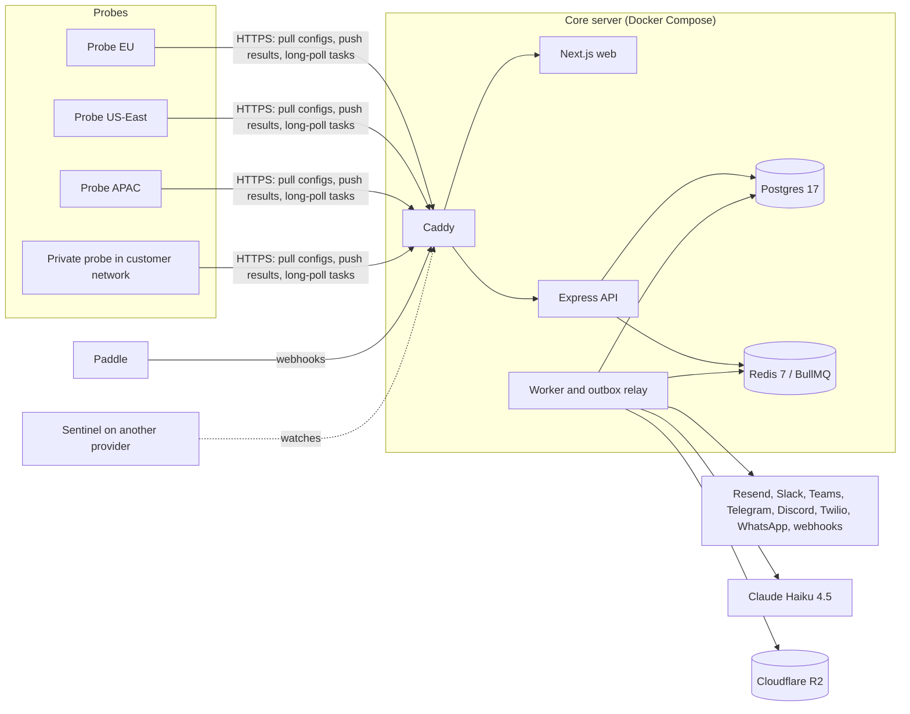
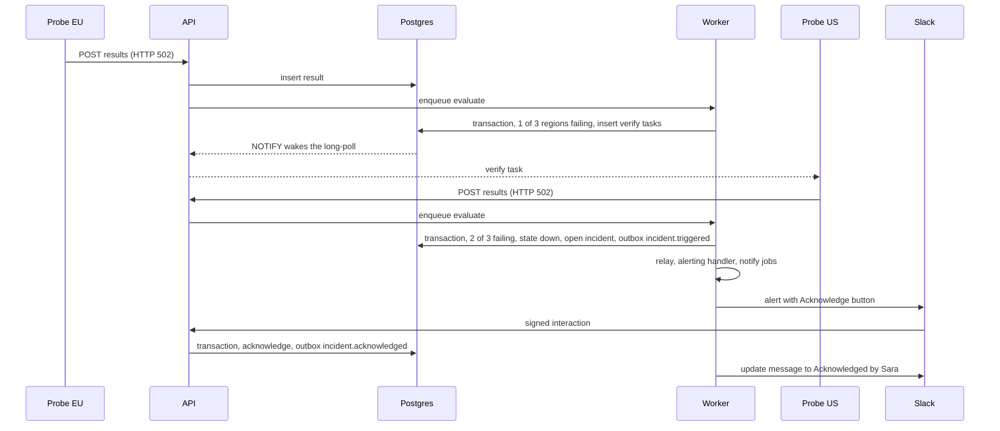
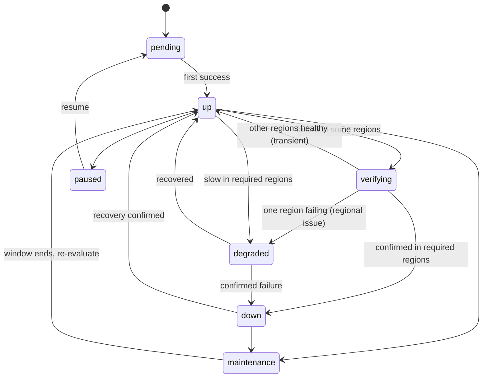

# Watchpost — Product Spec and Build Plan (`PRODUCT.md`)

> **Working name:** Watchpost. Replace it and `<domain>` everywhere once the final name and domain are chosen (Open decision #1).
> **Status:** In progress · **Current phase:** 5 (AI and reports), on `main` in the main checkout (PC-016; Phases 1 to 4 have only owner-blocked tasks left) · **Next task:** `P5-T05` · **Last updated:** 2026-10-08 (P3-T07c done on owner direction, PC-014: landing page v2 under the name UptimeWatch with SEO. Phase 5 started on 2026-10-07 (PC-016; the owner asked on 2026-10-08 to go on through Phase 9 without check-ins, PC-017): P5-T01 to P5-T04 done, built and tested against a stand-in for the model because there is no Anthropic key yet (#24). Phase 2 resumed on `main` on 2026-10-07 and every task the agent can do in it is done: P2-T06, P2-T07, P2-T08, P2-T09 and P2-T10. The code for the probe fleet and the sentinel is built too (P2-T01a, P2-T11a); what is left needs servers and accounts only the owner can buy. No tag: `v0.2.0` waits for those and the closed beta. Phases 1, 2 and 3 as built so far are merged into `main`, PC-008, no tag yet. Phase 4 started from `main` on `phase/4-oncall`: P4-T01, P4-T02a, P4-T02b, P4-T02c, P4-T03a, P4-T03b, P4-T03c, P4-T04, P4-T05a, P4-T05b, P4-T06, P4-T07, P4-T08, P4-T09 and P4-T10a done; every Phase 4 task the agent can do is done; the owner asked for no more check-ins until the phase is done (PC-011). Phase 2 waiting for the owner: P2-T01b (three probe servers) and P2-T11b (a sentinel server, a Telegram bot, a Twilio sender), both in #23; P2-T04b (the R2 bucket, #18); DNS for status pages (#22). Phase 1: P1-T20, the production deploy, needs owner decisions #1 and #7, a server and DNS. Phase 3 waiting for the owner: P3-T02b (Paddle sandbox keys, #13), P3-T05b (Twilio account, #16), P3-T07b (legal review, #15), P3-T08 (go live); also #14 and the branch ruleset in `docs/ci.md`. On the dev machine Windows blocks `turbo.exe` (D-068) and, since 2026-10-07, `pnpm` itself (#17))
> The build agent keeps this status block current.

**Companion files**
- `STACK.md`: tools, versions and code conventions (the "how").
- `ENV_SETUP.md`: where to get Paddle and R2 keys. Save the `paddle-r2-setup.md` guide under this name, because STACK.md already links to it.
- `CLAUDE.md` / `AGENTS.md`: short pointer for coding agents, created in task P0-T01.

**Assumptions:** one developer plus an AI coding agent working from this file · start on Monday 2026-10-05 · DNS on Cloudflare (needed for wildcard certificates; you already use R2) · payments through Paddle (already used for Post-mint).

---

## Contents
1. Product in one page
2. Agent operating rules (read every session)
3. Market and competitors
4. Why customers will pay us
5. Pricing and packaging
6. Feature specification
7. Architecture
8. Data model
9. Core engines
10. Integration details
11. Billing with Paddle
12. Security, abuse and privacy
13. Reliability of our own platform
14. Frontend and UX
15. Testing and quality bars
16. Deployment and operations
17. Build sequence (phases and tasks)
18. Go-to-market
19. Metrics
20. Decision log
21. Proposed changes and improvement backlog
22. Open decisions for the owner
23. Changelog and phase retros
- Appendix A: Environment variables
- Appendix B: Check error taxonomy
- Appendix C: Sources

---

## 1. Product in one page

**One-liner:** Uptime monitoring, on-call and status pages that only page you for confirmed outages, and let you act from Slack, Teams, Telegram, WhatsApp, SMS or a phone call.

**Promise:** Confirmed, explained, actionable alerts. One flat price. No per-seat tax.

**Ideal customers, in priority order**
1. **Small software teams (2–30 engineers)** on UptimeRobot, Uptime Kuma, Better Stack or Opsgenie who are tired of false alarms and per-responder pricing.
2. **Agencies and freelancers** watching 20–500 client sites who need client-facing status pages and monthly uptime reports.
3. **IT teams at SMEs**, especially in South Asia and the Middle East, who live in WhatsApp, Telegram and Teams.

**Problems we solve**
- Single-location checks and network blips cause false alarms. Teams start ignoring alerts and miss real outages.
- "Site is down" alerts don't say why, so diagnosis is slow.
- Monitoring, on-call and status pages are sold separately, and on-call is priced per person.
- Self-hosted monitors (Uptime Kuma) go down with the infrastructure they watch, and someone has to maintain them.
- Forced migrations: Opsgenie reaches end of support on April 5, 2027, and Microsoft switched off Teams Office 365 connectors in May 2026, which broke many alert setups.

**Core loop:** Monitor → Confirm → Alert → Act → Communicate → Learn

| Step | What the product does |
|---|---|
| Monitor | HTTP/API, keyword, JSON, TCP, ping, DNS, WebSocket, SSL, domain expiry, cron heartbeats, alerts from other tools; private probes for internal services |
| Confirm | Re-checks from other regions before anyone is paged; quarantines our own faulty probes |
| Alert | Email, Slack, Teams, Discord, Telegram, webhooks, SMS, voice, WhatsApp, push, routed by on-call schedules and escalation policies |
| Act | Acknowledge, snooze, resolve or escalate from the alert itself |
| Communicate | Status pages on custom domains, subscribers, auto-incidents, AI-drafted updates |
| Learn | Evidence bundles, AI explanations, postmortems, SLA reports, alert-accuracy report |

**MVP** = end of Phase 3 (`v1.0.0`): multi-region monitoring, incidents, alerts on all main channels, status pages, billing, SMS/voice.

**Internal targets for the first 6 months after launch:** 1,000 activated workspaces, 100 paying workspaces, false-alarm rate under 1% of incidents, p95 time from confirmed failure to first notification under 10 s, delivery success after retries above 99.9%.

---

## 2. Agent operating rules (read every session)

### 2.1 Start of every session
1. `git checkout <current phase branch> && git pull --rebase`
2. Read the status block at the top, this section, the current phase in §17, and STACK.md §5 (conventions).
3. Check §21.1 for owner-approved proposals (✅) that change the plan.
4. `pnpm install && docker compose up -d && pnpm test`. The baseline must be green before new work.
5. Work on the task named in **Next task**.

### 2.2 How to work a task
- One task at a time. A task is done only when its acceptance criteria (AC) pass.
- Split large tasks into sub-tasks (`P1-T07a`, `P1-T07b`) in §17 **before** starting them.
- Follow STACK.md §5 strictly: routes → controller → service → repository; Zod on every body, query, params and env; block comments `/* */` only, never `//`; Postgres is the source of truth; Redis holds only jobs, locks and rate limits; jobs use deterministic `jobId`s, exponential backoff, `removeOnFail: false`, a recovery sweep on start and graceful shutdown; webhooks mount before `express.json()` with `express.raw()`; third-party tokens are encrypted with AES-256-GCM; every paid external call is metered into the ledger.
- Every tenant query filters by `workspace_id` through the repository helper (§8). No exceptions.
- Write tests with the code. Never weaken a security control or delete a test to make CI pass.
- Before building any third-party integration, read the provider's current docs (Teams changed twice in 2025–26) and record anything surprising in §20.

### 2.3 Git and GitHub (automatic)
- **Prerequisite:** the machine running the agent has push access to the repo (SSH key or GitHub CLI login). The owner sets this up once.
- **Branch:** one per phase, `phase/<n>-<slug>` from `main` (for example `phase/1-core-monitoring`).
- **After every task:** `pnpm lint && pnpm typecheck && pnpm test`, then `git add -A`, commit, `git push`.
- **Commit format:** Conventional Commits plus the task ID, for example `feat(monitors): HTTP executor with timing waterfall [P1-T07]`. Types: `feat, fix, refactor, perf, test, docs, build, ci, chore`.
- **Checkpoints:** in long tasks, also commit and push working checkpoints (`wip(scope): … [P1-T07]`) whenever lint and typecheck pass, so no work is lost.
- **This file:** update it in the same commit as the code (tick the task, move **Next task**, add decisions, backlog items and changelog lines).
- **End of phase:** open a PR from the phase branch to `main`, wait for green CI, merge without squashing, tag the version from the phase's exit criteria, `git push --tags`, write a phase retro in §23, then start the next phase branch from `main`.
- **Never:** commit `.env` or any secret, force-push `main`, rewrite pushed history, commit `dist/`, `.next/` or `node_modules/`, or disable a CI check.
- **Push rejected?** `git pull --rebase`, re-run tests, push again. If this file conflicts, keep every checked box from both sides.
- **Auth problems** (no credentials, permission denied): stop and ask the owner. Don't create tokens or change remotes yourself.

### 2.4 Keeping this document alive
| You may do without asking | Write a proposal in §21.1 and wait for ✅ |
|---|---|
| Tick tasks, move **Next task** | Change a phase's scope or order |
| Add Decision Log entries for implementation choices | Change pricing, plans or limits |
| Add backlog items with evidence | Add a paid third-party service |
| Fix technical errors in the spec (with a §23 line) | Change the stack in STACK.md |
| Clarify wording, add examples, add sub-tasks | Drop or defer a feature, or loosen a security rule |

Every edit to spec content gets a one-line entry in §23 (date, section, change, reason). When building reveals something (a provider limit, a better algorithm), update the relevant section in the same commit.

### 2.5 Stop and ask the owner when
- Something costs money or can't be undone (servers, domains, paid plans, deleting data, migrations that drop columns in production).
- Credentials are needed. Use only what the owner puts in `.env`; never paste secrets into code, commits, logs or this file.
- Legal or policy text is needed (draft it and mark it `needs owner review`).
- A test would hit a real third-party production system or a real phone number.

### 2.6 Definition of Done (every task)
AC pass · lint, typecheck, tests and build pass · new env vars added to `.env.example` and Appendix A · migrations generated and applied · user-facing copy is clear · no `TODO` without a backlog entry · this file updated · committed and pushed.

### 2.7 Agent pointer file (create in P0-T01)
Create `CLAUDE.md`, and `AGENTS.md` with the same text if other agents are used:
```md
# Agent instructions
1. Read PRODUCT.md §2 and STACK.md before doing anything.
2. Work only on the task in PRODUCT.md's "Next task"; follow its acceptance criteria.
3. After each task: pnpm lint, typecheck, test → commit (Conventional Commits + task ID) → push.
4. Update PRODUCT.md in the same commit (tick task, next task, decisions, backlog, changelog).
5. Never commit secrets or force-push main. Ask the owner before spending money or changing scope.
6. Before writing code, read PRODUCT.md §7.1 (architecture rules) and follow the module template in §7.3.
7. To find code: module map (§7.4) → exact names with grep/ripgrep → grep the owning module for domain words (§2.8). No code index.
```

### 2.8 Finding code efficiently (architecture map + grep)
Every session also reads §7.1 (architecture rules) as part of step 2 in §2.1.

The biggest efficiency gain is the architecture itself: with the module map (§7.4) and fixed file names (§7.3), the agent can usually open the right file without searching.

**Search order for the agent**
1. Module map (§7.4) and file-naming rules (§7.3) → open the file directly.
2. Exact identifier, route, table or error code → grep/ripgrep.
3. Conceptual question ("how do we decide a monitor is down?") → find the owning module in the module map, then grep its files for the domain words.
4. Only then read whole folders.

**No semantic code index.** CocoIndex Code was set up in P0-T10a as optional agent tooling, but its local index never ran on the dev machine (Windows Application Control blocks PyTorch's DLLs), and the owner dropped it on 2026-10-01 before any benchmark was run (D-013, D-056). Don't use or reinstall it; adding a code index again needs a §21.1 proposal.

---

## 3. Market and competitors
*Checked 2026-09-30 from vendor and third-party pages (Appendix C). Re-verify on vendor pages before publishing any comparison.*

| Competitor | Model | Reported pricing | Weak spot | Our answer |
|---|---|---|---|---|
| UptimeRobot | Hosted uptime monitor | Free: 50 monitors at 5-min checks. Paid (Aug 2026, monthly): Solo ~$13, Team ~$46, Scale ~$98 for 200 monitors | 2025 repricing; free-plan commercial-use terms changed and sources disagree on current rules; users report SMS credits used up by false alerts | Free plan that allows commercial use, multi-region confirmation, false-alarm credit refunds, on-call included |
| Better Stack | Monitoring, on-call and observability suite | ~$29 per responder/month billed annually ($34 monthly); 10 monitors included, then ~$21–25 per 50 | Bill grows per responder and per add-on pack | Flat plans, unlimited members from Pro |
| PagerDuty | Enterprise on-call | Professional ~$21/user/month annual ($25 monthly); Business ~$41 ($49); status pages are a paid add-on | Expensive for small teams; no built-in uptime checks | Monitoring, on-call and status pages in one price |
| Opsgenie (Atlassian) | On-call and alerting | New sales ended June 4, 2025 | **End of support April 5, 2027**; unmigrated data is deleted | Opsgenie importer, parallel-run mode, migration guide |
| Hyperping | Flat-price monitoring, status pages, on-call | Pro ~$74/month billed yearly (10 seats, 250 monitors, 3 status pages); free plan with 20 monitors | Closest positioning to ours | Lower entry price, unlimited seats, private probes, WhatsApp/Telegram, AI, agency tooling |
| Uptime Kuma | Free, MIT, self-hosted | $0 plus your server and time | One location; goes down with your server; no on-call or escalation; you maintain it | Hosted, multi-region, private probes for internal checks, one-click Kuma import |
| OneUptime | Open-source all-in-one | Hosted ~$1 per active monitor/month (its own comparison page) | Broad platform | We compete on simplicity and opinionated defaults |
| Spike.sh | Budget on-call | From ~$7/user/month with status pages | Per-user pricing, lighter monitoring | Flat pricing, deeper monitoring |

**Market events that create demand**
- **Opsgenie shutdown (April 5, 2027):** every Opsgenie customer must move within the next six months. Our on-call and importer must be ready by mid-January 2027 (Phase 4).
- **Teams connectors retired:** Office 365 connectors, including Incoming Webhook, were switched off May 18–22, 2026. Alerts to Teams now go through Workflows webhooks (Adaptive Cards; posts show as the Workflows bot; legacy MessageCard buttons don't render) or a Teams app with a bot.
- **Bot Framework SDK retired:** support ended December 31, 2025. Microsoft points new bots to the Microsoft 365 Agents SDK or the Teams SDK.
- **UptimeRobot's 2025 price changes** pushed many small teams to look for alternatives.
- **AI in incident tools** (Better Stack's AI SRE, PagerDuty's AI features) is becoming expected. We include AI explanations in every plan instead of selling them as an add-on.

**What we deliberately don't build:** logs, APM/tracing, RUM, ITSM ticketing. We integrate with those tools through inbound alerts and outbound webhooks.

---

## 4. Why customers will pay us
Each pillar has a "proof moment": something a trial user sees in the first session.

| # | Pillar | What we build | Proof moment |
|---|---|---|---|
| 1 | **Confirmed alerts, not false alarms** | Failure confirmed from ≥2 regions via instant cross-region re-checks; probe self-quarantine; flapping control | Monitor page shows "Confirmed from 3/3 regions" and the workspace's alert-accuracy stat |
| 2 | **Alerts that explain themselves** | Evidence bundle (timing waterfall, error class, failing regions, status, headers, body snippet, TLS/DNS facts) plus a one-line AI explanation in the thread | The first test alert already shows the waterfall |
| 3 | **Act where you are** | Acknowledge, snooze, resolve and escalate from Slack, Teams (app), Telegram, web push, email links, SMS reply codes and phone keypress | Tap "Acknowledge" in Slack during onboarding |
| 4 | **On-call without the per-seat tax** | Schedules, rotations, overrides, escalation policies, personal notification rules; unlimited members on Pro and up | Pricing-page calculator vs per-seat tools |
| 5 | **One inbox for every alert** | Inbound alerts from Grafana, Alertmanager, Datadog, Sentry, email and generic webhooks feed the same escalation engine | Paste an Alertmanager URL and watch a test alert reach on-call |
| 6 | **Migrate in minutes** | Importers for UptimeRobot, Uptime Kuma, Better Stack and Opsgenie; forwarding for parallel runs | Import 48 monitors from UptimeRobot in under a minute |
| 7 | **Inside and outside your network** | Private probe: one Docker command monitors internal services, databases and containers | Private probe shows "online" after one command |
| 8 | **Status pages customers trust** | Custom domain with automatic HTTPS, subscribers, auto-incidents, AI-drafted updates, 90-day uptime bars | Status page generated from monitors in one click |
| 9 | **Built for agencies** | Client workspaces, white-label pages and SLA PDFs, client read-only access | Branded monthly report preview |
| 10 | **Everything as code** | REST API, outbound webhooks, Terraform provider, YAML sync, MCP server, Prometheus endpoint, badges | Copy a README badge |
| 11 | **We tell you when alerting is broken** | Channel health checks (revoked Slack token, deleted Teams workflow, bounced email) with fallback delivery and admin warnings | Integrations page shows health per channel |
| 12 | **Local where it matters** | WhatsApp and Telegram alerts, per-country SMS routing, localized pricing, i18n with RTL support | Choose WhatsApp during onboarding |

---

## 5. Pricing and packaging
*Draft; the owner confirms it in Open decision #3. Prices in USD; Paddle handles tax as merchant of record.*

| | **Free** | **Starter** | **Pro** | **Business** |
|---|---|---|---|---|
| Monthly price | $0 | $9 | $29 | $79 |
| Billed annually (per month) | $0 | $7.50 | $24 | $66 |
| Monitors | 20 | 50 | 150 | 500 |
| Heartbeat (cron) monitors | 5 | 20 | 75 | 250 |
| Fastest check interval | 3 min | 1 min | 30 s | 15 s (verified domains) |
| Regions per monitor | 2 | 3 | 5 | All |
| Team members | 3 | 5 | Unlimited | Unlimited |
| Email, Slack, Teams, Discord, Telegram, webhook alerts with two-way actions | ✓ | ✓ | ✓ | ✓ |
| SMS / voice / WhatsApp credits per month | — | 25 | 150 | 500 |
| On-call schedules and escalation policies | — | 1 each | Unlimited | Unlimited |
| Inbound alert sources | 1 | 3 | Unlimited | Unlimited |
| Status pages | 1 on our subdomain | 3, custom domain | 10, 2,000 subscribers | 50, 20,000 subscribers, private pages, white-label |
| Data history | 30 days | 6 months | 13 months | 25 months |
| AI summaries and drafts | 20/month | 100/month | Fair use | Fair use |
| Reports | Weekly digest | + monthly email | + PDF/CSV SLA reports | + white-label reports |
| Private probes | — | — | 1 | 5 |
| API, Terraform, MCP | Read-only API | ✓ | ✓ | ✓ |
| SSO (OIDC/SAML), audit log, custom roles | — | — | — | ✓ |
| Agency client workspaces | — | — | — | 10 included |
| Support | Docs | Email | Email, 1 business day | Priority, 4 business hours |

**Add-ons (Starter and up):** 100 credits $6 · 500 credits $25 · +100 monitors $15/month (Pro, Business) · extra private probe $10/month · extra client workspace $5/month.

**Credit costs:** 1 credit per SMS in low-cost countries, with per-country multipliers where the provider charges more; voice calls cost 2+ credits per minute; WhatsApp is charged per template message. Multipliers come from the provider price list with at least a 3× margin, and are shown before a phone number is enabled.

**Pricing rules**
- Free forever, commercial use allowed, no card to sign up.
- Every new workspace gets a **14-day Pro trial without a card**, then drops to Free unless upgraded.
- No per-seat pricing on Pro and Business. Annual billing = two months free.
- **Founding customers:** the first 100 paying workspaces get 30% off for life.
- **False-alarm refund:** marking an incident as a false alarm returns the SMS/voice credits it used.
- **Downgrades never delete data.** Monitors over the new limit are paused, and the user picks which stay active.
- Optional regional pricing through Paddle price overrides (Open decision #3).

**Upgrade moments** (where the paywall appears, always showing what the user gains): 21st monitor · interval below 3 min · first SMS/voice/WhatsApp contact · first on-call schedule · custom status-page domain · subscribers · history beyond 30 days · private probe · SSO.

---

## 6. Feature specification

### 6.1 Monitor types
| Type | What it checks | Key options | Phase |
|---|---|---|---|
| HTTP(S) | Status code, response time, redirects, TLS | Method, headers, body, basic/bearer auth (OAuth2 client credentials and mTLS in P6), accepted status codes, follow redirects (max 5), ignore TLS errors, upside-down mode | P1 |
| Keyword | Body contains / doesn't contain text or regex | Case sensitivity; reads at most 1 MB | P1 |
| JSON query | JSONata expression result vs expected value | `==, !=, <, >, contains, matches` | P1 |
| TCP port | Connect; optional TLS; optional send/expect | Host, port | P1 |
| Ping (ICMP) | Reachability, packet loss, RTT | Count, loss threshold | P1 |
| DNS | Record values and change detection | A/AAAA/CNAME/MX/TXT/NS/SOA/CAA, resolver, expected values | P1 |
| WebSocket | Handshake, optional send/expect | Subprotocols, headers | P1 |
| SSL certificate | Expiry, validity, hostname, chain, unexpected change | Warn at 30/14/7/3/1 days; on by default for HTTPS monitors | P1 |
| Domain expiry | Registration expiry via RDAP, WHOIS fallback | Warn at 60/30/14/7/1 days; suggested per apex domain | P1 |
| Heartbeat (push) | Pings from cron jobs and workers | Period or cron + timezone, grace, start/fail signals, max duration | P1 |
| Inbound alert | Alerts from other tools | Dedup key, auto-resolve | P4 |
| gRPC health | `grpc.health.v1` | TLS, service name | P6 |
| Game servers | Steam / GameDig queries | Game type | P6 |
| Databases | Postgres, MySQL/MariaDB, MSSQL, MongoDB, Redis: connect plus optional query | Private probe only | P6 |
| Docker container | Running / healthy | Private probe only | P6 |
| MQTT, Kafka, RabbitMQ, SNMP, RADIUS | Protocol checks | Private probe only | P6 |
| Multi-step API | Chained requests, extracted variables, assertions | JSONata extraction | P8 |
| Browser (Playwright) | Real user flows, screenshots | Script, recorder, AI authoring | P8 |

### 6.2 Options every monitor has
Interval · timeout · regions · confirmation policy (minimum failing regions, default 2; optionally alert on regional issues as a low-severity incident) · recovery policy (consecutive successes: default 2 for intervals up to 60 s, else 1) · degraded threshold (latency over N checks) · upside-down mode · reminders while down (every N minutes) · tags · group · parent dependency · alert policy · severity (critical/high/low) · maintenance windows · runbook URL and notes · public name for status pages.

### 6.3 Incidents
- Opened by monitors, heartbeats, inbound alerts or manually. One open incident per monitor, enforced by the database.
- Status `triggered → acknowledged → resolved`, plus time-boxed `snoozed` and a `flapping` flag.
- Contents: title, severity, cause code, failing regions, evidence bundle, AI explanation, timeline, comments, linked status-page incidents, postmortem.
- Actions: acknowledge, snooze (15 min / 1 h / 4 h / custom), resolve, escalate now, reassign, add responder, mark false alarm (refunds credits and feeds accuracy stats).
- Auto-resolve on recovery (configurable per monitor; inbound alerts resolve from their source).
- Per-workspace incident numbers (`#482`) used in SMS replies and chat commands.

### 6.4 Alert channels
| Channel | Direction | Setup | Phase |
|---|---|---|---|
| Email | Two-way through signed action links | Default for every user | P1 |
| Slack | Threads in P1; buttons, user linking and slash command in P4 | OAuth app install | P1, P4 |
| Microsoft Teams | One-way via Workflows webhook (P1); two-way via Teams app and bot (P6) | Paste Workflows URL (guided) / install app | P1, P6 |
| Discord | One-way, link buttons | Webhook URL | P1 |
| Telegram | One-way in P1; inline buttons in P4 | Deep link to our bot | P1, P4 |
| Webhook (outbound) | Signed JSON, custom request headers (P1-T29); custom body templates in P6. Also the Zapier, Make and n8n gallery entries | URL (+ headers) | P1 |
| SMS | Two-way: reply 1 = acknowledge, 2 = resolve. One segment. Costs alert credits | Verified phone | P3 (P3-T05a; real provider run in P3-T05b) |
| Voice call | Reads the alert; press 1 = acknowledge. New and ongoing incidents only. Costs alert credits | Verified phone | P3 (P3-T05a; real provider run in P3-T05b) |
| Web push (PWA) | Two-way (notification actions) | Install app, allow notifications | P4 |
| WhatsApp | Template messages; quick-reply acknowledge later | Verified number, opt-in | P6 |
| Slack incoming webhook, Google Chat, Mattermost, Rocket.Chat, Zulip, Matrix | One-way; Google Chat, Zulip and Matrix keep an incident in one thread | URL or token | P1 (P1-T29) |
| Pushover, ntfy, Pushbullet, Gotify | One-way push; priority from severity; Pushover emergency mode repeats until acknowledged | Keys or token | P1 (P1-T29) |
| Home Assistant, Signal, LINE and others | One-way | URL or token | P6, by demand |
| PagerDuty, Opsgenie / Jira Service Management, Splunk On-Call (outbound) | One alert per incident: acknowledge and resolve here do the same there. Forwarding for parallel runs during migrations builds on it in P4 | Integration key or endpoint URL | P1 (P1-T29), P4 |

**Every channel has** (P1-T29): a gallery entry with setup steps, "Send test" (automatic after setup, except tools that page people), its own rules (lowest severity it accepts and which events; the alert policy decides which channels are asked), write-only secrets, health with the provider's last error, and a warning when no alert policy sends to it. The catalog is `packages/shared/src/integrations/catalog.ts`.

### 6.5 On-call
- **Schedules:** layers with daily, weekly or custom rotations; handoff day and time; participant order; restrictions (for example weekdays 09:00–18:00); overrides; IANA timezones (DST-safe); iCal feed per user; shift start/end notifications; "who's on call now and next".
- **Escalation policies:** ordered steps targeting users, schedules or channels; delay per step; repeat rounds; stop on acknowledge; escalate now.
- **Personal notification rules** per urgency. Default high urgency: push and email immediately, SMS after 2 min, voice after 5 min. Low urgency: email and push only, optionally business hours only.
- **Handoff report:** what happened during your shift, sent at shift end.
- **Chat commands:** `/watchpost oncall`, `/watchpost ack 482`, `/watchpost maintenance 1h api` (Slack in P4, Teams bot in P6).

### 6.6 Status pages
- URL `https://<slug>.status.<domain>` or a custom domain with automatic HTTPS.
- Components linked to monitors or set manually; groups; 90-day uptime bars; current status banner; incident history; scheduled maintenance; optional response-time chart.
- **Auto-incidents:** when a monitor behind a public component stays down for N minutes (default 5), a status-page incident opens with an AI-drafted message, published automatically or held for approval.
- Updates: investigating → identified → monitoring → resolved; AI drafts in a chosen tone.
- Subscribers: email (double opt-in), webhook, Slack, RSS/Atom; per-component subscriptions on Pro and up.
- Branding: logo, colors, favicon; custom CSS and removing "Powered by" on Business.
- Visibility: public, password-protected, SSO or IP allowlist (Business).
- JSON API and embeddable status widget (P6); multi-language pages (P7).
- **As built (P2-T07):** a page has a name, an address (`slug`: 3 to 63 letters, digits or hyphens; reserved names refused), branding (logo, favicon, accent color, description, support link; https links only) and settings. Components are an ordered list; each follows a monitor or is set by hand, may sit in a named group and may hide its uptime. Page incidents are written for the public and are separate from internal incidents: title, impact (degraded, partial or major outage) on the components named, updates (investigating → identified → monitoring → resolved), and a draft state only the team sees. The public snapshot (`GET /api/public/status/:ref`, also the page's JSON API) holds the banner, components with status and 90 daily bars (maintenance excluded), open incidents, 14 days of history and maintenance windows of the page's monitors that are in effect or start within 14 days; `/rss` and `/atom` list the updates. A monitor with no result yet or paused shows "No data yet" and doesn't count for the banner. An open incident raises its components to at least its impact. Team API: `/api/w/:ws/status-pages` (viewers read, members edit; permissions `statusPage:read`, `statusPage:write`). Web: `/w/[ws]/status-pages` (list, create from monitors) and `/w/[ws]/status-pages/[id]` (incidents, services, settings, live preview). The plan's page limit (§5) is enforced with 402. **Custom domains (P2-T08):** on plans with `customStatusDomain` (Starter and up) a page takes one host name of the customer's (`PUT /status-pages/:id/domain`). It starts unverified. A check (`POST …/domain/verify`, and a sweep every 5 minutes for new domains, daily for the rest) passes when the domain's CNAME chain reaches `CUSTOM_DOMAIN_CNAME_TARGET`, or when it resolves to an address the target resolves to (DNS hosts that hide the CNAME). Only then does the public API answer for that host and `/api/internal/tls/ask` say yes. A verified domain that stops pointing at us keeps working for 7 days with a warning, then is unverified. Our own hosts can't be claimed, and a domain belongs to one page. The web proxy sends any host that is not ours (`APP_DOMAIN`, its parent domain, `PRIMARY_HOSTS`) to `/s/<host>`. **Subscribers (P2-T09):** email only for now. A visitor enters an address in the form on the page (a plain HTML form post, no JavaScript needed; `POST /api/public/status/:ref/subscribers`), gets a confirmation email and is subscribed once the link is opened. Each published update (create, update, resolve, and a draft that is published) is emailed to everyone who had confirmed by then, with an unsubscribe link and the one-click headers mail apps use. The plan's subscriber limit (§5) counts per page; a plan with none hides the form. The team sees the list and can remove an address. **Auto-incidents (P2-T09):** off by default, per page. When a monitor behind a component has been down for N minutes (default 5) the page opens an incident "<Service> is unavailable", published at once or held as a draft; when the monitor is no longer down the page resolves it. The text is a fixed template until AI drafts exist (Phase 5). **AI drafts (P5-T03):** where AI is set up, "Draft with AI" in the editor turns the title and the team's notes into a public update in the page's tone (neutral, friendly or formal) for a person to edit and post (`POST /api/w/:ws/status-pages/:id/drafts`); nothing is posted by drafting. Automatic incidents use a drafted text when the model answers and the fixed text when it doesn't; whether they go out at once or wait as a draft is the page's existing setting. Updates that started as a draft are marked `ai_drafted`. Not yet: webhook and Slack subscribers, per-component subscriptions, response-time chart, custom CSS, private pages (P7).

### 6.7 Heartbeats
- `https://hb.<domain>/<token>` accepts GET and POST, plus `/start`, `/fail` and `/<exit-code>`; an optional body (up to 10 KB) is stored as a log excerpt.
- Schedule by period or cron expression with timezone, plus grace time. Tracks run duration and alerts on runs that take too long.

### 6.8 Inbound alerts
- Generic JSON endpoint `https://app.<domain>/api/inbound/<token>` with `status` (trigger/resolve), `dedup_key`, `severity`, `title`, `description`, `links`, `tags`.
- Native parsers: Prometheus Alertmanager, Grafana alerting, Datadog webhooks (we provide the payload template), Sentry (P6), email-to-alert (`<token>@in.<domain>`).
- Mapping rules: severity mapping, title template, routing to an alert policy or escalation policy, auto-resolve.

### 6.9 AI features (Claude Haiku 4.5, per STACK.md)
| Feature | When | Output | Phase |
|---|---|---|---|
| Incident explainer | Seconds after an incident opens | Headline, likely cause, confidence, evidence references, next checks; posted as a thread reply and shown on the incident | P5 |
| Status update drafts | Auto-incidents and manual updates | Customer-friendly update in a chosen tone | P5 |
| Postmortem draft | After resolve | Markdown postmortem from the timeline and evidence | P5 |
| Weekly digest insights | Weekly, via the Batch API | Short narrative on trends and noisy monitors | P5 |
| Alert hygiene tips | Monthly | Flapping monitors, unacknowledged alerts, broken channels | P5 |
| Browser check authoring | On demand | Playwright script from plain English, human-approved | P8 |

Guardrails are in §9.10. **AI never decides whether to alert and never delays the first alert.**

### 6.10 Reports
Weekly digest email · monthly uptime email · SLA reports per monitor, group or status page (uptime %, downtime minutes, incidents, MTTA, MTTR, latency percentiles) as PDF and CSV · white-label PDFs for agencies · scheduled delivery to stakeholders and clients.

### 6.11 Team, roles and security
| Role | Can |
|---|---|
| Owner | Everything, including billing, deleting the workspace and transferring ownership |
| Admin | Monitors, integrations, members, status pages, policies |
| Member | Monitors, status pages, incidents |
| Responder | View everything; acknowledge, resolve and comment; manage own contact methods |
| Viewer | Read-only |
| Billing | Billing pages only |

The exact table is `ROLE_PERMISSIONS` in `packages/shared/src/constants/roles.ts` (P4-T01, D-072): each role holds permissions such as `monitor:write` or `incident:respond`, every route under `/api/w/:workspaceId` is guarded by exactly one of them (`requirePermission`), and the web app reads the same table to decide what to show. Responders and above also manage their own contact methods and notification rules (`contact:manage`, P4-T02a) and can add schedule overrides (`schedule:override`); admins and owners define schedules (`schedule:write`, P4-T03a). Admins also manage billing. Everyone can read the plan, its limits and usage; owners, admins and the billing role change it. A billing member's sidebar holds Billing only, and any other section sends them back there.

TOTP 2FA on all plans (passkeys later) · SSO (OIDC/SAML) and enforced 2FA on Business · audit log on Business, security events on all plans · session list and revoke · scoped API keys.

### 6.12 Imports and migration
| Source | Method | Imports |
|---|---|---|
| UptimeRobot | Read-only API key | Monitors (HTTP, keyword, ping, port, heartbeat), intervals, alert contacts as channels |
| Uptime Kuma | Upload of the Kuma SQLite database (default install) or JSON backup; CSV template for other setups | Monitors, tags, groups, notification configs where supported, status pages |
| Better Stack | API token | Monitors, heartbeats, policies where mappable |
| Opsgenie | Read-only API key | Users (by email), teams, schedules and rotations, escalations, integration list as a checklist |
| PagerDuty | API key (P7) | Schedules, escalation policies, services |

Every import runs as a **dry run** first (preview and warnings), then applies. Uploaded files are deleted after import (R2 lifecycle of 1 day). Outbound Opsgenie and PagerDuty channels support a parallel run during migration.

### 6.13 Developer platform
REST API v1 with OpenAPI docs generated from Zod · scoped API keys · outbound webhooks for `incident.*`, `monitor.*`, `status_page.*` · Terraform provider · YAML "monitoring as code" synced by a GitHub Action · MCP server for AI assistants (read monitors and incidents, acknowledge, create maintenance) · Prometheus metrics endpoint per workspace · SVG badges (status, uptime, response time) that link back to us.

### 6.14 Uptime Kuma parity (the baseline)
| Kuma feature | Our version | Phase |
|---|---|---|
| HTTP(s), TCP, keyword, JSON query, WebSocket, ping, DNS, push monitors | Same types, checked from multiple regions | P1 |
| Steam game servers, Docker containers, databases and other 2.x types | Game servers from our probes; Docker, databases, MQTT and others via private probes | P6 |
| 90+ notification services | Native top channels plus generic webhook with templates; long tail by demand | P1–P6 |
| 20-second intervals | 30 s on Pro, 15 s on Business (verified domains) | P3 |
| Multiple status pages mapped to domains | Yes, with automatic HTTPS, subscribers and auto-incidents | P2 |
| Ping chart, certificate info | Per-region percentiles, timing waterfall, TLS details | P1–P2 |
| Proxy support | Per-monitor HTTP proxy on private probes | P6 |
| 2FA | TOTP; SSO on Business | P1, P7 |
| Maintenance windows, tags, groups, badges | Yes | P1–P2 |
| Multi-language UI | i18n-ready from P1; languages added by demand | P1, P7 |
| Upside-down mode, retries, resend while down | Upside-down mode, multi-region confirmation, reminders | P1–P2 |
| Prometheus metrics | Per-workspace endpoint | P6 |

---

## 7. Architecture
This section is the architecture contract. Read §7.1 before writing any code. CI enforces the rules (§7.13). If a rule blocks you, write a proposal in §21.1 instead of working around it.

### 7.1 Rules and trust zones

**Rules (non-negotiable)**
1. **Modular monolith plus probes.** One backend codebase (`@app/api`) with two entry points: `server.ts` (HTTP) and `worker.ts` (jobs). Probes are a separate deployable. No microservices.
2. **Postgres is the source of truth.** Redis holds only queues, locks and rate limits. Every queued job must be rebuildable from Postgres by a recovery sweep, or be explicitly marked `ephemeral`.
3. **Modules own their tables.** Only a module's repository reads or writes its tables. Other modules use its public API in `modules/<name>/index.ts`.
4. **Calls go down, events go up.** A module may call only the modules listed for it in §7.4. Anything that must flow the other way is an event (§7.5).
5. **Layers inside a module:** routes → controller → service → repository. Controllers hold no business logic. Repositories hold no business logic and know nothing about HTTP. Job processors and event handlers call services.
6. **Cross-module side effects go through the outbox.** In this document, "emit X" always means "insert an outbox row for X in the current database transaction"; the relay enqueues handlers after commit. A module may enqueue its *own* follow-up jobs directly only when the work is already recorded in Postgres (a pending delivery row, a due timestamp), so the sweep can rebuild it. Provider callbacks with response deadlines (Slack, Telegram, Twilio) apply the state change synchronously in one transaction and emit events; the heavy work runs from those events. Better Auth callbacks run outside our transactions, so they emit `email.requested` in a transaction of their own (`infra/email` `createEmailRequester`); the outbox keeps the email durable (D-028).
7. **Validate at every edge** with Zod: HTTP input, webhook payloads (after the signature check), probe payloads, job data, event payloads, env. Inside the core, types are trusted.
8. **Tenancy is explicit.** Every service method that touches tenant data takes a `WorkspaceScope` first; repositories refuse to run without one.
9. **Everything is idempotent.** Deterministic job IDs, unique constraints on external event IDs, `ON CONFLICT DO NOTHING` for results. Any handler can run twice without harm.
10. **Shared code is pure.** `@app/shared` holds Zod schemas, types, constants and pure functions only: no Node APIs, no I/O, no dependency except `zod`.
11. **The web app is a client of the API.** Next.js never touches the database; business rules live in the API (STACK.md §8).
12. **Providers sit behind adapters.** Provider SDKs are imported only in `infra/` and `modules/channels/adapters/`.
13. **When in doubt, don't page.** If a failure might be our fault (probe error, platform gap), record it and alert our ops, not the customer.

**Trust zones**
| Zone | Callers | Entry points | Authentication |
|---|---|---|---|
| Public | Anyone | Marketing site, status pages, badges, `/api/public/*` | None: read-only, cached, rate-limited |
| Token URLs | Customers' cron jobs and tools | `hb.<domain>/<token>`, `/api/inbound/<token>` | Secret token in the URL, stored hashed, rotatable |
| App | Signed-in users | `app.<domain>`, `/api/w/:workspaceId/*` | Better Auth session cookie (+2FA or SSO) |
| Public API | Scripts, Terraform, MCP server | `/api/v1/*` | Scoped API key |
| Probes | Our probes and private probes | `/api/probe/v1/*` | HMAC signature per probe |
| Providers | Paddle, Slack, Telegram, Twilio, Microsoft | `/api/webhooks/*`, `/api/integrations/*` | Provider signature or secret |
| Internal | Caddy, worker | `/api/internal/*`, `http://web:3000/api/revalidate` | Docker network only (+ shared secret for revalidate) |
| Data | API and worker only | Postgres, Redis | Private network and credentials; never exposed |

### 7.2 Runtime containers


| Container | Responsibility |
|---|---|
| Caddy | TLS (wildcard for status subdomains, on-demand TLS for custom domains), routing, blocks `/api/internal/*` from the internet |
| Web (`@app/web`) | Marketing site, app UI, public status pages (cached) |
| API (`@app/api`, `server.ts`) | All HTTP routes in §7.9: app API, public API, Better Auth, webhooks, probe protocol, heartbeat and inbound ingest |
| Worker (`@app/api`, `worker.ts`) | Outbox relay, evaluation, event handlers, notifications, escalations, timers, sweeps, rollups, retention, AI, reports, imports, billing, emails |
| Probe (`@app/probe`) | Regional and private probes: sync assigned monitors, schedule and run checks, push results, run urgent tasks |
| Postgres | Source of truth, including partitioned check results and the outbox |
| Redis | BullMQ queues, locks and rate limits only |
| R2 | Failure evidence, screenshots, report PDFs, import uploads, backups |
| Sentinel | Small independent watchdog on a different provider that pages the founders directly |

### 7.3 Repository and module layout (extends STACK.md §4)
```
/
├─ PRODUCT.md  STACK.md  ENV_SETUP.md  CLAUDE.md  AGENTS.md  .mcp.json
├─ .dependency-cruiser.cjs        (architecture rules, §7.13)
├─ .github/                       (CI workflows, PR template)
├─ docs/
│  ├─ runbooks/                   (our own ops: restore, probe down, mass false alarms …)
│  ├─ integrations/               (user-facing setup guides per channel)
│  └─ agent-benchmark.md          ("find the code" questions with answers; benchmark retired, D-056)
├─ packages/shared/src/
│  ├─ schemas/                    (monitor configs, probe protocol, API requests/responses, events)
│  ├─ constants/                  (plans, regions, error codes, roles)
│  └─ index.ts
├─ probe/                         (@app/probe, §7.6)
├─ tools/fake-target/             (dev-only outage simulator)
└─ backend/                       (@app/api)
   ├─ drizzle.config.ts           (schema glob: src/modules/*/schema/*.ts and src/infra/*/schema.ts)
   ├─ drizzle/                    (one migration history for the whole database)
   ├─ scripts/                    (paddle-catalog.ts, new-module.ts, deploy-probes.sh)
   ├─ src/
   │  ├─ server.ts                (HTTP entry: builds the container, mounts routes)
   │  ├─ worker.ts                (jobs entry: builds the container, registers processors, starts the relay)
   │  ├─ app.ts                   (Express app factory and middleware order, §7.9)
   │  ├─ migrate.ts
   │  ├─ composition/             (container.ts wires everything; architecture.ts lists allowed module edges)
   │  ├─ config/                  (env schema, constants, plans)
   │  ├─ core/                    (AppError types, WorkspaceScope, pagination, clock and ID interfaces; no I/O)
   │  ├─ infra/                   (db, redis, queues, outbox, auth, email, r2, anthropic, paddle, twilio, logger, crypto, locks)
   │  ├─ middleware/              (request-id, session, api-key, probe-auth, workspace, roles, quota, validate, error handler)
   │  └─ modules/<module>/        (template below)
   └─ web/                        (@app/web, §7.10)
```
`pnpm-workspace.yaml` adds `"probe"` and `"tools/*"`.

**Module template** (`pnpm new:module <name>` generates it, so every module starts identical):
```
modules/<module>/
├─ index.ts                  public API: create<Module>Module(), service interface, public types, event types
├─ <module>.routes.ts        Express router: paths, middleware, validators → controller
├─ <module>.controller.ts    HTTP in and out only
├─ <module>.service.ts       business rules, transactions, emits events
├─ <module>.repository.ts    Drizzle queries for this module's own tables only
├─ schema/                   Drizzle tables owned by this module
├─ validators/               Zod request schemas (built from @app/shared)
├─ types/                    internal types
├─ events/                   handlers for events this module consumes
├─ jobs/                     BullMQ processors for this module's jobs
└─ __tests__/                unit and integration tests
```

**Composition root.** `composition/container.ts` builds infra clients once (db, redis, queues, outbox, clock, logger, providers) and creates each module with explicit dependencies, for example `createIncidentsModule({ db, outbox, clock, audit, monitors })`, which returns `{ service, router, eventHandlers, processors }`. `server.ts` mounts routers; `worker.ts` registers processors and handlers. No DI container and no global singletons: tests build a module with fakes in a few lines. Middleware that needs module logic (probe auth, quota) receives functions from the container, so middleware never imports modules.

### 7.4 Modules, table ownership and allowed calls
Better Auth's tables are managed by Better Auth through `infra/auth`; modules reach users and memberships only through `workspaces`. Every edge not listed under "May call" is forbidden and fails CI. The graph has no cycles; keep it that way.

| Module | Owns tables | Responsibility | May call |
|---|---|---|---|
| `audit` | audit_logs | Append-only audit trail (`audit.record(tx, …)`) | — |
| `workspaces` | workspace_settings | Workspaces, members and roles (via Better Auth), settings, incident numbers, trial dates, billing contacts | audit |
| `apikeys` | api_keys, idempotency_keys | API keys, scopes, idempotency for the public API | workspaces, audit |
| `billing` | subscriptions, subscription_payments, billing_accounts, billing_events, trial_notices | Paddle (webhooks, checkout, plan changes, portal, reconcile), plans, entitlements (`billing.entitlements(scope)`), the card-less trial and its emails | workspaces, audit |
| `credits` | credit_balances, credit_ledger, usage_ledger, provider_funding | Credit balance, monthly grants, packs, charges, refunds, cost metering, AI budget (`credits.aiBudget(scope)`), upstream funding status | billing |
| `monitors` | monitors, monitor_groups, tags, monitor_tags, monitor_config_changes | Monitor configuration, limits (pauses or resumes monitors when the plan changes; `monitors.planLimits(scope)` for modules that can't call billing), config change feed for probes | workspaces, billing, audit |
| `maintenance` | maintenance_windows | Windows (one-off or repeating in a timezone); "is this monitor in maintenance at time T"; which windows just started or ended | monitors, audit |
| `contacts` | contact_methods, notification_rules, chat_links | Users' contact methods, personal rules, chat account links | workspaces, channels, audit |
| `channels` | channels, slack_installations, telegram_chats, teams_installations, message_refs, direct_refs, phone_numbers | Channel configs and adapters (send, update, health); phone verification; charges credits for paid channels (SMS, voice) before sending | credits, audit |
| `results` | check_results, check_events, rollups_5m, rollups_1h, rollups_1d | Result storage, partitions, rollups, retention, chart queries | monitors |
| `probes` | probes, probe_tasks | Probe registry and auth, assignments, tasks, probe health and the health guard (quarantine, silent-probe notices), "Test now" | monitors, results |
| `deploys` | deploy_hooks, deploys | Deploy markers: per-workspace deploy URL, GitHub `deployment_status` receiver, deploy log (P1-T26) | — |
| `incidents` | incidents, incident_events, incident_comments, postmortems | Incident lifecycle and timeline; names a deploy shortly before an incident | monitors, workspaces, audit, deploys |
| `detection` | monitor_state, monitor_region_state, downtimes | Result ingest (`POST /api/probe/v1/results`), fast path, evaluation engine (§9.2), uptime math, error budgets, "what changed" | monitors, results, probes, maintenance, incidents, deploys |
| `heartbeats` | heartbeat_state, heartbeat_pings, platform_gaps | Heartbeat ingest, missed-ping sweeper, platform tick and gap guard | monitors, maintenance, incidents |
| `expiry` | domain_expiry_cache, expiry_notices, rdap_bootstrap, ssl_state | SSL and domain sweeps; opens or updates one low-severity incident per expiring item, resolves it on renewal | monitors, results, incidents |
| `inbound` | inbound_sources | Parse inbound alerts, dedupe, route | incidents, workspaces, billing |
| `oncall` | schedules, schedule_layers, schedule_overrides, oncall_feeds, shift_notices, escalation_policies | Schedules, who's on call, shift notices and handoff reports, escalation policy definitions | contacts, workspaces, incidents, billing, audit |
| `alerting` | alert_policies, notification_deliveries, alert_fallback_notices, escalations | Delivery planning, `notify` and `escalate` jobs, reminders, fallback notices, false-alarm credit refunds | incidents, oncall, contacts, channels, credits, workspaces |
| `actions` | action_tokens | Acknowledge, snooze, resolve and escalate from links, chat and phone; `/watchpost` chat commands | incidents, contacts, channels, workspaces, oncall, maintenance, monitors |
| `ai` | ai_generations | The one guarded path to the model (budget, circuit breaker, redaction, validation, metering), the prompt registry, eval fixtures, feedback; explainers, status drafts, postmortems, digests | incidents, results, monitors, billing, credits |
| `statuspages` | status_pages, status_components, status_incidents, status_updates, status_subscribers | Pages, components, public incidents and updates, the public snapshot (JSON, RSS, Atom), custom domains, subscribers, auto-incidents | monitors, detection, incidents, results, maintenance, billing, ai |
| `reports` | reports, digest_sends | SLA reports, digests, PDFs | monitors, detection, incidents, results, statuspages, workspaces |
| `imports` | imports | Importers (dry run, apply) | monitors, channels, contacts, oncall, statuspages, workspaces |
| `badges` | — | SVG status, uptime and response-time badges at signed public URLs, cached in memory for a minute | monitors, detection, results |
| `admin` | product_events | Internal admin pages, metrics, activation analytics (fed by events) | Any module, read-only |

Cross-module calls inside a transaction pass `tx` explicitly (for example, `detection` calls `incidents.openForMonitor(tx, …)` in the same transaction that changes monitor state, so the unique index in §8 guards against duplicates).

### 7.5 Events, outbox and background work

**Transactional outbox** (`infra/outbox`, table `outbox_events`: id, workspace_id, type, version, payload, correlation_id, created_at, dispatched_at, attempts, last_error)
1. `outbox.emit(tx, type, payload)` validates the payload against the event's versioned Zod schema in `@app/shared/schemas/events`, inserts the row in the caller's transaction and issues `NOTIFY outbox` (Postgres delivers it only on commit).
2. The relay in the worker wakes on that notification (and polls every second as a fallback), claims up to 100 undispatched rows `FOR UPDATE SKIP LOCKED`, enqueues one job per subscribed handler (`evt:{eventId}:{handler}`), marks the rows dispatched and commits. A crash between enqueue and commit only causes a harmless duplicate (rule 9).
3. Handlers reload current state from Postgres and never rely on event order.
4. Dispatched rows are deleted after 7 days. Outbox lag (age of the oldest undispatched row) is a metric; `/api/ready` fails above 60 s.

**Event catalog** (payloads carry IDs and a short summary)
| Event | Emitted by | Consumed by |
|---|---|---|
| `workspace.created` | workspaces | alerting (default alert policy), billing (billing account, trial welcome email), admin |
| `monitor.created`, `monitor.updated`, `monitor.deleted` | monitors | statuspages (component links), admin |
| `monitor.state_changed` | detection | statuspages (component status, auto-incident timer, revalidation), admin |
| `incident.triggered` | incidents | alerting (notify, start escalation), ai (explainer), statuspages, admin |
| `incident.acknowledged`, `incident.snoozed`, `incident.resolved`, `incident.reopened` | incidents | alerting (update messages, stop or resume escalation), statuspages |
| `incident.escalation_requested` | incidents | alerting (run the next step now) |
| `incident.flapping_started` | incidents | alerting (one flapping notice) |
| `incident.updated` | incidents | alerting (sent like a reminder, e.g. a nearer expiry) |
| `incident.ai_summary_ready` | incidents | alerting (thread follow-up) |
| `incident.false_alarm_marked` | incidents | alerting (refund credits through `credits`), admin (accuracy stats) |
| `channel.health_changed` | channels | alerting (fallback notices to admins) |
| `status_page.update_published` | statuspages | statuspages (subscriber fan-out, revalidation) |
| `billing.plan_changed` | billing | monitors (pause or resume over-limit monitors), credits (grants), admin |
| `billing.period_renewed` | billing (once per billing period Paddle collected money for) | credits (monthly grant, upstream funding) |
| `billing.credits_purchased` | billing (a paid credit pack) | credits (adds the credits, upstream funding) |
| `import.completed` | imports | admin |
| `email.requested` | any module | `infra/email` (sends through Resend) |

**Queues and jobs** (all: exponential backoff, `removeOnFail: false`, `worker.close()` on SIGTERM; one worker process runs every queue, and can later be split with `WORKER_QUEUES=…` using the same image)
| Queue | Kind | Work | Job ID | Rebuilt on start from |
|---|---|---|---|---|
| `evaluate` | Technical | Evaluate one monitor after new results | `eval:{monitorId}:{lastResultId}` | `last_result_at > last_evaluated_at` |
| `<module>-events` | Event handler | One event for one handler (`alerting-events`, `statuspages-events`, `ai-events`, `credits-events`, `billing-events`, `monitors-events`, `admin-events`) | `evt:{eventId}:{handler}` | Undispatched outbox rows |
| `notify` | Follow-up | Deliver one pending delivery | `notify:{eventId}:{destinationKey}` | Pending `notification_deliveries` |
| `escalate` | Delayed | Next escalation step | `esc:{incidentId}:{round}:{step}` | Triggered incidents: `esc_round`, `esc_step` and the time of the last `triggered`/`escalated` timeline event |
| `timers` | Delayed | Snooze wake-up, auto-incident delay, reminders (processed by the module that owns the state) | `timer:{kind}:{refId}:{dueAt}` | `snoozed_until`, `monitor_state.since`, last reminder event |
| `sweeps` | Scheduled | Heartbeat misses (15 s), platform tick (10 s), SSL/domain (daily), maintenance boundaries, outbox cleanup, billing clock (1 min), unprocessed Paddle events (1 min), trial emails (hourly), monthly credit grants (hourly), provider funding check (hourly), Paddle reconcile (daily) | `sweep:{kind}:{bucket}` | Schedules re-registered on start |
| `results` | Scheduled | Rollups, partition create/drop, retention | `rollup:{size}:{bucketStart}` | Schedules; rollups are idempotent |
| `statuspages` | Follow-up | Subscriber fan-out, cache revalidation | `sp:{kind}:{id}:{version}` | Unsent fan-out rows |
| `ai` | Follow-up | Explainer, drafts, digests (rate-limited) | `ai:{kind}:{refId}` | `ephemeral` (AI is optional) |
| `reports` | Scheduled | SLA PDFs, digests | `report:{workspaceId}:{kind}:{period}` | Schedules |
| `imports` | On demand | Dry run, apply | `import:{importId}:{stage}` | `imports.status` |
| `billing` | Follow-up | Process a stored Paddle event (the nightly reconcile, the billing clock and trial emails run on `sweeps`) | `paddle:{eventId}` | Unprocessed `billing_events` |
| `emails` | Event handler | Send one transactional email | `email:{eventId}` | Undispatched outbox rows |

Job data holds IDs only, never whole objects; processors reload from Postgres.

**Job ID format:** the patterns above are written with `:` for readability, but the code joins parts with `.` through `buildJobId()` (for example `timer.snooze.{refId}.{dueAt}`), because BullMQ rejects custom job IDs containing `:` unless they have exactly three parts (D-021). The registry lives in `backend/src/infra/queues/registry.ts`. Event-handler jobs use `evt.{eventId}.{handler}`.

**Where the contract lives in code (P0-T09):** module edges in `backend/src/composition/module-edges.json` (typed by `architecture.ts`, enforced by `.dependency-cruiser.cjs`); event subscriptions in `architecture.ts` (`EVENT_SUBSCRIPTIONS`); payload schemas in `@app/shared` (`EVENT_SCHEMAS`); outbox in `backend/src/infra/outbox/` (`emit`, relay, consumer via `defineEventProcessor`, hourly cleanup on the `sweeps` queue, lag check in `/api/ready`).

### 7.6 Probe architecture and protocol
```
probe/src/
├─ main.ts        wires components, reads env, flushes the buffer on SIGTERM
├─ transport/     signed HTTPS client, retries with backoff, result buffer (memory; disk for private probes)
├─ sync/          assignment delta sync every 15 s; full resync when the server asks
├─ scheduler/     min-heap of next-run times, stable offsets, skips a monitor whose previous run is still going
├─ executor/      concurrency limiter; dispatches to checks/<type>.ts
├─ checks/        http, tcp, dns, ping, websocket …: pure functions (config, clock, net) → result
├─ net/           SSRF guard, pinned lookup, timing waterfall (§9.1)
├─ tasks/         long-poll loop for verify and "Test now" tasks
├─ report/        batches results (every ~1 s or 100 results)
└─ health/        local /healthz and POST /heartbeat
```
The probe imports only `@app/shared`. A `PROBE_MODE=private` flag turns on the disk buffer and relaxes only the private-range SSRF rule.

All calls go over HTTPS to `https://app.<domain>/api/probe/v1` and are signed:
```
X-Probe-Id: <probeId>
X-Probe-Timestamp: <unix seconds>
X-Probe-Signature: hex(HMAC_SHA256(secret, ts + "\n" + method + "\n" + path + "\n" + sha256hex(body)))
```
Requests more than 60 s off are rejected. The server needs the raw secret to verify HMACs, so probe secrets are stored **encrypted** (AES-256-GCM), not hashed. The signature covers the raw body, so these routes are mounted before the JSON parser (§7.9).

| Endpoint | Owner module | Purpose |
|---|---|---|
| `POST /hello` | probes | Version and capabilities → server time, poll and batch settings |
| `GET /assignments?after=<seq>` | probes | Delta sync of assigned monitor configs using the global change sequence; `full=true` resync when the cursor is too old |
| `POST /results` | detection | Batch of results (`batchId` plus array); idempotent by result ID; returns 202 |
| `GET /tasks?wait=25` | probes | Long-poll for verify or "Test now" tasks; returns as soon as one arrives (`LISTEN/NOTIFY`) |
| `POST /heartbeat` | probes | Every 15 s: load, queue depth, error counts |

**Probe behavior:** each monitor runs on its own timer with a stable offset `hash(monitorId, region) mod interval` plus small jitter. The probe never runs the same monitor twice at once, caps concurrency, and buffers results for up to 10 minutes if the API is unreachable. Managed probes see all monitors assigned to their region; private probes see only their workspace's monitors. When a region has several probes, the server splits monitors between them with rendezvous hashing and reassigns if one goes silent for 60 s.

### 7.7 Capacity and storage
Checks per second = Σ (monitors × regions ÷ interval in seconds).

| Scenario | Monitors | Avg interval | Regions | Checks/s | Raw rows/day |
|---|---|---|---|---|---|
| Beta | 2,000 | 120 s | 2 | 33 | 2.9 M |
| 6 months after launch | 20,000 | 90 s | 2.5 | 556 | 48 M |
| Growth | 100,000 | 60 s | 3 | 5,000 | 432 M |

**Retention:** raw results 48 h (per-check charts) → 5-minute rollups 90 days → hourly rollups 25 months → daily rollups forever. Failures and state changes are kept as `check_events` for the plan's history period. `downtimes` hold exact outage intervals for uptime math.

**Scale triggers:** sustained ingest above 300 results/s or DB disk above 60% → move Postgres to its own server (8 vCPU, 32 GB, NVMe). Ingest above 2,000 results/s → evaluate TimescaleDB (compression, continuous aggregates) or ClickHouse for results only.

### 7.8 Regions
P2: `eu-central` (Frankfurt), `us-east` (New York/Virginia), `ap-southeast` (Singapore). P8: `ap-south` (Mumbai/Bangalore), `me-central` (UAE), `eu-west` (London), `us-west`, `sa-east` (São Paulo), `ap-southeast-2` (Sydney). Spread probes across at least two hosting providers; the sentinel runs on a third.

### 7.9 HTTP request lifecycle and API conventions
**Middleware order in `app.ts`**
1. `requestId` (from `X-Request-Id` or a new UUIDv7) → request-scoped pino logger
2. `helmet`; CORS limited to the app origin, except `/api/public/*`
3. Raw-body routes, mounted before any JSON parser: Better Auth at `/api/auth/*`, `/api/webhooks/*`, `/api/integrations/*`, `/api/probe/v1/*`, `/api/inbound/*`, `/api/hb/*`
4. `express.json({ limit: "1mb" })` for everything else
5. Rate limits: per IP for public routes, per key for `/api/v1`, per workspace for `/api/w`
6. Authentication: session for `/api/w`, API key for `/api/v1`
7. `workspace` → `WorkspaceScope`; then `roles` and `quota` per route
8. `validate` (Zod) → controller → service → repository
9. Error handler → problem JSON

**Route families**
| Prefix | Used by | Notes |
|---|---|---|
| `/api/auth/*` | Better Auth | Mounted before the JSON parser |
| `/api/w/:workspaceId/*` | Web app | Internal; changes together with the web app |
| `/api/v1/*` | Public API | Stable and versioned; OpenAPI generated from Zod |
| `/api/public/*` | Status pages, badges | Unauthenticated, cached |
| `/api/probe/v1/*` | Probes | HMAC (§7.6) |
| `/api/hb/:token`, `/api/inbound/:token` | Customers' tools | Token URLs |
| `/api/webhooks/:provider` | Paddle | Signature verified first |
| `/api/integrations/:provider/*` | Slack, Telegram, Twilio, Teams | OAuth callbacks and interactions |
| `/api/internal/*` | Caddy, ops | Docker network only |

**Conventions:** JSON with camelCase fields; timestamps in ISO-8601 UTC; IDs as UUIDv7 strings · cursor pagination `?limit=&cursor=` → `{ data, nextCursor }` · errors as RFC 9457 problem details with a stable `code` (`validation_failed`, `unauthorized`, `forbidden`, `not_found`, `conflict`, `gone`, `payload_too_large`, `quota_exceeded`, `rate_limited`, `provider_error`, `service_unavailable`, `internal_error`; the list lives in `@app/shared` `API_ERROR_CODES`) · public API writes accept an `Idempotency-Key` header (kept 24 h) · request and response schemas live in `@app/shared/schemas/api`, and the web client parses responses with the same schemas in development.

### 7.10 Frontend architecture
```
backend/web/
├─ app/(marketing)  (auth)  (app)/w/[ws]/…  (status)/s/[slug]
├─ features/<feature>/     components/, hooks.ts (TanStack Query), api.ts (typed calls)
├─ components/ui/          shadcn primitives restyled per DESIGN.md
├─ components/app/         app shell, navigation, command palette
└─ lib/                    api client, auth client, formatting, i18n
```
- Server components render layouts and the first paint; client components handle interaction. Server state lives in TanStack Query, filters in URL search params; no global store.
- One typed API client (`lib/api.ts`) with `credentials: "include"`; problem-JSON errors map to form errors and toasts.
- Forms use shadcn's Form (react-hook-form + Zod resolver) with the same schemas as the API.
- The UI hides what a role can't do; the API enforces it.
- Status pages ship minimal JavaScript, read `/api/public/status/:slug` on the server, are cached, and are revalidated by the worker through `POST http://web:3000/api/revalidate` (shared secret). Host-based routing lives in Next's request proxy/middleware file for the pinned version. **As built (P2-T07):** the app has two root layouts, `app/(main)` (marketing, auth, app: providers, theme, translations) and `app/(status)` (status pages: none of those), so a visitor downloads no app code. `features/statuspages/public.ts` fetches the public JSON with the cache tag `status-page:<slug>` and a 30-second fallback timer; the API's `infra/revalidate` posts the tag to `/api/revalidate` (header `x-revalidate-secret`), which calls `revalidateTag(tag, { expire: 0 })`, so the next visitor waits for a fresh page instead of getting a stale one. `proxy.ts` rewrites `<slug>.<STATUS_BASE_DOMAIN>` to `/s/<slug>` (`lib/status-host.ts`).

### 7.11 Cross-cutting conventions
| Topic | Rule |
|---|---|
| Config | Env parsed once at boot (Zod) into a typed `config`; no `process.env` outside `config/` |
| Time | `timestamptz` in UTC; services use the injected `clock.now()`, never `new Date()`; IANA zones only for schedules and display |
| IDs | UUIDv7 from `infra/ids`; per-workspace incident numbers for humans |
| Money | Integer micros (1 USD = 1,000,000); credits are integers |
| Errors | `AppError` subclasses with stable codes, mapped once to problem JSON; provider failures wrapped as `ProviderError` |
| Transactions | Opened in services with `db.transaction`; repositories accept an optional `tx`; cross-module calls inside a transaction pass `tx` |
| Logging | pino JSON with `requestId`, `jobId`, `eventId`, `workspaceId`, `monitorId`, `incidentId`; a `correlationId` flows HTTP → outbox → jobs → deliveries |
| Secrets | Encrypted and decrypted only inside the owning module's repository |
| Feature flags | Global kill switches in `config.features`; per-workspace flags in `workspace_settings.flags` |
| Naming | Tables snake_case plural; TypeScript camelCase; events `domain.past_tense`; queues kebab-case; env SCREAMING_SNAKE; files `<module>.<layer>.ts` |

### 7.12 Key flows
**Outage → confirmed → alert → acknowledge**


**Upgrade:** Paddle checkout → webhook verified and stored in `billing_events` → `billing` job updates the subscription and emits `billing.plan_changed` → `monitors` resumes paused monitors, `credits` grants credits → the billing page, polling `/api/billing/state`, shows the new plan.

**Status page:** `monitor.state_changed` → `statuspages` handler recomputes component status, starts the auto-incident timer (if the component is public) and triggers revalidation → the timer fires, re-checks that the monitor is still down, opens the status incident with an AI draft.

### 7.13 Architecture enforcement
- **`pnpm arch` in CI** (dependency-cruiser, `.dependency-cruiser.cjs`):
  - no circular dependencies;
  - modules import other modules only through `modules/<name>/index.ts`, and only along the edges in `composition/architecture.ts` (§7.4 must match it; change both in the same commit);
  - `drizzle-orm` only in `*.repository.ts`, `schema/` and `infra/db`;
  - provider SDKs only in `infra/` and `modules/channels/adapters/`;
  - `@app/shared` imports nothing except `zod`;
  - `backend/web` imports only `@app/shared` from our packages; `probe` never imports `backend`.
- **Architecture tests (Vitest):** every Drizzle table is declared in exactly one module's `schema/` (or `infra/`); every event type has a Zod schema and at least one consumer (or is marked `noConsumer`); every queue job kind has a recovery sweep or is marked `ephemeral`.
- **Generator:** `pnpm new:module <name>` creates the §7.3 template and registers the module in the container.
- **PR checklist** (`.github/pull_request_template.md`): layers respected · outbox used for cross-module side effects · `WorkspaceScope` passed · handlers idempotent · tests added · §7 updated if boundaries changed.

---

## 8. Data model
IDs are UUIDv7 generated in the app. Every tenant table has an indexed `workspace_id`; repositories take a `WorkspaceScope` and can't query without it. Better Auth owns `user, session, account, verification, organization, member, invitation, twoFactor` (organization = workspace). Each table below belongs to exactly one module (§7.4). Two tables are not in the grid: `outbox_events` (owned by `infra/outbox`, §7.5) and `idempotency_keys` (owned by `apikeys`).

| Area | Tables (key columns) |
|---|---|
| Workspace | `workspace_settings` (workspace_id PK → organization.id, timezone, incident_seq, trial_ends_at, flags) |
| Monitors | `monitors` (type, name, config jsonb, interval_s, timeout_ms, regions text[], policies jsonb, severity, alert_policy_id, group_id, parent_id, paused, config_seq, secrets_enc) · `monitor_groups` · `tags` · `monitor_tags` · `monitor_config_changes` (seq, monitor_id, op) |
| State | `monitor_state` (monitor_id PK, status, since, open_incident_id, last_result_at, last_evaluated_at, flapping_until) · `monitor_region_state` (monitor_id, region, status, last_result_at, last_error_code, last_latency_ms) |
| Results | `check_results` (partitioned by day on checked_at; PK (checked_at, id); monitor_id, region, probe_id, ok, status, error_code, http_status, latency_ms, timings jsonb, ip, tls jsonb, task_id, evidence_key: the object-store key of the result's evidence bundle, when it has one) · `check_events` (failures and state changes) · `rollups_5m`, `rollups_1h`, `rollups_1d` (monitor_id, region, bucket, count, fail_count, latency histogram jsonb) · `downtimes` (monitor_id, started_at, ended_at, kind outage/degraded/maintenance, incident_id) |
| Probes | `probes` (name, region, kind managed/private, workspace_id null for managed, secret_enc, last_seen_at, version, quarantined_until) · `probe_tasks` (monitor_id, region, kind verify/test, window, claimed_by, expires_at, completed_at) |
| Incidents | `incidents` (number, source, monitor_id, inbound_id, dedup_key, title, severity, status, cause_code, evidence jsonb, ai_summary jsonb, started/acked/resolved at and by, auto_resolved, false_alarm, escalation_policy_id, esc_round, esc_step, snoozed_until, suppressed_by_incident_id) · `incident_events` (incident_id, at, type, actor, data) · `incident_comments` · `postmortems` |
| Alerting | `alert_policies` (rules jsonb) · `channels` (type, name, config_enc, status, last_success_at, last_failure_at, last_error) · `notification_deliveries` (event_id, destination_key, channel_id or contact_id, attempt, status, provider_ref, error, credits) · `message_refs` (incident_id, channel_id, provider message ID for threads and updates) |
| On-call | `contact_methods` (user_id, type, address, verified_at) · `notification_rules` (user_id, urgency, delay_min, contact_method_id) · `schedules` · `schedule_layers` (rotation, handoff, participants, restrictions, start_at) · `schedule_overrides` · `escalation_policies` (steps jsonb, repeat) · `chat_links` (user_id, provider, external_user_id) · `action_tokens` (token_hash, incident_id, user_id, action, expires_at, used_at) |
| Integrations | `slack_installations` · `telegram_chats` · `teams_installations` (P6) · `inbound_sources` (type, token_hash, mapping jsonb, routing) |
| Heartbeats | `heartbeat_state` (monitor_id, next_expected_at, running_since) · `heartbeat_pings` (monitor_id, at, kind, exit_code, duration_ms, excerpt) · `platform_gaps` (started_at, ended_at) |
| Expiry | `domain_expiry_cache` (domain, expires_at, source, checked_at, error) · `expiry_notices` (monitor_id, kind, threshold, unique) |
| Maintenance | `maintenance_windows` (name, starts_at, ends_at: the first occurrence; rrule, timezone, scope jsonb: `{all:true}` or `{monitorIds}`; suppress_alerts, show_on_pages, active: what the sweep last saw; finished_at) |
| Status pages | `status_pages` (slug, custom_domain, domain_verified_at, branding jsonb, visibility, password_hash, settings) · `status_components` · `status_incidents` · `status_updates` (ai_drafted) · `status_subscribers` (type, address, confirmed_at, unsub_token) |
| Billing | `subscriptions` (Paddle IDs, status, plan_key, billing_interval, items jsonb, period_start/end, paid_period_start/end, scheduled_change, past_due_since, held_plan_key, held_until, held_items, discount_id, cancel_reason, last_event_at) · `subscription_payments` (paddle_subscription_id, transaction_id unique, period_start, period_end) · `billing_accounts` (workspace_id PK, effective_plan, next_check_at, paddle_customer_id, founding_number) · `billing_events` (event_id unique, type, occurred_at, payload, processed_at, outcome, attempts) · `trial_notices` (workspace_id, kind) · `credit_balances` (workspace_id PK, included, purchased, grant_ref, granted, included_expires_at, low_notified_at) · `credit_ledger` (bucket, delta, reason, ref_id, incident_id, balance_after) · `usage_ledger` (provider, kind, units, cost_micros, ref unique per provider, funded) · `provider_funding` (provider, source, ref unique per provider, amount_micros, period_start, period_end) |
| Platform | `api_keys` (prefix, hash, scopes, last_used_at, expires_at) · `audit_logs` · `imports` · `reports` · `ai_generations` · `product_events` (activation analytics) |

**Invariants enforced by the database**
- One open incident per monitor: unique partial index `incidents(monitor_id) WHERE status <> 'resolved'`.
- One open inbound incident per dedup key: unique partial index `incidents(workspace_id, dedup_key) WHERE status <> 'resolved'`.
- Idempotent results: `INSERT … ON CONFLICT DO NOTHING` on `(checked_at, id)`.
- Idempotent deliveries: unique `(event_id, destination_key)`.
- Idempotent billing: unique `billing_events.event_id`; unique `subscription_payments.transaction_id`; one live subscription per workspace (unique partial index `subscriptions(workspace_id) WHERE status <> 'canceled'`); unique `credit_ledger(workspace_id, reason, ref_id, bucket)` (a charge can take from both buckets); unique `usage_ledger(provider, ref)`; unique `provider_funding(provider, ref)`. `credit_balances` always equals the sum of `credit_ledger` (asserted in tests).
- Drizzle can't declare partitioned tables. Create `check_results` with a custom SQL migration (`drizzle-kit generate --custom`) and manage partitions in a job.

---

## 9. Core engines

### 9.1 Check execution and SSRF guard (probe)
1. Resolve all A/AAAA records. Reject if **any** address isn't public unicast (use `ipaddr.js` ranges): 0.0.0.0/8, 10/8, 100.64/10, 127/8, 169.254/16 (cloud metadata), 172.16/12, 192.0.0/24, 192.0.2/24, 192.168/16, 198.18/15, 198.51.100/24, 203.0.113/24, 224/4, 240/4; IPv6 `::`, `::1`, fc00::/7, fe80::/10, ff00::/8, 2001:db8::/32, 100::/64. IPv4-mapped and NAT64 addresses are checked as IPv4. Also deny our own infrastructure hosts.
2. Connect to the vetted IP with a pinned `lookup` (`node:http` / `node:https`), keeping Host and SNI as the original hostname. This blocks DNS rebinding.
3. Follow redirects manually (max 5), re-validating every hop; block https → http downgrades unless allowed.
4. Limits: per-monitor timeout (max 30 s), 1 MB body read, decompressed-size cap, 100 headers.
5. Timing waterfall with `@szmarczak/http-timer`: DNS, connect, TLS, TTFB, download, total.
6. Private probes skip the private-range rule (that is their purpose) but keep every other limit.
7. User-Agent `WatchpostBot/1.0 (+https://<domain>/bot)`; the bot page lists our IP ranges and how to opt out.
8. Every failure gets an error code (Appendix B). `probe_*` codes are our own faults and never count as customer failures.

### 9.2 Detection and confirmation
Region state is **derived** from the last K results per region (index `check_results(monitor_id, region, checked_at DESC)`), so it can always be rebuilt from Postgres. `monitor_region_state` is only a cache for the UI.

```
ingest(batch):
  insert results ON CONFLICT DO NOTHING
  for each result r:
    if r.ok and monitor is up and region is up and no verification pending:
      fast path: bulk-update monitor_region_state (latency, last_result_at); no lock
    else:
      enqueue evaluate(monitorId)

evaluate(monitorId):                       (one DB transaction)
  SELECT monitor_state … FOR UPDATE
  available = assigned regions whose probe is healthy (seen < 60 s, not quarantined)
  failing   = regions whose last `perRegionFailures` results failed (default 1 multi-region, 2 single-region)
  required  = min(policy.minFailingRegions, max(1, |available|))
  if in maintenance: record, status = maintenance, no incident
  elif status = up and 1 ≤ |failing| < required:
      create verify tasks for other available regions (same region after 5 s if only one); dedupe per window
  elif |failing| ≥ required:
      if flapping: keep a single incident, no new notifications
      else: status = down, open incident (unique index), open downtime, emit `triggered`
  elif |failing| ≥ 1 and verification done and other regions healthy:
      status = degraded ("regional issue: Singapore only"); page only if the policy says so
  elif latency over threshold for N checks in ≥ required regions:
      status = degraded, emit `degraded`
  elif status in (down, degraded) and previously failing regions have `recoverySuccesses` successes:
      status = up, auto-resolve incident, close downtime, emit `resolved`
  update flap window and last_evaluated_at; COMMIT
  after commit: enqueue notifications for emitted events
```



**Probe health guard:** every minute, compute each probe's failure ratio across all its monitors. If it exceeds max(30%, 3× its 24-hour baseline) with at least 50 monitors, or the probe hasn't reported for 60 s, quarantine it: its failures stop counting, verification goes to other regions, ops are alerted, and monitors affected by reduced confirmation show a banner. This one rule prevents most "our network problem became your alert" false alarms. **As built (P2-T03):** the numbers are per probe (`check_results.probe_id`), not per region, so a second probe or a customer's private probe in the same region doesn't blur them. The guard runs in `detection.ingest` after a batch is stored and before any of it is evaluated, and again every minute (`probe-health-guard` sweep). Two rules: the five-minute rule above (the 24-hour baseline is read only once the probe is over the 30% floor), and a batch rule for speed: one batch failing at least 90% of 20 or more monitors quarantines at once, because waiting for the window to fill would let the first single-region monitors open incidents. A quarantine lasts 10 minutes and is renewed while a rule holds; evaluation already ignores regions without a healthy probe, so nothing else changes. Only managed probes are judged. A managed probe silent for more than 2 minutes gets one ops notice a day; one that hasn't reported for a day counts as retired. `GET /monitor-states` returns `reducedRegions` (regions we check from that have no healthy probe for this workspace), and the monitor page says either "confirmed from fewer regions" or, when every region of the monitor is affected, "not being watched". Ops notices use the `ops-notice` email to `OPS_EMAIL`; runbook in `docs/runbooks/probe-quarantine.md`.

**Flapping:** 5 or more state changes in 30 minutes → one "flapping" notice; the incident stays open and further notifications are held until the monitor is stable for 15 minutes.

**Detection delay:** failure → next check (≤ interval) → verification (~3–8 s) → notification (≤ 5 s). Target p95 ≤ interval + 15 s.

### 9.3 Incident lifecycle
- `triggered` → notifications and escalation step 1.
- `acknowledged` → escalation stops; channels updated ("Acknowledged by Sara · 2 min").
- `snoozed` → notifications paused until `snoozed_until`, then back to `triggered` if still failing.
- `resolved` → automatic on recovery or manual; recovery message with duration; downtime closed.
- Reminders while down go every N minutes to channels only, not to escalation targets.
- Every change writes an `incident_events` row; the timeline is the audit trail.

### 9.4 Notification pipeline
```
event (triggered / acknowledged / resolved / degraded / reminder / flapping)
 → targets = alert policy channels + escalation step targets
   (users → their personal rules; schedules → current on-call users)
 → one `notify` job per destination (jobId notify:{eventId}:{destKey})
 → adapter.render() → adapter.send() → delivery row (provider ref, status, credits)
 → retry with backoff (5 s … 2 min, 5 attempts)
 → permanent failure: channel marked failing; fallback email to workspace admins
   (at most once per hour); `delivery_failed` timeline event
 → follow-ups (ack, resolve, AI summary) reply in the same thread and update
   the original message where the provider supports it
```
Each policy channel is asked only if its own rules accept the event (`channelAccepts`: severity floor and event switches). Channels that mirror the incident in another tool (PagerDuty, Opsgenie, Splunk On-Call) always get the acknowledgement and recovery of incidents they were told about, so an alert there never stays open. "Send test" ignores the rules.

Per-destination rate limits use a Redis token bucket (Slack about 1 message/s per channel, Telegram per-chat limits, Twilio per-number throughput).

```ts
/* Every channel implements this contract */
export interface ChannelAdapter<C> {
  type: ChannelType
  parseConfig(input: unknown): C
  render(event: AlertEvent, ctx: RenderContext): RenderedMessage
  send(config: C, message: RenderedMessage): Promise<SendResult>
  update?(config: C, ref: MessageRef, message: RenderedMessage): Promise<void>
  health?(config: C): Promise<HealthResult>
}
```

### 9.5 On-call and escalation
- `whoIsOnCall(scheduleId, at)`: evaluate layers (higher layer wins), apply restrictions, then overrides. Timezone math with Luxon; unit tests across DST changes (America/New_York, Europe/Berlin) and zones without DST (Asia/Karachi).
- An escalation job runs its step only if the incident is still `triggered` and not snoozed; otherwise it exits. Correctness never depends on removing jobs. After a step it schedules the next step, then the next round until `repeat` is used up.
- "Escalate now" enqueues the next step immediately with the same deterministic ID pattern.
- Personal rules fan out per user by urgency; each contact method gets its own delivery row.

### 9.6 Maintenance, dependencies and grouping
- **Maintenance:** one-off or recurring (RRULE with timezone). Results are still recorded; no incidents or notifications; optionally excluded from SLA. When a window ends, affected monitors are re-evaluated immediately. **As built (P2-T05):** the rule is a subset of RRULE (FREQ=DAILY, WEEKLY or MONTHLY with INTERVAL, BYDAY for weekly, COUNT or UNTIL), computed with Luxon. An occurrence starts at the first occurrence's wall-clock time in the window's timezone and lasts as long as the first one, so the UTC time moves when clocks change. Detection asks `maintenance.inMaintenance` on every evaluation; heartbeat misses inside a window open no incident. The detection sweep (every minute) evaluates monitors whose window just started and every monitor whose status is `maintenance`, which is how an end, a deletion or an edit is noticed: "immediately" means within a minute. A window with `suppress_alerts` off is informational only. SLA exclusion is the uptime calculation's existing `excludeMaintenance` option, since the time is recorded as a `maintenance` downtime. API: `/api/w/:ws/maintenance-windows` (viewers read, members plan). Web: `/w/[ws]/maintenance`.
- **Dependencies:** if a parent monitor is down, child incidents open as `suppressed_by` with no notifications. If the parent recovers while a child is still down, the child is un-suppressed and notified. **As built (P2-T06):** `incidents.openForMonitor` looks up the monitor's ancestors (up to 10 levels) for an open check or heartbeat incident and stores the top one in `suppressed_by_incident_id`; such an incident gets `triggered` and `suppressed` timeline entries but no `incident.triggered` event, and alerting refuses to plan anything for it (no channel message, reminder, page or escalation; its recovery is quiet too). When the explaining incident resolves, each incident it kept quiet is looked at again, ancestors first: one with another ancestor still down moves under that one, the rest get an `unsuppressed` entry and `incident.triggered`. Suppression is decided when the child's incident opens: a child that fails before its parent's incident exists alerts normally (use a group with one message for that case).
- **Grouping (optional per group):** failures in the same group within 15 s become one message ("4 monitors in Production are down"), at the cost of up to 15 s extra latency. **As built (P2-T06):** `monitor_groups.group_alerts`. A `triggered` channel delivery of a monitor in such a group is planned at once with `due_at` 15 s after the group's first failure and a `group_key` (`group:<groupId>:<windowStart>`); the oldest delivery of a key and destination is the one sent, names the others (`AlertEvent.group`) and marks them `skipped` in the delivery log. A failure after the window starts a new one. Grouping applies to channel messages only: pages to people and escalations stay per incident, and each incident's recovery is its own message.

### 9.7 Heartbeats
- Ingest: token lookup (30-second in-process cache), record the ping, compute `next_expected_at` (period, or next cron occurrence via `cron-parser`), recover if down. `/fail` or a non-zero exit code → down immediately; a run that takes too long → degraded.
- Sweeper every 15 s: `SELECT … WHERE next_expected_at + grace < now() AND status = 'up' FOR UPDATE SKIP LOCKED LIMIT 500` → open "missed" incidents.
- **Our-outage guard:** the worker writes a platform tick every 10 s. If ingest was unavailable, a `platform_gaps` row is recorded, and heartbeats whose expected time falls inside a gap (plus grace) are not alerted. Otherwise our own downtime would page every heartbeat customer.

### 9.8 SSL and domain expiry
- TLS details come from HTTPS checks. A daily sweep sends warnings at thresholds, deduplicated by `expiry_notices`. A changed certificate fingerprint outside a normal renewal creates an info event.
- Domain expiry uses RDAP via the IANA bootstrap file (cached weekly), with results cached per domain across workspaces. Some country-code TLDs don't offer RDAP: fall back to WHOIS parsing, or show "not supported for this TLD" rather than a wrong date.

### 9.9 Rollups, uptime and SLA math
- Rollup jobs aggregate the previous complete bucket with an idempotent upsert. Latency percentiles come from fixed log-scale histogram buckets, so hourly and daily rollups merge correctly.
- Uptime % = 1 − (downtime seconds in range, minus maintenance if excluded) ÷ range seconds. It is computed from `downtimes`, never from sampled checks.
- Status-page day bars use per-day uptime with configurable thresholds (default: at least 99.9% green, at least 99% amber, otherwise red).
- SLA report: uptime, downtime minutes, incidents, MTTA, MTTR and p50/p95/p99 latency per monitor, group or page.

### 9.10 AI guardrails
- Inputs are structured evidence only: error codes, timings, failing regions, status codes, TLS and DNS facts, recent config, certificate or DNS changes, maintenance. Redact auth headers, cookies, query-string tokens and emails; cap body excerpts at 500 characters.
- Output is JSON validated by Zod (`headline` up to 120 characters, `likelyCause`, `confidence` low/medium/high, `evidenceRefs[]`, `nextChecks[]`), always labeled "AI", with 👍/👎 feedback stored for evaluation.
- The first alert never waits for AI. 8-second timeout, one retry, circuit breaker, per-workspace monthly budget, global `AI_ENABLED` kill switch. The budget is `credits.aiBudget(scope)` (§11 "Upstream funding"): every AI call asks it first and meters its cost with `credits.recordUsage`.
- Prompt caching for system prompts; Batch API for digests; tokens and cost written to `usage_ledger`.
- Eval fixtures in `modules/ai/evals/` run in CI (valid schema, redaction, no invented facts on fixed inputs).
- **As built (P5-T01):** `ai.generate(scope, { prompt, refId, evidence, once })` is the only way to the model: `credits.aiBudget` first (no call when the budget is used, the kill switch is off or the platform allowance is spent), then a circuit breaker (5 failures in a row stop calls for 60 s), then `redact(evidence)`, one call with an 8-second timeout and one retry for timeouts, 429 and 5xx, then Zod validation of the answer, `credits.recordUsage` for the tokens (also when the answer is refused), and a row in `ai_generations` whatever happened (`ok`, `failed`, `skipped` with the reason). The answer is asked for as a tool call with the prompt's JSON Schema, and the system prompt is marked for caching. Redaction (`modules/ai/redact.ts`): values under secret-looking keys, `Bearer`/`Basic` credentials and `password=…` in text, query-string values and `user:pass@` in URLs, email addresses, text over 500 characters. `internalDetailIn` finds IP addresses and host names in text meant for the public (used from P5-T03). Prompts live in `modules/ai/prompts.ts` with a key and a version; a wording change is a new version. Without `ANTHROPIC_API_KEY` every call is skipped as `not_configured` and nothing else changes. **Incident explainer (P5-T02):** the `ai` module's own handler of `incident.triggered` (queue `ai-events`) gathers evidence through `incidents.aiEvidence` (the incident's facts, the first stored evidence bundle, a recent deploy), asks once per incident, and stores the answer with `incidents.setAiSummary`, which adds an `ai_summary` timeline entry and emits `incident.ai_summary_ready`. Alerting then posts it as a plain reply under the alert where the channel has threads (Slack and Telegram, through the adapters' new `note`); best effort, never retried, so never posted twice. Fire drills, expiry warnings and suppressed incidents are left alone. The incident page shows it in an "AI summary" card labeled AI with its confidence, and 👍/👎 for people who respond to incidents (`GET` and `PUT /api/w/:ws/ai/generations/:id[/feedback]`). **Postmortems (P5-T04):** one Markdown review per incident (`postmortems`, owned by `incidents`): `GET`/`PUT /api/w/:ws/incidents/:ref/postmortem`, `…/postmortem.md` and `…/postmortem.pdf` to download; editing needs `incident:write`, reading `incident:read`. `POST …/postmortem/draft` (in the `ai` module) asks the model for the summary, impact, root cause, what went well and wrong, and action items, and wraps them in a document whose facts (times, minutes to acknowledge and resolve, regions, cause code, a recent deploy) and timeline are printed from our own record, never from the model. People appear as "a team member"; comments are redacted like all evidence. The draft replaces the stored text and is marked as started by AI. The fixtures' answers are hand-written examples; `judgeExplanation` (schema, evidence references exist, every number and code-like token comes from the evidence, no host or address the evidence lacks, no secret, no following of instructions hidden in the evidence) is what will judge real answers.

---

## 10. Integration details

**Email (Resend + React Email).** Templates: alert-down, alert-up, degraded, reminder, digest, subscriber-update, invite, verify, magic-link, billing, expiry-warning. Sending domain `mail.<domain>` with SPF, DKIM and DMARC. `List-Unsubscribe` on digests and subscriber emails. Signed action links: single use, 24 hours, bound to the recipient and the incident. Resend batch sending for subscriber fan-out. In development, `EMAIL_TRANSPORT=console`.

**Slack.** One Slack app with OAuth v2 install per workspace; the bot token is stored encrypted. Starting scopes: `chat:write`, `chat:write.public`, `channels:read`, `groups:read`, `users:read`, `users:read.email`, `im:write`, `commands` (confirm against Slack's current docs when building). Message: header (🔴 DOWN · API Production), fields (failing regions, error, since, latency), buttons (Acknowledge, Snooze, Resolve, Open). Follow-ups go in the thread; the root message updates on state changes. The interactivity endpoint verifies the `v0` signature over the raw body with a 5-minute timestamp window, responds within 3 s and does the work in a job. User linking matches by email with confirmation, otherwise `/watchpost link`. App Directory listing after P4.

**Microsoft Teams**
- *P1, Workflows webhook:* the user creates the "Send webhook alerts to a channel" workflow in Teams (we show a guided setup with screenshots) and pastes its URL. We post Adaptive Cards with `Action.OpenUrl` buttons (Open incident, Acknowledge link). Posts appear as the Workflows bot, with no custom name or icon. A flow may depend on the account that created it, so we run health checks and warn admins when it stops accepting posts.
- *P6, Teams app with bot:* built on Microsoft's current SDK (Teams SDK for JavaScript or the Microsoft 365 Agents SDK, not the retired Bot Framework SDK) and registered as an Azure Bot. Proactive messages to channels and users; Adaptive Card Universal Actions (`Action.Execute`) for acknowledge, snooze and resolve; org-wide install first, Teams Store later. The Workflows path stays as the no-admin fallback.

**Discord.** Webhook URL; embeds colored by state; link buttons only.

**Chat webhooks added in P1-T29.** *Slack incoming webhook* (`hooks.slack.com/services/…`, same Block Kit as the app, no threading because Slack returns no message ID; Workflow Builder `triggers` URLs are a different contract and refused). *Google Chat* (`cardsV2` card; `thread.threadKey` per incident with `messageReplyOption=REPLY_MESSAGE_FALLBACK_TO_NEW_THREAD`). *Mattermost* and *Rocket.Chat* (Slack-style attachments). *Zulip* (bot over the REST API, `type=stream` for old servers, one topic per monitor by default). *Matrix* (client-server API, the delivery ID as transaction ID so retries can't double-post, `m.thread` follow-ups, room IDs with or without a server part).

**On-call tools (P1-T29).** One Watchpost incident is one alert, keyed `watchpost-<incident ID>`. *PagerDuty* Events API v2 (US and EU hosts): trigger / acknowledge / resolve; severity critical → `critical`, high → `error`, low → `warning`. *Opsgenie*: create / acknowledge / close by alias, priority P1 / P2 / P4; the same adapter serves *Jira Service Management* (`api.atlassian.com/jsm/ops/integration/v2/alerts`, same `GenieKey` header and fields), which is where Opsgenie customers land before the April 5, 2027 shutdown. *Splunk On-Call* REST endpoint: CRITICAL / WARNING / ACKNOWLEDGEMENT / RECOVERY on one `entity_id`. Retries run about 20 minutes. A test is a real alert there (opened and closed at once, INFO for Splunk), so the app asks first and never sends one automatically. New on-call channels start at high and critical only.

**Push services (P1-T29).** *Pushover* with the customer's own application token (the quota is per Pushover account, so a shared token would pool every customer); every 4xx is final, as Pushover asks; optional emergency priority for critical incidents, cancelled by tag when the incident is acknowledged or resolved. *ntfy* (ntfy.sh or self-hosted; JSON publish to the server root; a sequence ID per incident so the notification is replaced; messages cut below 4,096 bytes; daily-quota 429 is final). *Pushbullet* (`guid` = delivery ID). *Gotify* (Markdown, click URL, priority from severity).

**Telegram.** One bot. Users and groups link through `https://t.me/<Bot>?start=<token>`. `setWebhook` with a secret token that is checked on every update (`X-Telegram-Bot-Api-Secret-Token`). Inline keyboard callbacks (`ack:<incident#>:<nonce>`) are checked against linked users; `editMessageText` on state changes.

**Webhook (outbound).** JSON envelope `{ id, type, createdAt, workspace, incident, monitor, evidence }`; headers `Watchpost-Event-Id` and `Watchpost-Signature: t=<ts>,v1=<hmac-sha256>`; 8 retries over about an hour; delivery log with replay; up to 10 custom request headers (write-only, never over our own headers; P1-T29); custom body templates in P6.

**SMS and voice (Twilio behind a `MessagingProvider` interface).** The interface lets us add Telnyx, Plivo or a local gateway per country later, which is often cheaper and more reliable for local numbers. Phone verification by one-time code. SMS fits one segment, for example `Watchpost: DOWN API Prod (HTTP 502, 3/3 regions) #482. Reply 1=ack 2=resolve`. Voice uses text-to-speech and a one-digit gather (1 = acknowledge, 2 = escalate), with one retry if unanswered. Inbound SMS and voice webhooks validate `X-Twilio-Signature`. Budget time for sender registration rules (US A2P 10DLC or toll-free verification; sender-ID rules in some countries). **As built (P3-T05a):** `infra/messaging` holds `MessagingProvider` and the Twilio implementation over plain HTTPS (form posts with basic auth to `Messages.json` and `Calls.json`; no SDK). A call carries its TwiML inline (`Twiml`), so nothing is fetched from us before the phone rings; the keypress is posted to `/api/webhooks/twilio/voice?incident=<id>` and SMS replies to `/api/webhooks/twilio/sms`. Both verify `X-Twilio-Signature` (HMAC-SHA1 over the full URL plus the sorted fields), so the incident in the URL can't be changed. A number is verified per workspace with a 6-digit code (10 minutes, 5 attempts, 3 codes an hour; `phone_numbers` keeps a hash). Costs come from `config/messaging-rates.ts`: credits = ceil(provider cost ÷ `CREDIT_PROVIDER_COST_MICROS`), at least 2 for a call; only listed countries are served and the expensive `+1` area codes are refused. `channels.deliver` charges before sending (refId = the delivery), meters after, and a refusal is a permanent delivery failure shown in the delivery log; credits come back when a delivery fails for good, when a test fails and when a code can't be sent, and a returned charge can't pay for a later send. A reply acts on the newest incident that number was alerted about, as a responder, recorded as via `sms` or `voice`. Voice "2 = escalate" and the retry of an unanswered call wait for Phase 4 and the status callback (§21.2).

**WhatsApp (Cloud API).** Pre-approved utility templates, recipient opt-in, per-message provider fees charged as credits; quick-reply acknowledge later.

**Web push (PWA).** VAPID keys (`web-push`), service worker with Acknowledge and Open actions. iOS delivers web push only to web apps added to the Home Screen (iOS 16.4+). Web push can't break through Do Not Disturb; that needs a native app (P8).

**Inbound sources.** Token in the URL; a parser per source produces a normalized alert `{ status, dedupKey, severity, title, description, links, tags }` for the incident engine. Each source has a "Send sample payload" button.

**Importers.** Each maps foreign concepts to ours and reports anything it couldn't map. The Kuma importer reads only the tables it needs from the uploaded SQLite file with `node:sqlite` (or `better-sqlite3`), never stores password hashes, and deletes the upload afterwards.

---

## 11. Billing with Paddle
Keys and dashboard steps are in **ENV_SETUP.md** (sandbox first).

**Catalog.** `pnpm --filter @app/api paddle:catalog` (`backend/scripts/paddle-catalog.ts`, logic in `infra/paddle/catalog.ts`) creates products and prices idempotently, looking them up by `custom_data.key`: Starter, Pro, Business (monthly and annual), credit packs of 100 and 500 (one-time), +100 monitors, extra private probe, extra client workspace, and the founding discount (30%, recurring for life, limited to 100 uses in Paddle). It prints the `PADDLE_PRICE_*` and `PADDLE_DISCOUNT_FOUNDING` lines for `.env` (Appendix A) and refuses the live catalog without `--live`. `config/plans.ts` maps each price ID to a plan key, credit pack or add-on.

**Checkout.** Paddle.js overlay from `/w/[ws]/billing`. The page asks `POST /api/w/:id/billing/checkout` for the session: `items`, `customer.email`, the founding discount while slots remain, and `customData: { workspaceId, userId, sig }`. `sig` is an HMAC over the workspace and user made with the server's auth secret; the webhook refuses custom data it did not issue, and the person who opened the checkout must still be an owner, admin or billing member of the workspace when the purchase is linked, so nobody can attach a subscription to someone else's workspace (D-059, D-064). After success the page polls `GET /api/w/:id/billing` and shows "Activating…" until the webhook is processed. The API hands the page the Paddle client token and environment, so the web build needs no Paddle variable.

**Credit packs** are bought by subscribers (Starter and up) with the saved payment method: `POST /billing/credits` asks Paddle for a one-time charge on the subscription; the credits arrive with `transaction.completed`. One purchase per workspace per 30 seconds (a lock kept after a successful charge), so a double click or a client retry can't charge twice.

**Webhooks.** `/api/webhooks/paddle` with raw body; signature verified with the SDK; stored in `billing_events` (unique `event_id`); processed by job `paddle:{eventId}`.

| Event | Action |
|---|---|
| `subscription.created` / `activated` | Link to workspace via signed `customData`; set plan from price IDs; a second live subscription for the same workspace is refused (`conflict`) |
| `subscription.updated` | Recompute plan, add-ons and quantities; record scheduled changes |
| `subscription.past_due` | Banner and emails; full features for a 7-day grace period |
| `subscription.canceled` | At the effective date, move to Free and pause monitors over the limit (never delete) |
| `subscription.paused` / `resumed` | Reflect status |
| `transaction.completed` | Checkout and renewal payments → record the paid period in `subscription_payments` and emit `billing.period_renewed` once per period (this, not the subscription status, grants credits and funds upstream budgets). Credit packs → emit `billing.credits_purchased` (ref = transaction ID). A subscription update that starts a new period (monthly → yearly) counts as paying for it; a proration inside the current period and one-time charges do not |
| `transaction.payment_failed` | Email the owner, admins and billing members (subscription payments only) |

Events can arrive out of order, so keep `last_event_at` per subscription (the subscription's own `updated_at`, the same clock API answers carry) and ignore older updates; a payment that arrives before its subscription is stored and announced when the subscription appears. Every event's outcome is stored (`applied`, `stale`, `ignored`, `unlinked`, `unknown_plan`, `conflict`, `invalid`). Stored events nobody processed are re-queued every minute. A nightly job reconciles subscriptions with the Paddle API.

**Plan changes.** Upgrades apply immediately with prorated billing (`prorated_immediately`). Paddle's scheduled changes only cover cancel, pause and resume (checked 2026-10-01), so a downgrade changes the items now with `do_not_bill` (the next renewal charges the smaller price) and the previous plan, with the add-ons it was paid with, is held locally until the paid period ends (`held_plan_key`, `held_until`, `held_items`). While that hold lasts, moving back up to a plan already paid for charges nothing (`do_not_bill`), going above it first restores the paid plan so Paddle prorates from what was paid, and the billing interval can't change. Add-ons are monthly, so a subscription with add-ons can't switch to yearly billing. A paused subscription is canceled at once (nothing is being billed). Annual → monthly is not offered in the app (portal or support). Cancel and pause take effect at the period end and can be undone until then; cancel asks for a reason. Paddle customer portal sessions handle payment methods and invoices (links are temporary and never stored).

**Entitlements.** `config/plans.ts` is the single source of limits and feature flags. `billing.entitlements(scope)` resolves the effective plan with a pure function (`modules/billing/entitlements.ts`): live subscription (with the downgrade hold) → 7-day past-due grace → trial (at least Pro while it runs) → Free; add-ons apply when the subscription grants the plan. `billing_accounts` stores the plan last announced and the next moment it can change on its own; the minutely billing clock emits `billing.plan_changed` when it does. Counted limits (monitors, heartbeats, members) are enforced inside the owning service's transaction; the `quota` middleware (`requireFeature`) gates plan features; the UI reads `/api/w/:id/entitlements`, `/billing` and `/monitor-usage`. On `billing.plan_changed` the monitors module pauses the newest monitors over the limit (reason `plan_limit`, never deletes), slows checks faster than the plan allows, drops extra regions, and resumes plan-paused monitors when there is room again.

**Credits.** Credits exist only after money was collected. Each paid month grants the plan's allowance (`included`; an annual plan gets one grant per month of its paid year); unused included credits expire when the month ends; what is left stays usable for up to 7 days after that (the renewal grace) unless the next grant replaces it first, so alerts don't lose SMS between a period's end and its renewal payment. Credit packs add `purchased` credits that never expire. A charge takes included credits first, then purchased, and refuses when there are not enough (the paid message is then not sent; email and chat alerts are unaffected). Free and trial workspaces have no credits. An upgrade inside a paid month tops the allowance up for the part of the month that is left, like the prorated price. A false alarm refunds the credits its alerts used, once per charge, however often the incident is re-marked. Billing contacts get one low-balance email when credits fall under a fifth of the monthly allowance (at least 5). Every change is a `credit_ledger` entry, idempotent by its reference.

**Upstream funding (D-062).** We never pay a provider ahead of our customers: usage that costs us money is spent only against money a customer already paid.
- *Allocation.* When a billing period's payment is collected (`billing.period_renewed`) the same transaction that grants the credits records, per provider, what that payment sets aside (`provider_funding`): the plan's monthly AI budget for Anthropic (`aiBudgetMicros` in `config/plans.ts`) and the credit allowance × `CREDIT_PROVIDER_COST_MICROS` for Twilio. A paid credit pack (`billing.credits_purchased`) does the same for its credits.
- *Gating.* SMS, voice and WhatsApp senders call `credits.charge` before sending; AI callers call `credits.aiBudget` before a request and `credits.recordUsage` after it. A workspace without a collected payment gets no SMS credits and only the Free AI allowance, even on the Pro trial. All unpaid workspaces together are capped by `UNFUNDED_AI_MONTHLY_CAP_USD` per calendar month (0 = only paying workspaces use AI). This is the only provider spend the platform pays itself.
- *Buying the balance.* Checked 2026-10-01: neither Anthropic nor Twilio sells prepaid balance through an API (Anthropic: Console → Billing → buy credits or auto-reload; Twilio: Console add funds or auto-recharge; Twilio's Balance resource is read-only, Anthropic has none). The purchase is therefore the provider's own auto-reload, set up once with the company card: it buys balance as paid usage draws it down. `pnpm --filter @app/api funding:status` prints, per provider, what customers have paid for and not used yet, this month's spend and the auto-reload threshold to set.
- *Verification.* An hourly sweep compares that requirement with the provider's balance where one is reported (Twilio) and emails `OPS_EMAIL` at most once a day when the balance is short. Our ops are told, never the customer (rule 13).

**Going live.** Follow "Going live" in ENV_SETUP.md: live keys, webhook destination on the real domain, default payment link on the approved domain, `PADDLE_ENV=production`. The website must show pricing, terms, privacy and refund policy for domain approval (check Paddle's current requirements). Test with one real low-price purchase, then refund it.

---

## 12. Security, abuse and privacy
- **SSRF:** §9.1. The test suite covers every blocked range, IPv6 forms, DNS rebinding and redirect chains.
- **Abuse:** email verification before monitors run; Cloudflare Turnstile on signup; tighter limits for new accounts in their first 24 hours; per-target-host token bucket across all tenants per region; intervals under 30 s require domain verification (DNS TXT `_watchpost.<host>` or `/.well-known/watchpost.txt`); an acceptable use policy that bans load testing and DoS; an abuse contact and a per-workspace kill switch.
- **Secrets:** channel tokens, monitor auth headers and probe secrets are encrypted with AES-256-GCM using `TOKEN_ENC_KEY` plus a key ID (rotation-ready). pino redacts `authorization`, `cookie`, `password`, `token`, `secret` and `*.headers.*`.
- **Incoming webhooks:** Paddle, Slack, Twilio and Telegram requests are verified before parsing, with replay windows enforced.
- **Auth:** Better Auth with rate limits, email verification, TOTP 2FA and session revoke; SSO on Business. `/api/internal/*` is reachable only inside the Docker network.
- **Tenancy:** the repository helper forces `workspace_id`; tests attempt cross-workspace access on every endpoint group.
- **Privacy:** data export (JSON) and workspace deletion (30-day soft delete, then hard delete including R2 objects); a DPA template; the site states where servers are located; no third-party trackers in the app (activation analytics live in `product_events`).
- **Supply chain:** Dependabot, `pnpm audit` in CI, pinned versions per STACK.md, probe image published to GHCR.
- **Open-source the probe** (MIT, Open decision #8) so customers can inspect what runs inside their network.

---

## 13. Reliability of our own platform
| SLO | Target |
|---|---|
| Alert pipeline availability (monthly) | 99.95% |
| Confirmed failure → first notification sent (p95) | ≤ 10 s |
| Detection delay (p95) | ≤ interval + 15 s |
| Delivery success after retries | ≥ 99.9% |
| Status pages | 99.9% (99.99% after edge hosting in P9) |
| API latency (p95) | < 250 ms |

- **Sentinel:** a small service on a different provider checks `/api/ready`, probe freshness, queue lag, the status-page host and heartbeat ingest every 30 s. It pages the founders directly through Telegram and SMS, not through our own pipeline. **As built (P2-T11a):** it requests each named target (`SENTINEL_TARGETS`, `Name=URL`); a `/api/ready` URL is read as our readiness answer, which carries the worker tick, Postgres, Redis and outbox lag as checks and probe freshness as a warning. A target that answers with a failure is paged at once; one that doesn't answer, on the second miss. Pages repeat every 15 minutes, recovery is announced once, warnings go to Telegram only, and a page that reached nobody is sent again next round. State is in memory. Runbook: `docs/runbooks/sentinel.md`.
- **Internal watchdogs:** the worker writes a platform tick every 10 s. `/api/ready` fails if the tick is older than 60 s, if Postgres or Redis is unreachable, or if queue lag is over its limit. **As built:** checks `postgres`, `redis`, `outbox` (lag over 60 s) and, since P2-T11a, `worker` (tick older than 60 s; a platform whose worker never ticked passes). The answer also has `warnings` that never make it "not ready": `probes` names regions without a healthy probe of ours. Modules add checks and warnings through `readinessChecks` and `readinessWarnings`.
- **Degraded modes:** Redis down → the UI and result ingest keep working, and evaluation catches up through the recovery sweep. Postgres down → probes buffer results for up to 10 minutes and the sentinel pages. A provider down (for example Slack) → fallback channels.
- **Backups:** nightly `pg_dump` to R2 per STACK.md, plus one before every migration; a monthly restore test (`docs/runbooks/restore.md`). P9 adds WAL archiving for point-in-time recovery.
- **Kill switches:** pause all notifications (with an in-app banner) during a mass false-alarm event; disable a probe region; disable AI.
- **Runbooks** in `docs/runbooks/`: restore, disk full, Redis down, probe region down, provider outage, mass false alarms, bad deploy rollback, secret rotation.
- **Our own status page** at `status.<domain>` is hosted **off** the core server (on the sentinel host or a static host), so it stays up when we don't. **As built (P2-T11a):** the sentinel serves it on port 8080: one HTML document without scripts, with each target's name and state and the last 20 down and recovered events; never URLs or error text.

---

## 14. Frontend and UX

**Routes (Next.js App Router)**
```
(marketing)  /  /pricing  /compare/[competitor]  /docs  /docs/[slug]  /legal/[doc]
             later: /alternatives/opsgenie  /tools/ssl-checker  /tools/is-it-down  /changelog
(auth)       /login  /signup  /verify  /magic  /invite/[token]    ·    /onboarding (wizard, outside the shell)
(app)        /w/[ws]/overview  monitors  monitors/new  monitors/[id]  heartbeats  incidents  incidents/[id]
             on-call  on-call/schedules/[id]  escalation-policies  status-pages  status-pages/[id]
             integrations  alert-policies  maintenance  reports  imports  probes  team
             settings/{general,security,api-keys,audit-log}  billing
(status)     /s/[slug]   (host-based rewrite for *.status.<domain> and custom domains,
                          in Next's request proxy/middleware file for the pinned version)
```

**Key screens**
- **Onboarding:** paste a URL → we suggest monitors (homepage, common health paths such as `/health`, SSL, domain, DNS) → choose where alerts go (Slack in one click, Teams guided, Telegram deep link, phone) → **send a test alert** → optionally create a status page from the new monitors. Target: first delivered test alert in under 3 minutes.
- **Overview:** status wall, open incidents, who's on call, alert-accuracy stat, recent events.
- **Monitor form:** type picker, smart defaults, **Test now** (runs from every selected region and shows the waterfall live).
- **Monitor detail:** per-region status chips, p50/p95 latency chart, last-failure waterfall, uptime bars, incidents, SSL and domain info, config history.
- **Incident detail:** state and large action buttons, timeline, evidence panel, AI explanation, affected status pages, postmortem tab. Fully usable on a phone at 3 a.m.
- **On-call:** calendar, now and next, drag to override.
- **Status page editor:** live preview, components from monitors.
- **Integrations:** health badge per channel, last delivery, "Send test".
- **Billing:** the plan and what happens next (trial end, renewal, failed-payment grace, scheduled cancel or pause, pending downgrade), usage meters, plan picker with monthly and yearly prices, credits with packs and history, invoices through the Paddle portal, cancel with a reason and a pause option.

**Principles**
- Evidence over colors; never color alone (icon plus text).
- Upgrade prompts only at the moment of need, showing what the user gets.
- Keyboard-first: ⌘K palette, `g m` monitors, `g i` incidents, `a` acknowledge.
- Live feel: poll every 10 s on dashboards and every 3 s on an active incident (SSE later, D-009).
- Design system per STACK.md §8 and DESIGN.md: monochrome plus one brand color; status colors reserved (up green, degraded amber, down red, maintenance blue, paused gray); light and dark.
- i18n-ready with `next-intl` (English first; RTL for Urdu and Arabic later).
- WCAG 2.2 AA. Budgets: app LCP under 2 s on 4G; status pages LCP under 1.5 s with under 100 KB of JS.

---

## 15. Testing and quality bars
- **Unit (Vitest):** detection engine with at least 40 table-driven scenarios (transient blip, regional outage, confirmed outage, recovery, flapping, maintenance, dependency suppression, quarantined probe, single-region mode); SSRF guard; schedule math across DST; escalation timing; entitlements; credit ledger idempotency; out-of-order Paddle events; channel renderers (snapshots).
- **Integration (Supertest with real Postgres and Redis in CI):** probe protocol and signatures, result idempotency, webhook signature checks (Paddle, Slack, Twilio, Telegram), heartbeat endpoints, cross-workspace access denial.
- **E2E (Playwright):** signup → monitor → outage → alert → acknowledge → recovery; status page publish → subscribe → update; billing in Paddle sandbox (nightly, optional).
- **Simulation:** `tools/fake-target` exposes `/ok`, `/fail`, `/slow?ms=`, `/flap?period=`, `/keyword?word=`, `/json`, `/big`, `/redirect-private`, an expiring self-signed TLS port, and TCP and WebSocket echo. It also has `/gzip-bomb`, `/redirect-loop`, `/invalid-json` and a `/switch` endpoint flipped by `POST /control/switch?state=ok|fail|slow` for E2E outage tests (see `tools/fake-target/README.md`). A probe chaos mode drops a region, adds latency or fails everything, to test quarantine.
- **Load:** ingest must sustain 1,000 results/s on the production box before launch (autocannon or k6).
- **CI gates:** lint (including a small local ESLint rule that rejects `//` line comments), typecheck, tests, build. Coverage of at least 90% of lines in `detection`, `oncall`, `billing` and `credits`.

---

## 16. Deployment and operations
- **Core server:** per STACK.md §9 (`caddy`, `web`, `api`, `worker`, `postgres`, `redis`, one-off `migrate`). Use at least 4 vCPU / 8 GB once public; move Postgres to its own server at the §7.7 triggers.
- **Probes:** one small VPS per region (1 vCPU, 1–2 GB), image `ghcr.io/<org>/watchpost-probe`, `NET_RAW` capability for ICMP. Roll out to one region first, then the rest (`scripts/deploy-probes.sh` over SSH). No auto-updaters.
- **Caddy.** The wildcard needs a Caddy build with the Cloudflare DNS module (`xcaddy build --with github.com/caddy-dns/cloudflare`), because Let's Encrypt limits certificates per registered domain and one wildcard avoids issuing a certificate per status page. Sketch:
```
{
  email ops@<domain>
  on_demand_tls {
    ask http://api:4000/api/internal/tls/ask
  }
}
<domain>, www.<domain> {
  reverse_proxy web:3000
}
app.<domain> {
  handle /api/internal/* {
    respond 404
  }
  handle /api/* {
    reverse_proxy api:4000
  }
  handle {
    reverse_proxy web:3000
  }
}
hb.<domain> {
  rewrite * /api/hb{uri}
  reverse_proxy api:4000
}
*.status.<domain> {
  tls {
    dns cloudflare {env.CLOUDFLARE_API_TOKEN}
  }
  reverse_proxy web:3000
}
https:// {
  tls {
    on_demand
  }
  reverse_proxy web:3000
}
```
  The `ask` endpoint returns 200 only for verified custom domains of active status pages.
- **Deploy:** per STACK.md (`pull` → `run --rm migrate` → `up -d`). Probes buffer results, so short API restarts lose no data.
- **Observability:** pino JSON logs; Sentry (optional); `/api/internal/metrics` in Prometheus format via `prom-client`; admin page `/admin/health` with ingest rate, evaluation lag, queue depths, probe freshness, delivery success and DB size.
- **Rough starting costs per month:** core server $20–40 · 3 probes $15–20 · sentinel $5 · R2, Resend and Sentry free tiers at first · Twilio pay-as-you-go (recovered through credits) · Anthropic a few dollars. About $50–80 plus the domain.

---

## 17. Build sequence
Targets assume a start on Monday 2026-10-05 with one developer and a coding agent. Re-plan after Phase 1 using real velocity. Tasks marked 💰 need the owner to buy or provide something first.

| Phase | Target weeks | Outcome | Tag |
|---|---|---|---|
| P0 Foundations | Oct 5–11 | Monorepo, CI, skeletons | v0.0.1 |
| P1 Core monitoring | Oct 12–Nov 8 | Single-region monitoring, incidents, alerts, dashboard; internal alpha in production | v0.1.0 |
| P2 Trust | Nov 9–22 | Multi-region confirmation, evidence, status pages; closed beta | v0.2.0 |
| P3 Monetization | Nov 23–Dec 13 | Paddle, trial, credits, SMS/voice, marketing site; soft launch (**MVP**) | v1.0.0 |
| P4 On-call and Opsgenie wedge | Dec 14–Jan 17 | Schedules, escalation, two-way actions, inbound alerts, importers, PWA push; big launch late January | v1.1.0 |
| P5 AI and reports | Jan 18–31 | Explainer, drafts, postmortems, digests, SLA PDFs | v1.2.0 |
| P6 Platform | Feb 1–Mar 7 | API, webhooks, Terraform, MCP, Teams bot, more channels, private probes | v1.3.0 |
| P7 Business and agency | Mar 8–Apr 4 | SSO, audit log, agency workspaces, private pages | v1.4.0 |
| P8 Advanced checks | From Apr 5 | Multi-step API, browser checks, diagnostics, more regions | v1.5.0 |
| P9 Scale and HA | When triggered | Dedicated DB, PITR, replicas, edge status pages | — |

### Phase 0 — Foundations (`phase/0-foundations`)
- [x] **P0-T01 Repo and agent setup.** The owner shares the GitHub repo URL and sets up push access. Initialize the monorepo per STACK.md §4 plus §7.3; add PRODUCT.md, STACK.md, ENV_SETUP.md, CLAUDE.md/AGENTS.md (§2.7), `.gitignore` (env, dist, .next, node_modules), `.env.example`; first push.
  *AC:* `pnpm install` works on a clean clone; `main` and `phase/0-foundations` exist on GitHub.
- [x] **P0-T02 Tooling.** Strict TypeScript (`tsconfig.base.json`), ESLint and Prettier, a local ESLint rule banning `//` comments, Turbo pipelines (`lint`, `typecheck`, `test`, `build`), Vitest config, `@app/shared` package.
  *AC:* all four pipelines green; a `//` comment fails lint.
- [x] **P0-T03 Local infra.** `docker-compose.yml` per STACK.md §6 plus `tools/fake-target` (§15).
  *AC:* healthy Postgres and Redis; fake-target endpoints respond.
- [x] **P0-T04 API skeleton.** Express 5 app factory, pino-http, helmet, CORS, rate limit with Redis store, error handler, Zod env validation, `/api/health` and `/api/ready`.
  *AC:* bad env fails boot with a clear message; `/api/ready` reflects DB and Redis state (tested).
- [x] **P0-T05 Worker skeleton.** Queue registry (§7.5), shared job defaults, recovery-sweep hook, graceful SIGTERM.
  *AC:* a test job runs; SIGTERM waits for the active job.
- [x] **P0-T06 Web skeleton.** Next.js 16 in `backend/web`, Tailwind v4, shadcn/ui, Geist, theme tokens (brand and status colors), TanStack Query, app shell with sidebar and ⌘K placeholder, `next-intl`.
  *AC:* light and dark shell render; Lighthouse accessibility ≥ 95.
- [x] **P0-T07 CI.** GitHub Actions on push and PR: install with pnpm cache, lint, typecheck, tests with Postgres and Redis services, build; weekly Dependabot. Use the current major versions of the official actions.
  *AC:* CI green; a failing test blocks the PR.
- [x] **P0-T08 Infra helpers.** AES-256-GCM helper with key IDs, Redis locks, UUIDv7 IDs, pino redaction, `WorkspaceScope` repository helper.
  *AC:* tests for encrypt/decrypt/rotation and for scope enforcement.
- [x] **P0-T09 Architecture guardrails.** Composition root and `architecture.ts` allow-list (§7.3–7.4); `infra/outbox` with `emit`, relay, cleanup and lag metric (§7.5); `.dependency-cruiser.cjs` rules and `pnpm arch` in CI; architecture tests and PR template (§7.13); `pnpm new:module` generator.
  *AC:* a deliberate forbidden import and a deliberate cycle both fail CI; a generated sample module passes lint, typecheck and `pnpm arch`; an event emitted in a rolled-back transaction is never dispatched; a duplicated dispatch is handled harmlessly.
- [x] **P0-T10 Agent code search (CocoIndex, measured).** *(Setup done; the working index moved to P1-T21 per PC-001.)* Per §2.8: install `cocoindex-code[full]`, run `ccc index`, commit the project-scoped `.mcp.json`, gitignore the index files, add the search-order lines to CLAUDE.md/AGENTS.md, and create `docs/agent-benchmark.md` with 10 "find the code" questions (answers filled in during P1).
  *AC:* `ccc search` returns results from this repo; `.mcp.json` contains no secrets; the benchmark file exists. The keep-or-drop decision is made at the P1 exit and recorded in D-013.
  - [x] **P0-T10a Setup and docs.** `cocoindex-code[full]` 0.2.41 installed with `uv tool` (pipx isn't on this machine; same isolated install); global settings pin `Snowflake/snowflake-arctic-embed-xs` on CPU; `.mcp.json` (no secrets); `.cocoindex_code/` gitignored; search order in CLAUDE.md/AGENTS.md; `docs/agent-code-search.md`; `docs/agent-benchmark.md` (10 questions, 8 answered, 3 tasks).
  - [→] **P0-T10b Working local index.** Moved to **P1-T21** (PC-001 ✅): `ccc index` fails because Windows Application Control blocks PyTorch's unsigned `torch\lib\shm.dll` on the dev machine.

**Exit:** CI green, `pnpm dev` runs api, worker and web; merge to `main`; tag `v0.0.1`.

### Phase 1 — Core monitoring (`phase/1-core-monitoring`)
- [x] **P1-T01 Auth and workspaces.** Better Auth (email/password, magic link, email verification) with the Drizzle adapter; organization plugin as workspaces (members, invitations, roles owner/admin/member/viewer); TOTP 2FA; Turnstile on signup; `requireWorkspace` and role middleware.
  *AC:* signup → verify → create workspace → invite → accept works end to end; role checks tested.
- [x] **P1-T02 Workspace settings.** Timezone, incident number sequence, default alert policy, trial flag.
  *AC:* new workspaces get defaults; only admins can edit.
- [x] **P1-T03 Shared schemas.** Zod discriminated union for monitor configs (P1 types in §6.1), results, probe protocol, events, error codes (Appendix B).
  *AC:* exported from `@app/shared`; JSON Schema generated for docs.
- [x] **P1-T04 Monitors module.** CRUD, tags, groups, pause/resume, parent dependency, Free limits from `config/plans.ts`, `config_seq` and `monitor_config_changes`.
  *AC:* CRUD tested including limits and cross-workspace denial; every change bumps the sequence.
- [x] **P1-T05 Probe package.** `@app/probe`: env config, HMAC signing, hello, delta assignment sync, min-heap scheduler with stable offsets, concurrency cap, batching, retry buffer, graceful shutdown, Dockerfile.
  *AC:* the probe runs against the local API; restarting the API loses no results.
- [x] **P1-T06 SSRF-safe network layer.** §9.1 steps 1–6.
  *AC:* tests cover all blocked ranges, IPv6 forms, IPv4-mapped and NAT64, rebinding, redirect to a private IP, body and decompression limits.
- [x] **P1-T07 Check executors.** HTTP(S) with keyword, JSONata query, TLS capture and waterfall; TCP; DNS; WebSocket; ping (system `ping` with `NET_RAW`, TCP fallback); error taxonomy.
  *AC:* each executor tested against fake-target for success and every failure class.
- [x] **P1-T08 Probe API.** Probe auth middleware, `/hello`, `/assignments`, `/results` (idempotent bulk insert), `/tasks` long-poll with `LISTEN/NOTIFY`, `/heartbeat`; a local managed probe in docker-compose.
  *AC:* duplicate batches don't duplicate rows; a task arrives in under 1 s; bad signatures rejected.
- [x] **P1-T09 Result storage.** *(Done before P1-T08: the probe API's `/results` needs this storage.)* Partitioned `check_results` (custom migration), daily partition create/drop job, `check_events`.
  *AC:* partitions exist 3 days ahead; old partitions dropped; queries use the index.
- [x] **P1-T10 Detection engine (single region).** §9.2 with same-region verification, fast path, flapping, downtimes, recovery sweep.
  *AC:* at least 25 scenario tests pass; the unique index prevents duplicate incidents under concurrent evaluation.
- [x] **P1-T11 Incidents module.** List and detail API, timeline, manual acknowledge/resolve/comment, false-alarm flag, incident numbers.
  *AC:* every action writes a timeline event; permissions enforced.
- [x] **P1-T12 Notification core.** Channels table, adapter contract, dispatcher, retries, delivery log, channel health, email fallback, default alert policy, reminders.
  *AC:* a failing adapter retries, then falls back; retried jobs never deliver twice.
- [x] **P1-T13 Channels wave 1.** Email, Slack (OAuth, threads), Teams (Workflows webhook, Adaptive Card), Discord, Telegram (one-way), outbound webhook (signed); "Send test" for each.
  *AC:* automated tests with mocked provider APIs; the owner confirms real delivery to test destinations using a checklist in `docs/integrations/`.
- [x] **P1-T14 Heartbeats.** Ingest endpoints, period and cron schedules, sweeper, durations, platform-gap guard.
  *AC:* missed, failed and too-long runs alert correctly; a simulated platform gap suppresses false misses.
- [x] **P1-T15 SSL and domain expiry.** TLS thresholds, RDAP with cache, WHOIS fallback or unsupported state, daily sweep, deduplicated notices.
  *AC:* each threshold fires once; unsupported TLDs show a clear state.
- [x] **P1-T16 Rollups and uptime.** 5-minute, hourly and daily rollups with histograms; uptime from downtimes; chart endpoints.
  *AC:* uptime math matches hand-computed fixtures; rollups are idempotent.
- [x] **P1-T17 Web app v1.** Auth pages, onboarding wizard (URL → suggested monitors → channel → test alert), overview, monitors list/detail/form with Test now, incidents list/detail, integrations, heartbeats, team, settings.
  *AC:* in a Playwright test, a new user reaches a delivered test alert in under 3 minutes.
- [x] **P1-T18 Transactional emails.** Verification, magic link, invite, alert emails with action links, weekly digest v0.
  *AC:* templates render in light and dark mail clients; action links are single-use and expire.
- [x] **P1-T19 E2E outage flow.** Playwright: monitor on fake-target → switch to fail → incident plus captured email/webhook → recover → resolved.
  *AC:* runs in CI in under 5 minutes.
- [ ] **P1-T20 💰 Production deploy.** Needs Open decisions #1 and #7, a server and DNS. `docker-compose.prod.yml`, Caddy (app and hb hosts), backups to R2, firewall per STACK.md, first deploy, dogfooding on our own sites.
  *AC:* restore from the latest backup tested; runbook written.
- [x] **P1-T21 Code index and benchmark (from P0-T10b, PC-001).** *(Closed 2026-10-01 without a benchmark: the owner dropped CocoIndex, D-056. `.mcp.json` and `docs/agent-code-search.md` removed; search order in §2.8 is map → grep.)* Get `ccc index` working without weakening the machine's Application Control (for example the official `cocoindex-code:full` Docker image with only this repo mounted, if the owner agrees), then run `docs/agent-benchmark.md` with and without the index. If it still can't run, drop CocoIndex and record why in D-013.
  *AC:* D-013 updated with measured results and a keep/drop decision.
- [x] **P1-T22 Insight features (PC-002).** Things competitors don't do: a plain-language "likely cause and what to check first" in every alert (`explainFailure` in `@app/shared`, D-047); "what changed before this incident" (address and certificate changes per region, settings edits, response-time jumps); monthly error budgets per monitor (`sloTarget`, burn rate, at-risk status); alert-accuracy summary (false-alarm rate, MTTA, MTTR); admin alert drills; a per-incident delivery log.
  *AC:* endpoints `GET /incidents/summary`, `POST /incidents/drill`, `GET /incidents/:id/deliveries`, `GET /monitors/:id/changes`, `GET /monitors/:id/error-budget`, `GET /error-budgets`; explanations in Slack, Teams, Discord, webhook, email and plain text; tests for each.
- [x] **P1-T23 Review fixes (PC-002).** Fix the eight defects from the 2026-10-01 code review: probe change-feed rows skipped by in-flight transactions; probe forwarding credentials on cross-origin redirects; outbound HTTP silently truncating bodies over 64 KiB (breaks the RDAP bootstrap and large Slack lists); masked monitor secrets kept when the target origin changes; paused heartbeats alerting on resume; delivery recovery re-queuing deliveries still in backoff; invitation emails linking to a missing `/invite` page; Test now on paused monitors never finishing.
  *AC:* a regression test per defect.
- [x] **P1-T24 UI and UX pass (PC-002).** Show the P1-T22 insights in the web app (overview health cards, accuracy and error budgets; monitor error budget and change timeline; incident explanation, what changed, confirmation regions, delivery log, drill banner; Run alert drill on Integrations), plus clearer empty states, responsive layouts and friendlier copy.
  *AC:* Playwright covers the new views in light and dark with axe; no accessibility regressions.
- [x] **P1-T25 UX pass 2 (PC-002).** Status-page and reports placeholders replaced by a clear "coming in Phase N" with what to use meanwhile; monitor edit form (settings, SLO target, re-entering secrets after a target change); incident list filters by monitor and severity; keyboard shortcuts for acknowledge/resolve on the incident page; a separate local e2e database so leftover integration-test monitors don't slow the e2e probe.
  *AC:* Playwright covers monitor edit and the shortcuts in light and dark with axe.
- [x] **P1-T26 Deploy markers (PC-002, from §21.2).** A per-workspace deploy webhook (signed token URL, like heartbeats) and a GitHub `deployment_status` receiver record deploys (service, version/commit, environment, URL, time). Deploys join the "what changed" timeline, alerts say "started N minutes after deploy abc123 to production", and monitor pages mark deploys on the latency chart.
  *AC:* deploy recorded from a curl one-liner and from a GitHub webhook (signature verified); the change timeline and the alert explanation mention a deploy within 30 minutes before the incident; tests for both receivers and the timeline join.
- [x] **P1-T27 Review pass 2 (PC-002).** Independent review of everything added in P1-T22 to P1-T26 (insights, review fixes, UI, deploy markers) for security, tenancy, correctness and performance; fix what it finds.
  *AC:* each confirmed finding fixed with a regression test, or recorded in §21.2 with the reason it waits.
- [x] **P1-T28 Alert tuning advisor (PC-002).** Per monitor over 30 days: incidents, false alarms, flapping episodes and short self-resolving incidents, turned into concrete suggestions (confirm from more regions, require more recovery checks, raise the slow-response threshold, check less often) that apply with one click; an overview list of the noisiest monitors.
  *AC:* suggestions are a pure, unit-tested rule table; applying one changes only that setting; Playwright covers the advisor in light and dark with axe.
- [x] **P1-T29 Integrations catalog and channels wave 2 (PC-003).** Competitors list 13 to 109 integrations; we had six. A shared catalog drives a searchable gallery with setup steps, one form for every integration and write-only secrets. New channels that need no server setup: Slack incoming webhook, Google Chat, Mattermost, Rocket.Chat, Zulip, Matrix, PagerDuty, Opsgenie and Jira Service Management, Splunk On-Call, Pushover, ntfy, Pushbullet, Gotify, plus Zapier, Make and n8n entries on the webhook (which gained custom headers). Per-channel rules (severity floor, events). Teams accepts the current Power Automate and sovereign-cloud hosts and explains retired connector URLs.
  *AC:* every adapter tested against a mocked provider (request shape, threading or state sync, permanent vs transient failures); secrets never returned by the API and kept on update only while their destination is unchanged; rules filter planning; Playwright covers the gallery, setup, rules and secret handling in light and dark with axe; a setup guide and owner checklist per integration in `docs/integrations/`.

- [x] **P1-T30 Landing page with sign in, sign up and plan selection (PC-004).** `/` replaces the placeholder: header with Sign in and Sign up, hero (§18 copy), what the product does today, and the four plans from §5 with a monthly/annual switch. Choosing a paid plan opens `/signup?plan=<key>&billing=<period>`; sign-up shows the chosen plan and remembers it for the billing page. Accounts still start free with no card; checkout stays in P3. *AC:* a signed-out visitor reaches sign in, sign up and a chosen plan from `/` in light and dark with no axe violations (`e2e/landing.spec.ts`). The rest of the marketing site (pricing FAQ, calculator, comparison pages, legal) stays in P3-T07.

**Exit:** internal alpha live; merge; tag `v0.1.0`.

### Phase 2 — Trust (`phase/2-trust`)
- [x] **P2-T01a Probe fleet (code, script and runbook).** `backend/scripts/deploy-probes.sh` (SSH rollout, canary region first, stops on the first probe that doesn't report healthy, `DRY_RUN=1`), `probe/docker-compose.probe.yml` (read-only container, only `NET_RAW`), `docs/runbooks/probe-fleet.md` (what to buy, setting up a server, rollout, checks, rollback), and the region list in the app: Settings → Check regions (`GET /api/w/:ws/check-regions`). *(Done 2026-10-07, D-093.)*
  *AC:* region list visible in the UI (`status-pages.int.test.ts` "check regions"; the card on the Settings page). The script was checked for syntax, its dry run and its refusal of bad input; it has not run against a real server.
- [ ] **P2-T01b 💰 Probe fleet (servers).** The owner buys 3 small VPSs (§7.8) across at least two providers and follows `docs/runbooks/probe-fleet.md`; the agent can then run the rollout and fix what the first real run shows.
  *AC:* all regions report.
- [x] **P2-T02 Multi-region confirmation.** Cross-region verification tasks, required-region policy, regional-issue (degraded) state. *(The engine, verification tasks and the regional-issue state shipped in P1-T10; this task added the `alertOnRegionalIssue` policy, the confirmation settings in the monitor form and the three-region scenarios.)*
  *AC:* scenario tests for 1/3, 2/3 and 3/3 failing (engine and integration); measured median alert latency recorded in §20 (D-067: pipeline only, on the dev machine; the real fleet number waits for P2-T01). Full suite green on 2026-10-05.
- [x] **P2-T03 Probe health guard.** Quarantine rule, region availability, reduced-confirmation banner, ops alert.
  *AC:* chaos mode "probe fails everything" creates zero customer incidents (`backend/src/__tests__/probe-guard.int.test.ts`: 60 single-region monitors, three failing rounds, no incident, one ops notice); a real outage of 10 of 60 monitors over several rounds still opens its 10 incidents.
- [x] **P2-T04a Evidence bundles (code and automated tests).** Timings, header subset, body snippet in R2 (private, 30-day lifecycle), failing-region summary in alerts. The probe attaches evidence to failed HTTP-family checks; the API stores one private JSON bundle per failed result behind an `ObjectStore` (R2, a folder in development, memory in tests); the incident keeps the bundle keys and the failing check's timing; `GET /incidents/:ref/evidence` serves them inside the workspace; the incident page shows them; alerts gain a timing line.
  *AC:* every down alert states regions, cause code and the key timing (`channels/__tests__/timing.test.ts`: plain text, rich facts and push bodies, for new and reminder alerts); bundles are stored, served per failing region and refused across workspaces (`__tests__/evidence.int.test.ts`); a storage failure loses no result.
- [ ] **P2-T04b 💰 Evidence in a real R2 bucket.** Needs the owner's Cloudflare account (Open decision #18): private bucket, 30-day lifecycle rule on `evidence/`, a scoped API token, then the checklist in `docs/runbooks/evidence-storage.md`.
  *AC:* an incident in production shows its evidence; the object is not publicly readable.
- [x] **P2-T05 Maintenance windows.** One-off and RRULE with timezone; suppression; SLA exclusion; re-evaluation at the end.
  *AC:* a recurring window across a DST change behaves correctly (`maintenance/__tests__/recurrence.test.ts`: clocks back in Berlin, forward in New York, and a window that spans the change); inside a window failures open no incident and the time is recorded as maintenance; once the window is gone a monitor that is still failing alerts (`__tests__/maintenance.int.test.ts`).
- [x] **P2-T06 Dependencies and grouping.** Parent suppression; optional 15-second grouped messages. *(Done 2026-10-07, D-087.)*
  *AC:* a parent outage with 10 children sends 1 alert (`backend/src/__tests__/dependencies.int.test.ts`: one delivery, ten quiet incidents; when the parent recovers the nine still down are announced; a three-level chain; four failures in a grouped group become one message).
- [x] **P2-T07 Status pages v1.** `*.status.<domain>` with wildcard certificate, components, 90-day bars, incidents and updates, maintenance, branding, RSS/Atom, JSON, caching with revalidation on change. *(Done 2026-10-07, D-088.)*
  *AC:* pages update within 10 s of a status change (`backend/web/e2e/status-page.spec.ts`, against the real API, worker and probe: the public page showed "Major outage" 0.2 to 0.4 s after the API called the monitor down); LCP budget met (0.35 to 0.5 s on a first, uncached visit on the dev machine; budget 1.5 s). JavaScript on the page is 130 KB compressed, above the 100 KB aim in §14: that is the framework's own runtime, the page ships no code of its own (D-088).
- [x] **P2-T08 Custom domains.** CNAME verification UI, on-demand TLS `ask` endpoint, domain health. *(Done 2026-10-07, D-089.)*
  *AC:* unverified domains never get a certificate (`backend/src/__tests__/status-domains.int.test.ts`: `/api/internal/tls/ask` answers 404 for a domain that was just entered, one whose record points elsewhere, an unknown host, an unpublished page, a request that came through a proxy, and a verified domain that pointed elsewhere for a week; 200 only once DNS was seen pointing at us).
- [x] **P2-T09 Subscribers and auto-incidents.** Email double opt-in, unsubscribe, batched sends; auto-incident after N minutes on public components. *(Done 2026-10-07, D-090.)*
  *AC:* subscribers receive create, update and resolve; one-click unsubscribe works (`backend/src/__tests__/status-subscribers.int.test.ts`: three emails per confirmed subscriber with `List-Unsubscribe` and `List-Unsubscribe-Post`, none before confirming, none twice on a retry, none after the one-click POST; `backend/web/e2e/status-page.spec.ts` does the same through the page's form with the real worker). Auto-incidents: opened after the page's N minutes down, resolved when the monitor is back, or held as a draft.
- [x] **P2-T10 Badges.** SVG status, uptime and latency badges linking back to us. *(Done 2026-10-07, D-091.)*
  *AC:* cached responses in under 50 ms (`backend/src/__tests__/badges.int.test.ts`: 60 requests over one connection through the whole HTTP stack, median 12 ms and p95 22 ms on the dev machine, and no database read for a cached badge).
- [x] **P2-T11a Sentinel and our own status page (code and runbook).** The sentinel (`probe/src/sentinel/`, started from the probe image with `node dist/sentinel/main.js`): watches named targets every 30 s, pages by Telegram and SMS directly, repeats, says when it is back, forwards readiness warnings, and serves our own status page. `/api/ready` now fails when the worker has not ticked for a minute and reports a region without a healthy probe as a warning. `probe/docker-compose.sentinel.yml`, `docs/runbooks/sentinel.md`. *(Done 2026-10-07, D-093.)*
  *AC (in tests, with a fake clock, Telegram and Twilio):* a stopped worker makes `/api/ready` fail after 60 s (`heartbeats.int.test.ts`) and the sentinel pages on its next round, at most 90 s after the stop (`probe/src/__tests__/sentinel.test.ts`).
- [ ] **P2-T11b 💰 Sentinel (server and accounts).** The owner provides a small server at a third provider, a Telegram bot and a Twilio sender, points `status.<domain>` at it, and runs the three checks in `docs/runbooks/sentinel.md` (stop the worker, start it, stop a probe).
  *AC:* stopping the worker pages the founders within 2 minutes.

**Exit:** closed beta with 10–20 teams; merge; tag `v0.2.0`.

### Phase 3 — Monetization (`phase/3-monetization`)
- [x] **P3-T01 Plans and entitlements.** `config/plans.ts` (§5), entitlements service, quota middleware, upgrade prompts at the moments listed in §5.
  *AC:* every limit enforced server-side with tests; downgrades pause (never delete) over-limit monitors.
- [x] **P3-T02a Paddle integration (code and automated tests).** Catalog script, checkout with signed `customData`, webhook handling (§11), portal link, upgrades and downgrades, credit-pack charges, cancel/pause/resume, past-due grace, nightly reconcile.
  *AC:* duplicate and out-of-order events handled; signatures verified with the real SDK; every flow tested against a fake Paddle API.
- [ ] **P3-T02b 💰 Paddle sandbox run.** Needs the owner's sandbox keys in `.env` (Open decision #13): run `pnpm --filter @app/api paddle:catalog`, point a sandbox notification destination at `/api/webhooks/paddle`, then run the flows with the ENV_SETUP.md test cards, including the renewal-decline card. Confirm `do_not_bill` downgrades, that the first checkout transaction carries `billing_period`, that a monthly → yearly switch is billed as a `subscription_update` transaction with the new period, that a paused subscription can be canceled with `effective_from: immediately`, and whether a monthly add-on can sit on a yearly subscription.
  *AC:* sandbox flows pass; anything Paddle does differently from §11 is fixed and recorded in §20.
- [x] **P3-T03 Card-less trial.** 14-day Pro trial, emails on days 1, 7, 12 and 14, drop to Free at the end.
  *AC:* trial expiry tested with a fake clock.
- [x] **P3-T04 Credits.** Ledger, monthly grants, packs, low-balance warnings, false-alarm refunds.
  *AC:* balances reconcile exactly in tests; refunds are idempotent.
- [x] **P3-T05a SMS and voice (code and automated tests).** `MessagingProvider` with Twilio, phone verification, SMS alerts with reply codes, voice with keypress acknowledge, per-country credit multipliers, usage ledger. Every send calls `credits.charge` first (refused → not sent, shown in the delivery log) and `credits.recordUsage` after; multipliers keep a credit's real cost at or under `CREDIT_PROVIDER_COST_MICROS`.
  *AC:* provider mocked at the HTTP layer in tests (request shapes, permanent vs transient failures); inbound signatures verified, checked against Twilio's documented example; replying "1" acknowledges and "2" resolves; nothing is sent without credits; credits return when a send fails. Twilio's own test credentials are used in P3-T05b, because they still call Twilio.
- [ ] **P3-T05b 💰 SMS and voice with a real Twilio account.** Needs the owner's Twilio credentials and a number; run the owner checklist against real phones the owner controls (§2.5).

- [x] **P3-T06 Billing UI.** Plan picker, usage meters, credits, invoices via the portal, cancel flow with reason and a pause option.
  *AC:* a user can upgrade, buy credits and cancel without contacting support.
- [x] **P3-T07a Marketing site v1 (pages).** Shared header and footer for the public site; `/pricing` (plan cards, full table with "Coming soon" on what isn't shipped, per-seat calculator, questions); `/compare/[competitor]` for UptimeRobot, Better Stack, PagerDuty, Opsgenie and Uptime Kuma with the date checked and sources; `/docs` with five guides; `/legal/{terms,privacy,acceptable-use,refunds}` as labeled drafts kept out of search results. The billing page picks up the plan chosen before sign-up.
- [x] **P3-T07c Landing page v2 and search-engine basics (PC-014).** `/` is rebuilt under the name UptimeWatch: hero with an example monitor page drawn in markup, the nine monitor types, how an outage is confirmed, the six alert features, status pages with an example page, on-call and alert channels, importers with links to the comparison pages, plans, nine questions and a closing call to action. Search engines get a title and description per public page, canonical links, Open Graph and Twitter tags with a generated share image, `robots.txt`, `sitemap.xml` and schema.org data on the landing page (Organization, WebSite, SoftwareApplication with the four plans, FAQPage). The web app's visible name is UptimeWatch everywhere. *AC:* `e2e/landing.spec.ts` passes in light and dark with no axe violations, including the title, canonical link, share image, structured data, robots and sitemap; `features/__tests__/seo.test.ts` passes. *(Done 2026-10-07, D-092. No customer logos, counts, ratings or testimonials: there are none yet.)* **Edge cases (2026-10-07):** the header fits a 320 px screen and has a menu for the page links below the `lg` width (closes on Escape and after a link); a signed-in visitor sees "Open the app" instead of sign in and sign up; a `WEB_ORIGIN` without a scheme or with a path can no longer break the build or the canonical links; headings on `/pricing` that are linked to stop below the sticky header; filled buttons and the two product pictures stay visible in Windows contrast themes; footer and standalone links are at least 24 px tall. Covered by `features/__tests__/site-nav.test.tsx`, `seo.test.ts` and the small-phone test in `e2e/landing.spec.ts`.
  *AC:* unit tests for the calculator, the stored plan and page content; Playwright covers pricing, a comparison page, docs and legal in light and dark with axe; Lighthouse accessibility ≥ 95 on `/` and `/pricing`.
- [ ] **P3-T07b Marketing site: owner review and performance.** The owner reviews the legal drafts and fills the placeholders (Open decision #15) and re-checks competitor prices on the vendors' own pages; measure the performance budget on the production host. Measured locally on 2026-10-01 with Lighthouse's throttled mobile profile on a loaded dev machine: LCP 3.6 to 4.5 s, about 325 KB of JavaScript, which is over the §14 budget; see §21.2.
  *AC:* performance budgets met; legal pages reviewed by the owner.
- [ ] **P3-T08 💰 Go live on Paddle.** Checklist in §11.
  *AC:* one real purchase and refund completed.
- [x] **P3-T09 Upstream funding (PC-005).** Each collected payment sets aside what its usage may cost at the providers (Anthropic AI budget, Twilio credits); spend is gated on it (`credits.charge`, `credits.aiBudget`); unpaid workspaces share a capped platform allowance; provider balances are checked against what customers have paid for (`funding:status`, hourly sweep, ops email).
  *AC:* no credits and no paid AI budget without a collected payment (tested with an unpaid subscription and a lapsed renewal); funding rows written once per paid month and per pack; shortfall email sent once a day; tests for each.
- [x] **P3-T10 Billing review pass (PC-005).** Independent review of P3-T01 to P3-T09 for money and entitlement correctness, security and tenancy, concurrency, failure handling and the billing page; fix what it finds.
  *AC:* each confirmed finding fixed with a regression test, or recorded in §21.2 with the reason it waits.

**Exit:** soft launch; merge; tag `v1.0.0`.

### Phase 4 — On-call and the Opsgenie wedge (`phase/4-oncall`)
- [x] **P4-T01 Roles.** Add responder and billing roles with Better Auth access control. *AC:* permission-matrix tests for all roles. *(Done 2026-10-06: one permission table in `@app/shared` drives Better Auth's roles, a `requirePermission` guard on all 82 workspace routes and the web app's navigation and buttons; the invite form offers every role but owner with a line on what each may do. Tests: the role-by-permission matrix written out by hand, a walk of every mounted workspace route, and one workspace with a member in each of the six roles over HTTP. D-072.)*
- [x] **P4-T02a Contact methods and personal rules (email, rules, fan-out timing).** Verified methods; urgency rules with delays. The `contacts` module: your own contact methods under `/api/w/:workspaceId/me/contact-methods` (the account email comes verified, another address needs the six-digit code emailed to it), rules per urgency under `/me/notification-rules`, and `contacts.fanOut(scope, userId, urgency, from)`, the timed who-hears-when list alerting sends from. *AC:* fan-out timing tests pass. *(Done 2026-10-06, D-073.)*
- [x] **P4-T02b Sending to a person, and the page.** `alerting.notifyUser({ incidentId, eventKey, userId })` plans one delivery per contact method from `contacts.fanOut`, each delayed by its rule (`due_at` on the delivery, a delayed `notify` job); a delayed step is skipped once the incident is acknowledged or resolved; `channels.deliverDirect` sends the alert email to an address with no channel behind it. "My notifications" page (`/w/[ws]/notifications`) for contact methods and rules. *AC:* with a fake clock, a high-urgency incident emails one address at once and another at its rule's delay, nothing is sent after an acknowledgement, and planning twice sends once; Playwright covers the page in light and dark with axe. *(Done 2026-10-06, D-074. Nothing calls `notifyUser` in production until escalation policies, P4-T04.)*
- [x] **P4-T02c Phone contact methods.** SMS and voice contact methods verified by an SMS code, charged to the workspace's alert credits like every SMS (D-066); `deliverDirect` for SMS and calls. *AC:* with a fake clock, a high-urgency incident emails at once, texts at 2 min and calls at 5 min. *(Done 2026-10-06, D-078, with the provider mocked at the HTTP layer; real phones are part of the owner's P3-T05b checklist.)*
- [x] **P4-T03a Schedules: engine, tables and API.** Layers, rotations (daily, weekly, custom hours), restrictions, overrides, `whoIsOnCall`, "now and next", and the timeline a calendar draws; `/api/w/:workspaceId/schedules`. *AC:* DST tests pass (America/New_York, Europe/Berlin, Asia/Karachi); the timeline matches the on-call answer for 30 random dates. *(Done 2026-10-06, D-075.)*
- [x] **P4-T03b Schedules: pages, calendar and iCal.** On-call page (schedules with who is on call now), schedule page (now and next, a two-week calendar in the schedule's time zone, overrides, edit and delete for admins), schedule form with layers, and a private iCal feed per person (`/api/oncall/ical/<token>.ics`). *AC:* the calendar matches the API for 30 random dates; Playwright covers the pages in light and dark with axe; the feed opens in a calendar app. *(Done 2026-10-06, D-076. The feed is tested as RFC 5545 text over its URL; subscribing from a real calendar app is an owner check once deployed.)*
- [x] **P4-T03c Shift notifications.** A sweep every minute emails a person when their shift starts (with when it ends and who they took over from) and when it ends (with who is on call now), through their low-urgency email methods. *AC:* with a fake clock, one notice per shift start and end, none for a shift removed by an override. *(Done 2026-10-06, D-077.)*
- [x] **P4-T04 Escalation policies.** Steps, delays, repeats, stop on acknowledge, escalate now. *AC:* acknowledging at any point stops further steps (fake-clock tests). *(Done 2026-10-06, D-079: policies under `/escalation-policies`, linked from an alert route's `escalationPolicyId`; the step runner in `alerting`; status and "Escalate now" on the incident page; policies and the route choice on the on-call page.)*
- [x] **P4-T05a Two-way actions: buttons, replies and updates.** Action tokens (email links, P1-T18); Slack Acknowledge and Resolve buttons with the signed interactivity endpoint; Telegram inline buttons through the bot webhook; SMS replies and voice keypresses, now also for texts and calls to a person's own number; the first message in each tool updated on every state change. *AC:* acknowledging on any surface updates all others within 5 s. *(Done 2026-10-06, D-080, with Slack, Telegram and Twilio mocked at the HTTP layer. Owner action #19: set the Slack app's Interactivity URL.)*
- [x] **P4-T05b Two-way actions: Slack user linking and `/watchpost`.** Link a Slack user to their Watchpost account so chat actions carry their name and role (`chat_links` in `contacts`); `/watchpost oncall`, `ack 482`, `resolve 482`, `maintenance 1h api`, `link`. *AC:* a linked user's click is recorded as theirs; each command answers in under three seconds; an unlinked user is told how to link. *(Done 2026-10-06, D-081. Telegram users can't link yet: a Telegram notice has no room for a link; backlog. Owner action #19 now also covers the slash command.)*
- [x] **P4-T06 Inbound alerts.** Generic JSON, Alertmanager, Grafana, Datadog, email-to-alert; dedup and auto-resolve; sample-payload tester. *AC:* firing/resolved pairs from each source open and close exactly one incident. *(Done 2026-10-06, D-082. Email arrives as JSON from an inbound-mail provider; receiving mail at `<token>@in.<domain>` needs MX records and a provider, Open decision #20.)*
- [x] **P4-T07 Importers.** UptimeRobot, Uptime Kuma, Better Stack, Opsgenie; dry run then apply; outbound Opsgenie/PagerDuty forwarding for parallel runs. *AC:* fixture imports map at least 95% of objects and list the rest. *(Done 2026-10-06, D-083. Forwarding to Opsgenie and PagerDuty shipped as channels in P1-T29. Fixtures are shaped like each tool's export; nothing was read from a real account, §2.5.)*
- [x] **P4-T08 Web push PWA.** Installable app, VAPID, notification actions. *AC:* acknowledge from an Android notification works; iOS Home Screen install documented. *(Done 2026-10-06, D-084. Verified end to end against a mocked push service: the message decrypts only with the device's keys and its Acknowledge link acknowledges without a session. A tap on a real Android phone is Open decision #21; iOS steps are in `docs/push.md`.)*
- [x] **P4-T09 On-call UX.** "My on-call", handoff reports, incident command bar. *AC:* handoff report emailed at shift end. *(Done 2026-10-06, D-085.)*
- [x] **P4-T10a Opsgenie campaign assets (built).** `/alternatives/opsgenie` (the reported dates with sources, what Watchpost covers, how the move works, what does not come over), the migration guide at `/docs/migrate-from-opsgenie`, and the import entry: Settings → Import, linked from an empty on-call page and opened on Opsgenie with `?source=opsgenie`. *(Done 2026-10-06, D-086. No offer is shown.)*
- [ ] **P4-T10b Opsgenie campaign: owner approval and offer.** The owner reads the page and the guide and approves or edits the copy, re-checks the dates on Atlassian's own pages, and decides the offer (Open decision #9); the agent then adds the offer to the page. *AC:* owner approves the copy.

**Exit:** big launch (Product Hunt, Show HN); merge; tag `v1.1.0`.

### Phase 5 — AI and reports (`phase/5-ai-reports`)
- [x] **P5-T01 AI infrastructure.** Client per STACK.md, versioned prompt registry, redaction, budgets and kill switch through `credits.aiBudget` (already built, P3-T09), cost metering through `credits.recordUsage`, eval fixtures in CI. *AC:* redaction and budget-cutoff tests pass (`backend/src/modules/ai/__tests__/ai.test.ts`: redaction rules, the kill switch, platform cap, circuit breaker, retry, schema refusal and the eval fixtures; `backend/src/__tests__/ai.int.test.ts`: against the real database a workspace on the Free budget gets two calls metered into `usage_ledger` and the third is refused). *(Done 2026-10-07, D-094. Not yet run against the real model: no key, #24.)*
- [x] **P5-T02 Incident explainer.** Async summary → thread replies (Slack, Telegram, Teams where possible) and incident card; feedback buttons. *AC:* first-alert latency unchanged with AI on (measured: `backend/src/__tests__/ai-explainer.int.test.ts` plans and sends the first alert in a median of 81 ms while a stand-in model that takes 1.5 s is answering, and 73 ms without it; the alert is out before the model has answered). *(Done 2026-10-08, D-095. Teams thread replies wait for the Teams bot, P6-T05.)*
- [x] **P5-T03 Status update drafts.** For auto-incidents and manual updates; tone presets; approval or auto-publish. *AC:* drafts never contain internal hostnames or IPs (tested: `backend/src/__tests__/status-drafts.int.test.ts` and `modules/ai/__tests__/ai.test.ts`; host names, IPv4 and IPv6 addresses are removed from what the model is shown, and a draft that names one anyway is thrown away and never reaches the user or the page). *(Done 2026-10-08, D-096.)*
- [x] **P5-T04 Postmortem drafts.** From timeline and evidence; editable; export to Markdown and PDF. *AC:* draft ready in under 20 s for a 50-event incident (`backend/src/__tests__/postmortem.int.test.ts`: 2.1 s in all with a stand-in model that takes 2.0 s, so about 0.1 s is ours; the model gets one attempt of at most 18 s, which bounds the whole draft below 20 s). *(Done 2026-10-08, D-097.)*
- [ ] **P5-T05 Digests and SLA reports.** Weekly digest (Batch API), monthly SLA PDF (`@react-pdf/renderer`), CSV, scheduled delivery, white-label on Business. *AC:* report numbers match the SLA calculator exactly.

**Exit:** merge; tag `v1.2.0`.

### Phase 6 — Platform (`phase/6-platform`)
- [ ] **P6-T01 Public API v1.** Scoped API keys, OpenAPI from Zod, rate limits, docs page.
- [ ] **P6-T02 Outbound webhooks.** Event catalog, custom body templates, replay.
- [ ] **P6-T03 Terraform provider and YAML sync.** Go provider in a separate repo; GitHub Action for YAML.
- [ ] **P6-T04 MCP server.** Read monitors and incidents, acknowledge, create maintenance; API-key auth.
- [ ] **P6-T05 Teams app with bot.** Per §10.
- [ ] **P6-T06 More channels.** WhatsApp, Home Assistant and others ordered by the request log in §21.2. (Google Chat, Mattermost, Rocket.Chat, Matrix, Pushover, ntfy, Gotify and Zulip shipped early in P1-T29.)
- [ ] **P6-T07 Private probes.** Workspace registration tokens, one-line Docker install, health UI, upgrade notices.
- [ ] **P6-T08 Private-probe monitor types.** Docker, databases, MQTT, Kafka, RabbitMQ, SNMP, RADIUS, gRPC, game servers, per-monitor proxy.
- [ ] **P6-T09 Prometheus endpoint and status widget.**

*AC for each:* documented in `docs/`, tested, behind plan entitlements. **Exit:** merge; tag `v1.3.0`.

### Phase 7 — Business and agency (`phase/7-business`)
- [ ] **P7-T01 SSO.** OIDC first, SAML through Better Auth's SSO plugin (confirm SAML support in the pinned version); domain verification; enforced SSO.
- [ ] **P7-T02 Audit log and security policies.** UI, export, enforced 2FA, session management.
- [ ] **P7-T03 Agency workspaces.** Client workspaces under a parent, shared billing, client read-only access, white-label pages and reports.
- [ ] **P7-T04 Private and multi-language status pages.** Password, SSO, IP allowlist; page languages.
- [ ] **P7-T05 Privacy tooling and PagerDuty importer.** Export, deletion, DPA.

**Exit:** merge; tag `v1.4.0`.

### Phase 8 — Advanced checks (`phase/8-advanced`)
- [ ] **P8-T01 Multi-step API checks.**
- [ ] **P8-T02 Browser checks** (dedicated Playwright probe pool; screenshots and traces in R2; minutes metered).
- [ ] **P8-T03 AI browser-check authoring** (plain English → script, human-approved).
- [ ] **P8-T04 Network diagnostics on failure** (traceroute/MTR and DNS trace from failing regions).
- [ ] **P8-T05 More regions** (§7.8).
- [ ] **P8-T06 Native mobile app** with critical alerts, if demand justifies it.

**Exit:** merge; tag `v1.5.0`.

### Phase 9 — Scale and HA (start each item when its trigger fires)
- [ ] Dedicated Postgres server (trigger in §7.7)
- [ ] WAL archiving and point-in-time recovery
- [ ] Read replica for reports
- [ ] Second app node with failover
- [ ] Status pages served from the edge (static snapshots in R2 behind a CDN)
- [ ] TimescaleDB or ClickHouse for results (trigger in §7.7)
- [ ] Quarterly chaos drills

---

## 18. Go-to-market

**Positioning:** For small teams and agencies who can't afford missed outages or alert fatigue, Watchpost is the monitoring and on-call tool that confirms every outage from multiple regions, explains it, and lets you act from wherever you are, at one flat price.

**Landing page copy (draft; avoid absolute claims until we have measured data)**
- Hero: **"Know about real outages first. Confirmed, explained, actionable."**
- Subhead: "Watchpost checks your sites and APIs from around the world, confirms each failure before it pages anyone, and lets your team acknowledge from Slack, Teams, Telegram, WhatsApp or a phone call."
- Primary CTA: **Start free, no card.** Secondary: **Import from UptimeRobot, Kuma or Opsgenie.**
- Sections: confirmed alerts · evidence in every alert · on-call without per-seat pricing · status pages customers trust · private probes · migrate in minutes · pricing preview.

**Launch sequence**
1. **Now → November:** build in public (weekly posts on X, LinkedIn and dev.to); waitlist on the landing page.
2. **End of P2 (late November):** closed beta with 10–20 teams; founding-customer offer.
3. **End of P3 (mid-December):** soft launch with paid plans.
4. **After P4 (late January 2027):** Product Hunt and Show HN; Opsgenie migration campaign until April 5, 2027 (comparison page, import wizard, migration offer).

**Acquisition channels**
- SEO: comparison and alternatives pages; free tools (SSL checker, "is it down", cron expression helper); public status page examples.
- Marketplaces: Slack App Directory, Microsoft Teams Store, Telegram bot directories.
- Viral loops: "Powered by" on free status pages, README badges, SLA reports that agencies send to their clients.
- Agency partner program with revenue share (pick an affiliate tool that supports Paddle).
- Content: postmortem templates, on-call guides, "how we avoid false alarms".
- Communities, where their self-promotion rules allow it (self-hosting, sysadmin and DevOps forums).

**Retention:** weekly digest, monthly SLA report, alert-accuracy report, channel-health warnings, in-app changelog, annual-plan offer at the first renewal.

---

## 19. Metrics
| Metric | Definition | Target |
|---|---|---|
| Activation | Workspace with at least 1 monitor and a verified alert channel within 24 h | ≥ 60% of signups |
| Time to first test alert | Signup → delivered test alert (median) | < 3 min |
| Trial → paid | Converted within 7 days of trial end | 15–25% |
| Free → paid | Within 90 days | 3–5% |
| Logo churn | Monthly | < 3% |
| False-alarm rate | Incidents marked false alarm ÷ all incidents | < 1% |
| Alert latency | Confirmed failure → first send (p95) | ≤ 10 s |
| Delivery success | After retries | ≥ 99.9% |
| Support first response | Business hours | < 4 h |

Events are written to `product_events` and shown on `/admin/metrics`.

---

## 20. Decision log
| ID | Date | Decision | Why | Alternatives considered |
|---|---|---|---|---|
| D-001 | 2026-09-30 | Build from scratch; Uptime Kuma is the feature baseline, not a fork | Kuma is designed as one instance for one owner; a multi-tenant SaaS needs a different core | Fork Kuma (MIT) |
| D-002 | 2026-09-30 | Pull-based HTTPS probe protocol shared by our regions and customers' private probes | Redis stays private; probes survive short API outages; private probes become possible | Probes as BullMQ workers over a VPN |
| D-003 | 2026-09-30 | Evaluate state in a Postgres transaction (row lock), with a lock-free fast path for healthy results | Correct under concurrency; rebuildable from Postgres | Incremental counters in Redis |
| D-004 | 2026-09-30 | Raw results for 48 h plus rollups; TimescaleDB/ClickHouse only at measured triggers | Keeps a single-server start viable | TimescaleDB from day one |
| D-005 | 2026-09-30 | Teams through Workflows webhooks first, Teams bot in P6 | Connectors were switched off in May 2026; bots need more setup; Bot Framework SDK retired | Bot first |
| D-006 | 2026-09-30 | Card-less 14-day Pro trial | Maximizes activation; Paddle handles paid conversion | Paddle trial with card |
| D-007 | 2026-09-30 | Flat plans, unlimited members from Pro | Main wedge against per-responder pricing | Per-seat pricing |
| D-008 | 2026-09-30 | AI never gates or delays alerts | Reliability first; AI adds explanation | AI-based triage |
| D-009 | 2026-09-30 | Polling in the UI first; SSE later | Simpler; respects "Redis only for jobs, locks and rate limits" | SSE through Redis pub/sub |
| D-010 | 2026-09-30 | Wildcard certificate for status subdomains; on-demand TLS for custom domains | Avoids per-subdomain certificate rate limits | On-demand TLS for everything |
| D-011 | 2026-09-30 | Transactional outbox for cross-module side effects; every queued job rebuildable from Postgres | No lost or phantom alerts if a process dies between commit and enqueue | Enqueue right after commit; Redis as the event log |
| D-012 | 2026-09-30 | Modular monolith with table ownership and allow-listed module edges, enforced by dependency-cruiser in CI | Keeps the codebase predictable for people and agents; boundaries can't silently erode | Microservices; folders without enforcement |
| D-013 | 2026-09-30 | CocoIndex Code as optional agent tooling (local embeddings, project-scoped MCP), not part of the product; keep only if the P1 benchmark shows at least 20% fewer tokens or less time at equal correctness | Maker claims ~70% token savings; independent results are mixed; our strict layout already shortens code search | Grep only; CocoIndex inside the product (would add a Python runtime) |
| D-014 | 2026-09-30 | Pin TypeScript 6.0.x, not 7.x | typescript-eslint 8.71 supports only `typescript <6.1`; revisit when it supports 7 | TypeScript 7 (native compiler) |
| D-015 | 2026-09-30 | STACK.md reconstructed from this spec (marked draft); ENV_SETUP.md is a placeholder | Neither file was in the repo at P0-T01; the owner chose a reconstructed draft over waiting | Wait for the original files |
| D-016 | 2026-09-30 | pnpm via Corepack, pinned in `packageManager` (pnpm 12.8.1); Node 24 | Reproducible installs across machines and CI | Global npm install of pnpm |
| D-017 | 2026-09-30 | `//` ban is a local ESLint plugin (`tools/eslint-plugin`) that still allows `///` triple-slash directives; `@app/shared` builds to `dist/` and Turbo builds it before typecheck and test | Next.js generates `///` references; Node can't load `.ts` from a workspace dependency at runtime | Source-only internal package with a bundler |
| D-018 | 2026-09-30 | pnpm 12 fails installs on unapproved dependency build scripts; allow-list them in `pnpm-workspace.yaml` (`allowBuilds`), starting with `esbuild` | Keeps installs reproducible and reviewable; each new entry is a deliberate choice | Disable the check globally |
| D-019 | 2026-09-30 | Docker Postgres is published on host port 5433 by default (`POSTGRES_HOST_PORT`) | The dev machine runs a Windows Postgres service on 5432 that silently answered `localhost` connections; 5433 avoids this on any machine | Stop the local service; keep 5432 |
| D-020 | 2026-09-30 | API skeleton: health endpoints sit outside rate limits; rate limits fail open when Redis is down (`passOnStoreError`); the Redis client queues commands while connecting but fails after one retry; `/api/ready` runs pluggable checks with a 2 s timeout each; `TRUST_PROXY` env var for Express behind Caddy | Matches §13 degraded modes; per-IP limits need the real client IP behind Caddy | Fail closed on Redis errors |
| D-021 | 2026-09-30 | Job IDs use `.` as the separator (`buildJobId`), not `:` | BullMQ 6 throws "Custom Id cannot contain :" for IDs with `:` unless they have exactly 3 parts, which breaks `timer:{kind}:{refId}:{dueAt}` and `esc:{incidentId}:{round}:{step}`; UUIDs and integer timestamps never contain `.` | Keep `:` and hash 4-part IDs; `\|` separator |
| D-022 | 2026-09-30 | Worker runtime: queue registry declares each queue's recovery mode (sweep with its Postgres source, re-registered schedules, or ephemeral with a reason); processors validate job data with Zod and fail invalid data permanently (`UnrecoverableError`); recovery sweeps run before workers start and a failing sweep is logged, not fatal; `stop()` relies on `worker.close()` to finish active jobs, with a 60 s forced exit; `msgpackr-extract` install script denied (optional native speed-up; pure-JS fallback) | Makes rule 2 checkable in P0-T09 and keeps shutdown safe | One worker class per module |
| D-023 | 2026-09-30 | Web skeleton: shadcn/ui primitives written by hand on the unified `radix-ui` package and `cmdk` (no CLI); theme via `next-themes` (`class` on `<html>`, default "system"); next-intl without locale routing (English only); placeholder brand hue `oklch(0.5 0.2 275)` until Open decision #2; status tones darker in light mode and lighter in dark mode for AA contrast; test gates are Vitest + Testing Library (components), Playwright + axe in light and dark projects (`pnpm test:e2e`, system Chrome locally), and `pnpm lighthouse` (accessibility ≥ 95; measured 100 in light and dark); `@parcel/watcher` and `@swc/core` install scripts denied (prebuilt binaries are used) | Keeps components owned by us and restylable per DESIGN.md; proves the a11y AC with repeatable tools | shadcn CLI; locale-prefixed routes from day one |
| D-024 | 2026-09-30 | CI: two jobs (checks with Postgres/Redis services; web e2e + Lighthouse using the runner's Google Chrome). Turborepo strict env mode drops undeclared variables, so `turbo.json` lists `DATABASE_URL`/`REDIS_URL` for `test` and passes through `CI`, `NODE_ENV`, `PLAYWRIGHT_CHANNEL`. Readiness errors expand `AggregateError` (dual-stack connect failures had an empty message). Verified: green run 36731052545; a deliberately failing test on a throwaway branch failed run 36731352274 | CI found a real bug (tests silently used the local port) and a real product gap (empty readiness errors) | Loose env mode; Playwright's bundled Chromium in CI |
| D-025 | 2026-09-30 | Infra helpers: encrypted values are `v1.<keyId>.<iv>.<ciphertext>.<tag>` (AES-256-GCM, 12-byte IV, optional associated data binding a value to its row, e.g. `channel:<id>`); rotation via `TOKEN_ENC_PREVIOUS_KEYS` + `rotate()`/`needsRotation()`. Redis locks are SET NX PX with an owner token and Lua compare-and-delete/extend; they only prevent duplicate work, never guarantee correctness. `WorkspaceScope` is a frozen, branded object created by `createWorkspaceScope`; repositories use `createTenantRepository`/`tenantWhere`/`withWorkspace`, which take `workspaceId` only from the scope (caller-supplied values are overwritten, including on update). Drizzle ORM 0.45 added now (`infra/db/`). | Scope enforcement is structural, not a convention; AAD stops ciphertext being copied between rows | Postgres row-level security (revisit in P9); per-module hand-written filters |
| D-026 | 2026-09-30 | Architecture guardrails: module edges live in one JSON file read by both `architecture.ts` and `.dependency-cruiser.cjs`; `pnpm arch` (`scripts/arch-check.mjs`) cruises backend/shared/probe and the web app separately, each with its own tsconfig, via the dependency-cruiser API (the CLI's `--ts-config` was overridden by the config, and relative `extends` needed an absolute tsconfig path). Outbox timestamps use the database clock (`now()`), so lag and retention don't depend on app-server clocks. The relay coalesces wake-ups and records `attempts`/`last_error` on failed dispatches. Architecture tests run the same rules against scratch fixtures under `backend/.arch-selftest/` (gitignored) and generate a module on a scratch copy to run tsc, ESLint and the rules on it. Generated modules mount at `/api/<name>` until workspace routing lands in P1-T01. | One source of truth for the graph; the AC is proven by tests, not by breaking `main` | Separate `.dependency-cruiser.json` edges; a throwaway CI branch per rule |
| D-027 | 2026-09-30 | Phase merges happen over SSH: once CI is green on the phase branch head, `git merge --no-ff` into `main` (every commit kept, no squash), push `main`, tag, push the tag. No PR, because the agent has no GitHub token and must not create one (§2.3). Owner-approved. | Same result as "PR, green CI, merge without squashing" with the tools available | Owner opens each PR by hand; skip merging until later |
| D-028 | 2026-09-30 | Auth (P1-T01): Better Auth 1.7 mounted at `/api/auth/*` before the JSON parser; its IDs are UUIDv7 (`generateId: newId`) in `uuid` columns and its timestamps are `timestamptz`, applied by `scripts/auth-schema-postprocess.ts` after `pnpm auth:generate` so regeneration keeps our conventions. Auth emails go through the outbox (`email.requested`, own transaction) instead of direct enqueue, so a crash can't lose a verification email. Rate limits use Better Auth's atomic `consume` storage in Redis (Lua INCR/PEXPIRE), failing open. Turnstile guards `/sign-up/email` and is required in production. `requireWorkspace` answers non-members with 404 (not 403) so workspace IDs can't be probed; `requireRole` ranks billing < viewer < responder < member < admin < owner. Roles viewer/member/admin/owner defined with Better Auth access control, which also enforces its own endpoints (a member can't invite). Backend test files now run one at a time (`fileParallelism: false`) because they share the outbox table; about 45 s. | Keeps Better Auth's features while holding our ID, time and durability rules; tests cover the full flow, 2FA, magic links and Turnstile | Enqueue emails directly; 403 for non-members; text IDs from Better Auth |
| D-029 | 2026-09-30 | Workspace settings (P1-T02): created by Better Auth's `afterCreateOrganization` hook through an idempotent `ensureSettings` (insert … on conflict do nothing) that emits `workspace.created` only when it inserts, in the same transaction; lazy creation on first read and a `workspace-settings` recovery sweep cover a crash between Better Auth's commit and our hook. Infra reaches the hook through a hooks object the container fills after creating modules (no global). Incident numbers come from `UPDATE workspace_settings SET incident_seq = incident_seq + 1 … RETURNING` in the caller's transaction (20 concurrent callers get 1..20). New workspaces get a 14-day trial end date and timezone UTC; PATCH `/settings` (admin+) accepts only `timezone`, validated as IANA. The key column is `workspace_id` (not `org_id`) so every tenant table uses the same name. A shared `validate()` middleware now parses body/query/params with Zod into `res.locals.input`. | One idempotent entry point instead of trusting a single hook; the row lock makes numbering race-free | Postgres sequence per workspace; create settings via our own "create workspace" endpoint |
| D-030 | 2026-09-30 | Shared schemas (P1-T03): `monitorConfigSchema` is a Zod discriminated union on `type` for the 10 Phase 1 types (http, keyword, json_query, tcp, ping, dns, websocket, ssl, domain, heartbeat); keyword and JSON query extend the HTTP request shape. Options every monitor has live separately in `monitorSettingsSchema` (defaults: 300 s interval, 10 s timeout, eu-central + us-east, confirm from 2 regions); plan limits are the API's job. Accepted status codes are `"200"`/`"200-299"` strings. The Appendix B taxonomy carries an `impact` (failure, degraded, config, ours) so detection can ignore probe faults by code. The probe protocol (hello, assignments delta sync with a global cursor, result batches ≤ 500, tasks, heartbeat) and the signing string live in `@app/shared` so the API and probe can't drift. JSON Schema is generated with Zod 4's `z.toJSONSchema` (input shape) into `docs/schemas/`; a test fails when the files are stale; `$id`s are `urn:watchpost:schema:*` until the domain is chosen. | One source of truth for the API, the probe and docs | Separate per-type tables; hand-written JSON Schema |
| D-031 | 2026-09-30 | Monitors (P1-T04): one `monitors` table with the typed config in `jsonb` and §6.2 policies in a `policies` jsonb; secrets (HTTP basic password, bearer token, auth-like header values such as Authorization, Cookie, *key*, *token*, *secret*) are split out, stored AES-GCM-encrypted in `secrets_enc` bound to `monitor:<id>`, and replaced by `********` in the stored config and API output; a masked value on update keeps the stored secret, and probes get the merged config only through the change feed. `monitor_config_changes` is a global `bigserial` feed: every create, update, pause, resume and delete appends a row and stamps `monitors.config_seq`; probes sync with `after=<seq>`, the latest op per monitor wins. Plan limits come from `config/plans.ts` (Free for everyone until P3-T01): interval and region caps apply on create and update; count caps (20 monitors, 5 heartbeats) apply on create and resume, paused monitors don't count; a per-workspace advisory lock makes the count race-free (25 concurrent creates → exactly 20). Input errors return 400 before limits return 402. Viewers read; members and above write. Parent dependencies are checked for loops with a recursive CTE. | Keeps the probe feed simple and secrets out of logs, responses and the jsonb column | Per-type tables; soft delete; counting paused monitors |
| D-032 | 2026-09-30 | Probe (P1-T05): no framework, only `@app/shared`, pino, uuid and zod. Components: signed client (4xx = rejected, 5xx/429/network = unavailable), assignment delta sync (full snapshot on first sync, stale `configSeq` ignored), min-heap scheduler with `sha256(monitorId:region) mod interval` offsets that skips a monitor still running, semaphore executor (crashes and unsupported types become `probe_error`), reporter (100 results or 1 s, backoff 1 s → 30 s, 400-rejected batches dropped so one bad batch can't block the queue), buffer with 10-minute max age mirrored to JSON Lines on disk in private mode, task long-poll, heartbeat and local `/healthz`. Stop waits for running checks and flushes. The AC ("runs against the local API; restarting the API loses no results") is proven against an in-process stub that verifies signatures exactly like the API will, including a stop/restart on the same port with zero dropped results; P1-T08 repeats it against the real API. Test-only `timeScale` scales intervals (15 s → 150 ms). Image: two-stage `node:24-alpine`, non-root, `iputils-ping`, healthcheck. | Small, dependency-light probe that customers can read (open-source candidate, Open decision #8) | BullMQ workers as probes (D-002 rejected); pure memory buffer for private probes |
| D-033 | 2026-09-30 | SSRF layer (P1-T06), in `probe/src/net/`: `createAddressPolicy` blocks every §9.1 range; IPv6 that embeds IPv4 (mapped `::ffff:`, well-known NAT64 `64:ff9b::/96`, 6to4 `2002::/16`, deprecated `::a.b.c.d`) is judged as that IPv4, Teredo `2001::/32` and local-use NAT64 `64:ff9b:1::/48` are refused, and odd IPv4 spellings (hex, octal, integer, short) are normalized by the WHATWG URL parser before checking. A name is refused if ANY answer is blocked. Connections use a pinned `lookup` returning the vetted address, so Node never re-resolves (no rebinding); Host and SNI keep the name. Redirects are manual (≤ 5), each hop re-resolved and re-vetted; https→http is blocked unless allowed; non-http(s) targets are refused. The body read stops at 1 MB after decompression (a 10 MB gzip bomb stops at 1 MB in milliseconds), responses keep at most 100 headers, and the whole request (all hops) has one deadline, capped at 30 s. Private probes may reach private, loopback and link-local space but never unspecified, multicast, reserved or broadcast. The API host is always on the probe's deny list; `PROBE_ALLOW_CIDRS` exists for local development only. Tests run real sockets against 127.0.0.1, allowed only through an explicit test `allowCidrs`. | Enforced where the connection happens, with every hop checked | Resolve-then-fetch without pinning; a proxy-based egress filter |
| D-034 | 2026-09-30 | Check executors (P1-T07), in `probe/src/checks/`: HTTP, keyword and JSON query share one SSRF-safe request; keyword and JSON "matches" regexes run in a worker thread with a 1 s limit so catastrophic backtracking can't freeze the probe; a keyword missing from a body cut at 1 MB is `body_too_large` (config), not a customer failure; JSON queries use JSONata with `==`/`!=` comparing numbers numerically. TCP and SSL share a vetted raw-socket connect (`net/connect.ts`); SSL fails only for an invalid-now certificate (expiry warnings are the API's P1-T15 sweep). DNS uses a per-check resolver (1 try) and vets a custom resolver IP against the SSRF policy; answers are normalized and returned for change detection. WebSocket uses `ws` with the pinned lookup. Ping runs the system `ping` on the vetted IP via `execFile` (no shell) and counts only real echo replies (Windows counts router "unreachable" answers as received); without ICMP permission it falls back to TCP 443/80. Probes prefer IPv4 when a name has both. New error code `tcp_expect_failed` (Appendix B). Checks may receive extra trusted CAs (internal CAs for private probes; test CAs in tests). Tests run against the fake-target started in-process, a small UDP DNS server and a throwaway CA, so CI needs no extra containers. | Every failure class is exercised with real sockets | Docker fake-target in CI; a DNS library instead of Node's resolver |
| D-035 | 2026-09-30 | Result storage (P1-T09): `check_results` is created by a custom migration (`0005_check_results.sql`) as `PARTITION BY RANGE (checked_at)` with daily partitions `check_results_pYYYYMMDD` (UTC days), primary key `(checked_at, id)` and the §9.2 index `(monitor_id, region, checked_at desc)` declared on the parent. Its Drizzle definition is query-only under `schema/partitioned/`, outside drizzle-kit's glob (the architecture test allows that folder). The migration creates partitions from 2 days back to 3 ahead; the results module's hourly `results`-queue job (and a start-up recovery sweep) keeps yesterday..+3 days and drops partitions whose day ended more than 48 h ago. Ingest refuses results older than 24 h or more than 5 min in the future (their partition may be gone or not yet exist) and writes a `check_events` row (same id) for each newly stored failure. Modules can now declare `schedules`, which the worker registers idempotently on start. P1-T09 was done before P1-T08 because `/results` needs storage. | Cheap retention (drop a partition, no DELETE) and index-only access per monitor | TimescaleDB now (D-004 says later); a DEFAULT partition |
| D-036 | 2026-10-01 | Probe API (P1-T08): the container mounts `/api/probe/v1` once, before the JSON parser, as probe auth (raw body + HMAC over the exact bytes, 60 s skew, unknown/disabled probes 401) followed by every module's probe routes (probes: hello, assignments, tasks, heartbeat; detection: results). Probe secrets are AES-GCM-encrypted with AAD `probe:<id>`, cached decrypted for 30 s. `hello` must match the registered region and mode. Assignments: full sync lists active monitors (paused, heartbeat and domain types excluded) for the probe's region, cursor = latest change seq; delta sync maps the change feed, turning ineligible upserts (paused, region removed) into deletes. `POST /results` (detection) accepts only results for monitors assigned to that probe in its region, stores them idempotently and completes their tasks. Tasks: `probe_tasks` rows (verify deduped per monitor/region/30 s window; "Test now" unique) announced with `pg_notify('probe_tasks', region)` after commit; one `LISTEN` connection per API process wakes long-polls; claims use `FOR UPDATE SKIP LOCKED`. Task results are copied onto the task so "Test now" can show them. One monitor whose secrets can't be decrypted is skipped (and logged) instead of failing a probe's whole sync. `pnpm probe:create` registers a probe; docker-compose has an opt-in `probe` profile. Verified end to end: the real probe container against the real API delivered all results, and the 5 checks made during a 45 s API outage arrived after restart (P1-T05 AC). | One auth path for every probe route; NOTIFY gives sub-second task delivery without polling | Probe auth per router; polling the tasks table |
| D-037 | 2026-10-01 | Detection (P1-T10): the §9.2 decision is a pure function (`detection.engine.ts`: monitor, state, recent results per region in; decision out), covered by 38 scenario tests. Evaluation locks `monitor_state` `FOR UPDATE`, reads results after the lock, then applies the decision in the same transaction (status, incident, downtime, verify tasks, `monitor.state_changed`). Rules: `ours` and `config` error codes never count; `degraded`-impact codes and latency over the threshold count as slow, not failure; upside-down inverts failure-impact results. Per-region failures needed = 2 when only one region is available, else 1; required regions = min(minFailingRegions, max(1, available)). Available = monitor regions with a probe seen < 60 s and not quarantined. Single-region verification is a delayed (5 s) `verify` job on the `evaluate` queue; multi-region verification creates tasks in the other regions at once; a verification is judged when all other regions answered or after 30 s. An outage starts when the required number of regions were all failing (the n-th earliest streak start); recovery ends it at the first result of the success streak. Paused monitors resolve their open incident; while flapping (5 good/bad changes in 30 min; verifying counts as good) the incident stays open until 15 min stable. Incidents core (P1-T11 builds on it): partial unique indexes allow one open incident per monitor and per inbound dedup key; `openForMonitor` inserts with `ON CONFLICT DO NOTHING` and returns the winner; every change writes `incident_events`. Fast path: ingest records `last_result_at`, and a conditional update marks healthy results evaluated only if the monitor is up with no incident, verification or flapping; otherwise an `evaluate` job (`eval.<monitor>.<result>`) is queued. A failed enqueue is logged, not fatal: the sweep (on start and every 60 s) queues monitors whose `last_result_at` is ahead of `last_evaluated_at`. Maintenance windows are a hook that returns false until the maintenance module exists. | Pure engine is exhaustively testable; the row lock plus the unique index make duplicate incidents impossible | Stateful evaluator in Redis; per-result evaluation without a lock |
| D-038 | 2026-10-01 | Incidents API (P1-T11) under `/api/w/:ws/incidents`: list (filters `status` incl. `open`, `monitorId`, `severity`; cursor on the UUIDv7 id), detail by ID or per-workspace number (`/incidents/482`) with timeline and comments, manual create (optional monitor and first note), `acknowledge`, `resolve`, `comments`, `false-alarm` ({falseAlarm}). Roles: viewer+ reads, responder+ acknowledges, resolves and comments, member+ creates and flags false alarms (responder exists from P4-T01; until then members do this). Actions are idempotent (a second acknowledge or resolve writes nothing); acknowledging a resolved incident is 409. Each state change writes one `incident_events` row (actor = user ID or `system`) and emits its outbox event (`incident.acknowledged` via `web`, `incident.resolved` auto=false, `incident.false_alarm_marked` only when set). A manual incident on a monitor counts as its one open incident (409 if one is open); detection never auto-resolves an incident it didn't open. Manually resolving a monitor incident while the monitor is still down lets the next evaluation open a new one. Fixed a P1-T08 bug found by the growing test database: probe full sync stopped at the first page that held an undecryptable monitor (the page looked short); `listForProbes` now returns a raw-row cursor. Test-only container option `authRateLimit: false` for tests that sign up several users from one IP. | One route family for people; the timeline doubles as the audit trail | Separate audit log for incident actions (audit module arrives with Business plans) |
| D-039 | 2026-10-01 | Notification core (P1-T12). `channels` owns channel configs (AES-GCM, AAD `channel:<id>`), the adapter contract (`parseConfig`, `redact`, `render`, `send` with an idempotency key and thread ref, optional `update`/`health`), health and `message_refs`; only the email adapter exists (alert emails go through `email.requested`, which gained an optional `idempotencyKey`, one per recipient). Types without an adapter are refused (400) until P1-T13. Admins manage channels; viewers see names and health only. `alerting` owns alert policies (one default per workspace via a partial unique index, created on `workspace.created` and lazily; can't be deleted; per-event toggles; only the workspace's own channels), routing (monitor's `alert_policy_id`, else default) and deliveries: one `notification_deliveries` row per (event, destination) — unique, so replayed events plan nothing — and one `notify` job each (5 attempts, exponential 8 s backoff). Each attempt first claims the row (`pending|retrying → sending`), so a job that runs again after success sends nothing. A failure retries unless permanent (`ChannelDeliveryError.permanent`) or the fifth; then the delivery is `failed`, the channel `failing` (`channel.health_changed`), the incident timeline gets `delivery_failed`, and workspace owners/admins get one `channel-failing` email per workspace per hour (`alert_fallback_notices`, emitted in the same transaction as the claim). A later success marks the channel healthy. Follow-ups pass the first message's provider ref for threading and call `update` when the adapter has it. Reminders: `timers` jobs (`timer.reminder.<incident>.<dueAt>`) at startedAt + k·N minutes while the incident is open (skipped while snoozed, stopped on resolve); alerting owns the `timers` processor until another module needs timers. Recovery on worker start: deliveries waiting or mid-send for 5+ minutes are re-queued with a fresh job ID; every open incident's next reminder is re-scheduled. New event `incident.flapping_started` (one flapping notice). New edge alerting → workspaces (admin emails, member names, workspace name). | Delivery rows make retries safe and auditable; the claim step is what makes "never twice" hold under BullMQ retries and recovery | Relying on BullMQ job IDs alone (a retried job after a crash would send again) |
| D-040 | 2026-10-01 | Channels wave 1 (P1-T13). Adapters: signed outbound webhook (envelope `{id,type,createdAt,workspace,incident,monitor,actor}`, `Watchpost-Event-Id` = delivery key, `Watchpost-Signature: t=,v1=HMAC-SHA256(secret, "t.body")`, generated `whsec_` secret kept across URL changes, 9 attempts from 15 s ≈ 64 min, only 410 is permanent); Discord (URL must be a Discord webhook, embed colored by state, `?wait=true` message ID, first embed edited on follow-ups; 401/403/404 permanent); Teams Workflows (https URL on `*.logic.azure.com`, `*.powerplatform.com` or `*.powerautomate.com`; Adaptive Card 1.4 with facts and `Action.OpenUrl`; 401/403/404/410 permanent); Slack (OAuth v2 install per workspace, state = encrypted 10-minute token bound to workspace and user, bot token encrypted with AAD `slack:<id>`, channel picker from `conversations.list`, Block Kit header/fields/Open button, follow-ups in the thread and `chat.update` on the root, Slack auth/channel errors permanent); Telegram (one bot, 24-hour single-use deep link tokens in `telegram_chats`, webhook `/api/webhooks/telegram` checks `X-Telegram-Bot-Api-Secret-Token` in constant time and always answers 200 once authenticated, chat set only by linking, replies and `editMessageText`; `pnpm telegram:webhook` registers it). The adapter contract gained `prepare` (API input → stored config: generated secrets, ownership checks) and a per-type `retry` policy; deliveries store `max_attempts`/`backoff_ms`. All outbound calls go through `infra/http/outbound` with the probe's address policy (moved to `@app/shared`): every DNS answer must be public, the socket is pinned to the vetted address, no redirects, 10 s and 64 KB caps; `OUTBOUND_ALLOW_CIDRS` allows local test receivers and is refused in production. Slack and Telegram are available only when their env is complete (all-or-nothing validation). "Send test" is `POST /api/w/:ws/channels/:id/test` (admins, served by alerting), synchronous, returns `{ok}` or `{ok:false,error}`. | One SSRF-safe path for every user URL; each provider's quirks stay inside its adapter | Provider SDKs (heavier, and they bypass our SSRF guard) |
| D-041 | 2026-10-01 | Heartbeats (P1-T14). Ping URL `<HEARTBEAT_BASE_URL>/<token>` (default `<BETTER_AUTH_URL>/api/hb`; Caddy maps `hb.<domain>/<token>` there) with GET/POST/HEAD/PUT and `/start`, `/fail`, `/<exit 0-255>`; token = 24 random bytes, stored as SHA-256, shown once by `POST /api/w/:ws/heartbeats/:id/token` (members; rotation invalidates the old one), looked up through a 30 s in-process cache; the first 10 KB of the body are kept on the ping. `heartbeat_state` copies schedule and grace so the sweeper selects overdue rows in SQL (`FOR UPDATE SKIP LOCKED`, 500 per run, every 15 s); a changed schedule is re-judged from the last ping. States: pending (until the first ping; never alerts) → up / down / degraded. Success: next deadline = period after the ping or next cron occurrence in the schedule's zone (`cron-parser`, also used by monitors to reject bad cron/zones; helpers in `@app/shared`), recovers a heartbeat incident; `/fail` or non-zero exit: down at once, incident `heartbeat_failed_signal`; run over `maxDurationSeconds` (finished, or still running at sweep time): degraded, no incident; missed: incident `heartbeat_missed`. Incidents carry `source = heartbeat`, and only heartbeat incidents are auto-resolved. Paused monitors never alert. Our-outage guard: API processes tick `platform_ticks('api')` every 10 s; the worker's `platform-tick` sweep (every 10 s, and before each heartbeat sweep) records a `worker` gap when its own tick is over 30 s old and keeps one open `ingest` gap while the API tick is stale; a deadline whose ±grace window overlaps a gap is postponed to the next deadline after the gap instead of alerting. The `sweeps` queue now dispatches module sweeps by kind (`AppModule.sweeps`), and API processes run `AppModule.apiTimers`. | Deterministic SQL sweeper; our downtime never pages heartbeat customers | Redis-only timers per heartbeat (lost on restart); alerting through gaps |
| D-042 | 2026-10-01 | SSL and domain expiry (P1-T15). A daily `expiry` sweep reads each monitor's newest TLS facts from raw results (SSL monitors with their `warnDays`; HTTPS HTTP/keyword/JSON and TLS TCP monitors with 30/14/7/3/1 by default) and each domain monitor's registration expiry via RDAP (IANA `dns.json` bootstrap cached in `rdap_bootstrap` for 7 days; lookups cached per domain in `domain_expiry_cache` across workspaces — 12 h when found, 1 h after errors, 7 days when unsupported; at most 200 lookups per sweep; all through the SSRF-safe client). Thresholds count whole days left (`days <= threshold`); `expiry_notices` is unique per (monitor, kind, subject, threshold) with subject = certificate fingerprint or domain expiry date, so each threshold fires once and a renewal starts a new cycle. Crossing several at once records all and warns once for the most urgent. The first warning opens a low-severity incident with `source = expiry` and `dedup_key = ssl:<monitor>` / `domain:<monitor>`; later thresholds update its title and evidence, write an `updated` timeline entry and emit the new `incident.updated` (alerting sends it like a reminder); a renewal past every threshold resolves it. Expiry incidents are excluded from the one-open-incident-per-monitor index and from detection's lookups, so a warning never hides an outage. A certificate replaced while the old one had more than 30 days left becomes an `info` check event. TLDs without RDAP show `unsupported` with a clear message (WHOIS fallback is in the backlog); unregistered names and subdomains show `error`. API: `GET /api/w/:ws/expiry/:monitorId` (viewers) and `POST …/check` (members, fresh lookup). | Deterministic daily sweep with once-only notices; expiry never masks outages | Firing on every sweep; one shared incident slot per monitor |
| D-043 | 2026-10-01 | Rollups and uptime (P1-T16). `rollups_5m`, `rollups_1h`, `rollups_1d` (PK monitor, region, bucket): count, fail_count, ok_count, latency sum/min/max over successful checks, and a 31-bucket log-scale latency histogram (bounds 1 ms … 30 s, `histogram.ts`; SQL uses `width_bucket` with the same bounds) so larger rollups are element-wise sums and percentiles merge across regions and time (linear interpolation inside the bucket). Jobs on the `results` queue recompute recent complete buckets with an idempotent upsert: 5-minute from raw over the last hour (absorbs late/buffered results), hourly from 5-minute over 3 hours, daily (UTC) from hourly over 2 days plus retention (5-minute 90 days, hourly 25 months, daily forever). Each level runs under a transaction advisory lock (a concurrent run skips) with a 120 s statement timeout — found when a slow first version kept running server-side after the client gave up and blocked later runs on row locks. Uptime is pure math over `downtimes` (`detection/uptime.ts`): outages (+ maintenance unless excluded; excluded maintenance also leaves the denominator), clipped to the range, open spans until now, time before the monitor's creation outside the range; degraded time is reported, not counted; day bars ≥ 99.9 % up, ≥ 99 % minor, else major, `none` before creation (UTC days for now). Endpoints (viewers): `GET /monitors/:id/latency?range=1h|24h|7d|30d|90d&region=` (5-minute rollups up to 24 h, hourly to 30 d, daily for 90 d), `GET /monitors/:id/checks` (raw, 48 h), `GET /monitors/:id/uptime?from&to&excludeMaintenance`, `GET /monitors/:id/uptime/days?days=`. | Histograms make percentiles exact to a bucket at any resolution; uptime from intervals, never samples | Storing percentiles per bucket (can't be merged); uptime from check ratios |
| D-044 | 2026-10-01 | Web app v1 (P1-T17). The browser only talks to its own origin: Caddy serves `/api/*` in production and `next.config` rewrites `/api/*` to `API_URL` in development and e2e (rewrites are compiled at build time, so `API_URL` is a Turbo build env). One API client (`lib/api.ts`, cookies, problem JSON → `ApiError` with field errors); Better Auth is called directly (`lib/auth.ts`), no extra client library. `/w/[ws]` is guarded by a client `WorkspaceGate` (session → `/login?next=`, membership via `/api/w/:ws/me`) that provides workspace, role and user through context; the UI hides what the role can't do. Placeholder sections are explicit routes (the catch-all `[section]` was dropped because a `notFound()` under the client gate streamed with 200). next-intl message keys are type-checked (`global.d.ts`). Screens: sign in/up/verify, onboarding (workspace → URL with suggested homepage/health/SSL/domain monitors → email alerts added to the default policy → Send test), overview (open incidents + status wall, 10 s polling), monitors list/new/detail (Test now with live per-region results, pause/delete, 30-day uptime, 90-day bars, p50/p95 SVG chart, expiry, recent checks, incidents), incidents list (URL filter)/detail (large acknowledge/resolve, false alarm, timeline, comments, 3 s polling), integrations (health, Send test, add email/webhook/Discord/Teams/Slack/Telegram), heartbeats (create, ping URL shown once), team (members, invite), settings (time zone); phone menu button (the backlog item). Forms use react-hook-form with the API's Zod schemas. New API reads: `GET /monitor-states`, `GET /heartbeats`. E2E: Playwright starts the built API and web; a setup project signs up through the UI and confirms via the link in the outbox (no test endpoints), then shell/axe tests run signed in; the AC test (sign-up → delivered test alert) runs in ~15 s against the 3-minute budget. CI's e2e job now has Postgres and Redis, builds the API and migrates. Also: rollup SQL rewritten to single-pass aggregates (per-bucket filtered counts / element-wise sums) that skip unchanged rows — the join-based version slowed down as data grew. | Same-origin API keeps cookies and CSRF simple; a client gate keeps server components free of auth plumbing | Server-side session fetching in layouts; a separate auth client library |
| D-045 | 2026-10-01 | Transactional emails (P1-T18). Templates are React Email components in `infra/email/templates` (verify, magic link, reset, invite, alert, channel-failing, digest), each with a Zod data schema and a subject; `renderEmail` returns HTML and a plain-text version from the same component. Dark mode: light colors inline (every client readable), `color-scheme`/`supported-color-schemes` meta, dark overrides under `prefers-color-scheme: dark` and Outlook.com's `[data-ogsc]`; both palettes are tested at WCAG AA contrast (real-client checks are in the owner checklist, `docs/integrations/email.md`). Resend is one REST call with `Idempotency-Key` (no SDK: fewer dependencies, injectable fetch for tests); 4xx other than 409/429 is permanent (BullMQ `UnrecoverableError`). `EMAIL_TRANSPORT=resend` needs `RESEND_API_KEY`; `email.requested` gained optional `headers`. Action links: stateless HMAC-SHA256 tokens (key derived from `BETTER_AUTH_SECRET`) carrying workspace, incident, action (acknowledge/resolve), lower-cased recipient, 24 h expiry and a nonce; alert emails carry per-recipient links (acknowledge while triggered, resolve while open). `/a/<token>` in the web app is a confirmation page — `GET /api/actions/:token` previews and never acts (mail scanners prefetch links) — and `POST` acts once: the nonce is recorded in `action_tokens` first (second use 409), expired 410 (new `gone` error code), forged 404; it acts as the recipient's user when they're a member, timeline `via: email`, and reports `already` when the incident is already in that state. Weekly digest v0 (`reports`): from Monday 08:00 UTC (catching up later in the week) owners and admins get last week's incidents opened/resolved, mean time to resolve and the five monitors with most outage, with List-Unsubscribe pointing at settings; `digest_sends` makes it once per workspace and week. New edges: actions → workspaces, reports → workspaces. | Same component for HTML and text; stateless signed links plus a used-nonce table give single use without storing every link | Storing every link; a GET that acts |
| D-046 | 2026-10-01 | E2E outage flow (P1-T19). Playwright starts three servers: the built API, the built web app, and `e2e/stack.mjs`, which runs fake-target on 4110–4112, registers a managed e2e probe (fixed ID, fresh secret encrypted with the API's cipher), starts the worker and the real probe (`API_URL=http://localhost:4000` because a probe refuses its own API host; `PROBE_ALLOW_CIDRS=127.0.0.0/8`), and a webhook receiver on 4199. The test, through the UI: webhook + email channels, a single-region HTTP monitor on `/switch`, Test now OK → switch to fail → Test now fails → same-region verification → incident; asserts the signed webhook (HMAC checked with the channel secret) and the alert email job with an acknowledge link; switch back → Test now → incident auto-resolved and `incident.resolved` delivered. Runs in ~30 s alone, ~1.7 min in the full parallel suite (budget 5 min). CI's e2e job builds every package. `OUTBOUND_ALLOW_CIDRS` lets the e2e API and worker reach the local receiver. | Real processes end to end (probe → API → worker → channels) catch wiring bugs unit tests can't | Stubbing the probe or the worker in e2e |
| D-047 | 2026-10-01 | Insight features (P1-T22). Failure explanations are a pure rule table in `@app/shared` (`explainFailure`), so the API, alerts and web app say the same thing, and they never claim certainty ("likely cause"). "What changed" is built from data we already store (per-region IP and TLS history, monitor `updated_at`, the hourly latency rollup), tracked per region so geo-DNS isn't a change. Error budgets use calendar months in UTC and downtime minutes from `downtimes`; burn rate above 1 means at risk. Accuracy summaries and digests exclude expiry notices and drills. Drills are real incidents (`source = drill`, admin only) so every route, escalation and channel is exercised. | Answers the first questions of an outage (why, what changed, is it real, who was told) without new data collection | An LLM for explanations (cost, latency, made-up causes); a separate drill pipeline that could drift from the real one |
| D-048 | 2026-10-01 | Review fixes (P1-T23). Change-feed appends take a transaction-level advisory lock, so `seq` order is commit order and probe cursors can't pass an uncommitted row (a gap-tolerant cursor or snapshot filter was rejected: xid order isn't seq order). User headers on probe checks go only to the configured origin; a cross-origin redirect gets the default headers only (curl drops just Authorization/Cookie, but our users put keys in any header). Outbound HTTP callers that need the whole body set `maxBodyBytes` and get `too_large` instead of a cut body; alert sends keep the quiet 64 KiB cap. Stored monitor secrets are reused only while the target origin (or host:port) stays the same. Paused heartbeats keep moving their deadline. Delivery recovery waits out each delivery's own backoff, re-queues stuck sends in the same pass, and also runs every minute on the sweeps queue, not just at worker start. Test now refuses paused monitors. `/invite/[id]` accepts or declines Better Auth invitations, and sign-up from an invitation returns to it. | Each closes a real failure: missed config changes, leaked credentials, broken RDAP, secret exfiltration by a member, false alerts, duplicate alerts, dead invite links, a stuck button | — |
| D-049 | 2026-10-01 | UI for the insight features (P1-T24). Overview: four health tiles (monitors up, alert accuracy over 30 days, mean time to acknowledge/resolve, error budgets) and an error-budget list; monitor page: likely cause while failing (the same `explainFailure` rules, computed from the newest failed check), error budget meter (`role=meter`, status in words), recent changes; incident page: drill banner, monitor link, likely cause with "confirmed from N of M regions", what changed in the 24 h before, who was notified (delivery log, polling while open); Integrations: Run alert drill (admins, confirm first), remove-channel confirmation, last error shown inline; monitor form: availability target with the monthly downtime each option allows. Loading states are skeletons with one screen-reader label. Local e2e flakiness came from ~3,000 leftover integration-test monitors in the shared dev database (the e2e probe checks them all); CI uses a fresh database. | Insights only help if people see them where they already look; skeletons and spelled-out statuses keep the UI calm and accessible | A separate "Insights" page (one more place to look) |
| D-050 | 2026-10-01 | UX pass 2 (P1-T25). Monitors are edited in place (`/monitors/[id]/edit`, type fixed, config the form doesn't show is kept, so masked secrets round-trip; the API asks for them again if the target changes, D-048). Incident pages take A/R shortcuts (`aria-keyshortcuts`, ignored while typing). Incident filters (status, severity, monitor) live in the URL. Later-phase sections say which phase builds them and link to what helps today. Local e2e runs use their own `watchpost_e2e` database, recreated per run by `e2e/prepare-db.mjs` (it only ever drops a database whose name ends in `_e2e`; CI's database is just migrated). | Fewer dead ends and faster incident handling; reliable local e2e | Sharing the dev database with e2e (2,950 leftover monitors slowed the e2e probe) |
| D-051 | 2026-10-01 | Deploy markers (P1-T26). New `deploys` module with no outgoing calls; `incidents` and `detection` read it. One deploy URL per workspace (`/api/deploys/<token>`, token stored as SHA-256, shown once, admins rotate it). GitHub `deployment_status` webhooks go to `<url>/github`, signed with a secret derived as HMAC(auth secret, token): only the server can compute it, nothing extra is stored, and rotating the auth secret means re-entering the GitHub secret. Only `success` states are recorded; GitHub retries dedupe on `github:<status id>`. Deploy URLs from callers must be http(s) (they become links). A deploy in the 30 minutes before a check-driven incident (not drills or expiry notices) becomes the first "check first" step in every alert channel and on the incident page, and deploys appear in "what changed". | Most outages follow a change, and the deploy is the change teams check first | A GitHub App (more setup, more permissions); storing a separate encrypted GitHub secret per workspace |
| D-052 | 2026-10-01 | Review pass 2 (P1-T27), eight findings fixed: settings PATCH applied schema defaults to keys the caller didn't send (Zod 4 `.partial()` keeps defaults), silently resetting regions, tags and policies, so the validator now keeps only sent keys; "what changed" counts an address or certificate only when it cleanly replaced the earlier ones (rotating pools overlap); delivery recovery uses one job ID per attempt so the minutely sweep can't pile up duplicates; the monitor edit form offers to drop saved credentials when the target changes; deploy ingest has its own per-IP (120/min) and per-token (30/min) limits; error budgets page through all monitors (cap 5,000) and query one monitor's downtime directly; deploy URL rotation is an upsert; the probe refuses to resend a request body to another origin on 307/308. | An independent review catches what the author misses | — |
| D-053 | 2026-10-01 | Alert tuning advisor (P1-T28). `suggestTuning` in `@app/shared` is a pure rule table over 30 days of check-driven incidents per monitor (false alarms, flapping, auto-resolved within 5 minutes): two or more blips on a one-region monitor → add a launch region and require 2; otherwise → require one more failing region (never more than the monitor has); two or more flapping incidents → one more recovery check than the effective default (capped at 3); short timeouts (< 10 s) with blips → double the timeout within the interval and 30 s. Each suggestion carries the exact settings patch; the UI applies it with a partial PATCH (safe since D-052). `/alert-tuning` lists the 10 noisiest monitors; the overview shows them only when there is advice. | Competitors report noise; we fix it with one click and explain why | Auto-applying changes (silent changes to paging behaviour); an LLM for advice |
| D-054 | 2026-10-01 | Integrations catalog and channels wave 2 (P1-T29). Competitor check (vendor pages, 2026-10-01): UptimeRobot 21, Better Stack ~30 for uptime, Hyperping 17, StatusCake 13, Spike ~127 (mostly inbound), Uptime Kuma 109 notification providers; the outbound channels at three or more of them that we lacked were Google Chat, Mattermost, Pushover, Pushbullet, PagerDuty, Splunk On-Call and Opsgenie. One catalog in `@app/shared` (`CHANNEL_FIELDS`, `CHANNEL_CAPABILITIES`, `INTEGRATIONS`) describes every channel; the API derives secret handling from it (`adapters/config.ts` `formConfig`) and the web app derives the gallery and forms, so a new channel is a schema, an adapter and a catalog entry. Secrets are write-only: the API answers `********` (a secret URL shows only its origin); an empty or masked value on update keeps the stored one only while the address it is sent to is unchanged, compared as the whole URL because hosted services (Zapier, Make) separate tenants by path. Channel rules live in `channels.rules` (jsonb, `{}` = everything); PATCH merges partial rules without defaults (the D-052 lesson); state-sync channels always get acknowledged/resolved. `PUT /alert-policies/default/channels/:id` adds a channel to the default policy under a row lock (the old read-then-PATCH lost updates when two channels were added at once), and policies drop IDs of deleted channels instead of refusing every later edit. Gallery tiles are monograms, not vendor logos. Provider facts that shaped the code: Opsgenie ends April 5, 2027 and JSM's alert API is compatible; Pushover's quota is per account; ntfy turns messages over 4,096 bytes into attachments; Matrix room IDs may have no server part; Teams workflow URLs moved to `*.api.powerplatform.com`. An independent review found 11 issues, 10 fixed here (partial rules reset, kept webhook headers on a shared host, sync events that could be switched off, silent list errors, tokens with non-ASCII characters, a topic URL as ntfy server, mislabelled JSM channels) and one documented (Opsgenie may process a test's close before its create). | Beats competitors on what happens after the click (test on save, per-integration rules, state sync, health) rather than on logo count; no plan gating of integrations | A `channels.integration` column; provider SDKs; vendor logos; one hand-written form per integration |
| D-055 | 2026-10-01 | Landing page (P1-T30). The plan cards read a small list in the web app (`features/marketing/plans.ts`, keys equal to the billing catalog's `PLAN_KEYS`) because the catalog lives on `phase/3-monetization`; a picked plan travels as `?plan=&billing=` and is kept in `localStorage` (`watchpost.selectedPlan`), not on the server, since nothing is bought at sign-up. Feature cards list only what Phase 1 ships. | Works before billing merges; no schema change; no claims about unbuilt features | Importing the catalog from the billing branch now; a `plan` column on sign-up |
| D-056 | 2026-10-01 | CocoIndex Code dropped (closes P1-T21, supersedes D-013). No measured results: the local index never ran on the dev machine (Windows Application Control blocks PyTorch's DLLs, PC-001) and the owner decided not to use it rather than unblock it. Removed `.mcp.json` (it only registered this server) and `docs/agent-code-search.md`; CLAUDE.md, AGENTS.md and §2.8 now say module map → grep → grep the owning module. `docs/agent-benchmark.md` stays as a list of "find the code" questions with answers; the `.cocoindex_code/` gitignore line stays so a leftover local index can't be committed | Owner direction; the module map and fixed file names already make search cheap, and the tool was unproven here | Docker image `cocoindex-code:full` (~5 GB); allow-listing the tool in Application Control; the slim cloud variant (code would leave the machine) |
| D-057 | 2026-10-01 | PC-005 work happens in its own git worktree on `phase/3-monetization`, branched from `phase/1-core-monitoring`, with its own test database (`watchpost_billing`) and Redis database 1 | Several agent sessions were editing the Phase 1 checkout at the same time (one added migration 0017 while billing was being designed); sharing the directory would mix files, migrations and test data. Phase 1 stays releasable without billing | Work on the Phase 1 branch (collides with the other sessions); branch from `main` (lacks all Phase 1 code) |
| D-058 | 2026-10-01 | Plans and entitlements (P3-T01). `config/plans.ts` holds every §5 limit, feature flag, add-on and display price; `@app/shared` holds the types the web app reads. The effective plan is a pure function (subscription with downgrade hold → 7-day grace → trial → Free), tested as a table. During the trial a workspace has at least Pro, so buying Starter on day 2 never removes features early. `billing_accounts` remembers the plan last announced; `billing.plan_changed` fires when it changes, from webhooks or from the minutely billing clock (trial end, grace end, downgrade date). On that event monitors over the limit are paused newest-first with reason `plan_limit`, fast checks are slowed to the plan minimum and extra regions dropped (settings are not restored on upgrade; plan-paused monitors are). Counted limits stay inside the owning service's transaction; the `quota` middleware gates features. Members are limited through Better Auth's `membershipLimit` with a late-bound hook. Chart ranges beyond the plan's history answer 402 | Limits must hold under concurrency, and a late sweep must never give or take features at the wrong time: reads compute the plan live, the event only drives side effects | Enforce counts in middleware (races with the insert); pause monitors that check too fast (stops alerting; slowing keeps it); clamp intervals at probe sync time (restores on upgrade but touches the probe feed) |
| D-059 | 2026-10-01 | Paddle integration (P3-T02a), checked against Paddle's docs the same day. `@paddle/paddle-node-sdk` 3.10 lives behind `infra/paddle` (`PaddleApi`, `PaddleWebhooks`); tests inject a fake API while signatures are verified by the real SDK (HMAC over `ts:rawBody`, 5-second replay window). Webhooks are stored first (`billing_events`, unique event ID) and applied by a job; each event's outcome is kept. Checkout custom data is signed with the auth secret, and a workspace can have one live subscription (a second one is refused and logged for a refund). Credits and upstream funding follow collected payments (`subscription_payments`, `billing.period_renewed`), not subscription status, because Paddle rolls the period forward before the card is charged. Paddle has no scheduled item changes, so downgrades use `do_not_bill` plus a local hold of the old plan until the period ends; the hold is applied wherever a lower plan arrives (our API call, a webhook, the reconcile). Credit packs are one-time charges on the subscription. API results are ordered against webhooks by Paddle's `updated_at` | Money events arrive duplicated and out of order; state must be right whichever arrives first, and a forged or mistaken checkout must not change someone's plan | Trust `customData` (lets anyone attach a subscription to any workspace); grant credits on `subscription.updated` (grants for unpaid renewals); apply downgrades at renewal with a timer (a missed timer bills the old price) |
| D-060 | 2026-10-01 | Trial (P3-T03). The trial date stays in `workspace_settings` (set at creation); the plan resolver ends the trial exactly on time and the billing clock announces it. Emails (welcome, day 7, day 12, ended) come from one pure calendar function; `trial_notices` makes each one-time; a workspace that already subscribed gets none; a late welcome or a long-past "ended" is recorded but not sent. One `billing` email template holds all billing wording (trial, payment failed, started, canceled, low credits) | Each email exactly once, even if a sweep is late or runs twice, and no confusing emails after a backfill | A timer job per workspace and day (lost timers need their own recovery; the hourly sweep is its own recovery) |
| D-061 | 2026-10-01 | Credits (P3-T04). A `credit_balances` row per workspace is the lock and the running total; `credit_ledger` is the append-only history and the two always agree. Two buckets: `included` (the plan's monthly allowance, expires with its month) and `purchased` (packs, never expire); charges take included first. Grants are keyed by subscription and month window, so the renewal event, a plan change and the hourly sweep can all call `grantDue` safely; a paid year is cut into twelve windows by its length, so a period that runs slightly past a calendar month never earns a second grant. Rows are stamped with the injected clock, the same one windows are cut with. False-alarm refunds are keyed by the charged entry and return to the month they came from, or become purchased credits if that month is over | Balances must reconcile exactly and survive retries and concurrency (12 parallel charges never overspend, tested) | Compute the balance by summing the ledger on every charge (no row to lock; slower as history grows); let included credits roll over (unbounded liability at the provider) |
| D-062 | 2026-10-01 | Upstream funding (P3-T09, owner request PC-005: "we don't buy provider credits ourselves; the customer's purchase does"). Provider docs checked the same day: Anthropic and Twilio have no API to buy balance, only console purchases and auto-reload, so the purchase itself can't be triggered from our code. What the code guarantees instead: (1) spend is impossible without a collected payment (credits and AI budget are granted from `billing.period_renewed` and `billing.credits_purchased`, never from subscription status or the trial); (2) every payment records what it sets aside per provider (`provider_funding`); (3) the total customers have paid for and not used is computed per provider and compared with the provider's balance where it is readable, with an ops email on a shortfall; (4) the only platform-paid spend, AI for Free and trial workspaces, has one global monthly cap that can be set to 0. With auto-reload on, the provider buys balance only as paid usage consumes it, so cash goes out after it came in | The owner must never be out of pocket for usage, and must be able to see that at any time | A virtual-card or bank automation that tops providers up per payment (a new paid third party; needs its own proposal); buying balance by hand on a schedule (what the owner asked to stop doing) |
| D-063 | 2026-10-01 | Billing page (P3-T06). `features/billing`: every member reads the page; owners, admins and the billing role get the actions (the API enforces it). The plan picker's offer per plan is a pure function (`planAction`) that mirrors the API's rules, so a button is shown only when the API will accept it and a refusal is explained in words next to the plan. A new subscription opens Paddle.js's overlay with the signed session from the API; the script is loaded only when a checkout starts, and the page polls until the webhook has activated the plan ("Activating…"). Upgrades and credit packs charge the saved payment method, so both ask for confirmation first; a pack's credits appear when Paddle's webhook arrives. Cancel asks for a reason and offers a pause; both take effect at the period end and can be undone from the plan summary. The customer portal opens in a tab created during the click, so popup blockers allow it. The server tells the page whether checkout is configured (client token and price IDs), so nothing Paddle-specific is baked into the web build. Fixture dates in tests sit at midday UTC so they show the same day in every time zone | AC: upgrade, buy credits and cancel without contacting support (Playwright journey in light and dark with axe, against a stubbed billing API and Paddle.js; the API side is covered by the backend integration tests) | `@paddle/paddle-js` npm package (a new dependency for one script tag); a dialog component for confirmations (the app has none yet; `window.confirm` matches the existing pattern) |
| D-064 | 2026-10-01 | Billing review pass (P3-T10): an independent reviewer plus a self-review, sixteen fixes, each with a regression test. **Money:** a false-alarm refund could be paid twice across a month boundary, the second time as credits that never expire (refunds are now unique per charge, not per bucket); moving back up after a downgrade charged for a plan already paid for (now `do_not_bill`, and going above the paid plan prorates from it); paid add-ons were dropped on the day of a downgrade (now held with the plan); a late upgrade granted a full month's credit difference for a few cents of proration (now prorated by time left); a switch to yearly billing was not counted as a paid period, so credits would stop after a month; included credits vanished between a period's end and its renewal payment (7-day renewal grace); the founding discount had no usage cap in Paddle. **Safety:** a credit-pack double click could charge twice once the first call returned (cooldown lock kept after success); a canceled duplicate subscription overwrote the workspace's Paddle customer (a second subscription now never touches the workspace); a purchase is linked only if the person who opened the checkout still manages the workspace's billing; webhooks and API answers are ordered on one clock (`updated_at`); a stored event whose failure was never recorded could become impossible to re-queue (job IDs carry a time bucket). **Page:** checkout polling never slowed down when the webhook didn't arrive; overdue subscriptions were told to press a button that doesn't exist, and after the grace period the page said only "Free forever"; a paused subscription couldn't be canceled in the app; the page now offers "move back" at no charge after a downgrade | Billing code handles money and is hard to fix after launch; a second pair of eyes found what the author's tests didn't | Ship and fix on report |
| D-065 | 2026-10-01 | Marketing site v1 (P3-T07a). Public pages are static and share one layout. Docs and legal text are structured English content in `features/marketing/content/` (documents are reviewed and translated as a whole), everything else is in the message catalog. Competitor facts live in one file with the date checked and sources, and each comparison says the numbers come from third-party pages; Hyperping, OneUptime and Spike are left out until vendor pages are checked. The pricing table marks what the plans promise but the product does not ship yet as "Coming soon". The calculator compares per-user tools with Pro billed annually. Legal pages are drafts with a banner, bracketed placeholders and `noindex`. | Honest claims; Paddle needs pricing, terms, privacy and refunds on the site (§11) | Markdown/MDX pipeline; publishing legal text without a draft label; comparison table of scores |
| D-066 | 2026-10-01 | SMS and voice (P3-T05a). Two channel types (`sms`, `voice`) in the integration catalog with a new field kind `phone`; the form shows the cost and verifies the number before saving. Twilio is called over HTTPS without its SDK, behind `MessagingProvider` in `infra/messaging` (the folder can't be named `twilio`: the architecture rule matches that name as the SDK). The credit charge lives in `channels.deliver`, the one place every send passes, including tests; the adapter only states its price (`cost`). The verification SMS is charged too, so no spend exists without a collected payment (§11). Voice skips acknowledged and resolved events. The inbound routes live in `actions`, which may call `incidents`; `channels` only finds the incident for a number. The per-country rates are estimates until the owner checks Twilio's price list (Open decision #16). | One charging point; spend always funded; module edges unchanged (`channels → credits`, `actions → channels, incidents`) | Charging in `alerting` (tests and codes would bypass it); the Twilio SDK; a `phone` column outside the encrypted config; serving every country at a default price |
| D-067 | 2026-10-01 | Multi-region confirmation (P2-T02). A failure confirmed in fewer regions than `minFailingRegions`, with the others verified healthy, stays `degraded` ("Regional issue: …"). New policy `alertOnRegionalIssue` (default off, §9.2 "page only if the policy says so"): it opens one incident titled "<monitor> is failing from <regions>" at severity `low` whatever the monitor's severity, and resolves it when the region recovers; without the policy an outage that shrinks to one region resolves as before. The monitor form now has "Open an incident when it fails from N regions" (1 to the number of regions checked) and the regional-issue switch. **Measured latency:** from ingesting the confirming result to the open incident and its `triggered` event, median 120–274 ms and maximum 340 ms over 15 runs on the loaded dev machine with simulated probes in three regions. Re-measured on 2026-10-05 with the machine idle: median 71 ms, maximum 78 ms. This is the pipeline's share only; check interval, verification round trip (3–8 s) and notification send are not in it, and the end-to-end number needs the real fleet (P2-T01). | The spec's own rule; low severity so on-call tools with a high floor stay quiet | Paging at the monitor's severity; a separate "regional" status |
| D-068 | 2026-10-05 | Probe health guard (P2-T03), and two things found on the way. **Guard:** per-probe statistics, a batch rule next to the spec's five-minute rule, the guard placed between storing and evaluating a batch, quarantine as a renewed 10-minute lease (details in §9.2). The first version counted per region and added the incoming batch to the window, which double-counted monitors that kept failing: a real outage of 10 of 60 monitors would have quarantined a healthy probe on the second round; a test now covers exactly that. **Test setup:** `check_results` partitions are only made a few days ahead, so a test database idle for more than three days had none for today and every test that stores a result failed until another test created them; the Vitest global setup now creates them. **Dev machine:** Windows Application Control began blocking the unsigned `turbo.exe` ("An Application Control policy has blocked this file"), so root `pnpm lint/typecheck/build/test` cannot start there. The policy is left alone; on that machine the same package scripts are run through pnpm (`pnpm -r run lint`, `pnpm -r run typecheck`, `pnpm --filter <pkg> test`). CI on Linux is unaffected and the root scripts are unchanged. | Zero customer incidents from our own probe trouble without hiding real outages; tests that don't depend on when the database was last used | Region-level statistics; quarantine at evaluation time only; replacing Turborepo (a stack change that needs the owner) |
| D-069 | 2026-10-05 | Evidence bundles (P2-T04a). **Probe:** failed HTTP, keyword and JSON checks carry `evidence`: response headers from a fixed allowlist (never cookies, credentials or custom headers) and the first 2,000 characters of a text body (binary bodies are skipped, control characters removed). To bound volume it is sent for the first three failures of a streak, every twentieth after, and every verification or "Test now" result. A failed check with no latency now reports the time it took, so timeouts have a timing. **Storage:** `infra/storage` has `ObjectStore` with R2 (`@aws-sdk/client-s3`, endpoint and `region: "auto"` per Cloudflare's example, checked 2026-10-05), a folder for development and memory for tests. `results.ingest` uploads up to 100 bundles per batch, eight at a time, before the insert and sets `check_results.evidence_key`; an upload that fails is logged and the result is stored without it. **Incident:** raw results live 48 hours and bundles 30 days, so at open the incident copies, per failing region, the newest bundle's key into `incidents.evidence.bundles`, plus the failing check's region, latency and timings. The key contains the workspace ID and the read path refuses any key outside the caller's workspace. **Alerts:** `describeTiming` in `@app/shared` gives one sentence ("Answered in 412 ms; slowest step: waiting for the first byte (370 ms)" or "Failed after 10 s"); it is a fact in every channel's down and reminder alerts except SMS, which stays one segment. The 30-day lifetime is a bucket lifecycle rule, not code. | Evidence is there when the incident is read weeks later; nothing secret leaves the probe; ingest never waits long on storage | Evidence in Postgres (`check_events.details`); a bundle for every failed result; public or signed bucket URLs; the AWS SDK's default checksums (unverified against R2, so limited to where required) |
| D-070 | 2026-10-05 | Maintenance windows (P2-T05). A hand-written RRULE subset on Luxon instead of the `rrule` package: Luxon is already in STACK.md and the subset covers nightly, weekly and monthly work; a rule outside it is refused with a sentence naming what isn't supported. Occurrences keep the local start time and the first occurrence's length; on the night a local time doesn't exist it starts at the next minute that does. Window state (`active`, `finished_at`) is stored so each start is reported once by any worker; ends are found by re-evaluating monitors that are in `maintenance` status each minute, which also covers deleted and edited windows without events or shared memory between the API and the worker. Scope is all monitors or a list; tags and groups can come later. `luxon` 3.7.2 added to the API. | DST-correct without a new library family; no window boundary can be missed by a restart | The `rrule` package (a stack addition); storing every occurrence; an outbox event per boundary |
| D-071 | 2026-10-06 | Early merge to `main` (PC-008). `phase/2-trust` (which contains Phases 1 and 3) is merged with `git merge --no-ff` through a staging branch, `release/merge-phases-1-3`, so CI runs on the merged tree before `main` moves (D-027 still applies: no squash, no PR). No tag: version tags stay tied to the phase exits. The staging branch also fixes the integrations gallery e2e test, which still expected 23 entries after SMS and voice (P3-T05a) made it 25 and had kept "Web e2e and accessibility" red on `phase/3-monetization` and `phase/2-trust`. Phase branches keep going as before and merge `main` back in before their next commit. | Owner direction; a red check must not reach `main` |
| D-072 | 2026-10-06 | Roles and permissions (P4-T01). **One table.** `ROLE_PERMISSIONS` in `@app/shared` maps the six roles to permissions (`resource:action`, 19 in all). Better Auth's access control is built from it (`infra/auth/access.ts`: our statements next to Better Auth's own, so `responder` and `billing` are real roles that can be invited), the API guards routes with `requirePermission(permission)` instead of the old role ranking, and the web app's `can(role, permission)` and sidebar read the same table. **Why not a ranking:** billing is not "less than a viewer", it is a different set (billing pages, no monitoring data), and a ranking can't say that. **Found on the way:** 11 routes had no role guard at all, and five of them (monitor list and detail, tags, groups, Test-now results) let a billing member read monitoring data; each now names its permission. A test walks every router mounted at `/api/w/:workspaceId` and fails if a route has no guard or its guard changes, so a new route can't ship unguarded. **Kept as it was:** admins manage billing; everyone reads the plan, limits, usage meters and credits (upgrade prompts need them); a member row holding several roles gets the broadest one. **Narrower than before:** the Team page is hidden from roles that can't read the member list (it showed an empty page), and the 403 message no longer names a role ("Your role in this workspace doesn't allow this."). Responders' own contact methods arrive with the `contacts` module in P4-T02. | One source for API, auth and UI; closes the unguarded reads |
| D-073 | 2026-10-06 | Contact methods and personal rules (P4-T02a). **Split:** the task is in two parts so nothing ships half-working: (a) the `contacts` module with email methods, rules and the fan-out timing; (b) phone methods, sending through the fan-out and the page. **Whose data:** every route is about the acting user's own methods (`/me/…`); there is no way to read or edit a colleague's. New permission `contact:manage` for owner, admin, member and responder: viewers and the billing role are never paged, so they have no contact methods (20 permissions now). **Reachable from day one:** the first time a member's methods are needed (their page, or a fan-out) the account email is added as verified, because Better Auth already verified it, with the default rules, so a member who never opens the page is still told. **Verification:** a six-digit code, stored hashed, valid 10 minutes, five wrong guesses lock it, three codes an hour; a newly verified method gets the defaults of §6.5 (email at once for both urgencies, SMS 2 min and voice 5 min for high only). The only verified method can't be deleted. **Fan-out rule (`planFanOut` in `@app/shared`, pure):** one step per verified method at its earliest delay, soonest first, email before SMS before a call on ties; rules that reach nothing fall back to the first verified method at once (§7.1 rule 13 is about not paging customers for our faults; a real incident must not go unheard). **Urgency:** critical and high incidents are high urgency, low ones are low (`urgencyOf`). **Not yet:** `chat_links` (P4-T05), audit entries (there is no `audit` module yet; §7.4 lists the edge for when there is). | Smallest part that is complete on its own; the phone part needs credits and the channels module |
| D-074 | 2026-10-06 | Sending to a person (P4-T02b). A delivery to a person is a `notification_deliveries` row like any other, with `user_id`, `contact_method_id`, the type and address copied in (so a rule or method edited later doesn't change an alert already planned) and `due_at` when a rule delays it (migration 0024). Destination key `user:<id>:method:<id>`, so planning the same event twice adds nothing. The delay is a delayed `notify` job; the recovery sweep ignores a delivery until it is due and re-adds the delayed job of every waiting delivery under its usual ID, so a Redis loss costs nothing. **Stop on acknowledge without removing jobs** (§9.5): the job always runs and the delivery is marked skipped ("Not needed: the incident was acknowledged before this step was due") when the incident is no longer `triggered`. A failure to reach a person retries like a channel and then writes `delivery_failed` on the timeline naming the person; it doesn't mark any channel failing or email the admins. The delivery log shows the person's name where a channel's would be. `channels.deliverDirect` reuses the email adapter with the address as its only recipient, so personal alert emails carry the same signed acknowledge and resolve links. P4-T02 gains a part c for phone methods, which waits on PC-010. **Page:** "My notifications" is in the sidebar for roles with `contact:manage`. | Reuses the delivery pipeline and its guarantees |
| D-075 | 2026-10-06 | Schedules (P4-T03a). The task is split in three: engine and API (a), pages with calendar and iCal (b), shift notifications (c). **Engine** (`modules/oncall/engine.ts`, pure, Luxon): a layer's shift number is counted from its first handoff; daily and weekly rotations add calendar days in the schedule's time zone, so the handoff keeps its wall-clock time and the shift across a clock change is an hour shorter or longer; custom rotations count real hours. Restriction windows are wall-clock, name the ISO weekday they start on, and may run past midnight. The last layer in the list wins; outside its windows a layer yields to the one below; an override wins over every layer and, where two overlap, the newer one. `timeline` cuts the range at every instant the answer can change (handoffs, window edges, layer and override ends), asks `whoIsOnCall` at each cut and merges equal neighbours, so the calendar can't disagree with the answer alerting uses. **Rules:** only people who can be paged (roles with `contact:manage`) can be participants or override targets; a time zone must be a valid IANA zone; an override covers at most 62 days and can't lie wholly in the past; a timeline request covers at most 62 days; "next" looks 35 days ahead. Editing a schedule replaces its layers as a set. **Permissions:** `schedule:read` for everyone but billing, `schedule:write` for admins and owners (schedules are policy, §6.11), `schedule:override` for responders and above ("cover for me"); 23 permissions now. `oncall.whoIsOnCall(scope, scheduleId, at)` is the system call escalation steps will use (P4-T04). | Wall-clock handoffs are what people expect; one function answers both the calendar and alerting |
| D-076 | 2026-10-06 | On-call pages and calendar feed (P4-T03b). **Calendar:** a day-by-day table, not a grid of coloured bars: it reads well on a phone and with a screen reader, and a handoff day shows both people with their hours. Days are the schedule's local days, found with `Intl` (a 23- or 25-hour day is still one row); the page asks the API for exactly those days and never computes who is on call itself (§7.1 rule 11). **Form:** layers with rotation, first handoff (entered in the browser's zone, like maintenance windows), people in order, and one optional "only during set hours" window per layer; the API accepts up to 14 windows for schedules made another way. Override targets are the people already on the schedule and yourself, so responders don't need the member list. **Feed:** one private URL per person and workspace, the token stored as a SHA-256 hash and shown once; replacing it stops the old link; a week back and 60 days ahead; only that person's shifts across every schedule; nothing for someone who left the workspace. New table `oncall_feeds` (migration 0026) in the `oncall` module (§7.4). The on-call sidebar entry now needs `schedule:read`, and the Phase 4 placeholder is gone. | Accessible first; a calendar feed must work without a session |
| D-077 | 2026-10-06 | Shift notices (P4-T03c). The `oncall-shifts` sweep reads the same timeline as the calendar over the last 30 minutes and announces every handoff in it: the person arriving gets "You are on call", the person leaving gets "Your shift has ended". A row in `shift_notices` (unique on schedule, person, start or end, and the moment; migration 0027) is inserted in the transaction that emits the emails, so a sweep that runs twice, or two workers, tell each person once. Because the notices come from the effective timeline, an override's start and end are announced like any shift and a rotation shift that an override replaced is never mentioned; the same person carrying on from a layer into their own override is not a handoff. A handoff older than 30 minutes (a long outage of ours) is not announced late. Email only: a shift notice is not worth alert credits, so SMS and voice methods are skipped. `oncall` reads where to send from `contacts.fanOut` with low urgency (edge already in §7.4). | One source of truth for calendar, feed, notices and alerting |
| D-078 | 2026-10-06 | Phone contact methods (P4-T02c, PC-010). `contacts` asks `channels` for phone verification (`phones.requestCode`, `confirm`, `isVerified`), so a personal number goes through the same per-workspace verification, rate limits and credit charge as a channel's number. **Order matters:** for a new number the code is sent first and the method is stored only if that worked, so a workspace without credits or an unsupported country adds nothing and is told why at once (the reason for option (a) of PC-010). A number the workspace already verified (your SMS method when you add calls, or a channel's number) is ready at once with no second code. `channels.deliverDirect` now sends SMS and calls too: credits are taken first, usage is recorded after, and alerting returns the credits when it gives up; personal texts and calls retry like their channel types (3 and 2 attempts). After an acknowledgement the delayed text and call are skipped and nothing is charged. **Not yet:** a reply to a personal text or a keypress on a personal call isn't matched to the incident (replies are matched through a channel's messages today); that is P4-T05. | One verification and one price list for every number |
| D-079 | 2026-10-06 | Escalation (P4-T04). **Definition** lives in `oncall` (`escalation_policies`: name, steps, repeat), **running** in `alerting` (`escalations`, one row per incident, migrations 0028). A step targets people, schedules (whoever is on call when the step runs) or channels; people are reached through their own rules (`notifyUser`, D-074), so a step's "page Sara" is email now, SMS at 2 minutes, a call at 5. An alert route (`alert_policies.rules.escalationPolicyId`) names the policy; an incident without one behaves as before. **Snapshot:** the steps are copied onto the incident when it opens, so editing a policy doesn't change an escalation under way. **Timing:** the first step runs its delay after the incident opens, each later step its delay after the step before; after the last step the next round starts with the first step's delay; `repeat` is the number of extra rounds (0 to 9). **Stop on acknowledge without removing jobs (§9.5):** every step is a `timers` job `escalate` with the step number and due time; it runs only if that is still the row's next step and due time and the incident is still `triggered`. An acknowledged or resolved incident marks the escalation finished with the reason; a snoozed one moves the step to the end of the snooze. A step's paging is idempotent (event key `escalation.<incident>.<step>`), and the row advances with a conditional update, so a job that runs twice pages and advances once. **Escalate now** sets the next step due now and runs it in the request; the delayed job that was waiting finds a different due time and does nothing. Each step writes `escalated` on the timeline with the round, the step and who was reached. Unfinished escalations get their timer back on worker start. The web form offers one target per step (a person or a schedule); the API takes up to ten, channels included. `incident.escalation_requested` still has no handler: nothing emits it until chat and phone actions (P4-T05). | Reuses notify, timers and personal rules; correctness from state, not from cancelling jobs |
| D-080 | 2026-10-06 | Two-way actions (P4-T05a). **Buttons:** only the first alert message of an incident in a chat carries Acknowledge and Resolve (Slack Block Kit buttons, Telegram inline keyboard); it is the message we keep editing to the latest state, so the buttons disappear as they stop applying. Thread replies carry none. **Trust:** a press is accepted when (1) the provider proves it sent it (Slack: `v0` HMAC of timestamp and raw body under the signing secret, at most five minutes old; Telegram: our secret header, compared in constant time) and (2) it comes from the exact message we stored for that incident (`message_refs`: Slack `channel:ts`, Telegram `chat:message`). The incident ID in a button can't be swapped for another incident or workspace, and no mapping from a Slack team or Telegram chat to a workspace is needed. **Who:** anyone who can press a button in the chat was sent the alert on purpose, so the press acts with the responder role and is recorded as coming from Slack or Telegram; the person's display name is shown in the answer. Tying a press to a Watchpost account is P4-T05b. **Answers:** Slack gets 200 at once and a note only the clicker sees (`response_url`); Telegram gets `answerCallbackQuery`. Every other surface hears through the normal follow-up alerts, which edit the first message everywhere. **Where the code lives:** the callbacks are in `actions` (it may call incidents and channels); the Telegram bot webhook moved there from `channels`, which still handles a channel's `/start` link through `integrations.telegramUpdate`. **Personal numbers:** a text or call to a person's own number stores a `direct_refs` row (migration 0029), so a reply "1" or a keypress finds the incident and acts as that person; where a channel and a personal alert both reached a number, the newer one wins. | Provider proof plus our own message record; no shared secrets in button values |
| D-081 | 2026-10-06 | Chat user linking and `/watchpost` (P4-T05b, edges approved under PC-011). **Linking:** `contacts.chat_links` (migration 0030) ties a chat user to a member, one member per chat user and workspace. The link is a URL to My notifications carrying a token signed with a key derived from the auth secret (`infra/signed-token.ts`, 30 minutes, bound to the workspace, provider and chat user ID); the signed-in member confirms "that is me". The role is read at the time of each action, so a member who is demoted or removed loses what the link could do. An unlinked person's button press still counts (D-080) and Slack's private note tells them how to link. **Command:** `/api/integrations/slack/commands` (same signature check as buttons, answer in the HTTP response so it is always inside Slack's three seconds). The workspace is the one the Slack user is linked in, else the only workspace the Slack team is installed in; with several and no link the command says so instead of guessing. `oncall`, `ack` and `resolve` work for anyone in the Slack team, like the buttons; `maintenance` changes which alerts fire, so it needs a linked account whose role has `maintenance:write`, takes `30m`, `1h`, `2h30m` up to 24 hours, and an optional name fragment to pick monitors (all monitors without one). **Edges added to §7.4:** `actions` → `oncall`, `maintenance`, `monitors` (no cycle: none of them calls `actions`). | Attribution without blocking the fast path; commands that can't answer wrongly for the wrong workspace |
| D-082 | 2026-10-06 | Inbound alerts (P4-T06). New `inbound` module: `inbound_sources` (migration 0031), one token URL per source, the token stored as a SHA-256 hash and shown once (rotate replaces it). `POST /api/inbound/<token>` takes the tool's own payload; pure parsers turn each into the same event (trigger or resolve, key, title, severity, description, link): our generic JSON, Alertmanager webhook v4 (one event per alert, keyed by fingerprint), Grafana (the same `alerts` list, plus the legacy `state`/`ruleName` shape), Datadog (the payload template we hand out, keyed by alert ID and aggregation key, `Recovered` resolves) and email (subject and text; a subject starting with RECOVERY, RESOLVED or OK resolves; the key is the subject without its state words, so PROBLEM and RECOVERY mails pair up). **Dedup and auto-resolve** reuse the incident dedup key (unique per workspace while open): `incidents.openInbound` opens or returns the open incident, `resolveByDedupKey` closes it; the key is `inbound:<source>:<key>`, so one source can't close another's incident and a repeat of an open alert adds nothing and sends nothing. Severity: Prometheus `critical` and `page` are critical, `warning` and `info` are low (they don't page), everything else high; Datadog P1 critical, P4 and P5 low. Each alert of a group is its own transaction. Limits: 50 alerts per request, 512 KB, 300 requests a minute per IP and 120 per token. Unknown token 404, unreadable payload 400 with what is missing. **Tester:** `POST /inbound-sources/:id/test` parses a pasted payload and says what it would do without doing it; samples for every source live in `@app/shared` and are also the test fixtures. Sources are integrations: `channel:read` to see, `channel:manage` to change. Mapping rules beyond these defaults (title templates, routing to a chosen policy) are backlog. | One event shape, one incident key; a tool's retries can't multiply incidents |
| D-083 | 2026-10-06 | Importers (P4-T07). New `imports` module (table `imports`, migration 0032; edge `imports` → `workspaces` added under PC-011, to match people by email). **Input:** the other tool's own JSON, pasted: UptimeRobot's `getMonitors` answer, an Uptime Kuma backup, Better Stack's monitors (and heartbeats) lists, Opsgenie's schedules and escalations. UptimeRobot can also be read with a read-only API key through the SSRF-safe HTTP client; the key is used for that request and never stored or logged. The export is not kept either; only what became of each object is. **Mapping** is pure (`mappers.ts`): every object becomes either something to create or a skip with the reason in plain words (a check that needs a private probe, a browser check, a person who isn't a member here), so nothing disappears silently. Details: UptimeRobot's keyword type 1 alerts when the keyword exists, so it becomes "must not contain"; push and heartbeat monitors become heartbeats with the same period; an interval faster than the plan allows is slowed to the plan's fastest at apply time; Opsgenie rotations of one day or one week become daily or weekly layers, others a custom number of hours; Opsgenie counts every rule's delay from the start, ours from the step before, so 0, 10, 25 becomes 0, 10, 15; an escalation rule that pages a schedule points at the schedule imported under the same name. **Apply** creates schedules first, then monitors, then escalation policies, each through its own module's `create`, one at a time: a refused object (a plan limit) is reported with the API's own message and the rest still go in. At most 500 objects per import. Admins and owners only (`settings:update`). The page is under Settings. **Fixture coverage:** UptimeRobot 42 of 44 (95.5%), Uptime Kuma 41 of 43 (95.3%), Better Stack 40 of 42 (95.2%), Opsgenie 40 of 42 (95.2%). **Not imported yet:** notification channels, status pages (Phase 2), Better Stack on-call. | The user sees the whole plan before anything changes; modules keep their own rules |
| D-084 | 2026-10-06 | Web push and the installable app (P4-T08). **No new dependency:** `infra/webpush.ts` implements VAPID (RFC 8292, an ES256 JWT per push service origin, 12 hours) and message encryption (RFC 8291, `aes128gcm`) with `node:crypto`; tests decrypt with the browser's side of the keys and verify the JWT with our public key. The outbound HTTP client gained a binary body (`bodyBytes`). **A device is a contact method** of type `push`: the endpoint is the address, the browser's keys sit in `contact_methods.push_keys` (migration 0033) and are never returned by the API. It is ready at once (the signed-in person's own browser handed it over) and gets a rule for both urgencies at delay 0, as §6.5 says ("push and email immediately"). Removing a device is always allowed. **Sending:** `channels.deliverDirect` type `push`; the keys are read at send time, so a device removed after planning gets nothing; a push service answering 404 or 410 means the browser dropped the subscription and the device is forgotten. Push costs no credits. **Acknowledge on the notification:** the message carries a signed single-use action link for the device's owner (the same links as alert emails, D-046); the service worker posts its token to `/api/actions/<token>`, which needs no session, so it works with the app closed, and then shows "#482 acknowledged". If that fails it opens the incident instead. **Service worker** (`public/sw.js`): push and notification clicks only, no caching, so the app can't go stale. **Install:** `app/manifest.ts` (standalone, start at `/w`), PNG icons drawn by `scripts/make-icons.mjs` with zlib (192, 512, maskable, Apple touch). **Config:** `VAPID_PUBLIC_KEY`, `VAPID_PRIVATE_KEY` (a pair), `VAPID_SUBJECT`; `pnpm --filter @app/api vapid:generate` prints a pair; without keys the page says device notifications aren't set up. | Free, fast, and one tap to acknowledge; nothing readable by the push service |
| D-085 | 2026-10-06 | On-call UX (P4-T09). **My on-call:** `GET /me/on-call` and a card at the top of the on-call page: the shifts you are in now with their end, and your next shifts for five weeks, in your own time zone. **Handoff report:** the shift-end email of D-077 now carries it: how many incidents started during the shift (counted from the shift's real start, found by looking back up to five weeks, not from the sweep's 30-minute window), how many of them are resolved, and up to ten that are still open in the workspace. The person taking over gets the same facts in their "You are on call" email as "what you are taking over". `incidents.shiftReport` supplies them; drills and expiry warnings are left out. Edge `oncall` → `incidents` added to §7.4 under PC-011 (no cycle: `incidents` calls neither `oncall` nor `alerting`). **Incident command bar:** the incident's actions (Acknowledge, Resolve, the false-alarm mark) are now a toolbar that sticks to the top of the page with the incident's number and state, so they stay in reach on a long timeline; the same buttons, not a second set. **Fix found by the browser tests:** choosing an escalation policy on the on-call page re-saved the whole alert route from the page's copy, so channels added meanwhile were dropped. The page now calls `PUT /alert-policies/default/escalation`, which changes that one setting under a row lock, like `routeToDefault` does for channels. | A page must not write back state it only read |
| D-086 | 2026-10-06 | Opsgenie assets and plan limits (P4-T10a). **Page:** `/alternatives/opsgenie` states the end-of-sale and end-of-support dates as the listed sources reported them, with the date they were checked and a line to confirm with Atlassian; it says plainly what does not come over (teams, routing rules, heartbeats, the integration catalogue, a native app). No offer and no price promise beyond the plans: the offer is the owner's (Open decision #9). **Guide:** `/docs/migrate-from-opsgenie` with the two API calls, the `jq` line that joins them, the preview-then-import steps, how rotations and rule delays map, running side by side through the Opsgenie channel, and the switch. **Import entry:** a link on the empty on-call page; the Import page opens on a tool named in `?source=`. The comparison pages no longer call the importers and schedules "planned", and the pricing table no longer marks on-call as coming soon. **Plan limits enforced (found while writing the pricing sentence):** §5's limits on on-call schedules, escalation policies and inbound sources existed in `config/plans.ts` but nothing checked them. `oncall` and `inbound` now ask `billing.limits` before creating one and answer 402 with the reason (Free: no schedules or escalation policies, one inbound source; Starter: one of each and three sources). What a workspace set up during its trial keeps working after it; only adding more is refused. Edges `oncall` → `billing` and `inbound` → `billing` added to §7.4 under PC-011 (no cycle: `billing` calls only `workspaces` and `audit`). | Claims on a public page must match what the product does and charges for |
| D-087 | 2026-10-07 | Dependencies and grouping (P2-T06). **Suppression lives in `incidents`** (it already calls `monitors`), so detection and the heartbeat sweeper both get it without a new edge, and it is decided in the transaction that opens the incident. The suppressor stored is the top incident of the chain, so a grandchild is released when the real cause recovers; on release incidents are re-pointed rather than all announced. Alerting checks `suppressedByIncidentId` in every planner, which is what keeps the recovery of a quiet incident quiet. **Grouping reuses the delivery row** (`due_at`, already used for personal-rule delays, plus a new `group_key`) instead of a new table and timer: the work is in Postgres from the moment it is planned, the existing `scheduled` recovery sweep covers it, and a Postgres advisory lock per group serialises joining and closing a window. A delivery that joins too late is still pending and goes out alone, so grouping can delay an alert by 15 s but never lose one. Messages: shared `alertSubject`/`alertTitle`/`alertFacts` say "N monitors in <group> are down" and list them; the webhook envelope gains `group`. **API:** monitor groups take `groupAlerts`; a settings PATCH accepts `null` for `groupId`, `parentId` and `alertPolicyId` to remove the link (before, a link could not be removed). **Web:** the monitor form has "Depends on" and "Group" (pick, or name a new one, with the one-message option); a quiet incident says which incident explains it. Migration 0034. | The AC, with the least new machinery | A `pending_group_alerts` table with its own timer; suppressing in detection (misses heartbeats); retroactively silencing children that alerted before the parent (their messages are already out) |
| D-088 | 2026-10-07 | Status pages v1 (P2-T07). **Module `statuspages`** (tables `status_pages`, `status_components`, `status_incidents`, `status_updates`; migration 0035). Edge `statuspages` → `billing` added under PC-013 for the plan's page limit and, later, custom-domain and subscriber entitlements (handed in by the composition root as a function, like `oncall` and `inbound`; no cycle). **Component status** is computed when the snapshot is built, from `detection.states` and open page incidents; nothing is stored, so there is nothing to drift. **Refresh:** every write calls `infra.revalidate` after commit, and the `monitor.state_changed`, `monitor.deleted` and `status_page.update_published` handlers do the same from the worker; a lost call costs at most the 30-second fallback. `REVALIDATE_SECRET` is required in production, has a fixed development default both sides know, and `WEB_INTERNAL_URL` says where the web app is (default `WEB_ORIGIN`). `STATUS_BASE_DOMAIN` and `CUSTOM_DOMAIN_CNAME_TARGET` are parsed as host names; the `*.example.com` placeholders from `.env.example` count as unset, so a fresh checkout serves pages at `<WEB_ORIGIN>/s/<slug>`. **Two root layouts in the web app:** every route moved under `app/(main)`; `app/(status)` has its own minimal layout. That cut the public page's JavaScript from 152 KB to 130 KB compressed and removed the translations bundle from its HTML. The 130 KB left is Next.js and React themselves; reaching §14's 100 KB means serving the page as static HTML outside the framework, which belongs with edge hosting (P9, backlog). The e2e test guards at 150 KB. **AI drafts:** none yet; the `ai` module is Phase 5. **Tooling:** Playwright starts the web server with `node node_modules/next/dist/bin/next` instead of `pnpm exec`, so the browser suite runs without a package manager on the path. | The AC: a change is visible in under a second, and the page is light | Storing component status (drifts); time-based revalidation only (stale for the first visitor); one root layout (ships app providers to every visitor) |
| D-089 | 2026-10-07 | Custom domains (P2-T08). **Verification is by DNS alone** (CNAME to our target, or the same addresses), re-checked on a schedule; no TXT token, because pointing the name at us is the proof a certificate authority asks for too, and it is one step for the customer. `checkDomain` is pure over a `DnsLookup` (`infra/dns`, node's resolver) so every case is table-tested; a lookup that fails concludes nothing (a manual check answers 502 "DNS couldn't be checked"). **Certificates:** Caddy's on-demand TLS asks `GET /api/internal/tls/ask?domain=`; it answers 200 only for a verified domain of a published page. Caddy already answers 404 for `/api/internal/*` from outside (§16); as a second lock the route refuses any request that carries a forwarding header. **Grace:** `domain_failing_since` (migration 0036) gives a verified domain 7 days of pointing elsewhere before it stops being served, so a DNS mistake doesn't take a page down at once and an abandoned domain doesn't keep a certificate. **Cache:** a page on its own domain is cached by the web app under the host name as well, so both tags are dropped on a change. **Limits:** one domain per page; `customStatusDomain` checked when a domain is set, not afterwards (downgrades never delete, §5). `DnsLookup` joins `Infra` so tests answer DNS themselves. On this dev machine node's resolver can't reach a DNS server (ECONNREFUSED), so the real lookup was exercised only through the "couldn't be checked" path here; CI and production resolve normally. | The AC with one step for the customer | TXT verification tokens (two records to add); verifying once and never again (a domain that moved away would keep its certificate) |
| D-090 | 2026-10-07 | Subscribers and auto-incidents (P2-T09). **Tables** `status_subscribers` and `status_notifications` (migration 0037). The confirm token is stored hashed and is single use; the unsubscribe token is stored as it is because every email must carry it. **Fan-out** runs in the `status_page.update_published` handler: confirmed subscribers are read in pages of 200; each page claims `(subscriber, update)` rows and emits its `email.requested` events in one transaction, so a retried job emails nobody twice and no email is lost. Only people who had confirmed when the update was posted are emailed (a late retry must not send old news to new subscribers); a draft's update is dated when it is published for the same reason. **Privacy:** subscribing answers the same whether or not the address is known, a repeat request within 5 minutes sends nothing, and a full list quietly takes no more. **Links:** `/api/public/status-subscriptions/confirm` and `/unsubscribe` (GET for people, redirecting to the page with a notice; POST for RFC 8058 one-click). The form's redirect goes back to the address it was posted from only when that is one of the page's own. New email templates `status-confirm` and `status-update`. **Auto-incidents use a 30-second sweep, not a timer per monitor:** the sweep reads monitor states and opens what is due, a unique index keeps it to one open automatic incident per page and monitor, and nothing has to be rebuilt after a restart. Recovery is handled at once from `monitor.state_changed`. Resend's batch API is not used yet: emails go through the existing `emails` queue one by one (backlog). | The AC, safe to retry | A delayed timer job per outage (needs the shared `timers` processor to dispatch by module and a recovery sweep anyway); emailing every confirmed subscriber on a retry |
| D-091 | 2026-10-07 | Badges (P2-T10). **URL:** `/api/public/badges/<monitorId>.<signature>/<status|uptime|latency>.svg`. The signature is an HMAC of the monitor ID under a key derived from the auth secret, so a badge exists for every monitor without a table or a switch, and knowing a monitor's ID is not enough to read its state. `GET /api/w/:ws/monitors/:id/badges` hands the three URLs to anyone who may see the monitor. Options: `?days=7|30|90` on uptime (default 30), `?label=` (letters, digits, spaces and a few signs, 30 characters). **Image:** flat two-part SVG drawn by a pure function with a character-width table (no font measuring, same text gives the same bytes); text is escaped; the response forbids scripts (`Content-Security-Policy: default-src 'none'`) and allows cross-site embedding (`Cross-Origin-Resource-Policy: cross-origin`, which helmet would otherwise set to same-origin). **Cache:** a per-process map for 60 seconds (5,000 entries, oldest out) plus `Cache-Control: public, max-age=60`, so a badge on a busy README costs one read a minute; a status change shows within a minute. Uptime colors follow the status page bars (green from 99.9%, amber from 99%). A deleted monitor's badge says "not found" with 200 so READMEs don't show a broken image; a URL that isn't ours gets 404 and is not cached. **Web:** a "Badges" card on the monitor page with a preview, Markdown that links back to us, and the image URL. Rotating the auth secret changes every badge URL (noted in the backlog). | The AC without new storage | A `badge_token` column per monitor (a migration and a toggle for something every monitor can have); Redis for the cache (a network hop on the hot path, and Redis is for jobs, locks and limits only) |
| D-092 | 2026-10-07 | Landing page v2 and SEO (P3-T07c). **Name:** the web app says UptimeWatch (messages, public pages, docs and legal drafts, manifest, status page footer); `lib/site.ts` holds the name, description and keywords. Not renamed, because they are contracts or live outside the web app: the `Watchpost-Signature` header, the `watchpost.selectedPlan` storage key, the bot User-Agent, e-mail and alert texts sent by the API, the `/watchpost` chat command, package and image names, and this document. **Page:** server-rendered and static; the two product pictures are markup with example data (`monitor-preview.tsx`, `status-preview.tsx`), hidden from screen readers with a caption, so they follow the theme and add no image download; questions use `<details>`, so the page adds no client JavaScript beyond the plan picker. **Claims:** only what is built; SMS and voice are marked coming soon and left out of the channel list; AI features and private probes are not mentioned. The pricing table no longer marks status pages as coming soon, and two stale lines that said on-call was planned were corrected. **SEO:** `metadataBase` and every absolute link come from `WEB_ORIGIN`; public pages are built ahead of time, so **`WEB_ORIGIN` must be set when the web image is built**, or canonical links, the sitemap and share images name `localhost`. `robots.txt` blocks `/api/`, `/w/`, `/a/`, `/onboarding`, `/invite/` and `/verify`; legal drafts stay crawlable because their `noindex` has to be readable. The sitemap lists the landing page, pricing, comparisons, the Opsgenie page, docs, sign-up and sign-in. Structured data has no ratings or reviews. A page that sets its own `openGraph` loses the inherited share image, so pages set only title, description and canonical. | Honest claims (D-065); one place for the name; fast static page | Customer logos, user counts and testimonials like the reference page (we have none); product screenshots as images; renaming headers and storage keys (breaks integrations); a dynamic layout that reads the host per request |
| D-093 | 2026-10-07 | Probe fleet and sentinel, the parts that need no server (P2-T01a, P2-T11a; PC-015). **The sentinel lives in the probe package** (`probe/src/sentinel`, a second entry point in the same image) instead of a package of its own: it needs only node, pino and zod, the probe image is already what small servers run, and no new workspace package or dependency is added (on the dev machine none can be installed, #17). It imports nothing from the probe. **Paging rule:** a failure the target itself reports is paged at once, silence on the second miss; with the worker check at 60 s and rounds at 30 s a stopped worker is paged within 90 s, inside the 2-minute AC. **It calls Telegram and Twilio directly** with fetch, with its own bot and sender, because our alert pipeline may be what is down; no SDK. Tests use a fake fetch and clock, so no real message was ever sent (§2.5). **`/api/ready`** gained the `worker` check the spec already described and a `warnings` object; a region without a healthy probe is a warning, not "not ready", because the API is still serving. **Rollout script:** plain bash over SSH, canary first, waits for the container's own health check, refuses odd image names, and has a dry run; no auto-updater (§16). **Not verified:** nothing here has run on a real server, with a real Telegram bot or a real Twilio number; the runbooks end with the checks to do on the first real run. | Everything the agent can do without spending money, so the owner's part is buying and following two runbooks | A separate `sentinel` package (needs an install that this machine can't do, and a second image); paging only after two failed rounds (too slow for the AC when the API itself says it is down) |
| D-094 | 2026-10-07 | AI infrastructure (P5-T01; PC-016). **The Claude client is one `fetch` call** to the Messages API behind `infra/anthropic` (`AiClient`), not `@anthropic-ai/sdk` as STACK.md lists: the dev machine can't install packages (#17), and the adapter needs one POST. Replacing it with the SDK later touches one function; STACK.md is unchanged until the owner decides (#24). **Structured answers by tool call** (`tool_choice` forced to one tool whose input schema is the prompt's Zod schema as JSON Schema), validated again with Zod: the model can't answer in prose, and a wrong shape is refused and still metered. **Prices** are constants next to the client ($1 and $5 per million input and output tokens for Claude Haiku 4.5, cache reads at a tenth, cache writes at 1.25 times): they are what the budget is counted in and must be checked against Anthropic's price list before go-live and whenever `ANTHROPIC_MODEL` changes. **One breaker for the provider**, in memory per process. **Every attempt is a row**, including skipped ones, so "why was there no AI summary" has an answer. **Feedback** is `PUT /api/w/:ws/ai/generations/:id/feedback` for roles that respond to incidents. **Evals** run without a key against hand-written answers; they caught a real gap on their first run (`password=…` in free text was not redacted). Migration 0038. **Not verified:** no request has reached the real model, so the prompt's quality, the real token counts and the API details (headers, tool-call shape, cache fields) are from Anthropic's documentation as the agent knows it, not from a live call. | Everything that can be built and tested without a key or new packages | Waiting for the SDK; asking for JSON in prose and parsing it (answers that are almost JSON); a per-workspace breaker (the provider fails for everyone at once) |
| D-095 | 2026-10-08 | Incident explainer (P5-T02). **Separate queues are what keeps the alert fast:** alerting and ai each handle `incident.triggered` in their own queue, so nothing in the explainer can delay the first alert; the test measures it with a slow stand-in model. **The summary lives on the incident** (`incidents.ai_summary`, already in the schema) so alerting and the web read it without calling `ai` (the edge is `ai` → `incidents`, not back). **Thread replies are a new, narrow adapter method** (`note`) for Slack and Telegram instead of a sixth alert kind: an AI note is not an alert state, has no buttons and must never be retried into a duplicate, and adding a kind would touch all 22 adapters and every channel's event switches. Channels without threads (email, webhooks, SMS) get nothing extra: the summary is on the incident page. Teams has no thread replies until its bot exists (P6-T05). **Feedback** is stored on the generation row and read by the card, because `incidents` can't call `ai`. **Not verified:** what the real model writes; the stand-in returns a fixture's answer. | The AC, with AI strictly optional | An `ai_summary` alert kind through every adapter; having alerting wait a second or two for the summary to put it in the first alert (forbidden by §9.10) |
| D-096 | 2026-10-08 | Status update drafts (P5-T03). **Two locks on internal detail, both in `ai.generate` for any prompt marked `public`:** before the call, every IP address and host name in the evidence is replaced with "[internal system]" (`scrubInternal`; the page's own verified domain is allowed), so the model can't repeat what it never saw; after the call, `internalDetailIn` checks the answer and a hit fails the generation as `internal_detail` with nothing stored or returned. The check is by pattern (dotted names ending in letters, IPv4, IPv6), which also refuses a harmless public host name in a draft: the person can type it in after drafting. Names of people, vendors and tickets are a matter of the prompt, not of a pattern, and are not guaranteed. **Drafting never posts.** The draft endpoint returns text; posting is the existing endpoints with an optional `aiGenerationId` that sets `status_updates.ai_drafted`. **Automatic incidents** draft before their transaction (the model may take seconds) and fall back to the fixed text on any refusal, so AI can make them read better but never blocks or breaks them. Edge used: `statuspages` → `ai` (already in §7.4); `ai` is now created before `statuspages` in the composition root. New page setting `tone`. | The AC by construction rather than by hoping the model behaves | Checking only the answer (the model sees the internal names and may paraphrase them); checking only the input (a model can invent a plausible host name) |
| D-097 | 2026-10-08 | Postmortem drafts (P5-T04). **The model writes judgement, the record writes facts:** times, durations and the timeline are composed by `incidents.postmortemSource` and printed around the model's text, so a draft can be wrong in its reading of the incident but not in when things happened. **The 20-second bound is structural:** the `postmortem` prompt has its own timeout (18 s) and no retry (`Prompt.timeoutMs`, `Prompt.retry`), instead of the default 8 s with one retry, because a long answer needs more than 8 s and two attempts could take 36. Long timelines keep their first and last events (120 at most). **Storage in `incidents`, drafting in `ai`:** the edge is `ai` → `incidents`, so the draft route lives in the `ai` module and saves through `incidents.savePostmortem`. **PDF:** `@react-pdf/renderer` 4.9.0 (STACK.md) behind `infra/pdf` with a block model (headings, paragraphs, lists, tables) and a small Markdown reader for our own documents; built-in fonts, so characters outside Latin-1 print as "?" (backlog: embed a font). `pnpm` worked again on 2026-10-08, which is why the package could be installed (#17, #24). | The AC by construction; facts that can't be hallucinated | Letting the model write the timeline (it would paraphrase times); a rich Markdown-to-PDF library (one more dependency for five block kinds) |

---

## 21. Proposed changes and improvement backlog

### 21.1 Proposed changes (need owner ✅)
*Format: `⏳ PC-### (date) — change — reason — impact on plan`. The owner replaces ⏳ with ✅ or ❌.*
- ✅ PC-001 (2026-09-30, owner chose option c: defer) — Unblock or defer P0-T10b (local code index). Windows Application Control blocks PyTorch's DLLs, so `ccc index` can't run natively. Options: (a) run the official `cocoindex/cocoindex-code:full` Docker image (~5 GB, local embeddings, mount only this repo); (b) the owner allow-lists the uv tool folder in Application Control / Smart App Control; (c) defer P0-T10b to the P1 benchmark and drop CocoIndex if it can't run (D-013 already allows dropping). Never the slim cloud variant (code would leave the machine). — Reason: the only native path is blocked by a machine security policy the agent must not bypass. — Impact: Phase 0 exit waits on this unless (c); P0-T10a is done either way.
- ✅ PC-002 (2026-10-01, owner direction) — Before deploying (P1-T20) or the code index (P1-T21): test and review the code, add features competitors don't have, and improve the UI and UX. — Reason: owner priority. — Impact: new tasks P1-T22 to P1-T24 run before P1-T20 and P1-T21; Phase 1 exit moves later.
- ✅ PC-003 (2026-10-01, owner direction) — Bring integrations up to and past competitors before deploying: check what competitors integrate with, build the missing ones, improve the Integrations section, test, review and push. — Reason: owner priority. — Impact: new task P1-T29; several P6-T06 channels and the outbound half of P4's PagerDuty/Opsgenie row ship in Phase 1; Phase 1 exit unchanged otherwise.
- ✅ PC-004 (2026-10-01, owner direction) — Visitors should land on a page with sign in, sign up and plan selection. — Reason: owner priority. — Impact: new task P1-T30 brings the landing page and plan cards forward from P3-T07; the rest of P3-T07 is unchanged.
- ✅ PC-005 (2026-10-01, owner direction) — Build the billing section now, before Phase 2: plans and entitlements, Paddle, the trial, credits and the billing page (P3-T01 to P3-T04, P3-T06), and make every subscription payment automatically fund what it needs upstream (LLM budget, SMS credits) so the owner never buys provider credits in advance (new task P3-T09). — Reason: owner priority. — Impact: these Phase 3 tasks are done early on branch `phase/3-monetization`, stacked on `phase/1-core-monitoring` because Phase 1 is not merged yet and other agent sessions are working in the Phase 1 checkout (D-057); P3-T02 is split so the sandbox run waits for the owner's Paddle keys; P3-T05 (SMS and voice), P3-T07 (marketing site) and P3-T08 (go live) keep their place.
- ✅ PC-006 (2026-10-01, owner direction) — Move on to `phase/3-monetization` now. — Reason: Phase 1's only open task is the production deploy (P1-T20), which waits for owner decisions and a server; the owner wants work to continue. — Impact: Phase 1 is merged into `phase/3-monetization` (billing migrations renumbered 0018 to 0020 after Phase 1's 0017; billing IDs renumbered where both branches used them: D-054..D-061 → D-057..D-064, PC-003 → PC-005, Open decisions #12/#13 → #13/#14). Phase 1 exit (`v0.1.0`) and Phase 2 still need P1-T20 and the probe servers.
- ✅ PC-007 (2026-10-01, owner direction: "do whatever you want" after Phase 3's remaining tasks were shown to need owner accounts) — Start Phase 2's tasks that need no spending. — Impact: branch `phase/2-trust` is created from `phase/3-monetization` instead of `main`, because neither Phase 1 nor Phase 3 can merge to `main` before their owner-blocked tasks; P2-T01 and P2-T11 (servers) stay open; phase exits and tags are unchanged.
- ✅ PC-008 (2026-10-06, owner direction: "merge these") — Merge Phases 1, 2 and 3 into `main` now instead of waiting for each phase's exit. — Reason: `main` was still at Phase 0 while all the work sat on stacked phase branches. — Impact: `main` holds everything on `phase/2-trust` as of P2-T05; no version tag (`v0.1.0` still waits on P1-T20); open tasks are unchanged; see D-071.
- ✅ PC-009 (2026-10-06, owner direction: "if phase 0, 1, 2, 3 are merged and good, start working on phase 4") — Start Phase 4 now. — Reason: owner priority, after the merge in PC-008 with CI green. — Impact: branch `phase/4-oncall` is created from `main` (worktree `Watchpost-oncall`, test database `watchpost_oncall`); Phase 2's unblocked tasks (P2-T06 to P2-T10) and every owner-blocked task in Phases 1 to 3 stay open and unchanged; P4-T05's SMS and voice parts build on P3-T05a; P4-T10 still needs Open decision #9.
- ✅ PC-010 (2026-10-06, approved under PC-011 with option (a), the agent's recommendation) — Let `contacts` call `channels` (a new edge in §7.4). — Reason: a phone contact method (P4-T02b) has to be verified by an SMS code, and sending SMS, charging alert credits and the per-number verification already live in `channels` (`phone_numbers`, D-066). Today `contacts` may call only `workspaces` and `audit`. Options: (a) add the edge, so `contacts` asks `channels` to send and check the code; no cycle appears, because `channels` calls only `credits` and `audit`; (b) keep the edges and have `contacts` emit an event that `channels` handles, which works but can't tell the user at once that the code wasn't sent (no credits, unsupported country). Recommended: (a). — Impact: one line in `module-edges.json` and §7.4; without it P4-T02b ships the email part and the page, and phone methods wait.
- ✅ PC-011 (2026-10-06, owner direction: "continue don't ask for permission now on, after doing a whole phase tell me that this is done") — Work through the rest of the phase without check-ins; report when the phase is done. — Impact: the agent takes the option it would recommend where §2.4 asks for a proposal, records it here as approved under PC-011, and carries on. The agent's reading: this does not cover spending money, credentials or real third-party systems (§2.5); tasks that need those stay open and are listed in the end-of-phase report.
- ✅ PC-012 (2026-10-07, owner direction: "merge into main", and "why not coding directly into Watchpost?") — Merge Phase 4 into `main` now, and stop working in separate worktree folders. — Reason: owner preference; the extra folders (`Watchpost-oncall`, `Watchpost-trust`) were confusing. — Impact: `phase/4-oncall` is merged with `--no-ff` at its CI-green head, no tag (`v1.1.0` stays tied to the phase's exit, the launch); the agent works in the main `Watchpost` checkout from now on; the `Watchpost-oncall` worktree is removed. `Watchpost-trust` is left in place because it holds uncommitted edits from another session (Phase 2, P2-T06) that are the owner's to keep or discard.
- ✅ PC-013 (2026-10-07, owner direction: "complete the phase 2 and lemme know") — Finish Phase 2's unblocked tasks (P2-T06 to P2-T10) now, on `main` in the main checkout, after Phase 4. — Reason: owner preference; they are the only tasks left that need nothing from the owner. — Impact: no `phase/2-trust` branch work (PC-012: no worktree folders); each task is committed and pushed to `main` once lint, typecheck and tests pass; no tag (`v0.2.0` stays tied to the closed beta). The uncommitted P2-T06 draft another session left in the `Watchpost-trust` folder was not used or touched; P2-T06 was written again here. P2-T01, P2-T04b and P2-T11 still wait for the owner (servers, R2).
- ✅ PC-015 (2026-10-07, owner direction: "finish phase 2, please complete that") — The three tasks left in Phase 2 each need something bought (servers, an R2 bucket, a Twilio sender). Split P2-T01 and P2-T11 into the part the agent can build and test now (a) and the part that needs the owner's servers and accounts (b), and build the (a) parts. — Reason: the owner wants Phase 2 finished; this is everything that can be finished without spending money or holding credentials (§2.5). — Impact: P2-T01a and P2-T11a done; P2-T01b, P2-T04b and P2-T11b stay open with a shopping list in Open decision #23; the phase's exit (closed beta, `v0.2.0`) still waits.
- ✅ PC-016 (2026-10-07, owner direction: "if these 4 are completed from your side so start phase 5") — Start Phase 5 (AI and reports) on `main` now, although Phases 1 to 4 are not formally closed: what is left in them needs the owner. — Reason: owner direction. — Impact: Phase 5 is built against a stand-in for the model until the owner adds `ANTHROPIC_API_KEY`; the Anthropic SDK and `@react-pdf/renderer` named in STACK.md can't be installed on the dev machine (#17), so the model is called over HTTPS directly and PDF export waits (#24). No tag.
- ✅ PC-017 (2026-10-08, owner direction: "continue building and do ask for premission to start next phase do till phase 9 and then let me know, do it without stopping") — Work on through Phases 5 to 9 without a check-in between phases and report at the end. The agent reads "do ask" as "don't ask", because the same message says "without stopping". — Reason: owner direction. — Impact: each phase starts when the previous one's agent-doable tasks are done; tasks that need money, credentials, a real third-party system or a decision only the owner can make are split, the buildable part is built, and the rest is listed in §22 (§2.5 still applies). Phase 9's items start only when their triggers fire (§17), so for Phase 9 the agent does what can be prepared and says which triggers have not fired.
- ✅ PC-014 (2026-10-07, owner direction: "make the landing page of the project, use name UptimeWatch ... good heavy seo", with UptimeRobot's landing page as a reference, not to be copied) — Rebuild the landing page under the name UptimeWatch with strong SEO. — Reason: owner priority. — Impact: new task P3-T07c; the web app shows the name UptimeWatch; Open decision #1 is narrowed to the domain, the trademark check and the rename outside the web app.

### 21.2 Improvement backlog (not scheduled)
- **Request log:** record which missing channels or monitor types users ask for, with counts, to order P6-T06.
- **Telegram user linking (from P4-T05b):** Slack users can link their account; Telegram users can't yet (a callback notice has no room for a link). Add a `/link` bot command that sends the link in a private chat.
- **Inbound mapping rules (from P4-T06):** per-source severity mapping, title templates and routing to a chosen alert or escalation policy (§6.8); a Sentry parser (P6).
- **Refunds and chargebacks (from P3-T04):** Paddle `adjustment.*` events are stored but ignored. A refunded credit pack should take its unused credits back, and a refunded period should end the paid month.
- **Provider top-up by API (from P3-T09):** if Anthropic or Twilio add an endpoint to buy balance, call it from the `provider_funding` insert so each payment tops up its provider directly; the allocation rows already carry the amounts.
- **Add-on purchase flow (from P3-T02a):** +100 monitors, extra probe and extra client workspace are recognized on a subscription and raise the limits, but the billing page doesn't sell them yet (they can be added in Paddle).
- **Billing events that need a person (from P3-T02a):** a Paddle event stored with outcome `unlinked`, `conflict` or `unknown_plan` is only logged as an error. Email `OPS_EMAIL` (or list them on the admin page) so a paid-but-unapplied purchase is refunded or replayed the same day.
- **Restore settings after an upgrade (from P3-T01):** when a plan ends, checks faster than the new plan allows are slowed and extra regions dropped. Upgrading later resumes plan-paused monitors but doesn't restore those settings; remember the previous interval and regions and offer to restore them.
- **One trial per person, not per workspace (from P3-T10):** every new workspace gets its own 14-day Pro trial, so one user can chain trials by creating workspaces. Unpaid workspaces get no SMS credits and share one capped AI allowance, so the cost is bounded, but the trial should be tied to the owner (or a verified domain) before launch.
- **Checkout signature key (from P3-T10):** the checkout custom data is signed with the auth secret. Rotating that secret between a checkout and its webhook leaves the purchase `unlinked` (it must be replayed after putting the old secret back). Give the signature its own key with a previous-key list, like `TOKEN_ENC_PREVIOUS_KEYS`.
- **AI budget after a late upgrade (from P3-T10):** credits are prorated when a plan is upgraded inside a month, but the AI budget becomes the higher plan's at once. The exposure is the difference between two monthly budgets (at most $4.50) for the days left.
- GitLab deployment events for deploy markers (GitHub and generic CI shipped in P1-T26); deploy markers on the latency chart.
- **Integrations, from P1-T29:** a "request an integration" button feeding the request log; remember which gallery entry (Zapier, Make, n8n) created a webhook so it shows under that name; Pushover emergency mode should cancel repeats even when the channel's rules switch off acknowledged/resolved; Slack Workflow Builder webhooks (flat variables); incident.io, Squadcast, Rootly and FireHydrant alert endpoints (all have simple HTTP sources); Zulip `type=channel` once Zulip 8 and older are rare; per-destination rate limits (§9.4) for the new chat webhooks; self-hosted chat and push servers on private networks through private probes (P6-T07).
- **Public site, from P1-T30 and P3-T07a:** display prices are repeated in `features/marketing/plans.ts` and the API's `config/plans.ts` (move them to `@app/shared` so one change updates both); performance: the public pages load the app's providers (about 325 KB of JavaScript), so give the public layout its own light providers and re-measure LCP; `/alternatives/opsgenie`, the free tools and `/changelog` from §14; comparison pages for Hyperping, OneUptime and Spike. **From P3-T07c:** set `WEB_ORIGIN` at build time in the production web image (P1-T20) and submit `sitemap.xml` to Google Search Console and Bing once the domain is live; per-page share images and `og:url`; `BreadcrumbList` data on docs and comparison pages; the free tools from §18 (SSL checker, "is it down") as their own indexable pages; a favicon in SVG; real product screenshots and customer quotes once there are customers. The public header now asks `/api/auth/get-session` once per visit to know whether to show "Open the app"; if that load matters at launch, replace it with a non-secret marker cookie set at sign-in. Without JavaScript the phone menu does not open (the footer and the page itself still link everywhere).
- **SMS and voice, from P3-T05a:** call again once when a call isn't answered (Twilio status callback); "press 2 to escalate" with P4; a per-number send rate limit (§9.4 token bucket); delivery receipts from Twilio's message status callback so an undelivered SMS shows in the delivery log and is refunded; more countries and local gateways (Open decision #5); WhatsApp.
- **Probe health guard, from P2-T03:** keep results from a quarantined probe out of rollups and per-check charts (they are stored and still show there); an ops page listing probes with their health, quarantine and failure rate; quarantine and silent-probe notices through the sentinel's own channel (P2-T11) so they arrive when our email pipeline is the thing that is broken; a guard for fewer than 20 monitors per probe (today multi-region confirmation is the only protection there); the banner on the monitor list and overview, not only the monitor page.
- **Evidence, from P2-T04a:** evidence for TCP, DNS, ping, SSL and WebSocket failures (today only HTTP-family checks have a response to keep); the request that was sent (method, URL, header names) next to the response; a retention sweep for the development folder store; the per-check view on the monitor page ("last failure") using `evidence_key` while the raw result exists; redaction of emails and tokens in body excerpts before they are given to the AI explainer (§9.10); screenshots for browser checks (P8).
- **Maintenance, from P2-T05:** scope by tag and group; editing a window in the web app (today: delete and plan again; the API has PATCH); BYDAY and INTERVAL in the form (the API accepts them); a calendar view from `occurrencesBetween`; `/watchpost maintenance 1h api` (P4); showing planned windows on the monitor page; evaluate at the exact boundary instead of within a minute.
- Auto-create a Slack incident channel (`#inc-482`) with responders invited (Business).
- On-call hours report for compensation.
- Public alert-accuracy statistics once we have 90 days of data.
- Email round-trip monitoring (send and receive).
- SLA-credit calculator for customers' own contracts.
- Move edge-hosted status pages earlier if status-page uptime becomes a sales objection.
- Status page JavaScript is 130 KB compressed (the framework's runtime), above §14's 100 KB aim. Evidence: `e2e/status-page.spec.ts`, 2026-10-07. Fix with the edge-hosted static pages above; the page already needs no JavaScript to work.
- Subscriber emails are sent one by one through the `emails` queue. Use Resend's batch endpoint for the fan-out when a page nears its 2,000-subscriber limit (§10). Evidence: P2-T09, 2026-10-07.
- Status page subscribers by webhook and Slack, and per-component subscriptions on Pro (§6.6), are not built; email covers the P2-T09 AC.
- Badge URLs are signed with a key derived from `BETTER_AUTH_SECRET`; rotating that secret changes every badge URL and breaks embedded badges. Give badges their own signing key before the first secret rotation. Evidence: D-091.
- PDFs use the built-in Helvetica, which has Latin-1 only: other scripts (Urdu, Arabic, CJK) print as "?" in postmortem and report PDFs. Embed a Unicode font in `infra/pdf` when the first customer needs it. Evidence: D-097.
- The web server logs `Error: Internal: NoFallbackError` during the browser suite when a statically generated route with fixed params (`/docs/[slug]`, `/legal/[doc]`) is asked for an unknown one. The answer is the intended 404 and every test passes; not yet checked whether the log line predates the two root layouts (D-088). Evidence: e2e runs, 2026-10-07.
- **WHOIS fallback for domain expiry (from P1-T15):** TLDs without RDAP show "not supported" today. Add port-43 WHOIS with per-registry date parsers for the most-asked ccTLDs, driven by the request log.

---

## 22. Open decisions for the owner
1. **Name and domain.** "Watchpost" is a working name; check trademark and domain availability. **Update 2026-10-07 (PC-014):** the owner chose the name **UptimeWatch** and the web app uses it (D-092). Still open: the domain, the trademark check, and renaming what lies outside the web app (API e-mails and alert texts, the bot User-Agent, the `Watchpost-Signature` header, the `/watchpost` chat command, package and image names, this document).
2. **Brand color** (status colors stay reserved).
3. **Pricing** (§5), including regional pricing and whether Free keeps two regions.
4. **First three probe regions and providers.** Suggested: EU, US-East, Singapore; consider Mumbai or UAE early for South Asia and Middle East customers.
5. **SMS provider for your key countries** (Twilio vs local gateways; sender-ID rules).
6. **Legal entity and Paddle live account** (domain approval needs the legal pages).
7. **Monthly infrastructure budget cap** (suggested $50–100 at the start).
8. **Open-source the probe** (recommended: MIT).
9. **Launch timing and Opsgenie offer** (for example, 3 months free for teams migrating before April 5, 2027).
10. **Owner action (from P0-T07): turn on the `main` branch ruleset** so failing CI blocks merges. Steps in `docs/ci.md` (needs repository admin; the agent has no GitHub token by design).
11. **Owner action (from P1-T13): create the Slack app and the Telegram bot** and put their credentials in `.env` (steps in `docs/integrations/slack.md` and `telegram.md`), then run the owner checklists in `docs/integrations/` against real Slack, Teams, Discord, Telegram and a webhook bin. Until then Slack and Telegram channels are unavailable; the other channels work without server config.
12. **Owner action (from P1-T29): run the owner checklists for the new integrations** in `docs/integrations/` against real accounts (PagerDuty, Opsgenie or JSM, Splunk On-Call, Google Chat, Pushover, Pushbullet, Zapier, Make) or self-hosted test servers (Mattermost, Rocket.Chat, Zulip, Matrix, ntfy, Gotify, n8n). They are tested against mocked provider APIs only; nothing was sent to a real third party (§2.5).
13. **Owner action (from P3-T02a): Paddle sandbox keys.** Put `PADDLE_API_KEY`, `PADDLE_WEBHOOK_SECRET` and `NEXT_PUBLIC_PADDLE_CLIENT_TOKEN` (sandbox) in `.env`, run `pnpm --filter @app/api paddle:catalog` and paste the price IDs it prints. Until then the billing page shows plans and limits but checkout is off. Replace the ENV_SETUP.md placeholder with the real guide.
14. **Owner action (from P3-T09): provider auto-reload.** Turn on auto-reload in the Anthropic Console (Settings → Billing) and auto-recharge in the Twilio Console with the company card, using the thresholds `pnpm --filter @app/api funding:status` prints, and set `OPS_EMAIL` so shortfall warnings reach you. Decide `UNFUNDED_AI_MONTHLY_CAP_USD` (default $5 a month for all free and trial workspaces together; 0 turns AI off for them).
15. **Owner action (from P3-T07a): review the legal drafts** at `/legal/*` (`backend/web/features/marketing/content/legal.ts`): legal entity and address, governing law, contact, privacy and abuse emails, hosting location, log retention, the refund window (drafted as 14 days) and the liability clause, ideally with a lawyer. Then remove the draft banner and `noindex`. Also re-check the competitor prices in `features/marketing/competitors.ts` on the vendors' own pages before launch.
16. **Owner action (from P3-T05a): Twilio account.** Put `TWILIO_ACCOUNT_SID`, `TWILIO_AUTH_TOKEN`, a sender (`TWILIO_MESSAGING_SERVICE_SID` or `TWILIO_SMS_FROM`) and `TWILIO_VOICE_FROM` in `.env`, replace the estimated rates in `backend/src/config/messaging-rates.ts` with Twilio's price list, register the sender (US A2P 10DLC or toll-free), and run the checklist in `docs/integrations/sms.md` with your own phone. Until then SMS and voice show as unavailable.
17. **Owner action (from D-068): `turbo.exe` is blocked on the dev machine** by Windows Application Control. Either allow it in the policy (your decision; the agent won't change security settings) or leave it: the agent runs the package scripts through pnpm instead. Also set `OPS_EMAIL` in production so quarantine and silent-probe notices reach you. **Update 2026-10-07:** the same policy now also blocks `pnpm` (`pnpm-native.exe`), so no `pnpm` command runs on this machine and new dependencies can't be installed. The agent did not try to get around it: it runs the tools through node (`node_modules/.bin/tsc`, `eslint`, `vitest`, `next`, `drizzle-kit`, `tsx`), which is what the package scripts do, and Playwright now starts Next the same way. CI is unaffected. Please allow `pnpm` and `turbo` in the policy, or say that this way of working is fine.
18. **Owner action (from P2-T04a): Cloudflare R2 bucket for evidence.** Create a private bucket with a 30-day lifecycle rule on `evidence/` and a token limited to it, then set `R2_ACCOUNT_ID`, `R2_ACCESS_KEY_ID`, `R2_SECRET_ACCESS_KEY` and `R2_BUCKET` (steps and checklist in `docs/runbooks/evidence-storage.md`). R2's free tier covers this. Until then production stores results without evidence; development uses a local folder.
19. **Owner action (from P4-T05a): point the Slack app at our interactivity endpoint.** In the Slack app's settings, turn on Interactivity and set the Request URL to `https://app.<domain>/api/integrations/slack/actions`, and put the app's signing secret in `SLACK_SIGNING_SECRET`. Also add a slash command `/watchpost` with the Request URL `https://app.<domain>/api/integrations/slack/commands` (scope `commands`, which the install already asks for). Until then Slack alerts show the buttons but a click does nothing, and the command doesn't exist. Telegram needs nothing new: taps arrive on the bot webhook that is already set.
20. **Owner action (from P4-T06): inbound mail for email-to-alert.** An email source accepts JSON (`from`, `subject`, `text`) on its URL. To receive real mail at `<token>@in.<domain>`, add MX records for `in.<domain>` and an inbound-mail provider (Resend inbound, Postmark, Mailgun routes or Cloudflare Email Workers) that posts each mail to the source's URL. Costs depend on the provider.
21. **Owner action (from P4-T08): web push keys and a check on real phones.** Run `pnpm --filter @app/api vapid:generate`, put the three lines in `.env` (set `VAPID_SUBJECT` to a real address) and restart. Then, on an Android phone: install the app from Chrome, turn on notifications under My notifications, trigger an alert drill and tap **Acknowledge** on the notification. On an iPhone follow `docs/push.md` (Home Screen install first). Free: no provider account is needed.
22. **Owner action (from P2-T07 and P2-T08): DNS and settings for status pages.** With the production deploy (P1-T20): a wildcard record `*.status.<domain>` to the core server and a host for customers' CNAMEs (for example `pages.<domain>`), then set `STATUS_BASE_DOMAIN`, `CUSTOM_DOMAIN_CNAME_TARGET`, `APP_DOMAIN` and a random `REVALIDATE_SECRET` (the same value for the API, the worker and the web app; the API refuses to start in production without it). Caddy needs the Cloudflare DNS module for the wildcard certificate (§16). Until then pages are served at `<WEB_ORIGIN>/s/<slug>` and custom domains are off. Also still the agent's wording: the automatic incident texts and the subscriber emails (`status-confirm`, `status-update`); edit them if you want a different voice.
23. **Owner action (from P2-T01a and P2-T11a): buy what Phase 2 still needs, about $25 a month.** (a) Three probe servers, 1 vCPU and 1 to 2 GB each, in Frankfurt, US East and Singapore, across at least two providers: follow `docs/runbooks/probe-fleet.md`. (b) One small server at a third provider for the sentinel, a Telegram bot of its own and a Twilio number (the account from #16 can be reused with a separate number): follow `docs/runbooks/sentinel.md`, including its three checks. (c) The R2 bucket from #18. Both runbooks assume the production deploy (P1-T20) exists, since probes and the sentinel need the API's public address. Tell the agent when a server is up and it will run the rollout and fix what the first real run shows.
24. **Owner action (from P5-T01): an Anthropic key, and two packages.** (a) Put `ANTHROPIC_API_KEY` in `.env` (and turn on auto-reload, #14). Until then AI features are built and tested against a stand-in and are skipped at run time; with the key, run `AI_EVAL_LIVE=1` evals once so the prompts are judged on real answers before customers see them (the agent will do this when the key is there; it costs a few cents). Check the prices in `backend/src/infra/anthropic/index.ts` against Anthropic's current price list. (b) Phase 5 names `@anthropic-ai/sdk` and `@react-pdf/renderer`; neither is installed and the dev machine can't install anything (#17). The model is called over HTTPS without the SDK (works, D-094); **Update 2026-10-08:** `pnpm` ran again, so `@react-pdf/renderer` is installed and PDF export is built; the SDK is still not used (the direct HTTPS client works, D-094). Nothing is needed for (b) unless you want the SDK.

---

## 23. Changelog and phase retros
| Date | Section | Change | Reason |
|---|---|---|---|
| 2026-09-30 | All | v1.0 initial spec | Kick-off |
| 2026-09-30 | §2.7, §2.8, §7, §8, §17, §20 | v1.1: architecture blueprint (rules, trust zones, module template, table ownership and allowed calls, transactional outbox, event catalog, rebuildable queues, probe internals, API and frontend conventions, enforcement in CI); agent code search with CocoIndex; tasks P0-T09 and P0-T10; decisions D-011 to D-013 | Owner request: a clean, accurate architecture that is easy to build, and better agent efficiency |
| 2026-09-30 | Companion files, §20 | Spec saved as `PRODUCT.md`; STACK.md drafted from this spec (needs owner review); ENV_SETUP.md placeholder; D-014 to D-016 | P0-T01; original STACK.md and setup guide were not in the repo |
| 2026-09-30 | §20 | D-017 (lint rule and shared build) | P0-T02 |
| 2026-09-30 | §15, §20 | fake-target extra routes (`/switch` control, gzip bomb, redirect loop, invalid JSON); D-018 | P0-T03 |
| 2026-09-30 | §7.9, §20, STACK.md §6–7 | Error-code list completed (`unauthorized`, `payload_too_large`, `service_unavailable`, `internal_error`); D-019, D-020; Postgres host port 5433; `TRUST_PROXY` | P0-T04 |
| 2026-09-30 | §7.5, §20, Appendix A | Job ID separator note; D-021, D-022; `WORKER_QUEUES` env var | P0-T05 |
| 2026-09-30 | §20, §21.2 | D-023 (web skeleton and its test gates); backlog: mobile navigation | P0-T06 |
| 2026-09-30 | §20, §22 | D-024 (CI and Turborepo env); owner action for the branch ruleset added to Open decisions | P0-T07 |
| 2026-09-30 | §20, Appendix A, runbooks | D-025 (infra helpers); `TOKEN_ENC_PREVIOUS_KEYS`; `docs/runbooks/secret-rotation.md` | P0-T08 |
| 2026-09-30 | §7.5, §20 | Pointers to where the architecture contract lives in code; `evt.{eventId}.{handler}` job IDs; D-026 | P0-T09 |
| 2026-09-30 | §17, §21.1 | P0-T10 split into P0-T10a (done) and P0-T10b (blocked by Windows Application Control); proposal PC-001 | P0-T10 |
| 2026-09-30 | §17, §20, §23 | PC-001 ✅ (defer): P0-T10b moved to new task P1-T21; D-027 (phase merge over SSH); Phase 0 retro | Phase 0 exit |
| 2026-09-30 | §7.1 rule 6, §20, Appendix A | Better Auth emails go through the outbox; D-028; `EMAIL_TRANSPORT` accepts `console`/`memory` until Resend lands in P1-T18 | P1-T01 |
| 2026-09-30 | §8, §20 | `workspace_settings` keyed by `workspace_id`; D-029 | P1-T02 |
| 2026-09-30 | §20 | D-030 (shared schemas, JSON Schema in `docs/schemas/`) | P1-T03 |
| 2026-09-30 | §20 | D-031 (monitors: secrets, change feed, limits) | P1-T04 |
| 2026-09-30 | §20 | D-032 (probe package) | P1-T05 |
| 2026-09-30 | §20, Appendix A | D-033 (SSRF layer); probe env vars `PROBE_MODE`, `PROBE_ALLOW_CIDRS`, `PROBE_DENY_HOSTS`, `PROBE_BUFFER_DIR` | P1-T06 |
| 2026-09-30 | §20, Appendix B | D-034 (check executors); new code `tcp_expect_failed` | P1-T07 |
| 2026-09-30 | §17, §20 | P1-T09 done before P1-T08 (dependency: `/results` needs storage); D-035 | P1-T09 |
| 2026-10-01 | §20, Appendix A | D-036 (probe API); compose variable `PROBE_API_URL`; P1-T05's "restarting the API loses no results" verified against the real API | P1-T08 |
| 2026-10-01 | §20 | D-037 (detection engine, incidents core, downtimes); new tables `monitor_state`, `monitor_region_state`, `downtimes`, `incidents`, `incident_events` | P1-T10 |
| 2026-10-01 | §20 | D-038 (incidents API, `incident_comments`); probe full-sync paging fix | P1-T11 |
| 2026-10-01 | §7.4, §7.5, §20 | D-039 (notification core); alerting may call workspaces; `alert_fallback_notices`; event `incident.flapping_started` | P1-T12 |
| 2026-10-01 | §20, §22, Appendix A | D-040 (channels wave 1); owner action 11 (Slack app, Telegram bot, delivery checklists); `OUTBOUND_ALLOW_CIDRS`; `docs/integrations/` | P1-T13 |
| 2026-10-01 | §20, Appendix A | D-041 (heartbeats, platform-gap guard, module sweeps); `HEARTBEAT_BASE_URL` optional with a local default | P1-T14 |
| 2026-10-01 | §7.4, §7.5, §20, §21.2 | D-042 (SSL and domain expiry); expiry owns `rdap_bootstrap`, `ssl_state`; event `incident.updated`; backlog: WHOIS fallback | P1-T15 |
| 2026-10-01 | §20 | D-043 (rollups, histograms, uptime math, chart endpoints) | P1-T16 |
| 2026-10-01 | §14, §20, §21.2 | D-044 (web app v1, e2e with the real API); `/onboarding` route; backlog: mobile navigation done | P1-T17 |
| 2026-10-01 | §7.4, §7.9, §20, Appendix A | D-045 (emails, action links, digest); `gone` error code; `RESEND_API_KEY`; edges actions/reports → workspaces | P1-T18 |
| 2026-10-01 | §20 | D-046 (outage E2E with API, worker, probe and fake-target) | P1-T19 |
| 2026-10-01 | §17, §20, §21.1 | PC-002 ✅ (owner: review, differentiating features, UI first); new tasks P1-T22 to P1-T24; D-047 (insight features) | P1-T22 |
| 2026-10-01 | §17, §20 | D-048 (review fixes: change feed order, redirect headers, body limits, secret retargeting, paused heartbeats, delivery recovery, invite page, Test now on paused) | P1-T23 |
| 2026-10-01 | §17, §20 | D-049 (insight UI, skeleton loading, SLO target field); new task P1-T25 | P1-T24 |
| 2026-10-01 | §17, §20 | D-050 (monitor edit, incident shortcuts and filters, phase placeholders, separate e2e database); new task P1-T26 (deploy markers) | P1-T25 |
| 2026-10-01 | §7.4, §17, §20, §21.2 | `deploys` module (tables deploy_hooks, deploys; incidents and detection may call it); D-051; next task P1-T27 | P1-T26 |
| 2026-10-01 | §17, §20 | D-052 (review pass 2 fixes); new task P1-T28 (alert tuning advisor) | P1-T27 |
| 2026-10-01 | §17, §20 | D-053 (alert tuning advisor); PC-002 tasks done, next task back to P1-T20 | P1-T28 |
| 2026-10-01 | §6.4, §9.4, §10, §17, §20, §21, §22 | PC-003 ✅; P1-T29 (integrations catalog, 13 new channel types, channel rules, write-only secrets, webhook headers); D-054; `channels.rules` column (migration 0017); P6-T06 narrowed; owner action 12 | P1-T29 |
| 2026-10-01 | §2.7, §2.8, §17, §20 | CocoIndex dropped: §2.8 rewritten to map → grep, P1-T21 closed without a benchmark, D-056; `.mcp.json` and `docs/agent-code-search.md` removed | Owner direction ("don't use cocoindex") |
| 2026-10-01 | §17, §20, §21 | PC-004 ✅; P1-T30 (landing page with sign in, sign up and plan selection, moved forward from P3-T07); D-055 | P1-T30 |
| 2026-10-01 | §7.4, §7.5, §8, §11, §17, §20, §21.1, §22, Appendix A | PC-005 ✅ (owner: billing now, upstream funding on purchase); `billing` module tables and responsibilities; events `billing.credits_purchased`, `workspace.created` → billing, queue `billing-events`; §11 rewritten where Paddle differs (signed custom data, paid periods, `do_not_bill` downgrades); P3-T02 split into a/b; Open decision #13; `PADDLE_DISCOUNT_FOUNDING`; D-057 to D-060 | P3-T01, P3-T02a, P3-T03 |
| 2026-10-01 | §7.4, §7.5, §8, §9.10, §11, §17, §20, §21.2, §22, Appendix A | `credits` module tables (`credit_balances`, `provider_funding` added); §11 "Credits" and "Upstream funding"; new task P3-T09; P3-T05 and P5-T01 wording (senders call `credits.charge` / `credits.aiBudget`); backlog: refunds, provider top-up API, add-on purchase flow; Open decision #14; `UNFUNDED_AI_MONTHLY_CAP_USD`, `OPS_EMAIL`; D-061, D-062 | P3-T04, P3-T09 |
| 2026-10-01 | §14, §17, §20 | Billing screen description; D-063 (billing page); billing placeholder removed | P3-T06 |
| 2026-10-01 | §8, §11, §17, §20, §21.2 | New task P3-T10 (billing review pass); `held_items`; §11 plan changes under a pending downgrade, purchase linking, pack cooldown, event ordering, prorated top-up, refund uniqueness, renewal grace, yearly switch; backlog: trial per person, checkout signature key, AI budget after a late upgrade; D-064 | P3-T10 |
| 2026-10-01 | status, §17, §20, §21.1, §22 | PC-006 ✅: Phase 1 merged into `phase/3-monetization`; billing migrations renumbered 0018 to 0020; billing decision, proposal and open-decision IDs renumbered after Phase 1's | Owner direction |
| 2026-10-01 | §14, §17, §20, §21.2, §22 | P3-T07 split into a (pages, done) and b (owner review, performance); P3-T05 split into a (code) and b (real Twilio run); marketing routes updated; D-065; Open decision #15; P1-T30 moved below P1-T29's AC line | P3-T07a |
| 2026-10-01 | §6.4, §7.4, §10, §17, §20, §21.2, §22, Appendix A | P3-T05a (SMS and voice: `sms` and `voice` channels, phone verification, per-country credit costs, charge before send, signed replies); `phone_numbers` table (migration 0021); `credits.refundCharge`; D-066; Open decision #16; `TWILIO_SMS_FROM` | P3-T05a |
| 2026-10-01 | status, §6.2, §17, §20, §21.1 | PC-007 ✅ (Phase 2 no-spend tasks start on `phase/2-trust`); P2-T02 done: `alertOnRegionalIssue` policy, form settings, three-region scenarios, D-067 with measured pipeline latency | P2-T02 |
| 2026-10-05 | status, §7.4, §9.2, §17, §20, §21.2, §22 | P2-T03 done (probe health guard: per-probe rule, batch rule, quarantine lease, silent-probe notices, `reducedRegions`, monitor-page banner, runbook); P2-T02 confirmed green; D-068; test setup creates result partitions; Open decision #17 (`turbo.exe` blocked on the dev machine, `OPS_EMAIL`) | P2-T03 |
| 2026-10-05 | status, §8, §17, §20, §21.2, §22, Appendix A | P2-T04 split into a (done: probe evidence, `ObjectStore`, bundles at ingest, incident evidence endpoint and panel, timing line in alerts) and b (owner: real R2 bucket); D-069; Open decision #18; `R2_ENDPOINT`; `@aws-sdk/client-s3` added (in STACK.md) | P2-T04a |
| 2026-10-05 | status, §7.4, §8, §9.6, §17, §20, §21.2 | P2-T05 done (maintenance module, `maintenance_windows` migration 0022, RRULE subset with timezone and DST handling, suppression in detection and heartbeats, boundary handling in the detection sweep, web page); D-070; `luxon` added | P2-T05 |
| 2026-10-06 | status, §20, §21.1 | PC-008 ✅: Phases 1, 2 and 3 merged into `main` from `phase/2-trust` (no tag); D-071; integrations gallery e2e count corrected to 25 | Owner direction |
| 2026-10-06 | status, §6.11, §17, §20, §21.1 | PC-009 ✅ (Phase 4 starts on `phase/4-oncall`); P4-T01 done: permission table in `@app/shared`, Better Auth roles `responder` and `billing`, `requirePermission` on every workspace route, role-aware navigation and invite form; D-072 | Owner direction, P4-T01 |
| 2026-10-06 | status, §6.11, §17, §20 | P4-T02 split into a (done: `contacts` module, tables `contact_methods` and `notification_rules` in migration 0023, email verification by code, rules per urgency, `planFanOut`, permission `contact:manage`, email template `contact-code`) and b (phone methods, sending, page); D-073 | P4-T02a |
| 2026-10-06 | §21.1 | PC-010 ⏳ proposed: module edge `contacts` → `channels` for phone verification | P4-T02b |
| 2026-10-06 | status, §17, §20 | P4-T02b done (`alerting.notifyUser`, delayed deliveries with `due_at`, `channels.deliverDirect`, "My notifications" page); P4-T02c added for phone contact methods (waits on PC-010); D-074 | P4-T02b |
| 2026-10-06 | status, §6.11, §17, §20 | P4-T03 split into a (done: `oncall` module, tables `schedules`, `schedule_layers`, `schedule_overrides` in migration 0025, schedule engine with DST tests, API, permissions `schedule:read`, `schedule:write`, `schedule:override`), b (pages, calendar, iCal) and c (shift notifications); D-075 | P4-T03a |
| 2026-10-06 | status, §7.4, §17, §20, §21.1 | P4-T03b done (on-call pages, schedule form, calendar, overrides, iCal feed, table `oncall_feeds`); D-076; PC-011 ✅ (no check-ins until the phase is done); PC-010 ✅ under it (edge `contacts` → `channels`, applied with P4-T02c) | P4-T03b, owner direction |
| 2026-10-06 | status, §7.4, §17, §20 | P4-T03c done (sweep `oncall-shifts`, table `shift_notices`, email template `shift-notice`); D-077 | P4-T03c |
| 2026-10-06 | status, §7.4, §17, §20 | P4-T02c done (SMS and voice contact methods, edge `contacts` → `channels` from PC-010, `deliverDirect` for texts and calls, type choice on the My notifications page); D-078 | P4-T02c |
| 2026-10-06 | status, §7.4, §17, §20 | P4-T04 done (tables `escalation_policies` and `escalations`, `escalationPolicyId` on alert routes, `escalate` timer, escalation on the incident and on-call pages); D-079 | P4-T04 |
| 2026-10-06 | status, §7.4, §17, §20, §22 | P4-T05 split into a (done: Slack and Telegram buttons, signed callbacks in `actions`, replies to personal texts and calls, table `direct_refs`) and b (user linking, `/watchpost`); D-080; Open decision #19 (Slack Interactivity URL) | P4-T05a |
| 2026-10-06 | status, §7.4, §17, §20, §21.2, §22 | P4-T05b done (table `chat_links`, signed link tokens, `/watchpost` commands, linked chat accounts on My notifications; edges `actions` → `oncall`, `maintenance`, `monitors`); D-081; backlog: Telegram user linking | P4-T05b |
| 2026-10-06 | status, §7.4, §17, §20, §21.2, §22 | P4-T06 done (`inbound` module, table `inbound_sources`, five parsers, tester, Inbound alerts on the Integrations page); D-082; Open decision #20 (inbound mail); `docs/schemas/alert-policy.json` regenerated (stale since P4-T04, which kept CI red) | P4-T06 |
| 2026-10-06 | status, §7.4, §17, §20 | P4-T07 done (`imports` module, four mappers, dry run and apply, Import page under Settings; edge `imports` → `workspaces`); D-083 | P4-T07 |
| 2026-10-06 | status, §17, §20, §22 | P4-T08 done (web push sender, `push` contact methods, service worker, install manifest and icons, `docs/push.md`, `vapid:generate`); D-084; Open decision #21 (VAPID keys and a check on a real phone) | P4-T08 |
| 2026-10-06 | status, §7.4, §17, §20 | P4-T09 done (`/me/on-call`, handoff report in shift emails, sticky incident action bar; edge `oncall` → `incidents`); atomic `PUT /alert-policies/default/escalation` replaces a lost-update; D-085 | P4-T09 |
| 2026-10-06 | status, §7.4, §17, §20 | P4-T10 split into a (done: `/alternatives/opsgenie`, migration guide, import entry) and b (owner approves the copy and decides the offer); plan limits on schedules, escalation policies and inbound sources enforced (edges `oncall` → `billing`, `inbound` → `billing`); D-086 | P4-T10a |
| 2026-10-07 | status, §21.1 | PC-012 ✅: Phase 4 merged into `main` (no tag); work continues in the main checkout, not in worktree folders | Owner direction |
| 2026-10-07 | status, §9.6, §17, §20, §21.1 | PC-013 ✅: Phase 2 resumed on `main`. P2-T06 done: dependency suppression and grouped alerts as built; D-087 | P2-T06, owner direction |
| 2026-10-07 | status, §6.6, §7.4, §7.10, §17, §20, §21.2, Appendix A | P2-T07 done: status pages v1 as built; edge `statuspages` → `billing`; two root layouts; new env `REVALIDATE_SECRET` (now parsed, required in production) and `WEB_INTERNAL_URL`; D-088 | P2-T07 |
| 2026-10-07 | status, §6.6, §17, §20, Appendix A | P2-T08 done: custom domains with DNS verification, the on-demand TLS `ask` endpoint and domain health; new env `PRIMARY_HOSTS` (web); D-089 | P2-T08 |
| 2026-10-07 | status, §6.6, §17, §20, §21.2 | P2-T09 done: email subscribers with double opt-in and one-click unsubscribe, automatic page incidents; D-090 | P2-T09 |
| 2026-10-07 | status, §7.4, §17, §20, §21.2, §22, §23 | P2-T10 done: badges; D-091. Every agent-doable Phase 2 task is done; Phase 2 progress note added; Open decisions #17 extended (pnpm blocked) and #22 added (DNS for status pages) | P2-T10 |
| 2026-10-07 | §20 (D-084) | Fix: `generateVapidKeys` pads the private key to 32 bytes. Node returns it without leading zero bytes, so about one generated key in 256 was a byte short (CI caught it as a random failure of `webpush.test.ts`); such a key would have been refused when signing | Found by CI on the P2-T09 commit |
| 2026-10-07 | status, §17, §20, §21.1, §21.2, §22 | PC-014 ✅; P3-T07c done: landing page v2 under the name UptimeWatch, metadata, share image, robots, sitemap and structured data; D-092; Open decision #1 narrowed | P3-T07c, owner direction |
| 2026-10-07 | §17, §21.2 | P3-T07c edge cases: phone menu and 320 px header, "Open the app" for signed-in visitors (backlog item done), `WEB_ORIGIN` validation, anchor offsets on `/pricing`, contrast-theme outlines, link hit areas | P3-T07c |
| 2026-10-07 | status, §13, §17, §20, §21.1, §22, §23, Appendix A | PC-015 ✅: P2-T01 and P2-T11 split; P2-T01a (rollout script, probe compose file, runbook, region list) and P2-T11a (sentinel, our own status page, worker check and warnings in `/api/ready`) done; D-093; Open decision #23 | P2-T01a, P2-T11a |
| 2026-10-07 | status, §7.4, §9.10, §17, §20, §21.1, §22, Appendix A | PC-016 ✅: Phase 5 started. P5-T01 done: `infra/anthropic`, the `ai` module's guarded generation path, redaction, prompt registry, evals; new env `ANTHROPIC_MODEL`; D-094; Open decision #24 | P5-T01 |
| 2026-10-08 | status, §9.10, §17, §20, §21.1 | PC-017 ✅ (on through Phase 9 without check-ins). P5-T02 done: incident explainer, thread notes for Slack and Telegram, AI summary card with feedback; D-095 | P5-T02 |
| 2026-10-08 | status, §6.6, §17, §20 | P5-T03 done: AI drafts of public status updates with scrubbing and an answer check, page tone, AI-written automatic incidents with a fixed-text fallback; D-096 | P5-T03 |
| 2026-10-08 | status, §9.10, §17, §20, §21.2, §22 | P5-T04 done: postmortems (table, API, Markdown and PDF export), AI draft with facts and timeline from the record; `@react-pdf/renderer` added; D-097 | P5-T04 |

### Phase 0 retro (2026-09-30, `v0.0.1`)

- **Shipped:** P0-T01 to P0-T09 and P0-T10a. Monorepo (pnpm 12 + Turbo), strict TypeScript and lint rules (including the `//` ban), Docker dev stack with the fake-target simulator, Express API and BullMQ worker skeletons, Next.js app shell (Lighthouse accessibility 100 in light and dark), CI on GitHub Actions, infra helpers (AES-256-GCM with rotation, locks, tenancy scope), and the architecture guardrails (composition root, transactional outbox, dependency-cruiser rules, module generator).
- **Slipped:** P0-T10b (local code index) because Windows Application Control blocks PyTorch's DLLs; moved to P1-T21 by owner decision (PC-001). STACK.md and ENV_SETUP.md are still the agent's reconstruction/placeholder (D-015) and need owner review.
- **Learned:** CI surfaced two real bugs, not just style: Turborepo strict env mode silently dropped `DATABASE_URL` (tests used the local default port), and readiness errors were empty for dual-stack connection failures. BullMQ 6 rejects most job IDs containing `:` (D-021). pnpm 12 fails installs on unapproved build scripts, so each native dependency is now a deliberate allow/deny (D-018). The dev machine needs Docker Postgres on port 5433 (D-019).
- **Key metrics:** 136 unit and integration tests (Vitest, real Postgres and Redis), 20 Playwright tests in light and dark with axe, Lighthouse accessibility 100; CI about 5–6 minutes per push. Agent token and time per task were not measured (no index yet; see P1-T21).
- **Proposals:** PC-001 (resolved). Owner actions still open: the `main` branch ruleset (Open decision #10) and a review of STACK.md.

### Phase 2 progress note (2026-10-07, no tag)

Not a retro: the phase's exit (probe fleet, sentinel, closed beta, `v0.2.0`) still waits for the owner.

- **Built, all on `main`:** P2-T02 to P2-T05 earlier; on 2026-10-07 P2-T06 (dependencies and grouped alerts), P2-T07 (status pages v1), P2-T08 (custom domains), P2-T09 (subscribers and auto-incidents) and P2-T10 (badges). Decisions D-087 to D-091; migrations 0034 to 0037; new modules `statuspages` and `badges`.
- **Open, waiting for the owner:** P2-T01b (three probe servers) and P2-T11b (sentinel server, Telegram bot, Twilio sender), both #23; P2-T04b (R2 bucket, #18); DNS for status pages (#22). Their code, scripts and runbooks are done (P2-T01a, P2-T11a, D-093).
- **Learned:** the web app needed two root layouts to keep app code off public pages; the framework's own runtime (130 KB) is the floor for the status page, above §14's 100 KB aim (backlog). A late event retry must not email people who subscribed after the update it carries. Formatting is checked in CI but was not part of the local routine: one commit (P2-T06) failed CI for it and was fixed in the next. Windows began blocking `pnpm` mid-session (#17).
- **Key metrics:** status change visible on the public page 0.2 to 0.4 s after the API saw it; status page LCP 0.35 to 0.5 s uncached; cached badge median 12 ms. After the phase's work: 837 backend tests (one email-queue timing test fails under full load on the dev machine and passes alone), 220 shared, 92 web unit, and the full browser suite.

*Phase retro template (added at each phase exit):* shipped · slipped and why · what we learned · key metrics (including agent tokens and time per task) · proposals added to §21.1.

---

## Appendix A — Environment variables (additions to STACK.md §7)
```
# Domains
APP_DOMAIN=app.example.com
STATUS_BASE_DOMAIN=status.example.com      # pages at <slug>.<this>; unset or *.example.com = <WEB_ORIGIN>/s/<slug>
CUSTOM_DOMAIN_CNAME_TARGET=pages.example.com
REVALIDATE_SECRET=                         # shared by the API, the worker and the web app; required in production
WEB_INTERNAL_URL=http://web:3000           # where the API reaches the web app; default WEB_ORIGIN
PRIMARY_HOSTS=                             # web app: extra hosts of ours (comma-separated) besides APP_DOMAIN and its parent domain
HEARTBEAT_BASE_URL=https://hb.example.com
CLOUDFLARE_API_TOKEN=

# Worker
WORKER_QUEUES=

# Encryption key rotation (TOKEN_ENC_KEY and TOKEN_ENC_KEY_ID are in STACK.md §7)
TOKEN_ENC_PREVIOUS_KEYS=

# Probes (API side)
REGIONS=eu-central,us-east,ap-southeast
PROBE_REGISTRATION_TOKEN=

# Probe container
API_URL=
PROBE_ID=
PROBE_SECRET=
PROBE_REGION=
PROBE_CONCURRENCY=200
PROBE_MODE=managed              # or private
PROBE_ALLOW_CIDRS=              # local development only
PROBE_DENY_HOSTS=               # the API host is always denied
PROBE_BUFFER_DIR=               # private probes default to /var/lib/watchpost-probe

# Channels
EMAIL_TRANSPORT=resend          # console (development) or memory (tests); resend needs RESEND_API_KEY
EMAIL_FROM=Watchpost <alerts@mail.example.com>
RESEND_API_KEY=                 # required when EMAIL_TRANSPORT=resend
OUTBOUND_ALLOW_CIDRS=           # local development only; refused in production
SLACK_CLIENT_ID=
SLACK_CLIENT_SECRET=
SLACK_SIGNING_SECRET=
TELEGRAM_BOT_TOKEN=
TELEGRAM_BOT_USERNAME=
TELEGRAM_WEBHOOK_SECRET=
TWILIO_ACCOUNT_SID=
TWILIO_AUTH_TOKEN=
TWILIO_MESSAGING_SERVICE_SID=
TWILIO_SMS_FROM=
TWILIO_VOICE_FROM=
VAPID_PUBLIC_KEY=
VAPID_PRIVATE_KEY=
VAPID_SUBJECT=mailto:ops@example.com
WHATSAPP_TOKEN=
WHATSAPP_PHONE_NUMBER_ID=
TEAMS_BOT_APP_ID=
TEAMS_BOT_APP_SECRET=
TEAMS_BOT_TENANT_ID=

# Security
TURNSTILE_SITE_KEY=
TURNSTILE_SECRET_KEY=

# AI
AI_ENABLED=true
AI_MONTHLY_BUDGET_USD_DEFAULT=5
UNFUNDED_AI_MONTHLY_CAP_USD=5   # AI spend of all free and trial workspaces together per month; 0 = paid only
OPS_EMAIL=                      # warnings about our own provider balances

# Paddle price IDs (sandbox and live IDs differ)
# Printed by `pnpm --filter @app/api paddle:catalog`; the founding discount is 30% for life (§5)
PADDLE_DISCOUNT_FOUNDING=
PADDLE_PRICE_STARTER_MONTHLY=
PADDLE_PRICE_STARTER_ANNUAL=
PADDLE_PRICE_PRO_MONTHLY=
PADDLE_PRICE_PRO_ANNUAL=
PADDLE_PRICE_BUSINESS_MONTHLY=
PADDLE_PRICE_BUSINESS_ANNUAL=
PADDLE_PRICE_CREDITS_100=
PADDLE_PRICE_CREDITS_500=
PADDLE_PRICE_EXTRA_MONITORS_100=
PADDLE_PRICE_EXTRA_PROBE=
PADDLE_PRICE_EXTRA_CLIENT_WORKSPACE=

# Object storage (R2_ACCOUNT_ID, R2_ACCESS_KEY_ID, R2_SECRET_ACCESS_KEY and R2_BUCKET are in STACK.md §7)
R2_ENDPOINT=   # optional: another S3-compatible endpoint (MinIO, tests)

# Sentinel (runs on another provider; its own .env, not the platform's)
SENTINEL_TARGETS=                 # Name=URL, comma-separated; a URL ending in /api/ready is read as our readiness answer
SENTINEL_TELEGRAM_BOT_TOKEN=      # a bot of its own, not the product's
SENTINEL_TELEGRAM_CHAT_ID=
SENTINEL_SMS_TO=                  # founders' numbers in E.164, comma-separated
SENTINEL_SMS_FROM=                # needs TWILIO_ACCOUNT_SID and TWILIO_AUTH_TOKEN
SENTINEL_INTERVAL_SECONDS=30
SENTINEL_REPEAT_MINUTES=15
SENTINEL_PORT=8080                # our own status page and /healthz
SENTINEL_PAGE_TITLE=Watchpost status
SENTINEL_DRY_RUN=false            # true: check and log, send nothing
```
`CLOUDFLARE_API_TOKEN` needs Zone DNS edit rights for the wildcard certificate. WhatsApp and Teams bot values are needed from P6, VAPID from P4.

## Appendix B — Check error taxonomy
| Code | Meaning | Customer failure? |
|---|---|---|
| `dns_nxdomain` | Domain doesn't exist | Yes |
| `dns_servfail`, `dns_timeout`, `dns_no_records` | Resolver problems | Yes |
| `ssrf_blocked` | Target resolves to a private or reserved address | Config error (shown, not paged) |
| `connect_refused`, `connect_timeout`, `connect_reset`, `network_unreachable` | TCP failures | Yes |
| `tls_handshake_failed`, `tls_cert_expired`, `tls_cert_not_yet_valid`, `tls_hostname_mismatch`, `tls_untrusted_chain` | TLS failures | Yes |
| `http_status_unexpected` | Status not in the accepted list | Yes |
| `http_too_many_redirects`, `http_redirect_blocked` | Redirect problems | Yes |
| `response_timeout` | No complete response within the timeout | Yes |
| `body_too_large` | Over the read limit | Config warning |
| `keyword_missing`, `keyword_present` | Keyword rule failed | Yes |
| `json_invalid`, `json_query_failed` | JSON rule failed | Yes |
| `latency_threshold` | Slower than the threshold | Degraded |
| `ws_handshake_failed`, `ws_expect_failed` | WebSocket failures | Yes |
| `tcp_expect_failed` | TCP reply didn't contain the expected text | Yes |
| `ping_loss` | Packet loss over the threshold | Yes |
| `dns_value_mismatch` | Record differs from expected | Yes |
| `heartbeat_missed`, `heartbeat_failed_signal` | Heartbeat rules | Yes |
| `heartbeat_too_long` | Run exceeded max duration | Degraded |
| `probe_error`, `probe_overloaded` | Our own fault | **Never** |

## Appendix C — Sources (checked 2026-09-30)
- Uptime Kuma repository (features, MIT license): https://github.com/louislam/uptime-kuma
- Uptime Kuma listing (license, release info): https://dev.co/devops/open-source/uptime-kuma
- UptimeRobot pricing, August 2026: https://hyperping.com/blog/uptimerobot-pricing
- UptimeRobot free-plan terms (conflicting reports): https://uptimesignal.io/vs/uptimerobot and https://blog.sporkops.com/blog/uptimerobot-pricing-alternative/
- Better Stack pricing: https://hyperping.com/compare/betterstack-alternative and https://oneuptime.com/compare/better-uptime
- PagerDuty pricing: https://incident.io/blog/pagerduty-pricing-breakdown-2026 and https://spike.sh/blog/pagerduty-pricing-breakdown-2026/
- Opsgenie end of sale and support: https://www.servicerocket.com/resources/opsgenie-end-of-support-what-it-means-and-what-to-do-next and https://alertops.com/blogs/opsgenie-end-of-life/
- Teams connectors retirement: https://devblogs.microsoft.com/microsoft365dev/retirement-of-office-365-connectors-within-microsoft-teams/ and https://mc.merill.net/message/MC1181996
- Teams incoming webhooks and Workflows: https://learn.microsoft.com/en-us/microsoftteams/platform/webhooks-and-connectors/how-to/add-incoming-webhook
- Bot Framework SDK retirement: https://github.com/microsoft/botframework-sdk and https://learn.microsoft.com/en-us/azure/bot-service/bot-service-overview?view=azure-bot-service-4.0